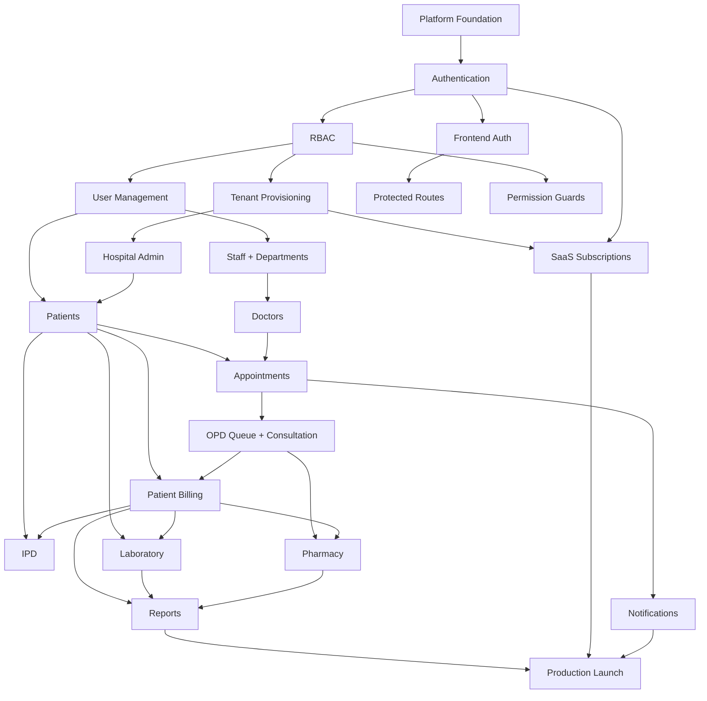

# Dependency Matrix

## Module Dependency Graph



---

## Task Dependency Chain (Critical Path)

```
DS-001 → DS-002 → DS-008 → DS-009 → DS-012 → DS-013 → DS-014
  → DS-016 → DS-017 → DS-018 → DS-019 → DS-020
  → DS-023 → DS-024 → DS-025
  → DS-029 → DS-030
  → DS-021 → DS-039 → DS-032 → DS-026
  → DS-040 → DS-041 → DS-042
  → DS-043 → DS-044
  → DS-045 → DS-046 → DS-047 → DS-048
  → DS-049 → DS-050 → DS-051 → DS-054 (G2)
  → DS-055 → ... → DS-066 (G3)
  → DS-067 → ... → DS-080 (G5)
```

**Longest path:** 42 sequential dependencies → ~24 weeks

---

## Cross-Module Dependency Table

| Module | Hard Depends On | Soft Depends On |
|--------|-----------------|-----------------|
| Authentication | Platform Foundation | — |
| RBAC | Authentication | — |
| Tenant Provisioning | Platform, RBAC | Email adapter |
| Hospital Admin | Tenant Provisioning | — |
| User Management | RBAC, Auth | Email adapter |
| Frontend Auth | Auth API | — |
| Patients | User Mgmt, Frontend Auth | Hospital Admin |
| Staff/Doctors | User Management | Hospital Admin |
| Appointments | Patients, Doctors | Hospital settings |
| OPD | Appointments | RBAC (doctor role) |
| Patient Billing | Patients, OPD | Service master seeds |
| IPD | Patients, Billing | Subscription bed limits |
| Laboratory | Patients, Billing | Doctors |
| Pharmacy | OPD (e-Rx), Billing | Inventory |
| Reports | All clinical modules | Redis cache |
| Notifications | Appointments, Auth | SQS worker |
| SaaS Subscriptions | Tenant, Auth | Razorpay |
| Production | All above | Terraform |

---

## Database Migration Order

Migrations must follow schema dependency order:

| Order | Migration | Tables | Sprint |
|-------|-----------|--------|--------|
| 001 | Extensions + schemas | — | S1 ✅ |
| 002 | Platform tenants | tenants | S1 ✅ |
| 003 | RBAC | roles, permissions, user_roles | S1 ✅ |
| 004 | Hospital | tenant_locations, tenant_settings | S1 ✅ |
| 005 | Auth tokens | password_reset_tokens | S2 ✅ |
| 006 | Subscriptions | subscription_plans, tenant_subscriptions | S2 |
| 007 | Patients | patients, allergies, contacts | S3 |
| 008 | Staff | staff, departments, doctors | S3 |
| 009 | Clinical OPD | appointments, opd_visits, consultations | S4 |
| 010 | Billing | billing_services, invoices, payments | S4 |
| 011 | IPD | wards, rooms, beds, admissions | S5 |
| 012 | IPD clinical | nursing_notes, ipd_vitals, discharge | S6 |
| 013 | Laboratory | lab_tests, orders, samples, results | S7 |
| 014 | Pharmacy | medicines, inventory, dispensings | S8 |
| 015 | Communications | notifications, preferences | S10 |
| 016 | Audit | audit_logs (full) | S11 |

---

## Frontend Feature Dependency Order

```
providers/AuthProvider
  → routes/ProtectedRoute
    → hooks/usePermissions
      → features/auth/ (login, register)
        → features/admin/ (users, settings, branches)
          → features/patients/
            → features/appointments/
              → features/opd/
                → features/billing/
                  → features/ipd/
                    → features/laboratory/
                      → features/pharmacy/
                        → features/reports/
                          → features/notifications/
                            → features/subscription/
```

---

## Parallel Work Opportunities (Same Sprint)

| Sprint | Can Run in Parallel |
|--------|---------------------|
| S2 | Backend email adapter ∥ Frontend auth UI |
| S3 | Patient API ∥ Staff API ∥ Hospital UI |
| S4 | Billing API ∥ OPD UI (after appointments API done) |
| S5 | Bed admin UI ∥ Admissions API |
| S7 | Lab catalog ∥ Lab orders API |
| S9 | Dashboard API ∥ Report UI |
| S12 | Terraform ∥ Bug fixes ∥ Docs |

---

## Blockers & Resolutions

| Blocker | Blocks | Resolution | Owner | Target |
|---------|--------|------------|-------|--------|
| No frontend auth | All UI features | DS-021 | Dev | S2 W1 |
| OPD API spec missing | S4 OPD endpoints | Draft API_DESIGN §OPD extension | Dev | S3 W2 |
| Email adapter missing | Invite/reset prod flow | DS-037 dev stub | Dev | S2 W2 |
| RLS incomplete | Security audit | Complete DS-010 | Dev | S2 |
| No seed data | Demo/staging | Complete DS-011 | Dev | S3 |
