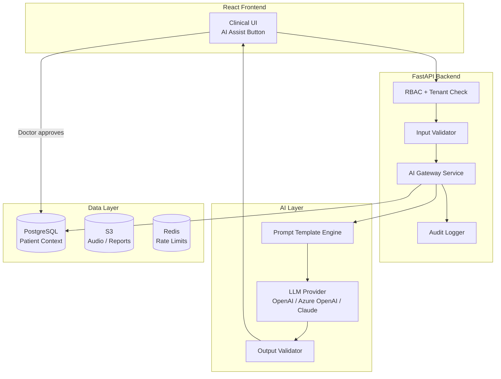
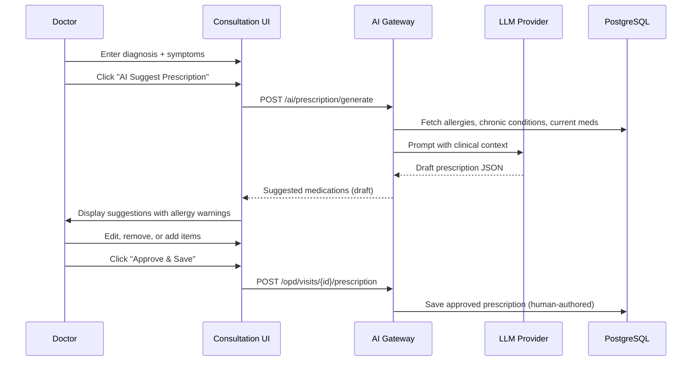
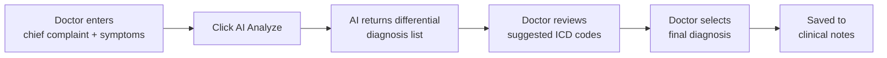
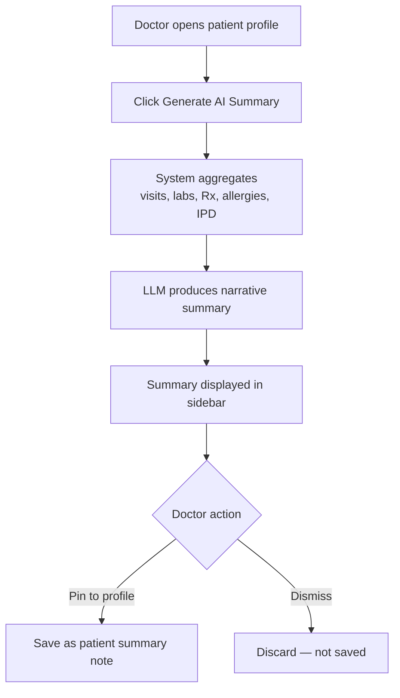
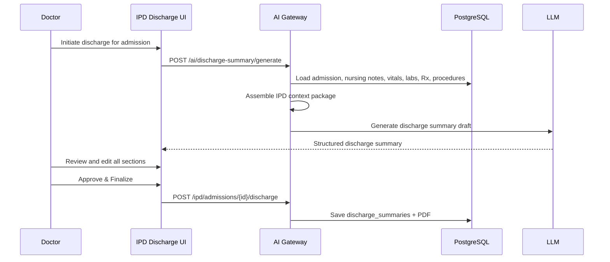
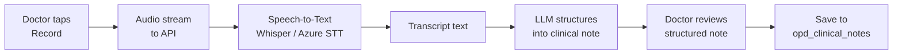
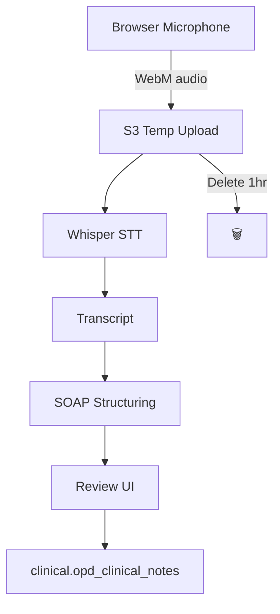
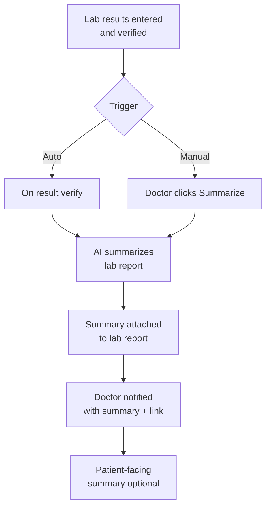

# AI Features Design Document

## Multi-Tenant Hospital Management SaaS Platform

| Field | Value |
|-------|-------|
| **Document Version** | 1.0 |
| **Status** | Draft |
| **Last Updated** | June 2026 |
| **Target Phase** | Phase 4 (post-MVP; Month 9+ of product roadmap) |
| **Related Documents** | PRD.md, ROADMAP.md, SECURITY_ARCHITECTURE.md, RBAC_DESIGN.md, API_DESIGN.md |

---

## 1. Executive Summary

This document defines six **AI-assisted clinical features** for the Hospital Management SaaS Platform. All features follow a **human-in-the-loop** model: AI generates drafts or suggestions; licensed clinicians review, edit, and approve before anything is saved to the patient record or issued to patients.

### 1.1 Design Principles

| Principle | Description |
|-----------|-------------|
| **Clinician authority** | AI never auto-commits clinical decisions; doctor approval required |
| **Tenant isolation** | All AI requests scoped to `tenant_id`; no cross-tenant context |
| **PHI minimization** | Send only necessary fields to LLM; redact identifiers where possible |
| **Auditability** | Every AI invocation logged with prompt hash, model, user, patient |
| **Fail safe** | AI unavailable → manual workflow continues without blocking care |
| **Transparency** | UI labels all AI-generated content; disclaimer shown |

### 1.2 AI Architecture Overview



### 1.3 Feature Summary

| # | Feature | Primary User | Module | Tier |
|---|---------|--------------|--------|------|
| 1 | AI Prescription Generator | Doctor | OPD / IPD | Professional+ |
| 2 | AI Symptom Analyzer | Doctor | OPD | Professional+ |
| 3 | AI Medical Summary | Doctor | Patient Profile | Enterprise |
| 4 | AI Discharge Summary | Doctor | IPD | Professional+ |
| 5 | AI Voice to Notes | Doctor, Nurse | OPD / IPD | Enterprise |
| 6 | AI Report Summarization | Doctor, Lab Tech | Laboratory | Professional+ |

### 1.4 LLM Provider Strategy

| Environment | Provider | Model |
|-------------|----------|-------|
| Development | OpenAI API | `gpt-4o-mini` |
| Production (India) | Azure OpenAI (India region) | `gpt-4o` |
| Fallback | Anthropic Claude | `claude-sonnet-4` |

All production traffic uses **region-local deployment** for data residency compliance.

---

## 2. Cross-Cutting Concerns

### 2.1 Shared API Pattern

```
POST /api/v1/ai/{feature}
Authorization: Bearer {jwt}
Permission: ai:{feature} or module-specific (e.g., opd:consult)

Request  → AI Gateway → LLM → Response (draft only)
POST /api/v1/ai/{feature}/accept
         → Doctor-approved content saved to clinical record
```

### 2.2 Shared Security Controls

| Control | Implementation |
|---------|----------------|
| Tenant scope | `tenant_id` from JWT; patient must belong to tenant |
| RBAC | Feature-specific permissions; AI features opt-in per tenant |
| Rate limiting | 50 AI requests/user/day (Professional); 200/day (Enterprise) |
| PHI in transit | TLS 1.2+ to LLM provider; BAA/DPA with provider |
| PHI in prompts | Patient name optional; use MRN + age + gender when sufficient |
| Output filtering | Block harmful content; validate JSON schema for structured outputs |
| Audit | `audit.ai_invocations` table: user, patient, feature, model, token count, latency |
| Consent | Tenant setting `ai_features_enabled`; patient consent flag checked |
| Data retention | Prompts/responses not stored by default; 24-hour cache max; audit metadata 7 years |

### 2.3 Shared Limitations (All Features)

- AI output is **assistive only**, not a medical device or diagnostic authority
- Not validated for pediatric, obstetric, or rare disease edge cases without clinician oversight
- English language primary; Hindi support planned Phase 2 of AI rollout
- Requires internet connectivity; no offline inference in MVP
- Model knowledge cutoff may miss recently approved drugs or guidelines
- Regulatory disclaimer required on every AI-generated screen

---

## 3. Feature 1: AI Prescription Generator

### 3.1 Business Value

| Stakeholder | Value |
|-------------|-------|
| **Doctors** | Reduces prescription writing time by 40–60%; fewer dosage errors |
| **Patients** | Clearer instructions; allergy-aware suggestions |
| **Hospital** | Faster consultations → higher patient throughput |
| **Platform** | Premium upsell feature; differentiation vs. legacy HMS |

**ROI estimate:** 2 minutes saved per prescription × 30 patients/day = 1 hour/day per doctor.

### 3.2 Workflow



**Steps:**

1. Doctor completes consultation notes and diagnosis (ICD code).
2. Doctor clicks **"AI Suggest Prescription"**.
3. System loads patient allergies, age, weight, renal/hepatic flags, current medications.
4. LLM returns structured medication list with dosage, frequency, duration.
5. System flags any allergy conflicts or drug interactions (rule engine + AI).
6. Doctor reviews, edits, and approves.
7. Approved prescription saved as standard e-prescription (existing workflow).

### 3.3 Prompt Design

**System prompt:**

```
You are a clinical prescription assistant for licensed physicians in India.
You suggest medications based on diagnosis, patient demographics, and standard treatment guidelines.
You MUST:
- Return valid JSON only matching the provided schema
- Respect ALL listed patient allergies (never suggest allergens)
- Use generic drug names where possible; include brand only if commonly prescribed in India
- Include dosage, route, frequency, duration, and patient instructions
- Flag pregnancy/lactation contraindications when relevant
You MUST NOT:
- Diagnose conditions
- Replace physician judgment
- Suggest controlled substances without explicit physician request
Output language: English (instructions may include Hindi transliteration if requested)
```

**User prompt template:**

```
Patient context:
- Age: {age} | Gender: {gender} | Weight: {weight_kg} kg
- Allergies: {allergies_list}
- Chronic conditions: {chronic_conditions}
- Current medications: {current_meds}

Diagnosis (ICD-10): {icd_code} — {icd_description}
Chief complaint: {chief_complaint}
Clinical notes: {examination_notes}

Suggest a prescription (JSON schema: PrescriptionSuggestion).
Maximum {max_items} medications.
```

**Output schema (JSON):**

```json
{
  "medications": [
    {
      "generic_name": "Paracetamol",
      "brand_name": "Crocin",
      "dosage": "500mg",
      "route": "oral",
      "frequency": "twice daily after food",
      "duration": "5 days",
      "quantity": 10,
      "instructions": "Take after meals; stop if rash develops",
      "rationale": "Antipyretic for fever management"
    }
  ],
  "warnings": ["Patient allergic to NSAIDs — avoid Ibuprofen"],
  "confidence": "medium"
}
```

### 3.4 Data Flow

| Stage | Data | Destination |
|-------|------|---------------|
| Input | Diagnosis, vitals, allergies, notes | FastAPI → LLM API |
| Context load | `patient_allergies`, `opd_vitals`, `opd_clinical_notes` | PostgreSQL (tenant-scoped) |
| Output | Draft prescription JSON | API → React (not persisted) |
| Approval | Doctor-edited final Rx | `clinical.opd_prescription_items` |
| Audit | Feature, token count, latency, user_id | `audit.ai_invocations` |

**PHI sent to LLM:** Age, gender, weight, allergies, diagnosis, clinical notes. **Not sent:** Full name, phone, address, MRN (use internal `patient_ref` UUID if needed for logging only).

### 3.5 Security

| Risk | Mitigation |
|------|------------|
| Allergy miss → adverse event | Rule engine cross-check; allergy list mandatory in prompt; red banner on conflicts |
| Wrong tenant patient data | `tenant_id` + `patient_id` validation before context load |
| Prompt injection via clinical notes | Sanitize notes; strip instruction-like patterns; system prompt hardening |
| LLM stores PHI | Azure OpenAI with zero-retention option; no training on customer data |
| Unauthorized access | `opd:prescribe` + `ai:prescription` permissions required |

### 3.6 Limitations

- Does not replace pharmacist or clinical pharmacist review
- Drug interaction database limited to common pairs in MVP (expand via integration)
- Pediatric dosing requires manual verification (weight-based suggestions are indicative)
- Ayurvedic/homeopathic prescriptions out of scope
- Cannot access hospital formulary restrictions automatically in Phase 1

### 3.7 Future Improvements

- Integration with **hospital formulary** (only suggest in-stock medicines)
- Real-time **drug interaction API** (DrugBank, local pharmacopeia)
- **Hindi prescription instructions** auto-generation
- Learning from doctor edit patterns (tenant-private fine-tuning)
- **Pediatric/geriatric dosing calculators** embedded in UI
- Multilingual voice input → prescription pipeline

---

## 4. Feature 2: AI Symptom Analyzer

### 4.1 Business Value

| Stakeholder | Value |
|-------------|-------|
| **Doctors** | Structured differential diagnosis suggestions during consultation |
| **Junior doctors** | Decision support in resource-limited settings |
| **Patients** | More thorough clinical evaluation; fewer missed conditions |
| **Hospital** | Reduced medico-legal risk from documented differential reasoning |

**Note:** Positioned as **clinical decision support**, not autonomous diagnosis. Doctor makes final diagnosis.

### 4.2 Workflow



**Steps:**

1. Doctor enters chief complaint, symptom checklist, and vitals (or loads from OPD vitals).
2. Clicks **"AI Analyze Symptoms"**.
3. AI returns ranked differential diagnoses with ICD-10 suggestions, recommended tests, and red-flag warnings.
4. Doctor selects applicable diagnoses; AI suggestions marked as "assisted" in audit trail.
5. Selected ICD codes flow into consultation record.

### 4.3 Prompt Design

**System prompt:**

```
You are a clinical decision support assistant for physicians.
Given symptoms and vitals, suggest differential diagnoses ranked by likelihood.
You MUST:
- Return JSON matching DifferentialDiagnosis schema
- Include ICD-10 codes where confident
- Flag red-flag symptoms requiring urgent action
- Suggest relevant investigations (lab/imaging)
- Indicate confidence: high | medium | low
You MUST NOT:
- State definitive diagnosis
- Recommend specific prescription doses
- Provide patient-facing advice
Disclaimer: For physician decision support only.
```

**User prompt template:**

```
Patient: Age {age}, Gender {gender}
Vitals: BP {bp}, Pulse {pulse}, Temp {temp}, SpO2 {spo2}

Chief complaint: {chief_complaint}
Symptoms (duration): {symptoms_json}
Relevant history: {history}
Allergies: {allergies}

Provide differential diagnosis (max 5) with ICD-10, confidence, and suggested investigations.
```

**Output schema:**

```json
{
  "differentials": [
    {
      "condition": "Acute Viral Upper Respiratory Infection",
      "icd10": "J06.9",
      "likelihood": "high",
      "reasoning": "Fever, cough, sore throat x 3 days; no distress",
      "suggested_tests": ["CBC if fever >3 days"],
      "red_flags": []
    }
  ],
  "urgent_action_required": false,
  "disclaimer": "AI-assisted suggestion — physician verification required"
}
```

### 4.4 Data Flow

| Stage | Data | Flow |
|-------|------|------|
| Input | Symptoms, vitals, complaint | UI → API |
| Enrichment | Patient age, gender, allergies, chronic conditions | DB → API |
| Inference | Assembled prompt | API → LLM |
| Output | Differential list (draft) | LLM → API → UI |
| Persistence | Doctor-selected ICD codes only | UI → `opd_clinical_notes` |

### 4.5 Security

| Risk | Mitigation |
|------|------------|
| Over-reliance on AI diagnosis | UI disclaimer; diagnosis field requires manual confirmation |
| Missed emergency (e.g., MI) | Red-flag detector in prompt + rule-based vital alerts independent of AI |
| Sensitive symptom data exposure | Minimal PHI; session-scoped; no prompt storage beyond audit metadata |
| Tenant data leak | Patient context loaded with `tenant_id` filter |

### 4.6 Limitations

- Not validated as a medical device; not for emergency triage without clinician judgment
- Poor performance on rare diseases and multi-morbid elderly patients
- Symptom input quality depends on doctor entry (garbage in, garbage out)
- No imaging or lab result interpretation in this feature (see Report Summarization)
- Cultural/regional disease prevalence may be imperfect for all geographies

### 4.7 Future Improvements

- Integrate **local epidemiology data** (seasonal flu patterns, regional diseases)
- **Lab result integration** into differential (auto-include recent CBC, LFT)
- **Triage severity score** (ESI/MEWS) alongside AI suggestions
- Patient symptom **pre-visit questionnaire** filled by receptionist
- Federated learning across tenants (anonymized, opt-in only)

---

## 5. Feature 3: AI Medical Summary

### 5.1 Business Value

| Stakeholder | Value |
|-------------|-------|
| **Doctors** | Instant patient overview before consultation (saves 3–5 min chart review) |
| **Locum / covering doctors** | Quick handoff context |
| **Hospital admin** | Better care continuity; reduced readmission risk |
| **Platform** | Enterprise-tier differentiator |

### 5.2 Workflow



**Steps:**

1. Doctor opens patient profile before or during consultation.
2. Clicks **"Generate Medical Summary"**.
3. Backend aggregates: demographics, allergies, last 10 visits, active medications, recent lab results, IPD admissions (if any).
4. LLM generates concise narrative summary (200–400 words).
5. Doctor reads summary; optionally pins approved version to patient record.
6. Summary timestamped; regenerated on demand (not auto-refreshed).

### 5.3 Prompt Design

**System prompt:**

```
You are a medical records summarization assistant.
Produce a concise, factual clinical summary for a physician audience.
Structure:
1. Patient demographics (age, gender, blood group)
2. Active problems and chronic conditions
3. Allergies (prominent)
4. Recent visits summary (last 90 days)
5. Current medications
6. Recent lab highlights (abnormal values only)
7. Pending follow-ups or open orders
Rules:
- Be factual; do not infer conditions not in the data
- Use bullet points for scannability
- Flag critical abnormalities prominently
- Max 400 words
```

**User prompt template:**

```
Summarize this patient record:

Demographics: {demographics_json}
Allergies: {allergies}
Chronic conditions: {conditions}

Recent visits ({visit_count}):
{visits_json}

Active prescriptions:
{prescriptions_json}

Recent lab results (90 days):
{lab_results_json}

IPD history:
{admissions_json}
```

### 5.4 Data Flow

| Source Table | Data Extracted |
|--------------|----------------|
| `core.patients` | Demographics, blood group |
| `core.patient_allergies` | Allergen list |
| `clinical.opd_visits` + `opd_clinical_notes` | Recent visits, diagnoses |
| `clinical.opd_prescriptions` | Active medications |
| `laboratory.lab_results` | Recent abnormal results |
| `clinical.admissions` | IPD history |

**Aggregation service** builds a de-identified context package → LLM → narrative summary → UI (draft). Saved summary → `patient_documents` or `patient.metadata.ai_summary` with version.

### 5.5 Security

| Risk | Mitigation |
|------|------------|
| Summary contains PHI sent to LLM | Enterprise tier only; BAA with provider; minimal fields |
| Stale summary misleads doctor | "Generated at {timestamp}" banner; regenerate button |
| Cross-tenant aggregation bug | All queries filtered by `tenant_id`; integration test per release |
| Summary saved without review | Save requires explicit doctor click; labeled "AI-generated" |

### 5.6 Limitations

- Summary quality depends on data completeness (garbage in → incomplete summary)
- Does not include external records (other hospitals) unless imported
- Not a substitute for full chart review for complex cases
- Token limits may truncate very long histories (last N visits cap)
- Regeneration costs API tokens; rate limited per user

### 5.7 Future Improvements

- **Auto-refresh** summary before scheduled appointments (background job)
- **PDF export** for referral letters
- **Multilingual summary** (Hindi for patient-facing version vs. English clinical)
- **Timeline visualization** alongside narrative
- **Change detection**: highlight what changed since last visit
- Integration with **ABHA** (India health ID) for external record pull

---

## 6. Feature 4: AI Discharge Summary

### 6.1 Business Value

| Stakeholder | Value |
|-------------|-------|
| **Doctors** | Reduces discharge documentation from 20–30 min to 5–10 min |
| **Patients** | Clearer discharge instructions; better adherence |
| **Hospital** | Faster bed turnover; improved NABH accreditation documentation |
| **Billing** | Discharge bottleneck removed → earlier final invoicing |

### 6.2 Workflow



**Steps:**

1. Doctor opens discharge workflow for an admission.
2. Clicks **"AI Generate Discharge Summary"**.
3. System aggregates entire IPD stay: admission diagnosis, daily notes, vitals trend, procedures, lab results, medications administered, consults.
4. LLM produces structured discharge summary matching hospital template.
5. Doctor edits each section (diagnosis, treatment, medications on discharge, follow-up).
6. Doctor approves → saved to `clinical.discharge_summaries` + PDF generated.

### 6.3 Prompt Design

**System prompt:**

```
You are a discharge summary documentation assistant for hospital physicians in India.
Generate a structured discharge summary from inpatient data.
Sections required:
1. Admission diagnosis
2. Reason for admission / presenting complaint
3. Hospital course (narrative)
4. Procedures performed
5. Investigations summary (key abnormal results)
6. Condition at discharge
7. Medications on discharge (name, dose, duration)
8. Follow-up instructions
9. Warning signs (when to return to ER)
Rules:
- Be factual; only include information present in provided data
- Use standard medical terminology
- Medications must match discharge prescription if provided
- Output JSON matching DischargeSummarySchema
```

**User prompt template:**

```
Admission: {admission_number} | {admission_date} to {discharge_date}
LOS: {length_of_stay} days
Admitting diagnosis: {admission_diagnosis}
Ward: {ward_name}

Nursing notes summary:
{nursing_notes_summary}

Vitals trend:
{vitals_summary}

Lab results during stay:
{lab_results}

Medications administered:
{medications}

Procedures/charges:
{procedures}

Attending physician notes:
{doctor_notes}
```

**Output schema:**

```json
{
  "admission_diagnosis": "Community-acquired pneumonia",
  "presenting_complaint": "Fever and cough x 5 days",
  "hospital_course": "Patient admitted with...",
  "procedures": ["IV antibiotics", "Oxygen therapy"],
  "investigations_summary": "WBC elevated on admission, normalized by day 4",
  "condition_at_discharge": "Stable, afebrile x 48 hours",
  "medications_on_discharge": [
    { "name": "Amoxicillin", "dosage": "500mg TDS", "duration": "5 more days" }
  ],
  "follow_up_instructions": "OPD follow-up in 1 week with Dr. Patel",
  "warning_signs": "Return if fever recurs, breathlessness, or chest pain"
}
```

### 6.4 Data Flow

| Stage | Source | Destination |
|-------|--------|-------------|
| Aggregate | `admissions`, `nursing_notes`, `ipd_vitals`, `lab_results`, `ipd_daily_charges` | AI context builder |
| Generate | Context → LLM | Draft JSON |
| Review | Doctor edits | React form |
| Persist | Approved summary | `clinical.discharge_summaries` |
| PDF | Template engine | S3 `tenants/{id}/reports/discharge/` |
| Billing trigger | Discharge event | IPD final invoice workflow |

### 6.5 Security

| Risk | Mitigation |
|------|------------|
| Incorrect discharge medications | Cross-validate against `opd_prescriptions` / discharge Rx; doctor must approve |
| PHI in LLM request | Admission data only; no unrelated patients in context |
| Premature discharge summary | Feature only available when admission status = `under_treatment` |
| Audit gap | Log AI draft hash vs. final approved text diff in audit trail |

### 6.6 Limitations

- Quality depends on nursing note completeness during stay
- Cannot summarize procedures not documented in system
- Legal signature still requires licensed physician (digital signatory field)
- Template variations across hospitals require tenant-level customization (Phase 2)
- Very long stays (>30 days) may hit token limits — sectional summarization needed

### 6.7 Future Improvements

- **Tenant-customizable templates** (NABH, hospital letterhead sections)
- **Auto-populate** discharge medications from active IPD medication orders
- **Patient-facing simplified version** in Hindi/regional language
- **Primary care physician** auto-email of discharge summary
- **Readmission risk score** appended to summary
- Voice dictation integration (Feature 5) for hospital course narrative

---

## 7. Feature 5: AI Voice to Notes

### 7.1 Business Value

| Stakeholder | Value |
|-------------|-------|
| **Doctors** | Hands-free documentation during examination; 50% faster note-taking |
| **Nurses** | Voice vitals and nursing notes at bedside |
| **Hospital** | Higher data capture rate; more complete records |
| **Elderly doctors** | Lower typing barrier; improved adoption |

### 7.2 Workflow



**Steps:**

1. Doctor opens consultation screen; taps **"Voice Note"** microphone button.
2. Browser captures audio (WebRTC); streams or uploads to API on stop.
3. **Speech-to-text** (OpenAI Whisper or Azure Speech) transcribes audio.
4. **LLM** structures transcript into: chief complaint, history, examination findings, assessment, plan (SOAP format).
5. Doctor reviews structured note; edits errors (medical term correction).
6. Approved note saved to `opd_clinical_notes` or `nursing_notes`.

**Nurse variant:** Shorter vitals + observation template instead of full SOAP.

### 7.3 Prompt Design

**Speech-to-text:** No prompt (model: `whisper-1` or Azure `hi-IN` / `en-IN` locale).

**Structuring system prompt:**

```
You convert a doctor's voice dictation into a structured clinical note (SOAP format).
Input: Raw transcript from speech recognition (may contain errors, fillers, Hindi-English mix)
Output: JSON with sections: chief_complaint, history, examination, assessment, plan
Rules:
- Correct obvious transcription errors using medical context
- Preserve medical terminology
- Remove filler words (um, uh, okay)
- Do not add clinical information not mentioned in transcript
- Flag [unclear] where audio was ambiguous
- Support Hinglish (Hindi-English code-switching common in India)
```

**User prompt template:**

```
Transcript:
"{raw_transcript}"

Patient context (for terminology correction only):
Age: {age}, Gender: {gender}, Visit type: {visit_type}

Structure into SOAP clinical note (JSON).
```

**Output schema:**

```json
{
  "chief_complaint": "Fever and body ache for 3 days",
  "history": "Patient reports onset after rain exposure...",
  "examination": "Temp 101°F, throat erythematous, chest clear",
  "assessment": "Likely viral URTI",
  "plan": "Symptomatic treatment, fluids, follow-up if worsening",
  "transcription_confidence": "high",
  "unclear_segments": []
}
```

### 7.4 Data Flow

| Stage | Data | Storage |
|-------|------|---------|
| Audio capture | WebM/WAV blob (max 5 min) | Temp S3 `tenants/{id}/audio/temp/` |
| Transcription | Audio → text | Ephemeral; deleted after 1 hour |
| Structuring | Transcript → SOAP JSON | LLM API |
| Review | Doctor-edited note | `opd_clinical_notes` |
| Audit | Audio duration, STT model, LLM model | `audit.ai_invocations` |
| Audio retention | **Not retained** by default | Deleted post-transcription |



### 7.5 Security

| Risk | Mitigation |
|------|------------|
| Audio PHI exposure | Encrypt in transit; temp S3 with 1-hour lifecycle; tenant-prefixed path |
| Background conversation recorded | UI requires explicit mic button press; visual recording indicator |
| Transcript sent to LLM | Same provider BAA; transcript deleted after structuring |
| Wrong patient context | Visit ID locked at recording start; cannot switch patient mid-recording |
| Unauthorized recording | `opd:consult` permission; audit log per recording |

### 7.6 Limitations

- Accuracy lower in noisy clinic environments (OT, OPD waiting area)
- Hinglish accuracy varies; doctor review essential
- Max 5-minute recording per session (extend in future)
- Requires microphone permission; not supported on all browsers equally
- No speaker diarization (doctor vs. patient) in MVP
- Additional latency: 10–30 seconds for STT + structuring

### 7.7 Future Improvements

- **Real-time streaming** transcription (display text as doctor speaks)
- **Speaker separation** (doctor vs. patient voices)
- **Medical vocabulary boost** (custom word list per specialty)
- **Offline STT** for low-connectivity clinics (on-device Whisper)
- **Nursing-specific templates** (SBAR format)
- **Integration with Feature 2** (auto-trigger symptom analysis from voice note)
- Bluetooth stethoscope / wearable mic support

---

## 8. Feature 6: AI Report Summarization

### 8.1 Business Value

| Stakeholder | Value |
|-------------|-------|
| **Doctors** | Lab report comprehension in seconds vs. minutes |
| **Patients** | Plain-language explanation option at discharge |
| **Lab technicians** | Quality check on report completeness before finalize |
| **Hospital** | Faster clinical decisions on abnormal results |

### 8.2 Workflow



**Steps:**

1. Lab technician verifies results (`lab:verify`).
2. System auto-triggers summarization (or doctor requests on demand).
3. AI receives structured lab results (parameters, values, reference ranges, flags).
4. LLM produces: clinical summary, abnormal findings explanation, suggested clinical actions.
5. Summary attached to `laboratory.lab_reports` metadata.
6. Doctor receives in-app notification with summary.
7. Optional: generate patient-friendly plain-language version.

### 8.3 Prompt Design

**System prompt:**

```
You are a laboratory report summarization assistant for physicians.
Given structured lab results, produce a concise clinical interpretation.
Sections:
1. Overall summary (1-2 sentences)
2. Abnormal findings (bullet list with clinical significance)
3. Critical values (if any) — prominently flagged
4. Suggested follow-up investigations (if warranted)
5. Trend comment (if previous results provided)
Rules:
- Do not diagnose; interpret results only
- Use standard reference range context
- Flag critical/panic values with ⚠️ prefix in output
- Patient-friendly version: grade 8 reading level, no jargon
Output: JSON matching LabSummarySchema
```

**User prompt template:**

```
Patient: Age {age}, Gender {gender}
Test panel: {panel_name}
Order date: {order_date}

Results:
{results_json}
/*
  [{ "parameter": "Hemoglobin", "value": "9.2", "unit": "g/dL",
     "reference": "12.0-16.0", "is_abnormal": true, "is_critical": false }]
*/

Previous results (if available):
{previous_results_json}
```

**Output schema:**

```json
{
  "clinical_summary": "Moderate anemia with normal WBC and platelets.",
  "abnormal_findings": [
    {
      "parameter": "Hemoglobin",
      "value": "9.2 g/dL",
      "significance": "Moderate anemia — investigate cause if persistent",
      "severity": "moderate"
    }
  ],
  "critical_alerts": [],
  "suggested_actions": ["Consider iron studies", "Reticulocyte count if not done"],
  "patient_friendly_summary": "Your blood test shows lower than normal hemoglobin (anemia). Your doctor will discuss next steps."
}
```

### 8.4 Data Flow

| Stage | Input | Output |
|-------|-------|--------|
| Trigger | `lab_results` verified event | SQS job `ai_lab_summarize` |
| Load | Results + patient age/gender + prior results | Context package |
| Infer | Context → LLM | `LabSummarySchema` JSON |
| Store | Summary JSON | `lab_reports.metadata.ai_summary` |
| Notify | Doctor (ordering) | `comms.notifications` |
| PDF | Optional patient summary section | Appended to lab report PDF |

### 8.5 Security

| Risk | Mitigation |
|------|------------|
| Critical value missed by AI | Independent rule-based critical alert (existing); AI is additive |
| Patient-friendly summary wrong | Labeled "informational only"; not sent to patient without doctor approval |
| Result data to LLM | Structured values only; no patient name |
| Unauthorized summarization | `laboratory:read` + `ai:lab_summary` permissions |

### 8.6 Limitations

- Summarizes structured results only; no radiology/image interpretation
- Trend analysis requires prior results in system (limited history in MVP)
- Cannot interpret microbiology cultures with sensitivity patterns complexly in Phase 1
- Reference ranges vary by lab; tenant-configured ranges used
- Not a substitute for pathologist review on complex panels

### 8.7 Future Improvements

- **Radiology report summarization** (PDF text extraction + vision model)
- **Longitudinal trend charts** with AI narrative ("Hb declining over 6 months")
- **Auto-ICD coding** from lab patterns (iron deficiency → D50.9 suggestion)
- **Direct integration** with symptom analyzer (Feature 2) for holistic view
- **WhatsApp delivery** of patient-friendly summary (with consent)
- **Quality gate**: AI flags incomplete panels before report finalization

---

## 9. AI Platform Services

### 9.1 AI Gateway API Endpoints

| Method | Endpoint | Permission | Feature |
|--------|----------|------------|---------|
| POST | `/api/v1/ai/prescription/generate` | `ai:prescription`, `opd:prescribe` | Prescription Generator |
| POST | `/api/v1/ai/symptoms/analyze` | `ai:symptoms`, `opd:consult` | Symptom Analyzer |
| POST | `/api/v1/ai/medical-summary/generate` | `ai:summary`, `patient:read` | Medical Summary |
| POST | `/api/v1/ai/discharge-summary/generate` | `ai:discharge`, `ipd:discharge` | Discharge Summary |
| POST | `/api/v1/ai/voice/transcribe` | `ai:voice`, `opd:consult` | Voice to Notes (STT) |
| POST | `/api/v1/ai/voice/structure` | `ai:voice`, `opd:consult` | Voice to Notes (SOAP) |
| POST | `/api/v1/ai/lab-report/summarize` | `ai:lab_summary`, `laboratory:read` | Report Summarization |
| GET | `/api/v1/ai/usage` | `admin:settings` | Token usage dashboard |

### 9.2 Database: AI Audit Table

```sql
-- Conceptual schema (add to audit schema in migration)
audit.ai_invocations (
    id              UUID PRIMARY KEY,
    tenant_id       UUID NOT NULL,
    user_id         UUID NOT NULL,
    patient_id      UUID,
    feature_code    VARCHAR(50) NOT NULL,  -- prescription, symptoms, etc.
    model           VARCHAR(50) NOT NULL,
    input_tokens    INTEGER,
    output_tokens   INTEGER,
    latency_ms      INTEGER,
    status          VARCHAR(20),           -- success, error, timeout
    prompt_hash     VARCHAR(64),           -- SHA-256 of prompt (not raw prompt)
    accepted        BOOLEAN,               -- doctor accepted output?
    created_at      TIMESTAMPTZ NOT NULL
);
```

### 9.3 Subscription Tier Access

| Feature | Starter | Professional | Enterprise |
|---------|---------|--------------|------------|
| AI Prescription Generator | — | ✅ (50/day) | ✅ (200/day) |
| AI Symptom Analyzer | — | ✅ | ✅ |
| AI Medical Summary | — | — | ✅ |
| AI Discharge Summary | — | ✅ | ✅ |
| AI Voice to Notes | — | — | ✅ |
| AI Report Summarization | — | ✅ | ✅ |

### 9.4 Cost Management

| Control | Implementation |
|---------|----------------|
| Per-tenant monthly token budget | Redis counter; alert at 80% |
| Per-user daily limits | Enforced at AI Gateway |
| Model routing | Simple tasks → `gpt-4o-mini`; complex → `gpt-4o` |
| Caching | Identical lab panel summaries cached 24h (same result hash) |
| Cost dashboard | Admin view: tokens used, estimated cost, by feature |

---

## 10. Implementation Roadmap

| Phase | Timeline | Features |
|-------|----------|----------|
| **AI Phase 0** | Month 9 | AI Gateway infrastructure, audit table, consent settings |
| **AI Phase 1** | Month 10 | Report Summarization, Symptom Analyzer |
| **AI Phase 2** | Month 11 | Prescription Generator, Discharge Summary |
| **AI Phase 3** | Month 12 | Medical Summary, Voice to Notes |
| **AI Phase 4** | Year 2 | Hindi, formulary integration, radiology AI |

### 10.1 Success Metrics

| Metric | Target (6 months post-launch) |
|--------|-------------------------------|
| AI feature adoption | > 30% of Professional+ tenants |
| Doctor acceptance rate (AI draft → saved) | > 60% |
| Average time saved per consultation | > 3 minutes |
| AI-related incidents (wrong suggestion acted on) | 0 critical |
| Tenant AI opt-out rate | < 10% |

---

## 11. Regulatory & Ethical Considerations

| Topic | Position |
|-------|----------|
| **Medical device classification** | AI features are **decision support**, not autonomous diagnostic devices |
| **Liability** | Treating physician retains full responsibility; Terms of Service explicit |
| **Patient consent** | Tenant configures AI usage; patient consent for data processing per DPDP Act |
| **Bias** | Monitor acceptance rates across demographics; quarterly model review |
| **Transparency** | All AI content labeled; audit trail maintained |
| **Right to opt out** | Tenants can disable AI features; manual workflows always available |

---

## 12. Revision History

| Version | Date | Author | Changes |
|---------|------|--------|---------|
| 1.0 | June 2026 | AI Architecture Team | Initial AI features design |
