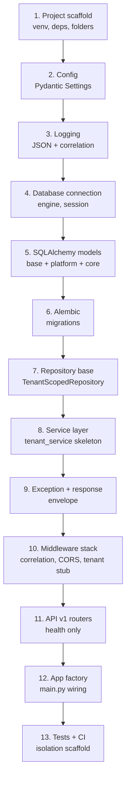

# Backend Sprint 1 Execution Guide

## FastAPI Foundation — Implementation Steps Only

| Field | Value |
|-------|-------|
| **Document Version** | 1.0 |
| **Status** | Active |
| **Last Updated** | June 2026 |
| **Author** | Senior FastAPI Architecture |
| **Sprint** | 1 — Backend foundation only |
| **Audience** | Solo backend developer |
| **Authoritative References** | `PROJECT_STRUCTURE.md` (frozen), `SPRINT_1_EXECUTION_GUIDE.md`, `API_DESIGN.md` §2, `DATABASE_IMPLEMENTATION_PLAN.md`, `MULTI_TENANT_DESIGN.md`, `IMPLEMENTATION_PLAN.md` §2.2–2.3 |

---

## Purpose

This guide defines **implementation steps** to build the FastAPI backend foundation before any auth, clinical, or billing features. It contains **no code** — only ordered actions, verification criteria, and architectural rules.

**Sprint 1 backend delivers:**

- Runnable FastAPI application with health probes
- Configuration, logging, and database connectivity
- SQLAlchemy models for `platform` + `core` (Phase 1 tables)
- Alembic migrations aligned with `database/baseline/schema.sql`
- Tenant context stub and `TenantScopedRepository`
- One domain service skeleton (`platform.tenant_service`)
- Standard API response envelope and exception mapping
- API version prefix `/api/v1`

**Sprint 1 backend does not deliver:**

- JWT authentication or RBAC enforcement (Sprint 2)
- Patient, OPD, billing, or clinical routers
- SQS worker process
- Redis permission cache (stub config only)
- Production AWS deployment

---

## Prerequisites

Complete before starting backend tasks:

- [ ] `DEVELOPMENT_CHECKLIST.md` — Environment and Git sections checked
- [ ] Docker Postgres 14+ and Redis 7 running locally
- [ ] `DATABASE_IMPLEMENTATION_PLAN.md` Phase 1 understood
- [ ] `PROJECT_STRUCTURE.md` §3 backend tree reviewed
- [ ] Python 3.11+ installed

**Estimated effort:** ~24 hours (matches `SPRINT_1_EXECUTION_GUIDE.md` Tasks BE-1 through BE-6).

---

## Master Setup Order

Build layers in this sequence. **Do not skip or reorder** — each layer depends on the previous.



| Step | Section | Estimate |
|------|---------|----------|
| 1 | FastAPI setup order (scaffold) | 4 hrs |
| 2 | Config setup | 1 hr |
| 3 | Logging setup | 3 hrs |
| 4 | Database connection setup | 2 hrs |
| 5 | SQLAlchemy setup | 6 hrs |
| 6 | Alembic setup | 4 hrs |
| 7 | Repository pattern setup | 2 hrs |
| 8 | Service layer setup | 4 hrs |
| 9–10 | API versioning + exception handling | 3 hrs (combined) |
| 11–12 | Routers + app factory | 2 hrs |
| 13 | Tests | 3 hrs |

---

## 1. FastAPI Setup Order

### 1.1 Phase A — Python project scaffold

| Step | Action | Why |
|------|--------|-----|
| 1.1.1 | Create `backend/` as the Python package root | Matches frozen monorepo layout |
| 1.1.2 | Create virtual environment (`.venv/`) with Python 3.11+ | Isolated dependencies |
| 1.1.3 | Create `requirements.txt` with production pins: `fastapi`, `uvicorn[standard]`, `sqlalchemy>=2`, `alembic`, `psycopg2-binary`, `pydantic-settings`, `python-dotenv` | Runtime stack per `PROJECT_STRUCTURE.md` |
| 1.1.4 | Create `requirements-dev.txt`: `pytest`, `pytest-cov`, `httpx`, `ruff` | Dev and CI tooling |
| 1.1.5 | Create `pyproject.toml` — configure ruff (line length 100, rules `E`, `F`, `I`) and pytest test paths | Lint and test discovery |
| 1.1.6 | Create `backend/.env.example` documenting all env vars (no secrets) | Onboarding |
| 1.1.7 | Create `backend/keys/.gitkeep` — JWT keys gitignored | Sprint 2 prep |
| 1.1.8 | Add `backend/.env.local` to root `.gitignore` | Secret safety |

**Verify:** `pip install -r requirements.txt -r requirements-dev.txt` succeeds.

---

### 1.2 Phase B — Package directory tree

Create all folders and empty `__init__.py` files per `PROJECT_STRUCTURE.md` §3. Sprint 1 populates only marked items.

| Path | Sprint 1 |
|------|----------|
| `app/` | Create + `main.py` |
| `app/api/v1/` | Create + `router.py`, `deps.py`, `health.py` |
| `app/core/` | Create all listed modules |
| `app/core/tenant/` | Create `context.py`, `middleware.py`, `resolver.py` |
| `app/domains/platform/services/` | Create `tenant_service.py` |
| `app/domains/platform/repositories/` | Create `tenant_repository.py` |
| `app/domains/platform/schemas/` | Create `tenant.py` |
| `app/domains/identity/` | **Folders only** — Sprint 2 |
| `app/models/` | Create `base.py`, `platform.py`, `core.py`, `__init__.py` |
| `app/repositories/` | Create `base.py` |
| `app/adapters/` | **Skip** — Sprint 4+ |
| `alembic/versions/` | Create after Alembic init |
| `tests/conftest.py` | Create |
| `tests/integration/test_tenant_isolation.py` | Create scaffold |
| `scripts/seed.py` | Create stub |

**Verify:** `python -c "import app"` succeeds without import errors.

---

### 1.3 Phase C — Sync vs async decision (lock early)

| Decision | Sprint 1 recommendation | Rule |
|----------|-------------------------|------|
| ORM style | **Sync SQLAlchemy 2.x** + `psycopg2-binary` | Simpler debugging for solo dev; matches `SPRINT_1_EXECUTION_GUIDE.md` |
| Route handlers | `def` (sync) for DB routes in Sprint 1 | FastAPI runs sync handlers in thread pool |
| Future | May migrate to `asyncpg` + async session in Phase 2 | Document decision in sprint journal; do not mix styles |

**Verify:** Team journal records sync/async choice before first model is written.

---

### 1.4 Phase D — App factory skeleton (wire last)

Do **not** fully wire `main.py` until Sections 2–10 are ready. Initial skeleton only:

| Step | Action |
|------|--------|
| 1.4.1 | Create `create_app()` factory function in `app/main.py` |
| 1.4.2 | Add lifespan context manager — dispose SQLAlchemy engine on shutdown |
| 1.4.3 | Defer router mount, middleware, and exception handlers until Section 10–11 |
| 1.4.4 | Confirm bare app starts: `uvicorn app.main:app --reload --port 8000` |

**Verify:** Process starts; root may return 404 until routers are mounted.

---

### 1.5 Phase E — Final assembly order

When all layers exist, wire `main.py` in this order:

| Order | Registration |
|-------|--------------|
| 1 | Load settings (`get_settings()`) |
| 2 | Configure logging |
| 3 | Register exception handlers |
| 4 | Register middleware (correlation → CORS → tenant stub) |
| 5 | Mount API v1 router at prefix `/api/v1` |
| 6 | Optionally expose OpenAPI at `/api/v1/docs` |

**Verify:** `http://localhost:8000/api/v1/docs` loads Swagger UI with health routes.

---

## 2. Config Setup

### 2.1 Pydantic Settings module

| Step | Action | Detail |
|------|--------|--------|
| 2.1.1 | Create `app/core/config.py` | Single `Settings` class using `pydantic-settings` |
| 2.1.2 | Use `model_config` with `env_file=".env.local"` and `env_file_encoding="utf-8"` | Local dev loads from file |
| 2.1.3 | Implement `get_settings()` cached with `@lru_cache` | One settings instance per process |
| 2.1.4 | Fail fast on startup if required vars missing in non-dev environments | Prevent silent misconfiguration |

### 2.2 Sprint 1 environment variables

| Variable | Required Sprint 1 | Default (dev) | Purpose |
|----------|-------------------|---------------|---------|
| `DATABASE_URL` | Yes | `postgresql://...@localhost:5432/hms_dev` | SQLAlchemy connection |
| `REDIS_URL` | Yes (readiness probe) | `redis://localhost:6379/0` | Health check only in Sprint 1 |
| `ENVIRONMENT` | Yes | `development` | Controls dev-only endpoints and tenant stub |
| `LOG_LEVEL` | No | `INFO` | Logging verbosity |
| `CORS_ORIGINS` | No | `http://localhost:5173` | Frontend dev server |
| `API_V1_PREFIX` | No | `/api/v1` | Version prefix constant |
| `JWT_PRIVATE_KEY_PATH` | No | `./keys/private.pem` | Sprint 2 — optional in Settings stub |
| `JWT_PUBLIC_KEY_PATH` | No | `./keys/public.pem` | Sprint 2 |
| `AWS_REGION`, `S3_BUCKET` | No | Placeholder | Sprint 4+ |

### 2.3 Config implementation steps

| Step | Action |
|------|--------|
| 2.3.1 | Copy `backend/.env.example` → `backend/.env.local` with local values |
| 2.3.2 | Add `Settings` properties: `database_url`, `redis_url`, `environment`, `is_development` (computed) |
| 2.3.3 | Parse `CORS_ORIGINS` as comma-separated list |
| 2.3.4 | Never log `DATABASE_URL` password — mask in debug output |
| 2.3.5 | Import `get_settings()` only from `core/config.py` — no `os.getenv` scattered in codebase |

### 2.4 Verification

- [ ] App starts with valid `.env.local`
- [ ] App fails clearly when `DATABASE_URL` is absent (non-dev)
- [ ] `get_settings()` returns same instance on repeated calls

---

## 3. Logging Setup

### 3.1 Structured JSON logging

| Step | Action | Reference |
|------|--------|-----------|
| 3.1.1 | Create `app/core/logging.py` | `SYSTEM_ARCHITECTURE.md` §11 |
| 3.1.2 | Configure root logger with JSON formatter | One JSON object per log line |
| 3.1.3 | Standard fields: `timestamp`, `level`, `service` (`hms-api`), `message` | Operational consistency |
| 3.1.4 | Request-scoped fields: `request_id`, `tenant_id` (when available) | Traceability |
| 3.1.5 | Call `configure_logging(settings)` from `create_app()` before middleware | Early log capture |

### 3.2 Correlation ID middleware

| Step | Action |
|------|--------|
| 3.2.1 | Create correlation middleware (in `core/middleware.py` or dedicated module) |
| 3.2.2 | Read `X-Request-ID` header from incoming request |
| 3.2.3 | If absent, generate new UUID |
| 3.2.4 | Store on `request.state.request_id` |
| 3.2.5 | Bind `request_id` to logging context for request duration |
| 3.2.6 | Clear context in `finally` block after response |
| 3.2.7 | Echo `X-Request-ID` on response headers |

### 3.3 Logging rules (establish early)

| Rule | Detail |
|------|--------|
| No PHI in logs | Never log patient names, clinical notes, or request bodies with health data |
| No secrets | Never log passwords, tokens, or full `DATABASE_URL` |
| Error logging | Log exception type and message; stack trace at `ERROR` level only |
| Uvicorn access logs | Keep enabled in dev; structured app logs are primary |

### 3.4 Verification

- [ ] One `GET /api/v1/health` call produces JSON log line with `request_id`
- [ ] Response includes matching `X-Request-ID` header
- [ ] Log level changes when `LOG_LEVEL=DEBUG` in `.env.local`

---

## 4. Database Connection Setup

### 4.1 SQLAlchemy engine

| Step | Action |
|------|--------|
| 4.1.1 | Create `app/core/database.py` |
| 4.1.2 | Build engine from `settings.database_url` using `create_engine()` |
| 4.1.3 | Set `pool_pre_ping=True` — detect stale connections |
| 4.1.4 | Set `pool_size=5`, `max_overflow=10` for dev (tune in production) |
| 4.1.5 | Set `echo=False` in production; `echo=True` only when `LOG_LEVEL=DEBUG` optional flag |

### 4.2 Session factory

| Step | Action |
|------|--------|
| 4.2.1 | Create `SessionLocal = sessionmaker(bind=engine, autocommit=False, autoflush=False)` |
| 4.2.2 | Implement `get_db()` generator dependency — yield session, close in `finally` |
| 4.2.3 | Never share sessions across requests |
| 4.2.4 | Commit in service layer or explicit unit-of-work — not in `get_db()` by default |

### 4.3 Tenant session integration

| Step | Action |
|------|--------|
| 4.3.1 | Create `get_tenant_db()` dependency that combines `get_db()` + tenant context |
| 4.3.2 | After session open, execute `SET LOCAL app.tenant_id = '<uuid>'` when `request.state.tenant_id` is set |
| 4.3.3 | Use `get_tenant_db()` in all tenant-scoped routes — not raw `get_db()` |
| 4.3.4 | Platform-only routes (future) may use `get_db()` without tenant context |

### 4.4 Health check database probe

| Step | Action |
|------|--------|
| 4.4.1 | In readiness handler, open session and execute `SELECT 1` |
| 4.4.2 | Return unhealthy if connection fails or times out (2 second limit) |
| 4.4.3 | Optionally ping Redis with `PING` in same readiness handler |

### 4.5 Verification

- [ ] `get_db()` yields working session against `hms_dev`
- [ ] `SELECT 1` succeeds through session
- [ ] Session closes after request — no connection leak under 10 sequential requests
- [ ] `/health/ready` returns unhealthy when Postgres is stopped

---

## 5. SQLAlchemy Setup

### 5.1 Base model and mixins

| Step | Action | File |
|------|--------|------|
| 5.1.1 | Create `DeclarativeBase` subclass | `app/models/base.py` |
| 5.1.2 | Create `TenantMixin` — `tenant_id` UUID column | Required on all tenant-scoped tables |
| 5.1.3 | Create `AuditMixin` — `created_at`, `created_by`, `updated_at`, `updated_by`, `version` | Match `DATABASE_DESIGN.md` §2 |
| 5.1.4 | Create `SoftDeleteMixin` — `deleted_at`, `deleted_by` | Soft delete pattern |
| 5.1.5 | Document mixin application order on each model | Consistency |

### 5.2 Sprint 1 model scope

Map **Phase 1 tables only** per `DATABASE_IMPLEMENTATION_PLAN.md`:

| Model file | Tables to map | PostgreSQL schema |
|------------|---------------|-------------------|
| `platform.py` | `tenants`, `tenant_locations` | `platform` |
| `core.py` | `users`, `roles`, `permissions`, `user_roles`, `role_permissions` | `core` |

**Defer to Sprint 2+:** `subscription_plans`, `tenant_subscriptions`, `tenant_settings`, `user_sessions`, `patients`, all `clinical.*`.

### 5.3 Model implementation rules

| Step | Action |
|------|--------|
| 5.3.1 | Set `__tablename__` matching database table name |
| 5.3.2 | Set `__table_args__ = {"schema": "platform"}` or `{"schema": "core"}` |
| 5.3.3 | Match column names, types, and nullability to `DATABASE_DESIGN.md` — do not invent columns |
| 5.3.4 | Map CHECK constraints as `CheckConstraint` in `__table_args__` where practical |
| 5.3.5 | Define `relationship()` only where needed for Sprint 1 queries — avoid over-eager loading |
| 5.3.6 | Do **not** map `users.staff_id` FK until `core.staff` model exists (Phase 2) |
| 5.3.7 | Register all models in `app/models/__init__.py` for Alembic discovery |

### 5.4 Special model: `platform.tenants`

| Rule | Detail |
|------|--------|
| Self-reference | `tenant_id` must equal `id` — enforced by DB trigger, not ORM |
| No parent FK on insert | Use `platform.create_tenant()` via service, not raw ORM insert in Sprint 1 |

### 5.5 Verification

- [ ] `Base.metadata.tables` lists all Phase 1 tables with correct schema prefix
- [ ] Column count per model matches `database/baseline/schema.sql`
- [ ] No import cycles between `models/` and `domains/`
- [ ] `alembic revision --autogenerate` produces empty or expected diff after baseline migration applied

---

## 6. Alembic Setup

### 6.1 Initialization

| Step | Action |
|------|--------|
| 6.1.1 | Run `alembic init alembic` from `backend/` directory |
| 6.1.2 | Edit `alembic.ini` — set `script_location = alembic` |
| 6.1.3 | Configure `sqlalchemy.url` to read from `Settings.database_url` in `env.py` — not hardcoded |
| 6.1.4 | In `alembic/env.py`, import `Base` and all models from `app.models` |
| 6.1.5 | Set `target_metadata = Base.metadata` |

### 6.2 Migration strategy (Sprint 1)

Follow `DATABASE_IMPLEMENTATION_PLAN.md` §4 — either:

| Approach | When |
|----------|------|
| **Split revisions** `001`–`008` | Preferred — granular rollback |
| **Single `001_phase1_baseline`** | Acceptable Sprint 1 shortcut — extract Phase 1 DDL from `database/baseline/schema.sql` |

### 6.3 Revision creation steps

| Step | Action |
|------|--------|
| 6.3.1 | Create initial revision containing Phase 1 tables, indexes, triggers, RLS, `create_tenant()` |
| 6.3.2 | Review autogenerate output manually — Alembic does **not** capture RLS policies reliably |
| 6.3.3 | Merge hand-written RLS and function DDL into revision upgrade block |
| 6.3.4 | Implement `downgrade()` dropping objects in reverse FK order |
| 6.3.5 | Never edit a revision after it is merged to `dev` — append new revisions only |

### 6.4 Migration workflow (daily)

| Step | Command / Action |
|------|------------------|
| 1 | Ensure Docker Postgres is running |
| 2 | `alembic upgrade head` on `hms_dev` |
| 3 | Run `python -m scripts.seed` after first upgrade |
| 4 | Run tests — `pytest tests/integration` |
| 5 | Before PR — test `alembic downgrade -1` then `upgrade head` on clean test DB |

### 6.5 CI integration

| Step | Action |
|------|--------|
| 6.5.1 | CI job starts ephemeral Postgres (`docker-compose.test.yml`) |
| 6.5.2 | CI runs `alembic upgrade head` before pytest |
| 6.5.3 | Failed migration blocks merge |

### 6.6 Verification

- [ ] Fresh `hms_dev` + `alembic upgrade head` creates Phase 1 tables
- [ ] `alembic current` shows head revision
- [ ] `alembic downgrade -1` + `upgrade head` cycle succeeds locally
- [ ] RLS enabled on all Phase 1 tables (verify via `pg_policies`)

---

## 7. Repository Pattern Setup

### 7.1 Architecture rules

| Rule | Detail |
|------|--------|
| Location | Shared base in `app/repositories/base.py`; domain repos in `app/domains/{domain}/repositories/` |
| Responsibility | Data access only — no HTTP, no business rules |
| Tenant filter | Every query must include `tenant_id` filter |
| Soft delete | Default queries exclude `deleted_at IS NOT NULL` |
| No raw SQL in services | Services call repository methods only |

### 7.2 TenantScopedRepository base class

| Step | Action |
|------|--------|
| 7.2.1 | Create `TenantScopedRepository` in `app/repositories/base.py` |
| 7.2.2 | Constructor accepts `db: Session` and `tenant_id: UUID` |
| 7.2.3 | Implement `_base_query(model)` returning `select(model).where(tenant_id match, deleted_at IS NULL)` |
| 7.2.4 | Implement generic helpers: `get_by_id(id)`, `list_all()`, `soft_delete(entity)` as needed |
| 7.2.5 | Never expose unfiltered `db.query(Model).all()` publicly |

### 7.3 Domain repository: `tenant_repository`

| Step | Action |
|------|--------|
| 7.3.1 | Create `app/domains/platform/repositories/tenant_repository.py` |
| 7.3.2 | Extend or compose `TenantScopedRepository` where tenant-scoped |
| 7.3.3 | Implement `get_by_slug(slug)` — used by tenant resolver in Sprint 2 |
| 7.3.4 | Implement `get_by_id(tenant_id)` — read tenant row |
| 7.3.5 | Implement `create_via_db_function(name, slug, email, ...)` — calls `platform.create_tenant()` through session |
| 7.3.6 | Platform list queries (all tenants) are **platform-admin only** — stub raises `NotImplementedError` in Sprint 1 |

### 7.4 Repository dependency injection

| Step | Action |
|------|--------|
| 7.4.1 | Create factory `get_tenant_repository(db, tenant_id) -> TenantRepository` |
| 7.4.2 | Wire through FastAPI `Depends()` in route handlers — inject into service, not router DB access |
| 7.4.3 | Repositories never read `request` object directly |

### 7.5 Verification

- [ ] Unit test: `_base_query` always includes `tenant_id` in WHERE clause
- [ ] Integration test: repository query under tenant A does not return tenant B rows
- [ ] No `Session` usage inside `api/v1/` router files

---

## 8. Service Layer Setup

### 8.1 Architecture rules

| Rule | Detail |
|------|--------|
| Location | `app/domains/{domain}/services/` |
| Responsibility | Business logic, orchestration, validation, transaction boundaries |
| Data access | Calls repositories only — never imports SQLAlchemy models in routers |
| Permissions | `@requires_permission` in Sprint 2 — services receive `user_id` when needed |
| Transactions | Service method opens unit of work; commit on success, rollback on domain exception |

### 8.2 Request flow (enforce from day one)

```
api/v1/router → domain service → domain repository → ORM model → PostgreSQL
```

| Layer | May call | Must not call |
|-------|----------|---------------|
| Router | Service, Pydantic schemas | Repository, Model, Session |
| Service | Repository, other services, adapters | HTTP, Request |
| Repository | Model, Session | Service |

### 8.3 Sprint 1 service: `tenant_service`

| Step | Action |
|------|--------|
| 8.3.1 | Create `app/domains/platform/services/tenant_service.py` |
| 8.3.2 | Constructor accepts `TenantRepository` (inject, do not instantiate inside) |
| 8.3.3 | Implement `provision_tenant(name, slug, email, country, timezone, currency) -> UUID` |
| 8.3.4 | Inside method: call repository `create_via_db_function()` |
| 8.3.5 | After tenant created: insert primary `tenant_locations` row (`is_primary=True`, code `MAIN`) |
| 8.3.6 | Validate slug format (lowercase, hyphenated) before DB call |
| 8.3.7 | Catch integrity errors — map duplicate slug to domain `ConflictError` |
| 8.3.8 | **Defer** role clone, admin user, subscription — Sprint 2 registration flow |

### 8.4 Pydantic schemas (DTOs)

| Step | Action | File |
|------|--------|------|
| 8.4.1 | Create `TenantCreate` request schema — fields matching provision input | `domains/platform/schemas/tenant.py` |
| 8.4.2 | Create `TenantResponse` — safe fields only (id, name, slug, status, created_at) | Same file |
| 8.4.3 | Keep ORM models separate from API schemas — use explicit mapping in service or router |

### 8.5 Optional dev-only endpoint

| Step | Action |
|------|--------|
| 8.5.1 | Create `POST /api/v1/platform/tenants` only when `settings.is_development` |
| 8.5.2 | Router validates `TenantCreate`, calls `tenant_service.provision_tenant`, returns 201 envelope |
| 8.5.3 | Return 404 or 403 in staging/production — endpoint must not exist publicly |

### 8.6 Service dependency injection

| Step | Action |
|------|--------|
| 8.6.1 | Create `get_tenant_service(repo=Depends(get_tenant_repository))` factory |
| 8.6.2 | Router handler signature: `def create_tenant(body: TenantCreate, service: TenantService = Depends(...))` |

### 8.7 Verification

- [ ] `provision_tenant` returns UUID; row exists in `platform.tenants`
- [ ] Primary location row created with `is_primary=True`
- [ ] Duplicate slug raises mapped domain exception → HTTP 409
- [ ] Unit test with mocked repository passes
- [ ] Integration test with real DB passes

---

## 9. API Versioning Strategy

### 9.1 Versioning approach

| Rule | Implementation |
|------|----------------|
| Strategy | **URL path versioning** — not header-based |
| Current version | `v1` |
| Prefix | `/api/v1` on all business endpoints |
| Health probes | May live at `/health` (root) **or** `/api/v1/health` — pick one, document in README; recommend `/api/v1/health` for consistency |
| OpenAPI | Served at `/api/v1/docs` and `/api/v1/openapi.json` |
| Breaking changes | Require new `/api/v2` — never break v1 in place |

### 9.2 Router aggregation

| Step | Action |
|------|--------|
| 9.2.1 | Create `app/api/v1/router.py` — single `APIRouter()` |
| 9.2.2 | Include sub-routers with `prefix` and `tags` per module |
| 9.2.3 | Sprint 1 includes only: `health.router` |
| 9.2.4 | Sprint 2 adds: `auth.router` |
| 9.2.5 | Mount aggregated router in `main.py`: `app.include_router(v1_router, prefix=settings.api_v1_prefix)` |
| 9.2.6 | Create stub files for future routers — **do not register** until implemented |

### 9.3 Sprint 1 registered routes

| Method | Path | Purpose |
|--------|------|---------|
| `GET` | `/api/v1/health` | Liveness — process alive |
| `GET` | `/api/v1/health/ready` | Readiness — DB + Redis |
| `POST` | `/api/v1/platform/tenants` | Dev-only tenant provision (optional) |

### 9.4 API layer rules

| Rule | Detail |
|------|--------|
| Thin routers | Validate input, call service, return envelope — max ~15 lines per handler |
| No business logic | Slug validation exception: trivial format check in Pydantic validator is OK |
| Response type | Always return `APIResponse` envelope — never raw dict or ORM model |
| Status codes | Follow `API_DESIGN.md` §2.4 |
| Tags | OpenAPI tag per domain: `health`, `platform`, `auth`, `patients`, etc. |

### 9.5 Shared dependencies (`api/v1/deps.py`)

| Step | Action |
|------|--------|
| 9.5.1 | Create pagination dependency stubs: `page`, `page_size` query params |
| 9.5.2 | Enforce `page_size` max 100 per `API_DESIGN.md` |
| 9.5.3 | Sprint 2 adds: `get_current_user`, `require_permission` dependencies |

### 9.6 Verification

- [ ] All Sprint 1 routes live under `/api/v1`
- [ ] OpenAPI spec lists correct paths and tags
- [ ] No unversioned business endpoints exposed

---

## 10. Exception Handling Strategy

### 10.1 Exception taxonomy

Create domain exceptions in `app/core/exceptions.py`:

| Exception | HTTP Status | When |
|-----------|-------------|------|
| `NotFoundError` | 404 | Resource not found; cross-tenant IDOR returns 404 not 403 |
| `ForbiddenError` | 403 | Permission denied (Sprint 2) |
| `ConflictError` | 409 | Duplicate slug, email, optimistic lock failure |
| `ValidationError` | 422 | Domain validation beyond Pydantic (rare) |
| `PlanLimitError` | 402 | Subscription limit exceeded (stub Sprint 1) |
| `UnauthorizedError` | 401 | Auth failures (Sprint 2) |
| `TenantUnavailableError` | 403 | Suspended or cancelled tenant |

All domain exceptions carry: `code` (string), `message` (string), optional `field`.

### 10.2 Response envelope on errors

Every error response uses `API_DESIGN.md` §2.3 format:

| Field | Error value |
|-------|-------------|
| `data` | `null` |
| `meta` | `request_id`, `timestamp`, optional `tenant_id` |
| `errors` | Array of `{ code, field, message }` |

### 10.3 Exception handler registration

| Step | Action | File |
|------|--------|------|
| 10.3.1 | Create handler map in `app/core/exception_handlers.py` | Central registry |
| 10.3.2 | Register handler for each domain exception → correct HTTP status + envelope |
| 10.3.3 | Register `RequestValidationError` (FastAPI/Pydantic) → 422 with field-level `errors[]` |
| 10.3.4 | Register catch-all `Exception` → 500; log full traceback; return generic message (no stack in response) |
| 10.3.5 | Register `HTTPException` → map to envelope (avoid raw FastAPI default JSON) |
| 10.3.6 | Call `register_exception_handlers(app)` from `create_app()` |

### 10.4 Response helpers

| Step | Action | File |
|------|--------|------|
| 10.4.1 | Create `APIResponse[T]` generic Pydantic model | `app/core/response.py` |
| 10.4.2 | Implement `success_response(data, request, status=200)` |
| 10.4.3 | Implement `error_response(errors, request, status)` |
| 10.4.4 | Implement `paginated_response(data, pagination, request)` stub for Sprint 3 |
| 10.4.5 | `meta.request_id` from `request.state.request_id` |
| 10.4.6 | `meta.timestamp` as UTC ISO-8601 |

### 10.5 Service-to-HTTP mapping rules

| Rule | Detail |
|------|--------|
| Services raise domain exceptions | Never raise `HTTPException` inside services |
| Repositories raise `NotFoundError` | When `get_by_id` returns None |
| Routers do not catch domain exceptions | Global handlers translate them |
| IntegrityError from SQLAlchemy | Catch in repository or service → map to `ConflictError` |

### 10.6 Verification

- [ ] `GET /api/v1/nonexistent` → 404 envelope with `errors[0].code`
- [ ] Invalid JSON body → 422 envelope with field errors
- [ ] Unhandled exception → 500 envelope without stack trace in body
- [ ] All error responses include `meta.request_id`

---

## 11. Middleware Stack (Sprint 1)

Full stack per `IMPLEMENTATION_PLAN.md` §2.3 — implement stubs where noted.

| Order | Middleware | Sprint 1 status |
|-------|------------|-----------------|
| 1 | Correlation ID | **Implement** |
| 2 | CORS | **Implement** — allow `localhost:5173` |
| 3 | Security headers | Stub optional |
| 4 | Rate limiting | **Defer** — Sprint 2 |
| 5 | JWT authentication | **Defer** — Sprint 2 |
| 6 | Tenant context | **Stub** — `X-Tenant-ID` header in dev only |
| 7 | Subscription gate | **Defer** — Sprint 2 |
| 8 | RBAC check | **Defer** — Sprint 2 |
| 9 | Audit log on mutation | **Defer** — Sprint 3 |

### Tenant middleware stub steps

| Step | Action |
|------|--------|
| 11.1 | Create `app/core/tenant/middleware.py` |
| 11.2 | In `development`: read `X-Tenant-ID` header or use fixed dev tenant UUID from settings |
| 11.3 | Set `request.state.tenant_id` |
| 11.4 | **Never** read `tenant_id` from request body |
| 11.5 | Skip tenant middleware for `/health` liveness route |
| 11.6 | Create `app/core/tenant/resolver.py` stub — `resolve_tenant_from_host()` returns None until Sprint 2 |
| 11.7 | Create `app/core/tenant/context.py` — `tenant_db_session()` context manager with `SET LOCAL` |

---

## 12. Testing (Sprint 1 minimum)

| Step | Action |
|------|--------|
| 12.1 | Create `tests/conftest.py` — test DB URL, session fixture, alembic upgrade |
| 12.2 | Fixture: `tenant_a`, `tenant_b` via `platform.create_tenant()` |
| 12.3 | Create `tests/integration/test_tenant_isolation.py` — cross-tenant read blocked |
| 12.4 | Create `tests/integration/api/v1/test_health.py` — liveness and readiness |
| 12.5 | Use `httpx.AsyncClient` or `TestClient` against `create_app()` |
| 12.6 | CI runs `ruff check .` + `pytest` on every push |

---

## 13. Sprint 1 Acceptance Criteria

| # | Criterion | Verification |
|---|-----------|--------------|
| AC-1 | App starts with `uvicorn app.main:app --reload` | No import errors |
| AC-2 | `GET /api/v1/health` returns 200 envelope | curl or pytest |
| AC-3 | `GET /api/v1/health/ready` checks DB (+ Redis) | Stop Postgres → unhealthy |
| AC-4 | Alembic Phase 1 migration applies on clean DB | `alembic upgrade head` |
| AC-5 | SQLAlchemy models match Phase 1 schema | Manual diff vs `schema.sql` |
| AC-6 | `TenantScopedRepository` filters by `tenant_id` | Unit test green |
| AC-7 | `tenant_service.provision_tenant` creates tenant + primary location | Integration test |
| AC-8 | All responses use `{ data, meta, errors }` envelope | Inspect JSON |
| AC-9 | Correlation ID in logs and response header | Single request trace |
| AC-10 | Tenant isolation integration test passes | pytest green |
| AC-11 | No business logic in `api/v1/` routers | Code review |
| AC-12 | `ruff check` passes | CI green |

---

## 14. Sprint 1 Non-Goals (Do Not Build)

- JWT issuance, refresh tokens, password hashing (`core/security.py` — empty stub only)
- Permission resolver (`core/permissions.py` — empty stub only)
- `auth.py`, `patients.py`, or any clinical/billing routers
- `worker/` SQS consumer
- `adapters/` (S3, SES, Razorpay)
- Full `provision_tenant` with RBAC clone and admin user (Sprint 2)
- Rate limiting and audit middleware

---

## 15. Daily Execution Schedule (Suggested)

| Day | Focus | Deliverable |
|-----|-------|-------------|
| 1 | Sections 1–4 | Scaffold, config, logging, database connection |
| 2 | Sections 5–6 | SQLAlchemy models, Alembic baseline |
| 3 | Sections 7–8 | Repository base, tenant service |
| 4 | Sections 9–11 | API versioning, exceptions, middleware, health routes |
| 5 | Section 12 | Tests, CI, sprint review |

---

## 16. Related Documents

| Document | Use For |
|----------|---------|
| `PROJECT_STRUCTURE.md` | Folder layout and layer rules |
| `DATABASE_IMPLEMENTATION_PLAN.md` | Phase 1 tables and migration order |
| `API_DESIGN.md` §2 | Envelope, status codes, headers |
| `MULTI_TENANT_DESIGN.md` | Tenant context and RLS |
| `FOUNDATION_DATABASE_GUIDE.md` | Table relationships |
| `AUTHENTICATION_ARCHITECTURE_GUIDE.md` | Sprint 2 auth prep |
| `DEVELOPMENT_CHECKLIST.md` | Pre-coding gate |
| `SPRINT_1_EXECUTION_GUIDE.md` | Full-stack sprint context |

---

## Revision History

| Version | Date | Author | Changes |
|---------|------|--------|---------|
| 1.0 | June 2026 | Senior FastAPI Architecture | Initial backend Sprint 1 execution guide |

---

*Implementation steps only — no code. Follow `PROJECT_STRUCTURE.md` (frozen) if this guide conflicts with any example in `IMPLEMENTATION_PLAN.md` §9.*
