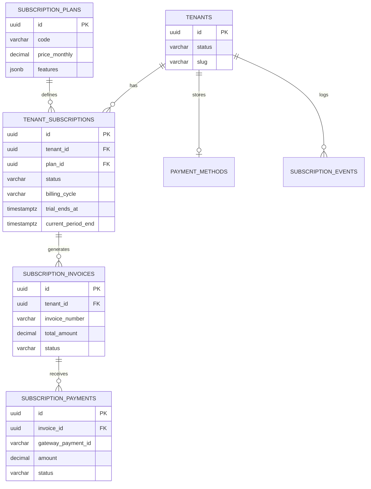
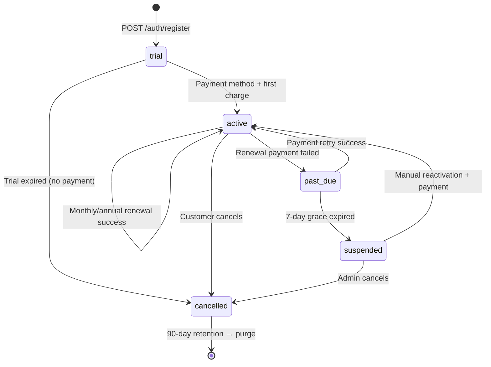
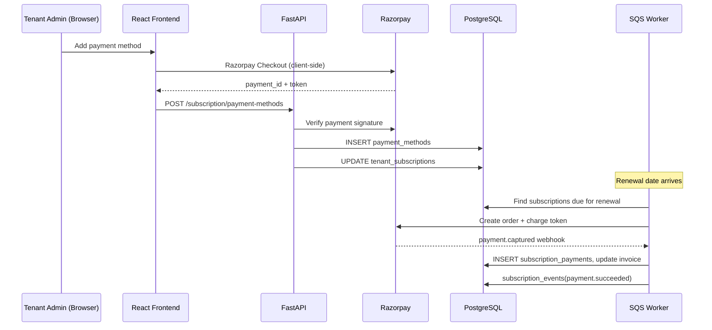
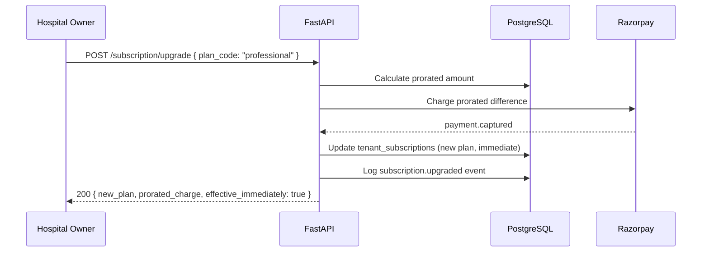
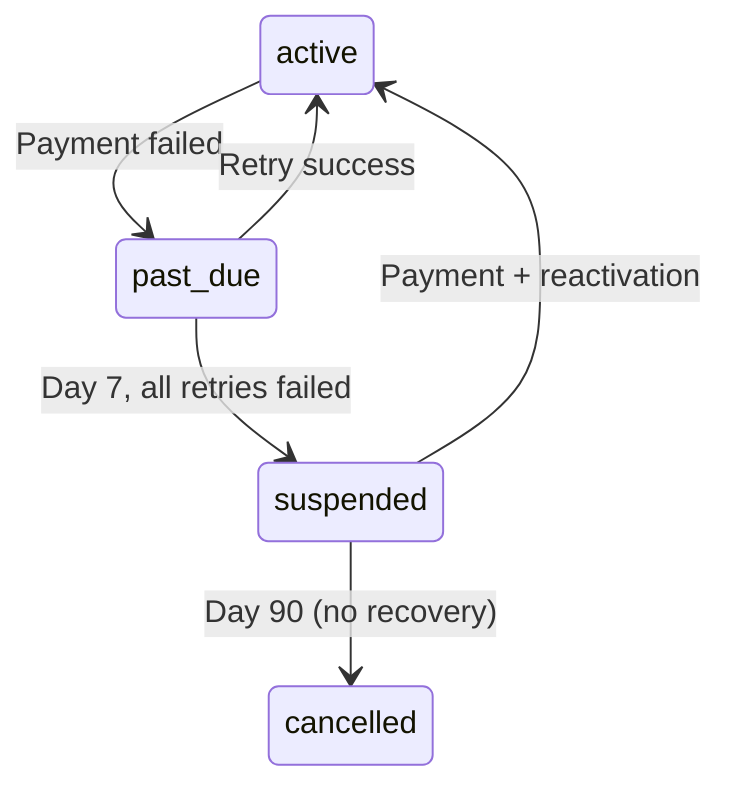
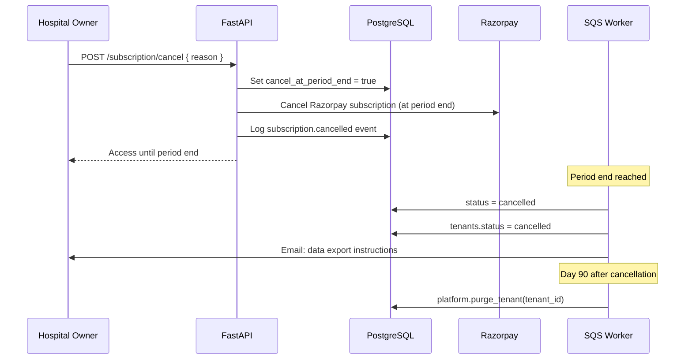

# Billing & Subscription Design Document

## Multi-Tenant Hospital Management SaaS Platform

| Field | Value |
|-------|-------|
| **Document Version** | 1.0 |
| **Status** | Draft |
| **Last Updated** | June 2026 |
| **Author** | Product & Platform Engineering |
| **Related Documents** | BUSINESS_REQUIREMENTS.md, MULTI_TENANT_DESIGN.md, DATABASE_DESIGN.md, API_DESIGN.md, SECURITY_ARCHITECTURE.md, FUNCTIONAL_REQUIREMENTS.md |

---

## 1. Executive Summary

This document defines the **SaaS subscription and platform billing** architecture for the Hospital Management Platform. It covers subscription plans, trial management, payment gateway integration (Razorpay primary), recurring billing, dunning, plan changes, limit enforcement, and tenant lifecycle billing states.

### 1.1 Scope Distinction

| Scope | Description | Document |
|-------|-------------|----------|
| **Platform Subscription Billing** | Tenant pays the SaaS operator for HMS access | **This document** |
| **Hospital Patient Billing** | Hospital bills patients for clinical services | API_DESIGN.md §7, FUNCTIONAL_REQUIREMENTS.md §Billing |

> Platform subscription invoices (`platform.subscription_invoices`) are separate from hospital patient invoices (`billing.invoices`). They must never share tables or payment flows.

### 1.2 Design Goals

| Goal | Description |
|------|-------------|
| Predictable recurring revenue | Automated monthly/annual renewal with minimal manual intervention |
| Self-service | Tenants manage plans, payment methods, and invoices without support tickets |
| Fair limits | Plan tiers enforce users, beds, modules; clear upgrade paths |
| Graceful degradation | Dunning with grace period before suspension; data preserved |
| PCI compliance | No card data stored on platform; tokenized via Razorpay |

---

## 2. Subscription Plans

### 2.1 Plan Tiers

| Plan Code | Display Name | Monthly (INR) | Annual (INR) | Target Segment |
|-----------|--------------|---------------|--------------|----------------|
| `starter` | Starter | ₹4,999 | ₹49,990 (~17% off) | Clinics, 1–10 doctors |
| `professional` | Professional | ₹14,999 | ₹1,49,990 (~17% off) | Small hospitals, 20–100 beds |
| `enterprise` | Enterprise | Custom | Custom | Medium hospitals, chains |

### 2.2 Plan Limits & Features

| Feature / Limit | Starter | Professional | Enterprise |
|-----------------|---------|--------------|------------|
| Max Users | 10 | 50 | 200+ (custom) |
| Max Beds | — | 50 | 200+ (custom) |
| Max Patients (trial only) | 100 | — | — |
| OPD Module | ✅ | ✅ | ✅ |
| Patient Management | ✅ | ✅ | ✅ |
| Hospital Billing | ✅ | ✅ | ✅ |
| IPD Module | ❌ | ✅ | ✅ |
| Laboratory | ❌ | ✅ | ✅ |
| Pharmacy | ❌ | ✅ | ✅ |
| Advanced Reports | ❌ | ✅ | ✅ |
| API Access | ❌ | ❌ | ✅ |
| Custom Branding | ❌ | ❌ | ✅ |
| Priority Support | ❌ | ❌ | ✅ |
| SLA Guarantee | ❌ | ❌ | 99.9% |
| Storage | 5 GB | 25 GB | 100 GB+ |

### 2.3 Plan Features JSONB Schema

Stored in `platform.subscription_plans.features`:

```json
{
  "modules": {
    "opd": true,
    "patient": true,
    "billing": true,
    "ipd": false,
    "laboratory": false,
    "pharmacy": false,
    "reports_advanced": false,
    "api_access": false
  },
  "limits": {
    "max_users": 10,
    "max_beds": null,
    "max_patients_trial": 100,
    "max_storage_gb": 5,
    "max_locations": 1
  },
  "support": {
    "priority": false,
    "sla_percent": null
  }
}
```

### 2.4 Trial Configuration

| Attribute | Value |
|-----------|-------|
| Duration | 14 days from registration |
| Plan access | Full features of selected plan |
| Payment required | No — trial starts without payment method |
| Trial limits | Users: 5, Patients: 100, Locations: 1, Storage: 1 GB |
| Conversion | Payment method required before `trial_ends_at` |
| Expiry (no conversion) | Status → `cancelled`; read-only export for 30 days |

---

## 3. Data Model

### 3.1 Entity Relationship



### 3.2 Platform Schema Tables

#### Existing Tables (DATABASE_DESIGN.md)

| Table | Purpose |
|-------|---------|
| `platform.tenants` | Tenant root; `status` reflects billing state |
| `platform.subscription_plans` | Plan catalog (system tenant seed) |
| `platform.tenant_subscriptions` | Active and historical subscriptions |
| `platform.tenant_settings` | Billing preferences, tax info |

#### Additional Tables (Subscription Billing)

| Table | Purpose |
|-------|---------|
| `platform.subscription_invoices` | SaaS invoices to tenants |
| `platform.subscription_invoice_line_items` | Invoice line items (plan, proration, add-ons) |
| `platform.subscription_payments` | Payment records against SaaS invoices |
| `platform.payment_methods` | Tokenized payment methods (Razorpay) |
| `platform.subscription_events` | Immutable billing event log |
| `platform.dunning_attempts` | Payment retry tracking |
| `platform.tenant_usage` | Usage metering (seats, storage, API calls) |

#### `platform.subscription_invoices`

| Column | Type | Description |
|--------|------|-------------|
| `id` | UUID | Primary key |
| `tenant_id` | UUID | FK → tenants |
| `subscription_id` | UUID | FK → tenant_subscriptions |
| `invoice_number` | VARCHAR(30) | `SINV-{YYYY}-{NNNNN}` per tenant |
| `status` | VARCHAR(20) | `draft`, `open`, `paid`, `void`, `uncollectible` |
| `billing_period_start` | TIMESTAMPTZ | Period covered |
| `billing_period_end` | TIMESTAMPTZ | Period covered |
| `subtotal` | DECIMAL(12,2) | Before tax |
| `tax_amount` | DECIMAL(12,2) | GST (18% for India SaaS) |
| `total_amount` | DECIMAL(12,2) | Final amount |
| `currency` | VARCHAR(3) | ISO 4217 (default `INR`) |
| `due_date` | TIMESTAMPTZ | Payment due |
| `paid_at` | TIMESTAMPTZ | Payment timestamp |
| `pdf_url` | TEXT | S3 path to invoice PDF |
| `gateway_invoice_id` | VARCHAR(255) | Razorpay invoice ID |

#### `platform.payment_methods`

| Column | Type | Description |
|--------|------|-------------|
| `id` | UUID | Primary key |
| `tenant_id` | UUID | FK → tenants |
| `gateway` | VARCHAR(20) | `razorpay`, `stripe` |
| `gateway_customer_id` | VARCHAR(255) | Razorpay customer ID |
| `gateway_token_id` | VARCHAR(255) | Tokenized payment method |
| `method_type` | VARCHAR(20) | `card`, `upi`, `netbanking` |
| `last_four` | VARCHAR(4) | Card last 4 digits |
| `brand` | VARCHAR(20) | `visa`, `mastercard`, `rupay` |
| `is_default` | BOOLEAN | Default payment method |
| `expires_at` | TIMESTAMPTZ | Card expiry |

#### `platform.subscription_events`

| Column | Type | Description |
|--------|------|-------------|
| `id` | UUID | Primary key |
| `tenant_id` | UUID | FK → tenants |
| `event_type` | VARCHAR(50) | See §3.3 |
| `payload` | JSONB | Event details |
| `source` | VARCHAR(20) | `system`, `webhook`, `admin`, `tenant` |
| `created_at` | TIMESTAMPTZ | Event timestamp |

### 3.3 Subscription Event Types

| Event Type | Trigger |
|------------|---------|
| `trial.started` | Tenant registration |
| `trial.ending_soon` | 3 days before trial end |
| `trial.expired` | Trial ended without payment |
| `subscription.created` | First paid subscription |
| `subscription.renewed` | Successful renewal |
| `subscription.upgraded` | Plan upgrade |
| `subscription.downgraded` | Plan downgrade scheduled |
| `payment.succeeded` | Successful charge |
| `payment.failed` | Failed charge |
| `dunning.retry` | Automatic retry attempt |
| `subscription.past_due` | Entered grace period |
| `subscription.suspended` | Grace period expired |
| `subscription.reactivated` | Payment recovered |
| `subscription.cancelled` | Customer cancellation |
| `payment_method.added` | New payment method |
| `payment_method.removed` | Payment method deleted |

---

## 4. Subscription Lifecycle

### 4.1 State Machine



### 4.2 State Definitions

| Status | Tenant Access | Billing | Description |
|--------|---------------|---------|-------------|
| `trial` | Full (trial limits) | No charge | 14-day evaluation period |
| `active` | Full (plan limits) | Charged per cycle | Paid and current |
| `past_due` | Full (grace period) | Retry in progress | Payment failed; 7-day grace |
| `suspended` | Blocked (403) | Overdue | Grace expired; login shows payment notice |
| `cancelled` | Export only | Stopped | Customer cancelled or trial expired |

### 4.3 Tenant Status Synchronization

`platform.tenants.status` mirrors subscription state:

| Subscription Status | Tenant Status |
|--------------------|---------------|
| `trial` | `trial` |
| `active` | `active` |
| `past_due` | `active` (with banner) |
| `suspended` | `suspended` |
| `cancelled` | `cancelled` |

---

## 5. Payment Gateway Integration

### 5.1 Gateway Selection

| Region | Primary Gateway | Fallback |
|--------|----------------|----------|
| India | **Razorpay** | — |
| International (Phase 2) | Stripe | Razorpay |

### 5.2 Razorpay Integration Architecture



### 5.3 Razorpay Configuration

| Setting | Value |
|---------|-------|
| Integration type | Razorpay Subscriptions + Orders API |
| Payment methods | Card, UPI, Net Banking, Wallet |
| Webhook endpoint | `POST /api/v1/webhooks/razorpay` |
| Webhook events | `payment.captured`, `payment.failed`, `subscription.charged`, `subscription.cancelled`, `refund.created` |
| Signature verification | HMAC SHA256 with webhook secret |
| Idempotency | `X-Razorpay-Event-Id` deduplication in Redis (24h TTL) |
| Test mode | Razorpay test keys in staging environment |

### 5.4 Payment Method Collection Flow

**Step 1 — Frontend initiates Razorpay Checkout:**

```javascript
const options = {
  key: RAZORPAY_KEY_ID,
  amount: 100,  // ₹1 auth charge (refunded)
  currency: 'INR',
  name: 'HMS Platform',
  description: 'Payment method verification',
  handler: function(response) {
    api.post('/subscription/payment-methods', {
      razorpay_payment_id: response.razorpay_payment_id,
      razorpay_order_id: response.razorpay_order_id,
      razorpay_signature: response.razorpay_signature
    });
  }
};
const rzp = new Razorpay(options);
rzp.open();
```

**Step 2 — Backend verifies and stores:**

```python
async def add_payment_method(tenant_id: UUID, payload: RazorpayPaymentPayload):
    if not razorpay_client.verify_payment_signature(payload):
        raise PaymentVerificationError()

    customer_id = await get_or_create_razorpay_customer(tenant_id)
    token = await razorpay_client.create_recurring_token(
        customer_id=customer_id,
        payment_id=payload.razorpay_payment_id,
    )

    await payment_method_repo.create(
        tenant_id=tenant_id,
        gateway="razorpay",
        gateway_customer_id=customer_id,
        gateway_token_id=token.id,
        method_type=token.method,
        last_four=token.last4,
        is_default=True,
    )
    await subscription_event_repo.log(tenant_id, "payment_method.added")
```

### 5.5 PCI Compliance

| Rule | Implementation |
|------|----------------|
| No card storage | Card data never touches platform servers |
| Tokenization | Razorpay stores card; platform stores token ID only |
| No PAN in logs | Log `gateway_token_id` only |
| HTTPS only | All payment pages over TLS |
| SAQ-A eligible | Redirect/checkout hosted by Razorpay |

---

## 6. Billing Cycles & Invoicing

### 6.1 Billing Cycles

| Cycle | Charge Date | Period |
|-------|-------------|--------|
| Monthly | Same day each month (signup anniversary) | 1 calendar month |
| Annual | Same day each year | 12 calendar months |

**Example:** Tenant signs up on June 17 → monthly renewal on 17th of each month.

### 6.2 Invoice Generation

| Trigger | Invoice Type |
|---------|-------------|
| Trial conversion | First subscription invoice |
| Renewal date | Recurring subscription invoice |
| Plan upgrade | Proration invoice (immediate) |
| Add-on purchase | One-time add-on invoice |

### 6.3 Invoice Calculation

```
Monthly renewal:
  line_item_1: Plan fee (e.g., Professional ₹14,999)
  tax: 18% GST = ₹2,699.82
  total: ₹17,698.82

Upgrade proration (Starter → Professional, 15 days remaining):
  credit:  -(Starter daily rate × 15) = -(4999/30 × 15) = -₹2,499.50
  charge:  +(Professional daily rate × 15) = +(14999/30 × 15) = +₹7,499.50
  net:     ₹5,000.00 + GST
```

### 6.4 Invoice PDF

| Attribute | Value |
|-----------|-------|
| Template | Platform-branded PDF with tenant name, GST details |
| Storage | `s3://bucket/tenants/{tenant_id}/invoices/{invoice_id}.pdf` |
| Generation | Async SQS job; status polled via API |
| Download | Pre-signed S3 URL (15-minute expiry) |

### 6.5 Tax Handling (India)

| Attribute | Value |
|-----------|-------|
| GST rate | 18% on SaaS (SAC code 998314) |
| GSTIN | Platform GSTIN on invoice header |
| Tenant GSTIN | Optional; collected in tenant profile for B2B |
| Tax invoice | Generated for all paid invoices |

---

## 7. Plan Changes

### 7.1 Upgrade Flow



| Rule | Value |
|------|-------|
| Effect | Immediate — new features available instantly |
| Billing | Prorated charge for remaining period |
| Limits | New plan limits apply immediately |
| Downgrade restriction | Cannot downgrade if current usage exceeds target plan limits |

### 7.2 Downgrade Flow

| Rule | Value |
|------|-------|
| Effect | End of current billing period |
| Billing | No refund for current period |
| Scheduling | `scheduled_plan_id` set on subscription |
| Confirmation | Email sent with effective date |
| Enforcement | At period end, if usage exceeds new limits → downgrade blocked with error |

### 7.3 Upgrade/Downgrade API

**Upgrade:**

```json
POST /api/v1/subscription/upgrade
Authorization: Bearer {token}
Permission: admin:subscription

{
  "plan_code": "professional",
  "billing_cycle": "annual"
}

Response 200:
{
  "data": {
    "previous_plan": "starter",
    "new_plan": "professional",
    "effective_immediately": true,
    "prorated_charge": 5000.00,
    "tax_amount": 900.00,
    "total_charge": 5900.00,
    "new_period_end": "2027-06-17T00:00:00Z"
  }
}
```

**Downgrade:**

```json
POST /api/v1/subscription/downgrade
{
  "plan_code": "starter"
}

Response 200:
{
  "data": {
    "current_plan": "professional",
    "scheduled_plan": "starter",
    "effective_date": "2026-07-17T00:00:00Z",
    "message": "Downgrade scheduled for end of current billing period."
  }
}
```

---

## 8. Dunning & Grace Period

### 8.1 Dunning Schedule

When renewal payment fails:

| Day | Action |
|-----|--------|
| Day 0 | Payment attempt fails → status `past_due` |
| Day 0 | Email: "Payment failed — please update payment method" |
| Day 1 | Automatic retry #1 |
| Day 3 | Email: "Payment overdue — 4 days until suspension" |
| Day 3 | Automatic retry #2 |
| Day 5 | Automatic retry #3 |
| Day 6 | Email: "Final notice — account will be suspended tomorrow" |
| Day 7 | Automatic retry #4 (final) |
| Day 7 | If all retries fail → status `suspended` |
| Day 7 | Email: "Account suspended — update payment to restore access" |

### 8.2 Dunning State Machine



### 8.3 Grace Period Access

| Status | HMS Access | Data |
|--------|------------|------|
| `past_due` (Day 1–7) | **Full access** | Read/Write — no disruption during grace |
| `suspended` | **Blocked** | Preserved; read-only export available |
| `cancelled` | **Blocked** | Export window 90 days |

### 8.4 Dunning Implementation

```python
async def process_dunning_retries():
    overdue = await subscription_repo.get_past_due_subscriptions()

    for sub in overdue:
        days_past_due = (utcnow() - sub.current_period_end).days
        attempt = await dunning_repo.get_attempt_count(sub.id)

        if days_past_due >= 7 and attempt >= 4:
            await suspend_tenant(sub.tenant_id, reason="payment_overdue")
            continue

        if should_retry_today(days_past_due, attempt):
            result = await charge_default_payment_method(sub.tenant_id, sub.amount_due)
            if result.success:
                await reactivate_subscription(sub)
            else:
                await dunning_repo.record_attempt(sub.id, result.error)
                await send_dunning_email(sub.tenant_id, days_past_due)
```

---

## 9. Limit Enforcement

### 9.1 Enforcement Matrix

| Limit | Check Point | HTTP Code | Error Code |
|-------|-------------|-----------|------------|
| Max users | `POST /admin/users/invite`, user activation | 402 | `plan_limit_users` |
| Max beds | `POST /clinical/beds`, `POST /admissions` | 402 | `plan_limit_beds` |
| Max patients (trial) | `POST /patients` | 402 | `plan_limit_patients` |
| Max storage | File upload pre-check | 402 | `plan_limit_storage` |
| Max locations | `POST /branches` | 402 | `plan_limit_locations` |
| Module access | Module-specific endpoints | 403 | `module_not_in_plan` |
| Suspended tenant | All authenticated endpoints | 403 | `tenant_suspended` |

### 9.2 Enforcement Middleware

```python
async def plan_limit_middleware(request: Request, call_next):
    tenant_id = request.state.tenant_id
    subscription = request.state.subscription
    plan = subscription.plan

    if request.url.path.endswith("/patients") and request.method == "POST":
        if subscription.status == "trial":
            count = await patient_repo.count(tenant_id)
            limit = plan.features["limits"]["max_patients_trial"]
            if count >= limit:
                return plan_limit_response("patients", limit)

    if request.url.path.endswith("/admin/users/invite") and request.method == "POST":
        count = await user_repo.count_active(tenant_id)
        limit = plan.features["limits"]["max_users"]
        if count >= limit:
            return plan_limit_response("users", limit)

    return await call_next(request)

def plan_limit_response(resource: str, limit: int):
    return JSONResponse(status_code=402, content={
        "error": f"plan_limit_{resource}",
        "message": f"Your plan allows a maximum of {limit} {resource}. Please upgrade.",
        "upgrade_url": "/settings/subscription"
    })
```

### 9.3 Module Access Check

```python
def requires_module(module_code: str):
    def decorator(func):
        @wraps(func)
        async def wrapper(request: Request, *args, **kwargs):
            plan = request.state.subscription.plan
            if not plan.features["modules"].get(module_code, False):
                raise HTTPException(status_code=403, detail={
                    "error": "module_not_in_plan",
                    "module": module_code,
                    "message": f"The {module_code} module is not included in your plan."
                })
            return await func(request, *args, **kwargs)
        return wrapper
    return decorator

@router.post("/admissions")
@requires_permission("ipd:admit")
@requires_module("ipd")
async def create_admission(...):
    ...
```

### 9.4 Usage Metering (Foundation)

`platform.tenant_usage` tracks daily aggregates for future usage-based billing:

| Meter | Unit | Tracked From |
|-------|------|--------------|
| `active_users` | count | Daily snapshot |
| `active_patients` | count | Daily snapshot |
| `storage_bytes` | bytes | S3 inventory |
| `api_calls` | count | API gateway middleware |
| `sms_sent` | count | Notification worker |
| `ai_invocations` | count | AI gateway |

---

## 10. API Endpoints

### 10.1 Tenant-Facing Subscription APIs

| Method | Endpoint | Permission | Description |
|--------|----------|------------|-------------|
| GET | `/subscription/plans` | Public | List available plans |
| GET | `/subscription/current` | `admin:subscription` | Current plan, status, limits, usage |
| POST | `/subscription/upgrade` | `admin:subscription` | Upgrade plan (immediate, prorated) |
| POST | `/subscription/downgrade` | `admin:subscription` | Schedule downgrade |
| POST | `/subscription/cancel` | `admin:subscription` | Cancel at period end |
| POST | `/subscription/reactivate` | `admin:subscription` | Reactivate cancelled subscription |
| GET | `/subscription/invoices` | `admin:subscription` | List SaaS invoices |
| GET | `/subscription/invoices/{id}` | `admin:subscription` | Invoice detail |
| GET | `/subscription/invoices/{id}/pdf` | `admin:subscription` | Download invoice PDF |
| POST | `/subscription/payment-methods` | `admin:subscription` | Add payment method |
| GET | `/subscription/payment-methods` | `admin:subscription` | List payment methods |
| DELETE | `/subscription/payment-methods/{id}` | `admin:subscription` | Remove payment method |
| PUT | `/subscription/payment-methods/{id}/default` | `admin:subscription` | Set default method |
| GET | `/subscription/usage` | `admin:subscription` | Current usage vs. limits |

### 10.2 Platform Admin APIs

| Method | Endpoint | Permission | Description |
|--------|----------|------------|-------------|
| GET | `/admin/tenants/{id}/subscription` | `platform:read` | View tenant subscription |
| PUT | `/admin/tenants/{id}/subscription` | `platform:update` | Override plan (Enterprise deals) |
| POST | `/admin/tenants/{id}/subscription/suspend` | `platform:update` | Manual suspension |
| POST | `/admin/tenants/{id}/subscription/reactivate` | `platform:update` | Manual reactivation |
| POST | `/admin/tenants/{id}/subscription/credit` | `platform:update` | Apply account credit |
| GET | `/admin/billing/revenue` | `platform:read` | MRR/ARR dashboard data |

### 10.3 Webhook Endpoint

| Method | Endpoint | Auth | Description |
|--------|----------|------|-------------|
| POST | `/webhooks/razorpay` | HMAC signature | Razorpay payment events |

**Webhook handler (idempotent):**

```python
@router.post("/webhooks/razorpay")
async def razorpay_webhook(request: Request):
    body = await request.body()
    signature = request.headers.get("X-Razorpay-Signature")

    if not razorpay_client.verify_webhook_signature(body, signature):
        raise HTTPException(status_code=400, detail="Invalid signature")

    event = json.loads(body)
    event_id = event["event"]

    if await redis.exists(f"webhook:razorpay:{event_id}"):
        return {"status": "already_processed"}

    await process_razorpay_event(event)
    await redis.set(f"webhook:razorpay:{event_id}", "1", ex=86400)
    return {"status": "ok"}
```

---

## 11. Notification Schedule

### 11.1 Billing Emails

| Trigger | Recipient | Template | Timing |
|---------|-----------|----------|--------|
| Trial started | Hospital Owner | `trial_welcome` | Registration |
| Trial ending (3 days) | Hospital Owner | `trial_ending_soon` | Trial day 11 |
| Trial ending (1 day) | Hospital Owner | `trial_last_day` | Trial day 13 |
| Trial expired | Hospital Owner | `trial_expired` | Trial day 14 |
| Payment method added | Hospital Owner | `payment_method_added` | On add |
| Renewal upcoming (7 days) | Hospital Owner | `renewal_reminder_7d` | 7 days before |
| Renewal upcoming (1 day) | Hospital Owner | `renewal_reminder_1d` | 1 day before |
| Payment success | Hospital Owner | `payment_receipt` | On charge |
| Payment failed | Hospital Owner | `payment_failed` | On failure |
| Dunning notice | Hospital Owner | `dunning_notice` | Day 3, 6 |
| Account suspended | Hospital Owner | `account_suspended` | Day 7 |
| Plan upgraded | Hospital Owner | `plan_upgraded` | On upgrade |
| Plan downgraded | Hospital Owner | `plan_downgrade_scheduled` | On downgrade |
| Cancellation confirmed | Hospital Owner | `cancellation_confirmed` | On cancel |

### 11.2 In-App Notifications

| Event | UI Element |
|-------|------------|
| Trial ending | Banner: "X days left in trial — add payment method" |
| Past due | Banner: "Payment overdue — update payment method" (red) |
| Suspended | Full-page block: "Account suspended" with payment CTA |
| Plan limit reached | Modal: "Upgrade to add more {resource}" |

---

## 12. Cancellation & Offboarding

### 12.1 Cancellation Flow



### 12.2 Cancellation Rules

| Rule | Value |
|------|-------|
| Notice | Cancel effective at end of current billing period |
| Access during notice | Full access until period end |
| Refund policy | No refund for partial period (monthly); prorated for annual (case-by-case) |
| Data retention | 90 days post-cancellation |
| Data export | Self-service export available during retention |
| Reactivation | Allowed within 90 days; outstanding payment cleared |

### 12.3 Data Export on Cancellation

```
POST /api/v1/tenant/data-export
Permission: admin:subscription (Hospital Owner)

Response 202:
{
  "data": {
    "export_id": "...",
    "status": "processing",
    "estimated_completion": "2026-06-18T12:00:00Z"
  }
}
```

Export includes: patients, staff, clinical records, invoices, audit logs — packaged as encrypted ZIP in tenant S3 prefix.

---

## 13. Background Jobs

### 13.1 Scheduled Jobs

| Job | Schedule | Description |
|-----|----------|-------------|
| `billing.process_renewals` | Daily 00:00 UTC | Charge subscriptions due today |
| `billing.process_dunning` | Daily 06:00 UTC | Retry failed payments per dunning schedule |
| `billing.trial_expiry_check` | Daily 00:00 UTC | Expire trials without payment method |
| `billing.send_renewal_reminders` | Daily 08:00 UTC | 7-day and 1-day reminders |
| `billing.generate_invoice_pdfs` | On demand (SQS) | Generate invoice PDF |
| `billing.sync_razorpay_status` | Hourly | Reconcile payment status with Razorpay |
| `billing.tenant_purge` | Daily 02:00 UTC | Purge tenants past 90-day retention |
| `billing.usage_snapshot` | Daily 01:00 UTC | Snapshot tenant usage meters |

### 13.2 Renewal Job Flow

```python
async def process_renewals():
    due_subscriptions = await subscription_repo.get_due_today()

    for sub in due_subscriptions:
        invoice = await create_renewal_invoice(sub)
        payment_method = await payment_method_repo.get_default(sub.tenant_id)

        if not payment_method:
            await transition_to_past_due(sub)
            continue

        result = await razorpay_client.charge(
            customer_id=payment_method.gateway_customer_id,
            token_id=payment_method.gateway_token_id,
            amount=invoice.total_amount,
            currency=invoice.currency,
            notes={"invoice_id": str(invoice.id), "tenant_id": str(sub.tenant_id)},
        )

        if result.status == "captured":
            await mark_invoice_paid(invoice, result.payment_id)
            await extend_subscription_period(sub)
        else:
            await transition_to_past_due(sub)
            await dunning_repo.create(sub.id, result.error)
```

---

## 14. UI Screens

### 14.1 Tenant Admin Screens

| Screen | Route | Permission | Description |
|--------|-------|------------|-------------|
| Subscription Overview | `/settings/subscription` | `admin:subscription` | Current plan, usage, next billing date |
| Plan Comparison | `/settings/subscription/plans` | `admin:subscription` | Feature matrix; upgrade/downgrade CTAs |
| Payment Methods | `/settings/subscription/payment` | `admin:subscription` | Add/remove cards, UPI |
| Billing History | `/settings/subscription/invoices` | `admin:subscription` | Invoice list with PDF download |
| Cancel Subscription | `/settings/subscription/cancel` | `admin:subscription` | Cancellation form with reason |

### 14.2 Platform Admin Screens

| Screen | Route | Permission | Description |
|--------|-------|------------|-------------|
| Revenue Dashboard | `/admin/billing` | `platform:read` | MRR, ARR, churn metrics |
| Tenant Billing Detail | `/admin/tenants/{id}/billing` | `platform:read` | Subscription, invoices, payment history |
| Manual Override | `/admin/tenants/{id}/billing/override` | `platform:update` | Custom plan, credits, suspension |

### 14.3 Registration Flow Integration

During onboarding wizard (MULTI_TENANT_DESIGN.md §4.1):

| Step | Billing Action |
|------|----------------|
| Step 1: Register | Trial subscription created (14 days) |
| Step 3: Select Plan | Plan selection recorded; conversion at payment |
| Trial Day 11 | Banner + email: add payment method |
| Trial Day 14 | Payment required or access blocked |

---

## 15. Security Considerations

| Control | Implementation |
|---------|----------------|
| PCI compliance | No card data on platform; Razorpay tokenization |
| Webhook verification | HMAC SHA256 signature on every webhook |
| Idempotency | Webhook event deduplication; `X-Idempotency-Key` on charges |
| Permission gate | Only Hospital Owner can manage subscription |
| Audit trail | All billing events in `subscription_events` |
| 2FA gate | Plan changes require 2FA if enabled (SECURITY_ARCHITECTURE.md §5.6) |
| Amount validation | Server-side amount calculation; never trust client amount |

---

## 16. Functional Requirements Traceability

| FR ID | Requirement | Section |
|-------|-------------|---------|
| FR-SUB-001 | Subscription plans | §2.1 |
| FR-SUB-002 | 14-day trial | §2.4 |
| FR-SUB-003 | Payment method before trial expiry | §5.4, §11.1 |
| FR-SUB-004 | Automatic monthly billing | §6, §13.2 |
| FR-SUB-005 | Billing reminders | §11.1 |
| FR-SUB-006 | Plan limit enforcement | §9 |
| FR-SUB-007 | Plan upgrade with proration | §7.1 |
| FR-SUB-008 | Plan downgrade next cycle | §7.2 |
| FR-SUB-009 | Suspend after 7-day grace | §8 |
| FR-SUB-010 | Billing history and PDF | §6.4, §10.1 |
| FR-SUB-011 | Annual billing with discount | §2.1, §6.1 |
| BR-REV-01 | Monthly subscription model | §4, §6 |
| BR-REV-02 | Tiered pricing | §2 |
| BR-REV-03 | Annual billing discount | §2.1 |
| BR-REV-05 | 14-day free trial | §2.4 |
| BR-REV-06 | 7-day grace period | §8 |
| BR-REV-07 | Plan upgrade/downgrade | §7 |

---

## 17. Testing Strategy

### 17.1 Test Scenarios

| Scenario | Expected Result |
|----------|-----------------|
| Register → trial created | 14-day trial, full plan features |
| Trial day 14, no payment | Status → cancelled; access blocked |
| Add payment method | Razorpay token stored; verification charge refunded |
| Monthly renewal success | Invoice paid; period extended |
| Monthly renewal failure | Status → past_due; dunning starts |
| Day 7 dunning, no payment | Status → suspended; 403 on API |
| Payment after suspension | Status → active; access restored |
| Upgrade Starter → Professional | Prorated charge; IPD module unlocked |
| Downgrade with excess users | Downgrade blocked with error |
| Cancel subscription | Access until period end; then cancelled |
| Webhook replay | Idempotent; no double charge |
| Plan limit: max users | 402 on invite when at limit |

### 17.2 Razorpay Test Cards

| Card Number | Scenario |
|-------------|----------|
| 4111 1111 1111 1111 | Success |
| 4000 0000 0000 0002 | Declined |
| 4000 0000 0000 0069 | Expired card |

---

## 18. Future Enhancements

| Feature | Phase | Reference |
|---------|-------|-----------|
| Usage-based billing | Post-MVP | ADVANCED_FEATURES_ROADMAP.md §3.7 |
| Add-on modules (per-module pricing) | Post-MVP | ADVANCED_FEATURES_ROADMAP.md |
| Stripe for international | Phase 2 | §5.1 |
| Self-service annual switch | Phase 2 | §6.1 |
| Account credits & coupons | Phase 2 | Platform admin |
| Revenue analytics dashboard | Post-MVP | ADVANCED_FEATURES_ROADMAP.md §3.6 |
| Multi-currency support | Phase 3 | International expansion |

---

## 19. Revision History

| Version | Date | Author | Changes |
|---------|------|--------|---------|
| 1.0 | June 2026 | Product & Platform Engineering | Initial billing & subscription design |

---

*This document governs platform SaaS billing only. Hospital patient billing is defined in FUNCTIONAL_REQUIREMENTS.md and API_DESIGN.md. No platform billing logic shall be mixed with `billing.invoices` (patient invoices).*
