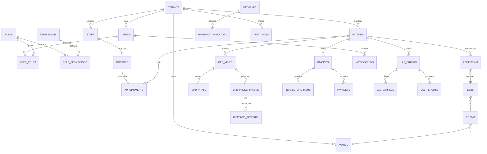

# Database Design Document

## Multi-Tenant Hospital Management SaaS Platform

| Field | Value |
|-------|-------|
| **Document Version** | 1.0 |
| **Status** | Draft |
| **Last Updated** | June 2026 |
| **Database Engine** | PostgreSQL 14+ |
| **Architecture** | Multi-Tenant · Shared Database · `tenant_id` Row Isolation |
| **Related Documents** | PRD.md, MULTI_TENANT_DESIGN.md, API_DESIGN.md, SECURITY_ARCHITECTURE.md |

---

## 1. Introduction

### 1.1 Purpose

This document defines the logical and physical database design for the Multi-Tenant Hospital Management SaaS Platform. It serves as the authoritative reference for schema structure, relationships, indexing, partitioning, retention, and tenant isolation—without prescribing implementation SQL.

### 1.2 Design Principles

| Principle | Description |
|-----------|-------------|
| **Tenant Isolation** | Every tenant-scoped table includes `tenant_id`; all queries filter by tenant context |
| **UUID Primary Keys** | All primary keys are UUID v4 (or v7 for time-ordered inserts where noted) |
| **Auditability** | Standard audit columns on all mutable tables |
| **Soft Delete** | Clinical and financial records use soft delete; hard delete only via retention jobs |
| **Referential Integrity** | Foreign keys enforced within tenant scope; composite keys include `tenant_id` where applicable |
| **Normalization** | 3NF for transactional tables; denormalized read models deferred to reporting layer |
| **Extensibility** | JSONB `metadata` column on key entities for tenant-specific extensions |

### 1.3 Schema Organization

| Schema | Purpose | `tenant_id` |
|--------|---------|-------------|
| `platform` | Cross-tenant SaaS operations (tenants, subscriptions, plans) | Present; root tenant self-references `id` |
| `core` | Identity, RBAC, patients, staff, doctors | Required on every table |
| `clinical` | OPD, IPD, admissions, beds, wards, rooms | Required on every table |
| `billing` | Services, invoices, payments | Required on every table |
| `pharmacy` | Medicines, inventory, dispensing | Required on every table |
| `laboratory` | Tests, orders, samples, results, reports | Required on every table |
| `comms` | Notifications and delivery tracking | Required on every table |
| `audit` | Immutable audit and compliance logs | Required on every table |

### 1.4 Standard Audit Fields

Applied to all tables unless noted as **immutable** (append-only):

| Column | Type | Nullable | Description |
|--------|------|----------|-------------|
| `id` | UUID | NO | Primary key |
| `tenant_id` | UUID | NO | Tenant scope; FK → `platform.tenants.id` |
| `created_at` | TIMESTAMPTZ | NO | Record creation timestamp (UTC) |
| `created_by` | UUID | YES | User who created the record |
| `updated_at` | TIMESTAMPTZ | YES | Last modification timestamp |
| `updated_by` | UUID | YES | User who last modified the record |
| `deleted_at` | TIMESTAMPTZ | YES | Soft-delete timestamp; NULL = active |
| `deleted_by` | UUID | YES | User who soft-deleted the record |
| `version` | INTEGER | NO | Optimistic locking counter; default `1` |

**Immutable tables** (`audit.audit_logs`, `comms.notification_delivery_log`): include `tenant_id`, `created_at`, `created_by` only; no `updated_*` or soft delete.

### 1.5 System Tenant

A reserved system tenant UUID (`00000000-0000-0000-0000-000000000001`) holds platform-global seed data (default permissions catalog, notification templates). Tenant-specific rows always use real tenant UUIDs.

---

## 2. ER Diagram Description

### 2.1 High-Level Entity Relationship Overview

The data model centers on **`tenants`** as the isolation root. Each tenant owns users, patients, clinical encounters, billing, pharmacy, and laboratory data. Users link to roles and permissions through RBAC junction tables. Patients connect to appointments, OPD visits, IPD admissions, invoices, lab orders, and prescriptions. Admissions occupy beds within rooms and wards.



### 2.2 Module-Level ER Descriptions

#### 2.2.1 Platform & Tenant Management

`tenants` is the root entity. Each tenant has one active `tenant_subscriptions` row (historical rows retained), optional `tenant_locations` for branches, and `tenant_settings` for configuration key-value pairs. Subscription references `subscription_plans` (system tenant seed data).

#### 2.2.2 Identity & RBAC

`users` belong to exactly one tenant. `roles` are tenant-scoped (with system-default roles cloned on tenant provisioning). `permissions` define atomic actions (system catalog). `role_permissions` and `user_roles` are many-to-many junction tables, always including `tenant_id`.

#### 2.2.3 Patient & Staff

`patients` are tenant-scoped with unique MRN per tenant. `patient_allergies`, `patient_contacts`, and `patient_documents` are child tables. `staff` represents employees; `doctors` extends staff with clinical attributes (specialization, fee, license). `departments` organize staff and services.

#### 2.2.4 OPD & Appointments

`doctor_schedules` define availability. `appointments` link patient, doctor, and optional location. `opd_visits` represent encounters (walk-in or appointment-linked). `opd_queue` manages token order. `opd_vitals`, `opd_clinical_notes`, and `opd_prescriptions` / `opd_prescription_items` hang off visits.

#### 2.2.5 IPD & Bed Management

Hierarchy: `wards` → `rooms` → `beds`. `admissions` link patient to bed with status lifecycle. `admission_transfers` track ward changes. `nursing_notes`, `ipd_vitals`, and `discharge_summaries` attach to admissions.

#### 2.2.6 Billing

`billing_services` is the charge master. `invoices` header links to patient and optional visit/admission. `invoice_line_items` itemize charges. `payments` record collections; `payment_allocations` split payments across invoices.

#### 2.2.7 Pharmacy

`medicines` is the drug master. `pharmacy_inventory` holds stock by batch. `pharmacy_stock_movements` is an immutable ledger. `dispense_records` and `dispense_items` fulfill prescriptions.

#### 2.2.8 Laboratory

`lab_test_catalog` defines tests. `lab_orders` / `lab_order_items` originate from consultations. `lab_samples` track specimen lifecycle. `lab_results` store result values. `lab_reports` are finalized report documents.

#### 2.2.9 Notifications & Audit

`notifications` are in-app messages. `notification_delivery_log` tracks SMS/email delivery. `audit_logs` capture all security-sensitive and data mutations.

---

## 3. Table List

### 3.1 Platform Schema (5 tables)

| # | Table | Description |
|---|-------|-------------|
| 1 | `platform.tenants` | Healthcare organization (tenant root) |
| 2 | `platform.subscription_plans` | SaaS plan definitions |
| 3 | `platform.tenant_subscriptions` | Tenant subscription history and status |
| 4 | `platform.tenant_locations` | Branches / facilities per tenant |
| 5 | `platform.tenant_settings` | Key-value tenant configuration |

### 3.2 Core Schema — Identity & RBAC (7 tables)

| # | Table | Description |
|---|-------|-------------|
| 6 | `core.users` | Authenticated user accounts |
| 7 | `core.roles` | Tenant-scoped roles |
| 8 | `core.permissions` | Permission catalog (system + tenant overrides) |
| 9 | `core.role_permissions` | Role-to-permission mapping |
| 10 | `core.user_roles` | User-to-role mapping |
| 11 | `core.user_sessions` | Active sessions and refresh tokens |
| 12 | `core.password_reset_tokens` | Password reset workflow |

### 3.3 Core Schema — Patients & Staff (8 tables)

| # | Table | Description |
|---|-------|-------------|
| 13 | `core.patients` | Patient demographics and MRN |
| 14 | `core.patient_allergies` | Patient allergy records |
| 15 | `core.patient_contacts` | Emergency / guardian contacts |
| 16 | `core.patient_documents` | Attached documents and consents |
| 17 | `core.departments` | Hospital departments |
| 18 | `core.staff` | Employee records |
| 19 | `core.doctors` | Doctor profiles (extends staff) |
| 20 | `core.doctor_schedules` | Doctor availability and slots |

### 3.4 Clinical Schema — Appointments & OPD (8 tables)

| # | Table | Description |
|---|-------|-------------|
| 21 | `clinical.appointments` | Scheduled appointments |
| 22 | `clinical.opd_visits` | Outpatient encounters |
| 23 | `clinical.opd_queue` | Token queue per doctor |
| 24 | `clinical.opd_vitals` | Vitals per visit |
| 25 | `clinical.opd_clinical_notes` | Consultation notes and diagnosis |
| 26 | `clinical.opd_prescriptions` | Prescription headers |
| 27 | `clinical.opd_prescription_items` | Prescription line items |
| 28 | `clinical.opd_referrals` | Internal / external referrals |

### 3.5 Clinical Schema — IPD & Bed Management (9 tables)

| # | Table | Description |
|---|-------|-------------|
| 29 | `clinical.wards` | Hospital wards |
| 30 | `clinical.rooms` | Rooms within wards |
| 31 | `clinical.beds` | Beds within rooms |
| 32 | `clinical.admissions` | IPD admission records |
| 33 | `clinical.admission_transfers` | Ward/bed transfer history |
| 34 | `clinical.nursing_notes` | Nursing documentation |
| 35 | `clinical.ipd_vitals` | Inpatient vitals charting |
| 36 | `clinical.discharge_summaries` | Discharge documentation |
| 37 | `clinical.ipd_daily_charges` | Daily IPD charge accruals |

### 3.6 Billing Schema (6 tables)

| # | Table | Description |
|---|-------|-------------|
| 38 | `billing.billing_services` | Service / charge master |
| 39 | `billing.invoices` | Invoice headers |
| 40 | `billing.invoice_line_items` | Invoice line items |
| 41 | `billing.payments` | Payment transactions |
| 42 | `billing.payment_allocations` | Payment-to-invoice allocation |
| 43 | `billing.invoice_adjustments` | Discounts, voids, write-offs |

### 3.7 Pharmacy Schema (6 tables)

| # | Table | Description |
|---|-------|-------------|
| 44 | `pharmacy.medicines` | Drug / medicine master |
| 45 | `pharmacy.pharmacy_inventory` | Stock by medicine and batch |
| 46 | `pharmacy.pharmacy_stock_movements` | Immutable stock ledger |
| 47 | `pharmacy.dispense_records` | Dispensing events |
| 48 | `pharmacy.dispense_items` | Dispensed line items |
| 49 | `pharmacy.purchase_orders` | Stock purchase orders |

### 3.8 Laboratory Schema (7 tables)

| # | Table | Description |
|---|-------|-------------|
| 50 | `laboratory.lab_test_catalog` | Lab test definitions |
| 51 | `laboratory.lab_orders` | Lab order headers |
| 52 | `laboratory.lab_order_items` | Ordered tests |
| 53 | `laboratory.lab_samples` | Sample collection and tracking |
| 54 | `laboratory.lab_results` | Result values per test item |
| 55 | `laboratory.lab_reports` | Finalized report documents |
| 56 | `laboratory.lab_report_signatures` | Authorized signatories |

### 3.9 Communications Schema (4 tables)

| # | Table | Description |
|---|-------|-------------|
| 57 | `comms.notification_templates` | Email/SMS templates |
| 58 | `comms.notifications` | In-app notifications |
| 59 | `comms.notification_preferences` | User notification settings |
| 60 | `comms.notification_delivery_log` | External delivery tracking (immutable) |

### 3.10 Audit Schema (1 table)

| # | Table | Description |
|---|-------|-------------|
| 61 | `audit.audit_logs` | Immutable audit trail |

**Total: 61 tables** — all include `tenant_id`.

---

## 4. Column Definitions

*Sections below list domain-specific columns beyond standard audit fields (`id`, `tenant_id`, `created_at`, `created_by`, `updated_at`, `updated_by`, `deleted_at`, `deleted_by`, `version`).*

### 4.1 Platform Schema

#### `platform.tenants`

| Column | Type | Nullable | Description |
|--------|------|----------|-------------|
| `name` | VARCHAR(255) | NO | Organization legal/display name |
| `slug` | VARCHAR(100) | NO | URL-safe identifier; unique platform-wide |
| `subdomain` | VARCHAR(100) | YES | Tenant subdomain (e.g., `apollo.platform.com`) |
| `status` | VARCHAR(20) | NO | `trial`, `active`, `suspended`, `cancelled` |
| `email` | VARCHAR(255) | NO | Primary admin email |
| `phone` | VARCHAR(20) | YES | Primary contact phone |
| `logo_url` | TEXT | YES | Organization logo storage path |
| `address_line1` | VARCHAR(255) | YES | Street address |
| `address_line2` | VARCHAR(255) | YES | Additional address |
| `city` | VARCHAR(100) | YES | City |
| `state` | VARCHAR(100) | YES | State / province |
| `country` | VARCHAR(100) | NO | ISO country code |
| `postal_code` | VARCHAR(20) | YES | Postal / ZIP code |
| `timezone` | VARCHAR(50) | NO | IANA timezone (default `Asia/Kolkata`) |
| `currency` | VARCHAR(3) | NO | ISO 4217 currency code (default `INR`) |
| `tax_registration_no` | VARCHAR(50) | YES | GST / tax ID |
| `metadata` | JSONB | YES | Extensible tenant attributes |

> **Note:** `tenant_id` = `id` (self-referencing root row).

#### `platform.subscription_plans`

| Column | Type | Nullable | Description |
|--------|------|----------|-------------|
| `code` | VARCHAR(50) | NO | Plan code: `starter`, `professional`, `enterprise` |
| `name` | VARCHAR(100) | NO | Display name |
| `description` | TEXT | YES | Plan description |
| `price_monthly` | DECIMAL(12,2) | NO | Monthly price |
| `price_annual` | DECIMAL(12,2) | YES | Annual price |
| `max_users` | INTEGER | NO | Licensed user seats |
| `max_beds` | INTEGER | YES | Licensed bed count (NULL = unlimited) |
| `max_patients` | INTEGER | YES | Patient record cap for trial tiers |
| `features` | JSONB | NO | Enabled module flags |
| `is_active` | BOOLEAN | NO | Plan available for new subscriptions |

#### `platform.tenant_subscriptions`

| Column | Type | Nullable | Description |
|--------|------|----------|-------------|
| `plan_id` | UUID | NO | FK → `subscription_plans.id` |
| `status` | VARCHAR(20) | NO | `trial`, `active`, `past_due`, `suspended`, `cancelled` |
| `billing_cycle` | VARCHAR(10) | NO | `monthly`, `annual` |
| `trial_ends_at` | TIMESTAMPTZ | YES | Trial expiration |
| `current_period_start` | TIMESTAMPTZ | NO | Billing period start |
| `current_period_end` | TIMESTAMPTZ | NO | Billing period end |
| `cancelled_at` | TIMESTAMPTZ | YES | Cancellation timestamp |
| `payment_gateway_customer_id` | VARCHAR(255) | YES | External billing customer ID |
| `payment_gateway_subscription_id` | VARCHAR(255) | YES | External subscription ID |

#### `platform.tenant_locations`

| Column | Type | Nullable | Description |
|--------|------|----------|-------------|
| `name` | VARCHAR(255) | NO | Branch / location name |
| `code` | VARCHAR(20) | NO | Short location code; unique per tenant |
| `is_primary` | BOOLEAN | NO | Primary location flag |
| `address_line1` | VARCHAR(255) | YES | Street address |
| `city` | VARCHAR(100) | YES | City |
| `state` | VARCHAR(100) | YES | State |
| `phone` | VARCHAR(20) | YES | Location phone |
| `is_active` | BOOLEAN | NO | Active status |

#### `platform.tenant_settings`

| Column | Type | Nullable | Description |
|--------|------|----------|-------------|
| `setting_key` | VARCHAR(100) | NO | Setting identifier |
| `setting_value` | JSONB | NO | Setting value |
| `description` | TEXT | YES | Human-readable description |

**Unique constraint:** (`tenant_id`, `setting_key`)

---

### 4.2 Core Schema — Identity & RBAC

#### `core.users`

| Column | Type | Nullable | Description |
|--------|------|----------|-------------|
| `email` | VARCHAR(255) | NO | Login email; unique per tenant |
| `password_hash` | VARCHAR(255) | NO | Bcrypt/Argon2 hash |
| `first_name` | VARCHAR(100) | NO | First name |
| `last_name` | VARCHAR(100) | NO | Last name |
| `phone` | VARCHAR(20) | YES | Mobile number |
| `avatar_url` | TEXT | YES | Profile image path |
| `status` | VARCHAR(20) | NO | `active`, `inactive`, `locked` |
| `last_login_at` | TIMESTAMPTZ | YES | Last successful login |
| `failed_login_attempts` | INTEGER | NO | Consecutive failed logins |
| `locked_until` | TIMESTAMPTZ | YES | Account lock expiry |
| `email_verified_at` | TIMESTAMPTZ | YES | Email verification timestamp |
| `staff_id` | UUID | YES | FK → `staff.id` (optional link) |
| `location_id` | UUID | YES | FK → `tenant_locations.id` default branch |

#### `core.roles`

| Column | Type | Nullable | Description |
|--------|------|----------|-------------|
| `name` | VARCHAR(100) | NO | Role name; unique per tenant |
| `code` | VARCHAR(50) | NO | Machine code: `tenant_admin`, `doctor`, etc. |
| `description` | TEXT | YES | Role description |
| `is_system` | BOOLEAN | NO | System-seeded role (non-deletable) |
| `is_active` | BOOLEAN | NO | Active status |

#### `core.permissions`

| Column | Type | Nullable | Description |
|--------|------|----------|-------------|
| `code` | VARCHAR(100) | NO | Permission code: `patient:read`, `billing:create` |
| `name` | VARCHAR(150) | NO | Display name |
| `module` | VARCHAR(50) | NO | Module grouping |
| `description` | TEXT | YES | Permission description |

#### `core.role_permissions`

| Column | Type | Nullable | Description |
|--------|------|----------|-------------|
| `role_id` | UUID | NO | FK → `roles.id` |
| `permission_id` | UUID | NO | FK → `permissions.id` |

**Unique constraint:** (`tenant_id`, `role_id`, `permission_id`)

#### `core.user_roles`

| Column | Type | Nullable | Description |
|--------|------|----------|-------------|
| `user_id` | UUID | NO | FK → `users.id` |
| `role_id` | UUID | NO | FK → `roles.id` |

**Unique constraint:** (`tenant_id`, `user_id`, `role_id`)

#### `core.user_sessions`

| Column | Type | Nullable | Description |
|--------|------|----------|-------------|
| `user_id` | UUID | NO | FK → `users.id` |
| `refresh_token_hash` | VARCHAR(255) | NO | Hashed refresh token |
| `ip_address` | INET | YES | Client IP |
| `user_agent` | TEXT | YES | Browser/client user agent |
| `expires_at` | TIMESTAMPTZ | NO | Session expiry |
| `revoked_at` | TIMESTAMPTZ | YES | Revocation timestamp |

#### `core.password_reset_tokens`

| Column | Type | Nullable | Description |
|--------|------|----------|-------------|
| `user_id` | UUID | NO | FK → `users.id` |
| `token_hash` | VARCHAR(255) | NO | Hashed reset token |
| `expires_at` | TIMESTAMPTZ | NO | Token expiry (1 hour) |
| `used_at` | TIMESTAMPTZ | YES | Consumption timestamp |

---

### 4.3 Core Schema — Patients & Staff

#### `core.patients`

| Column | Type | Nullable | Description |
|--------|------|----------|-------------|
| `mrn` | VARCHAR(20) | NO | Medical Record Number; unique per tenant |
| `first_name` | VARCHAR(100) | NO | First name |
| `last_name` | VARCHAR(100) | YES | Last name |
| `date_of_birth` | DATE | NO | Date of birth |
| `gender` | VARCHAR(10) | NO | `male`, `female`, `other` |
| `blood_group` | VARCHAR(5) | YES | A+, B+, O+, AB+, etc. |
| `phone` | VARCHAR(20) | NO | Primary phone |
| `email` | VARCHAR(255) | YES | Email address |
| `address_line1` | VARCHAR(255) | YES | Address |
| `city` | VARCHAR(100) | YES | City |
| `state` | VARCHAR(100) | YES | State |
| `postal_code` | VARCHAR(20) | YES | Postal code |
| `photo_url` | TEXT | YES | Patient photo |
| `id_proof_type` | VARCHAR(50) | YES | Aadhaar, passport, etc. |
| `id_proof_number` | VARCHAR(50) | YES | ID document number (encrypted at app layer) |
| `marital_status` | VARCHAR(20) | YES | Marital status |
| `occupation` | VARCHAR(100) | YES | Occupation |
| `consent_given_at` | TIMESTAMPTZ | YES | Data processing consent timestamp |
| `location_id` | UUID | YES | FK → `tenant_locations.id` |
| `metadata` | JSONB | YES | Extended attributes |

#### `core.patient_allergies`

| Column | Type | Nullable | Description |
|--------|------|----------|-------------|
| `patient_id` | UUID | NO | FK → `patients.id` |
| `allergen` | VARCHAR(255) | NO | Allergen substance |
| `severity` | VARCHAR(20) | NO | `mild`, `moderate`, `severe` |
| `reaction` | TEXT | YES | Reaction description |
| `onset_date` | DATE | YES | When allergy was identified |
| `is_active` | BOOLEAN | NO | Currently active allergy |

#### `core.patient_contacts`

| Column | Type | Nullable | Description |
|--------|------|----------|-------------|
| `patient_id` | UUID | NO | FK → `patients.id` |
| `name` | VARCHAR(200) | NO | Contact person name |
| `relationship` | VARCHAR(50) | NO | `spouse`, `parent`, `guardian`, etc. |
| `phone` | VARCHAR(20) | NO | Contact phone |
| `email` | VARCHAR(255) | YES | Contact email |
| `is_emergency` | BOOLEAN | NO | Emergency contact flag |
| `is_primary` | BOOLEAN | NO | Primary contact flag |

#### `core.patient_documents`

| Column | Type | Nullable | Description |
|--------|------|----------|-------------|
| `patient_id` | UUID | NO | FK → `patients.id` |
| `document_type` | VARCHAR(50) | NO | `id_proof`, `consent`, `report`, `other` |
| `file_name` | VARCHAR(255) | NO | Original file name |
| `file_path` | TEXT | NO | Object storage path |
| `file_size_bytes` | BIGINT | NO | File size |
| `mime_type` | VARCHAR(100) | NO | MIME type |

#### `core.departments`

| Column | Type | Nullable | Description |
|--------|------|----------|-------------|
| `name` | VARCHAR(150) | NO | Department name |
| `code` | VARCHAR(20) | NO | Short code; unique per tenant |
| `head_staff_id` | UUID | YES | FK → `staff.id` |
| `location_id` | UUID | YES | FK → `tenant_locations.id` |
| `is_active` | BOOLEAN | NO | Active status |

#### `core.staff`

| Column | Type | Nullable | Description |
|--------|------|----------|-------------|
| `employee_code` | VARCHAR(20) | NO | Employee ID; unique per tenant |
| `first_name` | VARCHAR(100) | NO | First name |
| `last_name` | VARCHAR(100) | NO | Last name |
| `email` | VARCHAR(255) | YES | Work email |
| `phone` | VARCHAR(20) | YES | Work phone |
| `department_id` | UUID | YES | FK → `departments.id` |
| `designation` | VARCHAR(100) | YES | Job title |
| `joining_date` | DATE | NO | Date of joining |
| `leaving_date` | DATE | YES | Date of separation |
| `status` | VARCHAR(20) | NO | `active`, `on_leave`, `terminated` |
| `location_id` | UUID | YES | FK → `tenant_locations.id` |

#### `core.doctors`

| Column | Type | Nullable | Description |
|--------|------|----------|-------------|
| `staff_id` | UUID | NO | FK → `staff.id` |
| `registration_number` | VARCHAR(50) | YES | Medical council registration |
| `specialization` | VARCHAR(150) | NO | Primary specialization |
| `qualification` | VARCHAR(255) | YES | Degrees / qualifications |
| `consultation_fee` | DECIMAL(10,2) | NO | Default OPD fee |
| `follow_up_fee` | DECIMAL(10,2) | YES | Follow-up consultation fee |
| `department_id` | UUID | YES | FK → `departments.id` |
| `bio` | TEXT | YES | Profile biography |
| `is_available` | BOOLEAN | NO | Currently accepting patients |

#### `core.doctor_schedules`

| Column | Type | Nullable | Description |
|--------|------|----------|-------------|
| `doctor_id` | UUID | NO | FK → `doctors.id` |
| `day_of_week` | SMALLINT | NO | 0=Sunday … 6=Saturday |
| `start_time` | TIME | NO | Shift start |
| `end_time` | TIME | NO | Shift end |
| `slot_duration_minutes` | INTEGER | NO | Appointment slot length |
| `max_patients_per_slot` | INTEGER | NO | Capacity per slot (default 1) |
| `location_id` | UUID | YES | FK → `tenant_locations.id` |
| `is_active` | BOOLEAN | NO | Schedule active flag |

---

### 4.4 Clinical Schema — Appointments & OPD

#### `clinical.appointments`

| Column | Type | Nullable | Description |
|--------|------|----------|-------------|
| `patient_id` | UUID | NO | FK → `patients.id` |
| `doctor_id` | UUID | NO | FK → `doctors.id` |
| `location_id` | UUID | YES | FK → `tenant_locations.id` |
| `appointment_date` | DATE | NO | Scheduled date |
| `start_time` | TIME | NO | Slot start time |
| `end_time` | TIME | NO | Slot end time |
| `appointment_type` | VARCHAR(20) | NO | `new`, `follow_up`, `emergency` |
| `status` | VARCHAR(20) | NO | `scheduled`, `confirmed`, `completed`, `cancelled`, `no_show` |
| `notes` | TEXT | YES | Booking notes |
| `cancelled_reason` | TEXT | YES | Cancellation reason |
| `reminder_sent_at` | TIMESTAMPTZ | YES | Last reminder timestamp |

#### `clinical.opd_visits`

| Column | Type | Nullable | Description |
|--------|------|----------|-------------|
| `visit_number` | VARCHAR(20) | NO | Visit ID; unique per tenant |
| `patient_id` | UUID | NO | FK → `patients.id` |
| `doctor_id` | UUID | NO | FK → `doctors.id` |
| `appointment_id` | UUID | YES | FK → `appointments.id` |
| `location_id` | UUID | YES | FK → `tenant_locations.id` |
| `visit_date` | DATE | NO | Visit date |
| `visit_type` | VARCHAR(20) | NO | `walk_in`, `appointment` |
| `status` | VARCHAR(20) | NO | `waiting`, `in_consultation`, `completed`, `cancelled` |
| `token_number` | INTEGER | YES | Queue token number |
| `chief_complaint` | TEXT | YES | Presenting complaint |
| `started_at` | TIMESTAMPTZ | YES | Consultation start |
| `completed_at` | TIMESTAMPTZ | YES | Consultation end |

#### `clinical.opd_queue`

| Column | Type | Nullable | Description |
|--------|------|----------|-------------|
| `opd_visit_id` | UUID | NO | FK → `opd_visits.id` |
| `doctor_id` | UUID | NO | FK → `doctors.id` |
| `token_number` | INTEGER | NO | Queue position |
| `queue_date` | DATE | NO | Queue date |
| `status` | VARCHAR(20) | NO | `waiting`, `called`, `in_consultation`, `completed`, `skipped` |
| `priority` | VARCHAR(10) | NO | `normal`, `urgent` |
| `called_at` | TIMESTAMPTZ | YES | When patient was called |

#### `clinical.opd_vitals`

| Column | Type | Nullable | Description |
|--------|------|----------|-------------|
| `opd_visit_id` | UUID | NO | FK → `opd_visits.id` |
| `recorded_at` | TIMESTAMPTZ | NO | Measurement timestamp |
| `blood_pressure_systolic` | SMALLINT | YES | Systolic BP (mmHg) |
| `blood_pressure_diastolic` | SMALLINT | YES | Diastolic BP (mmHg) |
| `pulse_rate` | SMALLINT | YES | Pulse (bpm) |
| `temperature` | DECIMAL(4,1) | YES | Temperature (°F or °C per tenant setting) |
| `respiratory_rate` | SMALLINT | YES | Breaths per minute |
| `spo2` | SMALLINT | YES | Oxygen saturation (%) |
| `weight_kg` | DECIMAL(5,2) | YES | Weight in kg |
| `height_cm` | DECIMAL(5,1) | YES | Height in cm |
| `bmi` | DECIMAL(4,1) | YES | Calculated BMI |
| `notes` | TEXT | YES | Additional observations |

#### `clinical.opd_clinical_notes`

| Column | Type | Nullable | Description |
|--------|------|----------|-------------|
| `opd_visit_id` | UUID | NO | FK → `opd_visits.id` |
| `note_type` | VARCHAR(30) | NO | `examination`, `diagnosis`, `plan`, `general` |
| `content` | TEXT | NO | Clinical note body |
| `icd_code` | VARCHAR(10) | YES | ICD-10 diagnosis code |
| `icd_description` | VARCHAR(255) | YES | Diagnosis description |
| `is_final` | BOOLEAN | NO | Locked after consultation complete |

#### `clinical.opd_prescriptions`

| Column | Type | Nullable | Description |
|--------|------|----------|-------------|
| `opd_visit_id` | UUID | NO | FK → `opd_visits.id` |
| `patient_id` | UUID | NO | FK → `patients.id` |
| `doctor_id` | UUID | NO | FK → `doctors.id` |
| `prescription_number` | VARCHAR(20) | NO | Unique per tenant |
| `prescribed_at` | TIMESTAMPTZ | NO | Prescription timestamp |
| `status` | VARCHAR(20) | NO | `active`, `dispensed`, `partially_dispensed`, `cancelled` |
| `notes` | TEXT | YES | General instructions |

#### `clinical.opd_prescription_items`

| Column | Type | Nullable | Description |
|--------|------|----------|-------------|
| `prescription_id` | UUID | NO | FK → `opd_prescriptions.id` |
| `medicine_id` | UUID | YES | FK → `medicines.id` |
| `medicine_name` | VARCHAR(255) | NO | Drug name (denormalized for history) |
| `dosage` | VARCHAR(100) | NO | e.g., `500mg` |
| `frequency` | VARCHAR(100) | NO | e.g., `twice daily` |
| `duration` | VARCHAR(100) | NO | e.g., `7 days` |
| `route` | VARCHAR(50) | YES | `oral`, `topical`, `IV`, etc. |
| `instructions` | TEXT | YES | Special instructions |
| `quantity` | INTEGER | YES | Quantity to dispense |

#### `clinical.opd_referrals`

| Column | Type | Nullable | Description |
|--------|------|----------|-------------|
| `opd_visit_id` | UUID | NO | FK → `opd_visits.id` |
| `patient_id` | UUID | NO | FK → `patients.id` |
| `referring_doctor_id` | UUID | NO | FK → `doctors.id` |
| `referred_doctor_id` | UUID | YES | FK → `doctors.id` (internal) |
| `referral_type` | VARCHAR(20) | NO | `internal`, `external` |
| `external_facility` | VARCHAR(255) | YES | External hospital/clinic name |
| `reason` | TEXT | NO | Referral reason |
| `urgency` | VARCHAR(10) | NO | `routine`, `urgent`, `emergency` |
| `status` | VARCHAR(20) | NO | `pending`, `accepted`, `completed` |

---

### 4.5 Clinical Schema — IPD & Bed Management

#### `clinical.wards`

| Column | Type | Nullable | Description |
|--------|------|----------|-------------|
| `name` | VARCHAR(150) | NO | Ward name |
| `code` | VARCHAR(20) | NO | Ward code; unique per tenant |
| `ward_type` | VARCHAR(30) | NO | `general`, `icu`, `pediatric`, `maternity`, etc. |
| `floor` | VARCHAR(10) | YES | Floor number/name |
| `location_id` | UUID | YES | FK → `tenant_locations.id` |
| `capacity` | INTEGER | NO | Total bed capacity |
| `is_active` | BOOLEAN | NO | Active status |

#### `clinical.rooms`

| Column | Type | Nullable | Description |
|--------|------|----------|-------------|
| `ward_id` | UUID | NO | FK → `wards.id` |
| `room_number` | VARCHAR(20) | NO | Room number; unique per ward |
| `room_type` | VARCHAR(30) | NO | `private`, `semi_private`, `general` |
| `daily_charge` | DECIMAL(10,2) | YES | Room daily rate |
| `is_active` | BOOLEAN | NO | Active status |

#### `clinical.beds`

| Column | Type | Nullable | Description |
|--------|------|----------|-------------|
| `room_id` | UUID | NO | FK → `rooms.id` |
| `bed_number` | VARCHAR(10) | NO | Bed identifier; unique per room |
| `bed_type` | VARCHAR(30) | NO | `standard`, `icu`, `ventilator` |
| `status` | VARCHAR(20) | NO | `available`, `occupied`, `maintenance`, `reserved` |
| `daily_charge` | DECIMAL(10,2) | YES | Bed-specific daily rate override |

#### `clinical.admissions`

| Column | Type | Nullable | Description |
|--------|------|----------|-------------|
| `admission_number` | VARCHAR(20) | NO | Unique per tenant |
| `patient_id` | UUID | NO | FK → `patients.id` |
| `admitting_doctor_id` | UUID | NO | FK → `doctors.id` |
| `attending_doctor_id` | UUID | YES | FK → `doctors.id` |
| `bed_id` | UUID | NO | FK → `beds.id` |
| `location_id` | UUID | YES | FK → `tenant_locations.id` |
| `admission_date` | TIMESTAMPTZ | NO | Admission timestamp |
| `expected_discharge_date` | DATE | YES | Planned discharge |
| `actual_discharge_date` | TIMESTAMPTZ | YES | Actual discharge timestamp |
| `admission_type` | VARCHAR(20) | NO | `emergency`, `planned`, `transfer` |
| `status` | VARCHAR(20) | NO | `admitted`, `under_treatment`, `discharged`, `transferred`, `deceased` |
| `diagnosis_on_admission` | TEXT | YES | Admitting diagnosis |
| `admission_notes` | TEXT | YES | Admission notes |

#### `clinical.admission_transfers`

| Column | Type | Nullable | Description |
|--------|------|----------|-------------|
| `admission_id` | UUID | NO | FK → `admissions.id` |
| `from_bed_id` | UUID | NO | FK → `beds.id` |
| `to_bed_id` | UUID | NO | FK → `beds.id` |
| `transfer_reason` | TEXT | YES | Reason for transfer |
| `transferred_at` | TIMESTAMPTZ | NO | Transfer timestamp |
| `transferred_by` | UUID | YES | FK → `users.id` |

#### `clinical.nursing_notes`

| Column | Type | Nullable | Description |
|--------|------|----------|-------------|
| `admission_id` | UUID | NO | FK → `admissions.id` |
| `nurse_id` | UUID | YES | FK → `staff.id` |
| `note_type` | VARCHAR(30) | NO | `assessment`, `care_plan`, `progress`, `incident` |
| `content` | TEXT | NO | Note content |
| `recorded_at` | TIMESTAMPTZ | NO | Note timestamp |

#### `clinical.ipd_vitals`

| Column | Type | Nullable | Description |
|--------|------|----------|-------------|
| `admission_id` | UUID | NO | FK → `admissions.id` |
| `recorded_at` | TIMESTAMPTZ | NO | Measurement timestamp |
| `blood_pressure_systolic` | SMALLINT | YES | Systolic BP |
| `blood_pressure_diastolic` | SMALLINT | YES | Diastolic BP |
| `pulse_rate` | SMALLINT | YES | Pulse |
| `temperature` | DECIMAL(4,1) | YES | Temperature |
| `respiratory_rate` | SMALLINT | YES | Respiratory rate |
| `spo2` | SMALLINT | YES | SpO2 |
| `notes` | TEXT | YES | Observations |

#### `clinical.discharge_summaries`

| Column | Type | Nullable | Description |
|--------|------|----------|-------------|
| `admission_id` | UUID | NO | FK → `admissions.id` |
| `patient_id` | UUID | NO | FK → `patients.id` |
| `discharging_doctor_id` | UUID | NO | FK → `doctors.id` |
| `diagnosis` | TEXT | NO | Final diagnosis |
| `treatment_summary` | TEXT | NO | Treatment provided |
| `medications_on_discharge` | TEXT | YES | Discharge medications |
| `follow_up_instructions` | TEXT | YES | Follow-up plan |
| `follow_up_date` | DATE | YES | Recommended follow-up date |
| `discharged_at` | TIMESTAMPTZ | NO | Discharge timestamp |

#### `clinical.ipd_daily_charges`

| Column | Type | Nullable | Description |
|--------|------|----------|-------------|
| `admission_id` | UUID | NO | FK → `admissions.id` |
| `billing_service_id` | UUID | YES | FK → `billing_services.id` |
| `charge_date` | DATE | NO | Charge accrual date |
| `description` | VARCHAR(255) | NO | Charge description |
| `amount` | DECIMAL(12,2) | NO | Charge amount |
| `is_billed` | BOOLEAN | NO | Included in invoice flag |
| `invoice_id` | UUID | YES | FK → `invoices.id` when billed |

---

### 4.6 Billing Schema

#### `billing.billing_services`

| Column | Type | Nullable | Description |
|--------|------|----------|-------------|
| `code` | VARCHAR(20) | NO | Service code; unique per tenant |
| `name` | VARCHAR(255) | NO | Service name |
| `category` | VARCHAR(50) | NO | `consultation`, `procedure`, `lab`, `pharmacy`, `room`, `nursing`, `other` |
| `department_id` | UUID | YES | FK → `departments.id` |
| `price` | DECIMAL(12,2) | NO | Unit price |
| `tax_rate` | DECIMAL(5,2) | NO | Tax percentage (e.g., 18.00 for GST) |
| `is_tax_inclusive` | BOOLEAN | NO | Price includes tax flag |
| `is_active` | BOOLEAN | NO | Available for billing |

#### `billing.invoices`

| Column | Type | Nullable | Description |
|--------|------|----------|-------------|
| `invoice_number` | VARCHAR(20) | NO | Unique per tenant |
| `patient_id` | UUID | NO | FK → `patients.id` |
| `opd_visit_id` | UUID | YES | FK → `opd_visits.id` |
| `admission_id` | UUID | YES | FK → `admissions.id` |
| `location_id` | UUID | YES | FK → `tenant_locations.id` |
| `invoice_date` | DATE | NO | Invoice date |
| `due_date` | DATE | YES | Payment due date |
| `status` | VARCHAR(20) | NO | `draft`, `finalized`, `partially_paid`, `paid`, `voided` |
| `subtotal` | DECIMAL(12,2) | NO | Pre-tax subtotal |
| `tax_amount` | DECIMAL(12,2) | NO | Total tax |
| `discount_amount` | DECIMAL(12,2) | NO | Total discount |
| `total_amount` | DECIMAL(12,2) | NO | Grand total |
| `paid_amount` | DECIMAL(12,2) | NO | Amount paid to date |
| `balance_amount` | DECIMAL(12,2) | NO | Outstanding balance |
| `notes` | TEXT | YES | Invoice notes |
| `finalized_at` | TIMESTAMPTZ | YES | Finalization timestamp |
| `voided_at` | TIMESTAMPTZ | YES | Void timestamp |
| `void_reason` | TEXT | YES | Void justification |

#### `billing.invoice_line_items`

| Column | Type | Nullable | Description |
|--------|------|----------|-------------|
| `invoice_id` | UUID | NO | FK → `invoices.id` |
| `billing_service_id` | UUID | YES | FK → `billing_services.id` |
| `description` | VARCHAR(255) | NO | Line item description |
| `quantity` | DECIMAL(10,2) | NO | Quantity |
| `unit_price` | DECIMAL(12,2) | NO | Price per unit |
| `tax_rate` | DECIMAL(5,2) | NO | Applied tax rate |
| `tax_amount` | DECIMAL(12,2) | NO | Line tax |
| `discount_amount` | DECIMAL(12,2) | NO | Line discount |
| `total_amount` | DECIMAL(12,2) | NO | Line total |
| `source_type` | VARCHAR(30) | YES | `opd`, `ipd`, `lab`, `pharmacy`, `manual` |
| `source_id` | UUID | YES | Polymorphic reference to source record |

#### `billing.payments`

| Column | Type | Nullable | Description |
|--------|------|----------|-------------|
| `receipt_number` | VARCHAR(20) | NO | Unique per tenant |
| `patient_id` | UUID | NO | FK → `patients.id` |
| `payment_date` | TIMESTAMPTZ | NO | Payment timestamp |
| `amount` | DECIMAL(12,2) | NO | Payment amount |
| `payment_mode` | VARCHAR(20) | NO | `cash`, `card`, `upi`, `bank_transfer`, `insurance` |
| `reference_number` | VARCHAR(100) | YES | Transaction / UPI reference |
| `status` | VARCHAR(20) | NO | `completed`, `pending`, `failed`, `refunded` |
| `notes` | TEXT | YES | Payment notes |
| `collected_by` | UUID | YES | FK → `users.id` |

#### `billing.payment_allocations`

| Column | Type | Nullable | Description |
|--------|------|----------|-------------|
| `payment_id` | UUID | NO | FK → `payments.id` |
| `invoice_id` | UUID | NO | FK → `invoices.id` |
| `allocated_amount` | DECIMAL(12,2) | NO | Amount applied to invoice |

#### `billing.invoice_adjustments`

| Column | Type | Nullable | Description |
|--------|------|----------|-------------|
| `invoice_id` | UUID | NO | FK → `invoices.id` |
| `adjustment_type` | VARCHAR(20) | NO | `discount`, `void`, `write_off`, `correction` |
| `amount` | DECIMAL(12,2) | NO | Adjustment amount |
| `reason` | TEXT | NO | Mandatory justification |
| `approved_by` | UUID | YES | FK → `users.id` (required for discounts > threshold) |

---

### 4.7 Pharmacy Schema

#### `pharmacy.medicines`

| Column | Type | Nullable | Description |
|--------|------|----------|-------------|
| `code` | VARCHAR(20) | NO | Medicine code; unique per tenant |
| `name` | VARCHAR(255) | NO | Brand name |
| `generic_name` | VARCHAR(255) | YES | Generic name |
| `category` | VARCHAR(50) | NO | `tablet`, `capsule`, `syrup`, `injection`, etc. |
| `unit` | VARCHAR(20) | NO | `tablet`, `ml`, `vial`, etc. |
| `strength` | VARCHAR(50) | YES | e.g., `500mg` |
| `manufacturer` | VARCHAR(255) | YES | Manufacturer name |
| `unit_price` | DECIMAL(10,2) | NO | Selling price per unit |
| `reorder_level` | INTEGER | NO | Minimum stock alert threshold |
| `is_active` | BOOLEAN | NO | Available for dispensing |

#### `pharmacy.pharmacy_inventory`

| Column | Type | Nullable | Description |
|--------|------|----------|-------------|
| `medicine_id` | UUID | NO | FK → `medicines.id` |
| `batch_number` | VARCHAR(50) | NO | Batch/lot number |
| `quantity_on_hand` | INTEGER | NO | Current stock quantity |
| `unit_cost` | DECIMAL(10,2) | NO | Purchase cost per unit |
| `expiry_date` | DATE | NO | Batch expiry date |
| `location_id` | UUID | YES | FK → `tenant_locations.id` |
| `supplier_name` | VARCHAR(255) | YES | Supplier reference |

**Unique constraint:** (`tenant_id`, `medicine_id`, `batch_number`)

#### `pharmacy.pharmacy_stock_movements`

| Column | Type | Nullable | Description |
|--------|------|----------|-------------|
| `medicine_id` | UUID | NO | FK → `medicines.id` |
| `inventory_id` | UUID | YES | FK → `pharmacy_inventory.id` |
| `movement_type` | VARCHAR(20) | NO | `purchase`, `dispense`, `adjustment`, `return`, `expired` |
| `quantity` | INTEGER | NO | Positive = in; negative = out |
| `reference_type` | VARCHAR(30) | YES | `dispense`, `purchase_order`, `manual` |
| `reference_id` | UUID | YES | Polymorphic source reference |
| `notes` | TEXT | YES | Movement notes |

> **Immutable table** — append-only ledger; no `updated_*` or soft delete.

#### `pharmacy.dispense_records`

| Column | Type | Nullable | Description |
|--------|------|----------|-------------|
| `dispense_number` | VARCHAR(20) | NO | Unique per tenant |
| `prescription_id` | UUID | YES | FK → `opd_prescriptions.id` |
| `patient_id` | UUID | NO | FK → `patients.id` |
| `dispensed_by` | UUID | YES | FK → `users.id` |
| `dispensed_at` | TIMESTAMPTZ | NO | Dispense timestamp |
| `status` | VARCHAR(20) | NO | `completed`, `partial`, `cancelled` |
| `total_amount` | DECIMAL(12,2) | NO | Total dispense value |

#### `pharmacy.dispense_items`

| Column | Type | Nullable | Description |
|--------|------|----------|-------------|
| `dispense_id` | UUID | NO | FK → `dispense_records.id` |
| `medicine_id` | UUID | NO | FK → `medicines.id` |
| `inventory_id` | UUID | YES | FK → `pharmacy_inventory.id` |
| `prescription_item_id` | UUID | YES | FK → `opd_prescription_items.id` |
| `quantity_dispensed` | INTEGER | NO | Quantity given |
| `unit_price` | DECIMAL(10,2) | NO | Price at time of dispense |
| `total_price` | DECIMAL(12,2) | NO | Line total |

#### `pharmacy.purchase_orders`

| Column | Type | Nullable | Description |
|--------|------|----------|-------------|
| `po_number` | VARCHAR(20) | NO | Unique per tenant |
| `supplier_name` | VARCHAR(255) | NO | Supplier name |
| `order_date` | DATE | NO | Order date |
| `expected_delivery_date` | DATE | YES | Expected delivery |
| `status` | VARCHAR(20) | NO | `draft`, `ordered`, `received`, `cancelled` |
| `total_amount` | DECIMAL(12,2) | NO | PO total |
| `notes` | TEXT | YES | Order notes |

---

### 4.8 Laboratory Schema

#### `laboratory.lab_test_catalog`

| Column | Type | Nullable | Description |
|--------|------|----------|-------------|
| `code` | VARCHAR(20) | NO | Test code; unique per tenant |
| `name` | VARCHAR(255) | NO | Test name |
| `category` | VARCHAR(50) | NO | `hematology`, `biochemistry`, `microbiology`, etc. |
| `sample_type` | VARCHAR(50) | NO | `blood`, `urine`, `stool`, `tissue`, etc. |
| `price` | DECIMAL(10,2) | NO | Test price |
| `tat_hours` | INTEGER | YES | Expected turnaround time |
| `normal_range` | TEXT | YES | Reference range description |
| `is_active` | BOOLEAN | NO | Available for ordering |

#### `laboratory.lab_orders`

| Column | Type | Nullable | Description |
|--------|------|----------|-------------|
| `order_number` | VARCHAR(20) | NO | Unique per tenant |
| `patient_id` | UUID | NO | FK → `patients.id` |
| `ordering_doctor_id` | UUID | YES | FK → `doctors.id` |
| `opd_visit_id` | UUID | YES | FK → `opd_visits.id` |
| `admission_id` | UUID | YES | FK → `admissions.id` |
| `order_date` | TIMESTAMPTZ | NO | Order timestamp |
| `priority` | VARCHAR(10) | NO | `routine`, `urgent`, `stat` |
| `status` | VARCHAR(20) | NO | `ordered`, `sample_collected`, `processing`, `completed`, `cancelled` |
| `clinical_notes` | TEXT | YES | Clinical indication |

#### `laboratory.lab_order_items`

| Column | Type | Nullable | Description |
|--------|------|----------|-------------|
| `lab_order_id` | UUID | NO | FK → `lab_orders.id` |
| `test_id` | UUID | NO | FK → `lab_test_catalog.id` |
| `status` | VARCHAR(20) | NO | `ordered`, `sample_collected`, `processing`, `completed`, `cancelled` |
| `price` | DECIMAL(10,2) | NO | Price at time of order |

#### `laboratory.lab_samples`

| Column | Type | Nullable | Description |
|--------|------|----------|-------------|
| `sample_id` | VARCHAR(30) | NO | Barcode/sample ID; unique per tenant |
| `lab_order_item_id` | UUID | NO | FK → `lab_order_items.id` |
| `sample_type` | VARCHAR(50) | NO | Sample material type |
| `collected_at` | TIMESTAMPTZ | YES | Collection timestamp |
| `collected_by` | UUID | YES | FK → `staff.id` |
| `status` | VARCHAR(20) | NO | `pending`, `collected`, `processing`, `completed`, `rejected` |
| `rejection_reason` | TEXT | YES | Reason if rejected |

#### `laboratory.lab_results`

| Column | Type | Nullable | Description |
|--------|------|----------|-------------|
| `lab_order_item_id` | UUID | NO | FK → `lab_order_items.id` |
| `sample_id` | UUID | YES | FK → `lab_samples.id` |
| `parameter_name` | VARCHAR(150) | NO | Result parameter |
| `result_value` | VARCHAR(255) | NO | Measured value |
| `unit` | VARCHAR(30) | YES | Measurement unit |
| `reference_range` | VARCHAR(100) | YES | Normal range |
| `is_abnormal` | BOOLEAN | NO | Outside normal range flag |
| `is_critical` | BOOLEAN | NO | Panic/critical value flag |
| `entered_by` | UUID | YES | FK → `staff.id` |
| `entered_at` | TIMESTAMPTZ | NO | Result entry timestamp |
| `verified_by` | UUID | YES | FK → `staff.id` |
| `verified_at` | TIMESTAMPTZ | YES | Verification timestamp |

#### `laboratory.lab_reports`

| Column | Type | Nullable | Description |
|--------|------|----------|-------------|
| `report_number` | VARCHAR(20) | NO | Unique per tenant |
| `lab_order_id` | UUID | NO | FK → `lab_orders.id` |
| `patient_id` | UUID | NO | FK → `patients.id` |
| `report_date` | TIMESTAMPTZ | NO | Report generation timestamp |
| `status` | VARCHAR(20) | NO | `draft`, `finalized`, `amended` |
| `file_path` | TEXT | YES | Generated PDF storage path |
| `finalized_by` | UUID | YES | FK → `staff.id` |
| `finalized_at` | TIMESTAMPTZ | YES | Finalization timestamp |

#### `laboratory.lab_report_signatures`

| Column | Type | Nullable | Description |
|--------|------|----------|-------------|
| `lab_report_id` | UUID | NO | FK → `lab_reports.id` |
| `staff_id` | UUID | NO | FK → `staff.id` |
| `designation` | VARCHAR(100) | NO | Signatory title |
| `signed_at` | TIMESTAMPTZ | NO | Signature timestamp |

---

### 4.9 Communications Schema

#### `comms.notification_templates`

| Column | Type | Nullable | Description |
|--------|------|----------|-------------|
| `code` | VARCHAR(50) | NO | Template code; unique per tenant |
| `channel` | VARCHAR(10) | NO | `email`, `sms`, `in_app` |
| `subject` | VARCHAR(255) | YES | Email subject (email only) |
| `body_template` | TEXT | NO | Template with placeholders |
| `is_active` | BOOLEAN | NO | Template enabled flag |

#### `comms.notifications`

| Column | Type | Nullable | Description |
|--------|------|----------|-------------|
| `user_id` | UUID | NO | FK → `users.id` |
| `title` | VARCHAR(255) | NO | Notification title |
| `message` | TEXT | NO | Notification body |
| `notification_type` | VARCHAR(50) | NO | `appointment`, `lab_result`, `billing`, `system` |
| `reference_type` | VARCHAR(30) | YES | Polymorphic entity type |
| `reference_id` | UUID | YES | Polymorphic entity ID |
| `is_read` | BOOLEAN | NO | Read status |
| `read_at` | TIMESTAMPTZ | YES | Read timestamp |

#### `comms.notification_preferences`

| Column | Type | Nullable | Description |
|--------|------|----------|-------------|
| `user_id` | UUID | NO | FK → `users.id` |
| `notification_type` | VARCHAR(50) | NO | Notification category |
| `channel` | VARCHAR(10) | NO | `email`, `sms`, `in_app` |
| `is_enabled` | BOOLEAN | NO | Preference enabled flag |

**Unique constraint:** (`tenant_id`, `user_id`, `notification_type`, `channel`)

#### `comms.notification_delivery_log`

| Column | Type | Nullable | Description |
|--------|------|----------|-------------|
| `notification_id` | UUID | YES | FK → `notifications.id` |
| `recipient` | VARCHAR(255) | NO | Email address or phone number |
| `channel` | VARCHAR(10) | NO | `email`, `sms` |
| `template_code` | VARCHAR(50) | YES | Template used |
| `status` | VARCHAR(20) | NO | `sent`, `delivered`, `failed`, `bounced` |
| `provider_message_id` | VARCHAR(255) | YES | External provider reference |
| `error_message` | TEXT | YES | Failure reason |
| `sent_at` | TIMESTAMPTZ | NO | Send timestamp |
| `delivered_at` | TIMESTAMPTZ | YES | Delivery confirmation |

> **Immutable table** — append-only; no updates or soft delete.

---

### 4.10 Audit Schema

#### `audit.audit_logs`

| Column | Type | Nullable | Description |
|--------|------|----------|-------------|
| `user_id` | UUID | YES | FK → `users.id` (NULL for system actions) |
| `action` | VARCHAR(50) | NO | `create`, `update`, `delete`, `login`, `logout`, `export`, `view` |
| `entity_type` | VARCHAR(50) | NO | Table/entity name |
| `entity_id` | UUID | YES | Affected record ID |
| `old_values` | JSONB | YES | Previous state (updates/deletes) |
| `new_values` | JSONB | YES | New state (creates/updates) |
| `ip_address` | INET | YES | Client IP address |
| `user_agent` | TEXT | YES | Client user agent |
| `request_id` | UUID | YES | Correlation ID for request tracing |
| `metadata` | JSONB | YES | Additional context |

> **Immutable table** — append-only; partitioned by month; no updates or soft delete.

---

## 5. Relationships

### 5.1 Relationship Cardinality Matrix

| Parent Entity | Child Entity | Relationship | FK Column(s) | On Delete |
|---------------|--------------|--------------|--------------|-----------|
| `tenants` | All tenant tables | One-to-Many | `tenant_id` | RESTRICT |
| `tenants` | `tenant_subscriptions` | One-to-Many | `tenant_id` | RESTRICT |
| `tenants` | `tenant_locations` | One-to-Many | `tenant_id` | RESTRICT |
| `subscription_plans` | `tenant_subscriptions` | One-to-Many | `plan_id` | RESTRICT |
| `users` | `user_roles` | One-to-Many | `user_id` | CASCADE |
| `roles` | `user_roles` | One-to-Many | `role_id` | CASCADE |
| `roles` | `role_permissions` | One-to-Many | `role_id` | CASCADE |
| `permissions` | `role_permissions` | One-to-Many | `permission_id` | RESTRICT |
| `staff` | `doctors` | One-to-One | `staff_id` | RESTRICT |
| `staff` | `users` | One-to-One (optional) | `staff_id` | SET NULL |
| `departments` | `staff` | One-to-Many | `department_id` | SET NULL |
| `departments` | `doctors` | One-to-Many | `department_id` | SET NULL |
| `patients` | `patient_allergies` | One-to-Many | `patient_id` | CASCADE |
| `patients` | `patient_contacts` | One-to-Many | `patient_id` | CASCADE |
| `patients` | `patient_documents` | One-to-Many | `patient_id` | CASCADE |
| `patients` | `appointments` | One-to-Many | `patient_id` | RESTRICT |
| `patients` | `opd_visits` | One-to-Many | `patient_id` | RESTRICT |
| `patients` | `admissions` | One-to-Many | `patient_id` | RESTRICT |
| `patients` | `invoices` | One-to-Many | `patient_id` | RESTRICT |
| `patients` | `lab_orders` | One-to-Many | `patient_id` | RESTRICT |
| `doctors` | `appointments` | One-to-Many | `doctor_id` | RESTRICT |
| `doctors` | `opd_visits` | One-to-Many | `doctor_id` | RESTRICT |
| `doctors` | `doctor_schedules` | One-to-Many | `doctor_id` | CASCADE |
| `appointments` | `opd_visits` | One-to-One (optional) | `appointment_id` | SET NULL |
| `opd_visits` | `opd_queue` | One-to-One | `opd_visit_id` | CASCADE |
| `opd_visits` | `opd_vitals` | One-to-Many | `opd_visit_id` | CASCADE |
| `opd_visits` | `opd_clinical_notes` | One-to-Many | `opd_visit_id` | CASCADE |
| `opd_visits` | `opd_prescriptions` | One-to-Many | `opd_visit_id` | RESTRICT |
| `opd_prescriptions` | `opd_prescription_items` | One-to-Many | `prescription_id` | CASCADE |
| `opd_prescriptions` | `dispense_records` | One-to-Many | `prescription_id` | RESTRICT |
| `wards` | `rooms` | One-to-Many | `ward_id` | RESTRICT |
| `rooms` | `beds` | One-to-Many | `room_id` | RESTRICT |
| `beds` | `admissions` | One-to-Many | `bed_id` | RESTRICT |
| `admissions` | `admission_transfers` | One-to-Many | `admission_id` | CASCADE |
| `admissions` | `nursing_notes` | One-to-Many | `admission_id` | CASCADE |
| `admissions` | `ipd_vitals` | One-to-Many | `admission_id` | CASCADE |
| `admissions` | `discharge_summaries` | One-to-One | `admission_id` | RESTRICT |
| `admissions` | `ipd_daily_charges` | One-to-Many | `admission_id` | CASCADE |
| `billing_services` | `invoice_line_items` | One-to-Many | `billing_service_id` | SET NULL |
| `invoices` | `invoice_line_items` | One-to-Many | `invoice_id` | CASCADE |
| `invoices` | `payment_allocations` | One-to-Many | `invoice_id` | RESTRICT |
| `invoices` | `invoice_adjustments` | One-to-Many | `invoice_id` | CASCADE |
| `payments` | `payment_allocations` | One-to-Many | `payment_id` | CASCADE |
| `medicines` | `pharmacy_inventory` | One-to-Many | `medicine_id` | RESTRICT |
| `medicines` | `pharmacy_stock_movements` | One-to-Many | `medicine_id` | RESTRICT |
| `pharmacy_inventory` | `dispense_items` | One-to-Many | `inventory_id` | SET NULL |
| `dispense_records` | `dispense_items` | One-to-Many | `dispense_id` | CASCADE |
| `lab_test_catalog` | `lab_order_items` | One-to-Many | `test_id` | RESTRICT |
| `lab_orders` | `lab_order_items` | One-to-Many | `lab_order_id` | CASCADE |
| `lab_orders` | `lab_reports` | One-to-Many | `lab_order_id` | RESTRICT |
| `lab_order_items` | `lab_samples` | One-to-Many | `lab_order_item_id` | CASCADE |
| `lab_order_items` | `lab_results` | One-to-Many | `lab_order_item_id` | CASCADE |
| `lab_reports` | `lab_report_signatures` | One-to-Many | `lab_report_id` | CASCADE |
| `users` | `notifications` | One-to-Many | `user_id` | CASCADE |

### 5.2 Composite Foreign Key Pattern

All child-to-parent foreign keys within a tenant **should include `tenant_id`** in composite FK constraints to prevent cross-tenant reference violations:

```
child(tenant_id, parent_id) → parent(tenant_id, id)
```

**Example:** `clinical.opd_visits(tenant_id, patient_id)` → `core.patients(tenant_id, id)`

### 5.3 Polymorphic References

| Table | `source_type` / `reference_type` | `source_id` / `reference_id` | Valid Targets |
|-------|----------------------------------|------------------------------|---------------|
| `invoice_line_items` | `source_type` | `source_id` | `opd_visits`, `admissions`, `lab_orders`, `dispense_records` |
| `pharmacy_stock_movements` | `reference_type` | `reference_id` | `dispense_records`, `purchase_orders` |
| `notifications` | `reference_type` | `reference_id` | Any entity type |
| `audit_logs` | `entity_type` | `entity_id` | Any entity type |

Polymorphic references are validated at the application layer; database enforces `tenant_id` consistency only.

### 5.4 Entity Relationship Hierarchy

```
tenants
├── tenant_locations
├── tenant_subscriptions → subscription_plans
├── tenant_settings
├── users → staff → doctors
│   ├── user_roles → roles → role_permissions → permissions
│   └── notifications
├── departments
├── patients
│   ├── patient_allergies / contacts / documents
│   ├── appointments → opd_visits
│   │   ├── opd_queue / vitals / clinical_notes
│   │   └── opd_prescriptions → opd_prescription_items
│   ├── admissions → beds → rooms → wards
│   │   ├── nursing_notes / ipd_vitals
│   │   ├── discharge_summaries
│   │   └── ipd_daily_charges
│   ├── invoices → invoice_line_items / payment_allocations
│   ├── payments → payment_allocations
│   └── lab_orders → lab_order_items → lab_samples / lab_results
│       └── lab_reports → lab_report_signatures
├── medicines → pharmacy_inventory → pharmacy_stock_movements
│   └── dispense_records → dispense_items
└── audit_logs
```

---

## 6. Indexing Strategy

### 6.1 Indexing Principles

1. **Every table:** B-tree index on `tenant_id` (leading column in all composite indexes).
2. **Primary keys:** UUID PK automatically indexed.
3. **Foreign keys:** Composite index on (`tenant_id`, `fk_column`).
4. **Unique business keys:** Unique index on (`tenant_id`, `business_key`).
5. **Soft delete:** Partial indexes with `WHERE deleted_at IS NULL` for active-record queries.
6. **Search columns:** GIN index for full-text search on patient names; B-tree on phone/MRN.
7. **Time-series:** BRIN indexes on `created_at` for append-only tables.

### 6.2 Mandatory Indexes (All Tables)

| Index Name Pattern | Columns | Type | Purpose |
|--------------------|---------|------|---------|
| `pk_{table}` | `id` | B-tree (PK) | Primary key lookup |
| `idx_{table}_tenant_id` | `tenant_id` | B-tree | Tenant scoping |
| `idx_{table}_tenant_active` | `tenant_id`, `deleted_at` | B-tree (partial: `deleted_at IS NULL`) | Active record queries |

### 6.3 Module-Specific Indexes

#### Platform

| Table | Index | Columns | Type |
|-------|-------|---------|------|
| `tenants` | `uq_tenants_slug` | `slug` | Unique |
| `tenants` | `idx_tenants_status` | `status` | B-tree |
| `tenant_subscriptions` | `idx_tsub_tenant_status` | `tenant_id`, `status` | B-tree |
| `tenant_locations` | `uq_tloc_tenant_code` | `tenant_id`, `code` | Unique |

#### Identity & RBAC

| Table | Index | Columns | Type |
|-------|-------|---------|------|
| `users` | `uq_users_tenant_email` | `tenant_id`, `email` | Unique |
| `users` | `idx_users_tenant_status` | `tenant_id`, `status` | B-tree |
| `roles` | `uq_roles_tenant_code` | `tenant_id`, `code` | Unique |
| `user_sessions` | `idx_usessions_user` | `tenant_id`, `user_id` | B-tree |
| `user_sessions` | `idx_usessions_expires` | `expires_at` | B-tree (partial: `revoked_at IS NULL`) |

#### Patients & Staff

| Table | Index | Columns | Type |
|-------|-------|---------|------|
| `patients` | `uq_patients_tenant_mrn` | `tenant_id`, `mrn` | Unique |
| `patients` | `idx_patients_tenant_phone` | `tenant_id`, `phone` | B-tree |
| `patients` | `idx_patients_name_search` | `tenant_id`, `first_name`, `last_name` | B-tree |
| `patients` | `idx_patients_name_gin` | `to_tsvector(first_name \|\| ' ' \|\| last_name)` | GIN |
| `staff` | `uq_staff_tenant_code` | `tenant_id`, `employee_code` | Unique |
| `doctors` | `idx_doctors_staff` | `tenant_id`, `staff_id` | Unique |

#### Clinical — OPD

| Table | Index | Columns | Type |
|-------|-------|---------|------|
| `appointments` | `idx_appt_doctor_date` | `tenant_id`, `doctor_id`, `appointment_date` | B-tree |
| `appointments` | `idx_appt_patient` | `tenant_id`, `patient_id` | B-tree |
| `appointments` | `idx_appt_status_date` | `tenant_id`, `status`, `appointment_date` | B-tree |
| `opd_visits` | `uq_opd_tenant_visit_no` | `tenant_id`, `visit_number` | Unique |
| `opd_visits` | `idx_opd_doctor_date` | `tenant_id`, `doctor_id`, `visit_date` | B-tree |
| `opd_visits` | `idx_opd_patient` | `tenant_id`, `patient_id` | B-tree |
| `opd_queue` | `idx_queue_doctor_date` | `tenant_id`, `doctor_id`, `queue_date`, `status` | B-tree |

#### Clinical — IPD

| Table | Index | Columns | Type |
|-------|-------|---------|------|
| `beds` | `idx_beds_tenant_status` | `tenant_id`, `status` | B-tree |
| `admissions` | `uq_adm_tenant_number` | `tenant_id`, `admission_number` | Unique |
| `admissions` | `idx_adm_patient` | `tenant_id`, `patient_id` | B-tree |
| `admissions` | `idx_adm_bed_status` | `tenant_id`, `bed_id`, `status` | B-tree |
| `admissions` | `idx_adm_status_date` | `tenant_id`, `status`, `admission_date` | B-tree |

#### Billing

| Table | Index | Columns | Type |
|-------|-------|---------|------|
| `invoices` | `uq_inv_tenant_number` | `tenant_id`, `invoice_number` | Unique |
| `invoices` | `idx_inv_patient` | `tenant_id`, `patient_id` | B-tree |
| `invoices` | `idx_inv_status_date` | `tenant_id`, `status`, `invoice_date` | B-tree |
| `payments` | `uq_pay_tenant_receipt` | `tenant_id`, `receipt_number` | Unique |
| `payments` | `idx_pay_patient_date` | `tenant_id`, `patient_id`, `payment_date` | B-tree |

#### Pharmacy

| Table | Index | Columns | Type |
|-------|-------|---------|------|
| `medicines` | `uq_med_tenant_code` | `tenant_id`, `code` | Unique |
| `pharmacy_inventory` | `idx_inv_med_expiry` | `tenant_id`, `medicine_id`, `expiry_date` | B-tree |
| `pharmacy_stock_movements` | `idx_stock_med_date` | `tenant_id`, `medicine_id`, `created_at` | B-tree |

#### Laboratory

| Table | Index | Columns | Type |
|-------|-------|---------|------|
| `lab_orders` | `uq_labord_tenant_number` | `tenant_id`, `order_number` | Unique |
| `lab_orders` | `idx_labord_patient` | `tenant_id`, `patient_id` | B-tree |
| `lab_orders` | `idx_labord_status` | `tenant_id`, `status`, `order_date` | B-tree |
| `lab_samples` | `uq_sample_tenant_id` | `tenant_id`, `sample_id` | Unique |
| `lab_results` | `idx_results_critical` | `tenant_id`, `is_critical` | B-tree (partial: `is_critical = true`) |

#### Audit & Communications

| Table | Index | Columns | Type |
|-------|-------|---------|------|
| `audit_logs` | `idx_audit_tenant_entity` | `tenant_id`, `entity_type`, `entity_id` | B-tree |
| `audit_logs` | `idx_audit_tenant_user` | `tenant_id`, `user_id`, `created_at` | B-tree |
| `audit_logs` | `idx_audit_created_brin` | `created_at` | BRIN |
| `notifications` | `idx_notif_user_unread` | `tenant_id`, `user_id`, `is_read` | B-tree (partial: `is_read = false`) |

### 6.4 Index Maintenance

| Activity | Frequency | Action |
|----------|-----------|--------|
| Index usage review | Monthly | Drop unused indexes; add missing FK indexes |
| `REINDEX` on bloated indexes | Quarterly | Rebuild indexes with > 30% bloat |
| Statistics update (`ANALYZE`) | Daily (automated) | Keep query planner accurate |
| Partial index review | Per release | Validate `deleted_at IS NULL` predicates |

---

## 7. Partitioning Strategy

### 7.1 Partitioning Approach

The platform uses **PostgreSQL declarative partitioning** on high-volume, time-series tables. Tenant isolation is maintained within each partition via `tenant_id` indexes — partitioning is by **time**, not by tenant, to avoid partition explosion.

### 7.2 Partitioned Tables

| Table | Partition Key | Strategy | Retention Partitions |
|-------|---------------|----------|---------------------|
| `audit.audit_logs` | `created_at` | RANGE (monthly) | 84 months active + archive |
| `comms.notification_delivery_log` | `sent_at` | RANGE (monthly) | 12 months active |
| `pharmacy.pharmacy_stock_movements` | `created_at` | RANGE (quarterly) | 24 months active |
| `clinical.opd_visits` | `visit_date` | RANGE (yearly) | All (clinical retention) |
| `billing.invoices` | `invoice_date` | RANGE (yearly) | All (financial retention) |
| `billing.payments` | `payment_date` | RANGE (yearly) | All (financial retention) |

### 7.3 Partition Naming Convention

```
{schema}.{table}_{partition_key}_{period}

Examples:
  audit.audit_logs_2026_06        (monthly)
  billing.invoices_2026           (yearly)
  pharmacy.pharmacy_stock_movements_2026_q2  (quarterly)
```

### 7.4 Partition Management

| Task | Automation | Schedule |
|------|------------|----------|
| Create future partitions | pg_partman or cron job | 3 months ahead |
| Detach expired partitions | Automated retention job | Per retention policy |
| Archive detached partitions | Export to cold storage (S3/Glacier) | On detach |
| Attach archived partitions (legal hold) | Manual | On demand |

### 7.5 When NOT to Partition

| Table Category | Reason |
|----------------|--------|
| Master/lookup tables (`medicines`, `billing_services`) | Low volume; index on `tenant_id` sufficient |
| Junction tables (`user_roles`, `role_permissions`) | Small row count per tenant |
| Configuration tables (`tenant_settings`) | Very low volume |
| Currently occupied beds (`beds` with status) | Low volume; frequent updates |

### 7.6 Tenant-Level Data Volume Thresholds

When a single tenant exceeds thresholds, apply **tenant-specific optimizations** (not separate partitions):

| Threshold | Optimization |
|-----------|-------------|
| > 500K patients | Dedicated read replica routing for patient search |
| > 1M audit log rows/month | Evaluate dedicated audit export pipeline |
| > 100GB total data | Evaluate tablespace separation for tenant |

---

## 8. Data Retention Policy

### 8.1 Retention Principles

| Principle | Description |
|-----------|-------------|
| **Regulatory Minimum** | Clinical records retained minimum 7 years (configurable per tenant/region) |
| **Financial Records** | Billing and payment data retained minimum 8 years |
| **Audit Logs** | Immutable; retained 7 years minimum |
| **Soft Delete First** | Records soft-deleted before hard purge per retention schedule |
| **Tenant Offboarding** | 90-day grace period; export offered; purge after retention window |

### 8.2 Retention Schedule by Data Category

| Data Category | Tables | Active Retention | Archive | Hard Delete | Regulatory Basis |
|---------------|--------|------------------|---------|-------------|------------------|
| **Patient Clinical** | `patients`, `opd_*`, `admissions`, `nursing_notes`, `ipd_vitals`, `discharge_summaries` | Indefinite (soft delete) | After 7 years → cold storage | After 10 years (with consent/legal review) | Medical record laws |
| **Patient Documents** | `patient_documents` | 7 years | S3 Glacier | After 10 years | Medical record laws |
| **Lab Data** | `lab_orders`, `lab_results`, `lab_reports`, `lab_samples` | 7 years | Cold storage | After 10 years | Diagnostic record laws |
| **Prescriptions** | `opd_prescriptions`, `dispense_records` | 7 years | Cold storage | After 10 years | Pharmacy record laws |
| **Financial** | `invoices`, `payments`, `invoice_line_items`, `payment_allocations` | 8 years | Cold storage | After 10 years | Tax/accounting laws |
| **Audit Logs** | `audit_logs` | 7 years (hot) | 7–10 years (cold) | Never (anonymize PII only) | Compliance |
| **Notifications** | `notifications` | 1 year | — | After 1 year | Operational |
| **Delivery Logs** | `notification_delivery_log` | 1 year | — | After 1 year | Operational |
| **Sessions** | `user_sessions`, `password_reset_tokens` | 90 days | — | After 90 days | Security |
| **Stock Movements** | `pharmacy_stock_movements` | 5 years | Cold storage | After 7 years | Inventory audit |
| **Cancelled Tenants** | All tenant data | 90 days post-cancellation | Export window | After 90 days (unless legal hold) | SaaS contract |

### 8.3 Soft Delete vs. Hard Delete

| Action | When Applied | Reversible | Tables |
|--------|-------------|------------|--------|
| **Soft Delete** | User-initiated deletion | Yes (admin restore within 30 days) | `patients`, `staff`, `medicines`, `billing_services` |
| **Anonymization** | Retention job on expired records | No | `patients` PII fields → hashed/redacted |
| **Archive** | Retention job moves to cold storage | Restorable on legal request | Partition detach + S3 export |
| **Hard Delete** | Post-retention purge job | No | Expired sessions, notifications, delivery logs |

### 8.4 Tenant Offboarding Data Lifecycle

```
Day 0:    Tenant cancelled → status = cancelled
Day 1-30: Read-only access; data export available
Day 31-90: No access; data preserved; export on request
Day 91:   Automated purge job queues tenant data deletion
Day 91+:  Hard delete all tenant rows (cascade by tenant_id)
          Audit logs anonymized (tenant_id retained, PII redacted)
```

### 8.5 Legal Hold

When legal hold is activated for a tenant:

- All retention purge jobs skip the tenant's data.
- Partitions containing tenant data are not detached.
- Hold released only by platform admin with documented authorization.

---

## 9. Multi-Tenant Isolation Strategy

### 9.1 Isolation Model

| Attribute | Value |
|-----------|-------|
| **Model** | Shared Database, Shared Schema |
| **Isolation Key** | `tenant_id` (UUID) on every table |
| **Enforcement Layers** | Application middleware → ORM/query builder → PostgreSQL RLS |
| **Tenant Context** | Resolved from JWT `tenant_id` claim on every request |

### 9.2 Isolation Architecture

```
┌─────────────────────────────────────────────────────────────┐
│                      API Request                            │
│              JWT: { user_id, tenant_id, roles }             │
└─────────────────────────┬───────────────────────────────────┘
                          ▼
┌─────────────────────────────────────────────────────────────┐
│              Tenant Context Middleware                       │
│  • Validate tenant_id in token                              │
│  • Verify tenant status (active/trial)                      │
│  • Set request-scoped tenant context                        │
└─────────────────────────┬───────────────────────────────────┘
                          ▼
┌─────────────────────────────────────────────────────────────┐
│              Repository / ORM Layer                          │
│  • Auto-append WHERE tenant_id = :ctx_tenant_id             │
│  • Reject queries without tenant filter                     │
│  • Inject tenant_id on INSERT                               │
└─────────────────────────┬───────────────────────────────────┘
                          ▼
┌─────────────────────────────────────────────────────────────┐
│              PostgreSQL Row-Level Security (RLS)             │
│  • Policy: tenant_id = current_setting('app.tenant_id')     │
│  • Applied on all tenant-scoped tables                      │
│  • Platform admin bypass role (restricted)                  │
└─────────────────────────────────────────────────────────────┘
```

### 9.3 Isolation Rules

| Rule ID | Rule | Enforcement |
|---------|------|-------------|
| ISO-01 | Every SELECT includes `tenant_id` filter | Middleware + RLS |
| ISO-02 | Every INSERT sets `tenant_id` from context (never from client input) | Application layer |
| ISO-03 | Every UPDATE includes `tenant_id` in WHERE clause | ORM + RLS |
| ISO-04 | Every DELETE (soft/hard) includes `tenant_id` in WHERE clause | ORM + RLS |
| ISO-05 | Composite FKs include `tenant_id` to prevent cross-tenant references | Database constraint |
| ISO-06 | Unique constraints are scoped: `UNIQUE(tenant_id, business_key)` | Database constraint |
| ISO-07 | `tenant_id` in API request body/path is ignored; token is authoritative | API layer |
| ISO-08 | Background jobs carry explicit `tenant_id` context | Job payload |
| ISO-09 | Reports and exports scoped to single tenant per execution | Report engine |
| ISO-10 | Cache keys prefixed with `tenant_id` | Cache layer |

### 9.4 PostgreSQL Row-Level Security (RLS)

RLS policies applied to all tenant-scoped tables:

| Policy Name | Operation | Expression |
|-------------|-----------|------------|
| `tenant_isolation_select` | SELECT | `tenant_id = current_setting('app.tenant_id')::uuid` |
| `tenant_isolation_insert` | INSERT | `tenant_id = current_setting('app.tenant_id')::uuid` |
| `tenant_isolation_update` | UPDATE | `tenant_id = current_setting('app.tenant_id')::uuid` |
| `tenant_isolation_delete` | DELETE | `tenant_id = current_setting('app.tenant_id')::uuid` |

**Session setup (per connection):**
```
SET app.tenant_id = '{tenant_uuid}';
```

**Platform admin role:** `BYPASSRLS` attribute restricted to break-glass support operations with full audit logging.

### 9.5 Cross-Tenant Access Scenarios

| Scenario | Allowed | Controls |
|----------|---------|----------|
| Tenant A user reads Tenant B patient | **NO** | RLS + middleware |
| Platform admin lists all tenants | **YES** | `platform.tenants` only |
| Platform admin reads tenant clinical data | **NO** (default) | Break-glass with audit + tenant consent |
| Support impersonation | **YES** (with consent) | Time-limited impersonation token; full audit |
| System batch job (billing) | **YES** | Job iterates tenants; sets context per iteration |
| Global permission catalog read | **YES** | System tenant UUID filter |
| Cross-tenant analytics | **NO** | Anonymized aggregates only in separate analytics DB |

### 9.6 Isolation Testing Requirements

| Test Type | Frequency | Validation |
|-----------|-----------|------------|
| Unit tests: tenant filter injection | Every commit | Mock tenant context; assert WHERE clause |
| Integration tests: cross-tenant access | Every commit | Tenant A token cannot read Tenant B data |
| RLS policy tests | Every commit | Direct SQL with wrong `app.tenant_id` returns zero rows |
| Penetration test: IDOR | Quarterly | Manipulate IDs in API paths |
| Chaos test: missing tenant context | Monthly | Request without tenant → 401/403 |

### 9.7 Noisy Neighbor Mitigation

| Control | Implementation |
|---------|----------------|
| Per-tenant API rate limiting | 1,000 requests/minute/tenant |
| Query timeout | 30-second statement timeout |
| Connection pooling | PgBouncer; max connections per tenant tier |
| Resource quotas | Storage, user seats, patient caps per plan |
| Slow query monitoring | Alert on queries > 5 seconds; tag with `tenant_id` |

---

## 10. Data Integrity Constraints Summary

| Constraint Type | Pattern | Example |
|-----------------|---------|---------|
| Primary Key | `id` UUID | All tables |
| Tenant Scope | `tenant_id` NOT NULL | All tables |
| Unique (business) | `(tenant_id, code)` | `patients.mrn`, `invoices.invoice_number` |
| Foreign Key (composite) | `(tenant_id, fk_id)` → parent `(tenant_id, id)` | `opd_visits → patients` |
| Check | Status enums | `status IN ('active', 'inactive', ...)` |
| Not Null | Required fields | `patients.first_name`, `invoices.total_amount` |
| Default | Audit defaults | `version DEFAULT 1`, `created_at DEFAULT now()` |

---

## 11. Revision History

| Version | Date | Author | Changes |
|---------|------|--------|---------|
| 1.0 | June 2026 | Database Architecture Team | Initial database design document |

