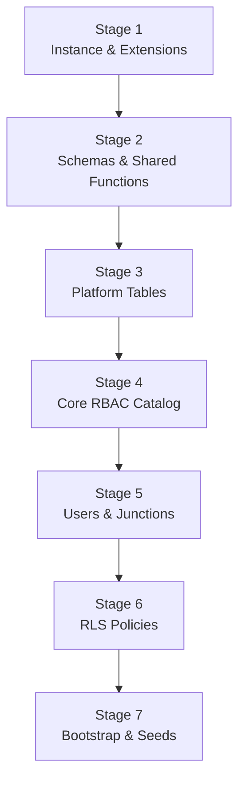
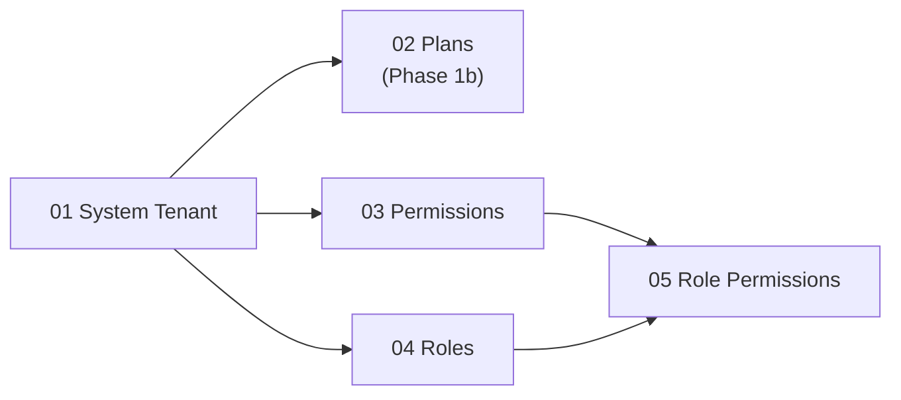

# Database Implementation Plan

## Phase 1 — Foundation Tables (Planning → Development)

| Field | Value |
|-------|-------|
| **Document Version** | 1.0 |
| **Status** | Active |
| **Last Updated** | June 2026 |
| **Author** | Database Architecture |
| **Phase** | Phase 1 — Tenancy & RBAC foundation |
| **Audience** | Backend developers, DBAs, technical leads |
| **Source of Truth** | `DATABASE_DESIGN.md`, `database/baseline/schema.sql`, `MULTI_TENANT_DESIGN.md`, `RBAC_DESIGN.md`, `SPRINT_1_EXECUTION_GUIDE.md` |

---

## Executive Summary

This plan defines **how to implement Phase 1 database objects** as the project moves from documentation to development. Phase 1 establishes multi-tenant identity: who the hospital is, who can log in, and what they are allowed to do.

**Phase 1 scope (logical entities → physical tables):**

| You asked for | Actual table | Schema | Notes |
|---------------|--------------|--------|-------|
| `tenants` | `platform.tenants` | `platform` | Tenant root — every hospital on the SaaS platform |
| `hospitals` | `platform.tenants` | `platform` | **No separate `hospitals` table exists** |
| `hospitals` (branches) | `platform.tenant_locations` | `platform` | Optional branches/facilities under one tenant |
| `users` | `core.users` | `core` | Login accounts |
| `roles` | `core.roles` | `core` | Job-function access groups |
| `permissions` | `core.permissions` | `core` | Atomic allowed actions |
| `user_roles` | `core.user_roles` | `core` | User ↔ role junction |
| `role_permissions` | `core.role_permissions` | `core` | Role ↔ permission junction |

**Out of Phase 1:** All `clinical.*`, `billing.*`, `pharmacy.*`, `laboratory.*`, `comms.*`, `audit.*` tables; `core.staff`, `core.departments`, `core.patients`, `core.user_sessions`; `platform.subscription_plans`, `platform.tenant_subscriptions`, `platform.tenant_settings` (these arrive in Phase 1b or Sprint 2 per sprint guide).

**Implementation approach:** Incremental Alembic revisions for Phase 1 objects only, aligned with the full baseline in `database/baseline/schema.sql`. The baseline remains the **reference**; Alembic is the **runtime** path.

---

## Phase 1 Objectives

| # | Objective | Done When |
|---|-----------|-----------|
| O1 | PostgreSQL instance ready for development and CI | Docker Postgres 14+ running |
| O2 | `platform` and `core` schemas exist with Phase 1 tables | 7 tables (+ locations) created with indexes and constraints |
| O3 | Tenant self-reference pattern works | `platform.create_tenant()` creates valid rows |
| O4 | RBAC graph is seedable | System tenant holds permissions; roles cloneable on provision |
| O5 | Row-Level Security active on all Phase 1 tables | Isolation smoke test passes |
| O6 | Migrations are reversible | `alembic downgrade` tested on dev |

---

## 1. Database Creation Sequence

Phase 1 database work follows **seven ordered stages**. Do not skip stages; each depends on the previous.



### Stage 1 — Instance and extensions

| Step | Action | Purpose |
|------|--------|---------|
| 1.1 | Provision PostgreSQL 14+ (local Docker, test DB, staging) | Runtime target per `PROJECT_STRUCTURE.md` |
| 1.2 | Create application database (`hms_dev`, `hms_test`) | Separate dev from test per `docker-compose.test.yml` |
| 1.3 | Enable extension `pgcrypto` | UUID generation (`gen_random_uuid()`) |

**Gate:** `SELECT version();` returns PostgreSQL 14+. Extension `pgcrypto` installed.

---

### Stage 2 — Schemas and shared functions

| Step | Action | Purpose |
|------|--------|---------|
| 2.1 | Create schema `platform` | Tenant and platform configuration objects |
| 2.2 | Create schema `core` | Identity and RBAC objects |
| 2.3 | Create function `public.set_updated_at()` | Trigger helper for `updated_at` columns |
| 2.4 | Create function `platform.enforce_tenant_self_reference()` | Enforces `tenant_id = id` on `platform.tenants` |

**Gate:** Both schemas exist. Trigger functions compile without error.

**Deferred to later phases:** `clinical`, `billing`, `pharmacy`, `laboratory`, `comms`, `audit` schemas.

---

### Stage 3 — Platform tables (tenant root and hospital branches)

| Step | Action | Purpose |
|------|--------|---------|
| 3.1 | Create `platform.tenants` | Hospital/organization root |
| 3.2 | Add self-referencing FK (`tenant_id` → `id`, DEFERRABLE) | Consistent composite FK pattern |
| 3.3 | Add triggers: self-reference check, `updated_at` | Data integrity |
| 3.4 | Create `platform.tenant_locations` | Branch/facility records (the "hospital building" layer) |

**Gate:** `platform.create_tenant()` can be added after table exists (Stage 7). Manual insert with `id = tenant_id` succeeds.

---

### Stage 4 — Core RBAC catalog tables

| Step | Action | Purpose |
|------|--------|---------|
| 4.1 | Create `core.roles` | Role definitions per tenant |
| 4.2 | Create `core.permissions` | Permission catalog per tenant |

**Gate:** Roles and permissions can be inserted for a test tenant UUID.

---

### Stage 5 — Users and junction tables

| Step | Action | Purpose |
|------|--------|---------|
| 5.1 | Create `core.users` | Authenticated accounts |
| 5.2 | Create `core.role_permissions` | Maps roles to permissions |
| 5.3 | Create `core.user_roles` | Maps users to roles |

**Gate:** Full RBAC chain insertable: tenant → roles → permissions → role_permissions → user → user_roles.

**Phase 1 constraint note:** Defer `core.users.staff_id` FK to `core.staff` until staff table exists (Phase 2). Keep `location_id` FK to `platform.tenant_locations` — locations table is in Phase 1.

---

### Stage 6 — Row-Level Security

| Step | Action | Purpose |
|------|--------|---------|
| 6.1 | `ENABLE ROW LEVEL SECURITY` + `FORCE ROW LEVEL SECURITY` on all Phase 1 tables | Defence-in-depth isolation |
| 6.2 | Create four policies per table: SELECT, INSERT, UPDATE, DELETE | Filter on `tenant_id = current_setting('app.tenant_id')` |
| 6.3 | Run manual isolation smoke test | Two tenants cannot see each other's rows |

**Gate:** Query without `SET app.tenant_id` returns zero rows (fail-safe).

---

### Stage 7 — Bootstrap function and seed data

| Step | Action | Purpose |
|------|--------|---------|
| 7.1 | Create `platform.create_tenant()` function | Safe tenant provisioning API |
| 7.2 | Run seed script (system tenant, permissions) | Master data for cloning |
| 7.3 | Verify idempotent re-run | No duplicate seed rows |

**Gate:** System tenant UUID `00000000-0000-0000-0000-000000000001` exists with permission catalog.

---

## 2. Table Creation Order

Tables must be created in **dependency order**. Creating out of order will fail on foreign key constraints.

### 2.1 Ordered creation list

| Order | Table | Schema | Depends On |
|-------|-------|--------|------------|
| 1 | `tenants` | `platform` | Self (deferred FK) |
| 2 | `tenant_locations` | `platform` | `platform.tenants` |
| 3 | `roles` | `core` | `platform.tenants` |
| 4 | `permissions` | `core` | `platform.tenants` |
| 5 | `users` | `core` | `platform.tenants`, `platform.tenant_locations` (optional `location_id`) |
| 6 | `role_permissions` | `core` | `platform.tenants`, `core.roles`, `core.permissions` |
| 7 | `user_roles` | `core` | `platform.tenants`, `core.users`, `core.roles` |

### 2.2 Per-table creation checklist

Each table creation should include, in this order:

1. `CREATE TABLE` with columns and inline `CHECK` constraints
2. Table comment (`COMMENT ON TABLE`)
3. Composite unique index `(tenant_id, id)` — required for downstream composite FKs
4. Business unique indexes (e.g. `UNIQUE(tenant_id, email)` on users)
5. Performance indexes (`tenant_id`, partial indexes on `deleted_at IS NULL`)
6. Composite foreign keys (where applicable)
7. `BEFORE UPDATE` trigger for `updated_at`

### 2.3 Objects created after all Phase 1 tables

| Object | When |
|--------|------|
| RLS policies | After all 7 tables exist |
| `platform.create_tenant()` | After `platform.tenants` exists |
| Seed scripts | After migrations applied |

### 2.4 Visual dependency tree

```
platform.tenants  (root)
├── platform.tenant_locations
├── core.roles
├── core.permissions
├── core.users ──────────────┐
│       (optional location_id)
├── core.role_permissions ◄──┤── needs roles + permissions
└── core.user_roles ◄────────┘── needs users + roles
```

---

## 3. Foreign Key Dependency Order

### 3.1 Direct FK dependencies

| Child Table | FK Column(s) | Parent Table | ON DELETE | Phase 1? |
|-------------|--------------|--------------|-----------|----------|
| `platform.tenants` | `tenant_id` | `platform.tenants.id` | RESTRICT | Yes (self, DEFERRABLE) |
| `platform.tenant_locations` | `tenant_id` | `platform.tenants.id` | RESTRICT | Yes |
| `core.roles` | `tenant_id` | `platform.tenants.id` | RESTRICT | Yes |
| `core.permissions` | `tenant_id` | `platform.tenants.id` | RESTRICT | Yes |
| `core.users` | `tenant_id` | `platform.tenants.id` | RESTRICT | Yes |
| `core.users` | `(tenant_id, location_id)` | `platform.tenant_locations` | RESTRICT | Yes (nullable) |
| `core.role_permissions` | `tenant_id` | `platform.tenants.id` | RESTRICT | Yes |
| `core.role_permissions` | `(tenant_id, role_id)` | `core.roles` | CASCADE | Yes |
| `core.role_permissions` | `(tenant_id, permission_id)` | `core.permissions` | RESTRICT | Yes |
| `core.user_roles` | `tenant_id` | `platform.tenants.id` | RESTRICT | Yes |
| `core.user_roles` | `(tenant_id, user_id)` | `core.users` | CASCADE | Yes |
| `core.user_roles` | `(tenant_id, role_id)` | `core.roles` | CASCADE | Yes |
| `core.users` | `(tenant_id, staff_id)` | `core.staff` | SET NULL | **No — Phase 2** |

### 3.2 Composite FK pattern (critical)

Every child-to-parent link within a tenant uses **composite keys**:

```
(tenant_id, child_id) → (tenant_id, parent_id)
```

This prevents cross-tenant reference attacks (e.g. linking an Apollo user to a City Hospital role).

**Prerequisite:** Parent table must have `UNIQUE (tenant_id, id)` index before composite FK is added.

### 3.3 FK creation order (DDL sequence)

| Step | Constraint | Notes |
|------|------------|-------|
| 1 | `platform.tenants.tenant_id → platform.tenants.id` | DEFERRABLE INITIALLY DEFERRED — allows single-row bootstrap |
| 2 | `tenant_locations.tenant_id → tenants.id` | Simple FK |
| 3 | `roles.tenant_id → tenants.id` | Simple FK |
| 4 | `permissions.tenant_id → tenants.id` | Simple FK |
| 5 | `users.tenant_id → tenants.id` | Simple FK |
| 6 | `users.(tenant_id, location_id) → tenant_locations` | Only if `location_id` column included |
| 7 | `role_permissions` composite FKs | After roles and permissions |
| 8 | `user_roles` composite FKs | After users and roles |

### 3.4 Self-referencing tenant bootstrap

`platform.tenants` is special: `tenant_id` must equal `id`.

| Approach | When to Use |
|----------|-------------|
| `platform.create_tenant()` function | **Recommended** — application and seeds |
| Deferred FK + single INSERT with same UUID for both columns | Manual/bootstrap scripts |
| System tenant seed with fixed UUID | Master data only |

Never insert a tenant row where `tenant_id ≠ id` — trigger `enforce_tenant_self_reference` will reject it.

---

## 4. Migration Strategy

### 4.1 Principles

| Principle | Rule |
|-----------|------|
| **Single runtime path** | All schema changes go through Alembic in `backend/alembic/versions/` |
| **Baseline is reference** | `database/baseline/schema.sql` is read-only truth; update only on major releases |
| **One concern per revision** | Easier rollback and code review |
| **Forward-only in production** | Never edit applied migrations; add new revision |
| **Test downgrade in dev** | Every revision must have a working `downgrade()` |

### 4.2 Recommended Alembic revision sequence (Phase 1)

| Revision | Name | Contents |
|----------|------|----------|
| `001` | `phase1_extensions_and_schemas` | `pgcrypto`, schemas `platform` + `core`, shared functions |
| `002` | `phase1_platform_tenants` | `platform.tenants` + indexes + triggers + self-FK |
| `003` | `phase1_platform_tenant_locations` | `platform.tenant_locations` |
| `004` | `phase1_core_roles_permissions` | `core.roles`, `core.permissions` |
| `005` | `phase1_core_users` | `core.users` (no `staff_id` FK yet) |
| `006` | `phase1_core_rbac_junctions` | `core.role_permissions`, `core.user_roles` |
| `007` | `phase1_rls_policies` | RLS enable + policies on all Phase 1 tables |
| `008` | `phase1_bootstrap_functions` | `platform.create_tenant()` |

**Alternative (Sprint 1 shortcut):** Single revision `001_phase1_baseline` containing all Phase 1 DDL extracted from `schema.sql`. Use when speed matters; split later if rollback granularity is needed.

### 4.3 Environment application order

| Environment | When | Command |
|-------------|------|---------|
| Local dev | Developer machine setup | `alembic upgrade head` on `hms_dev` |
| CI test | Every PR | `alembic upgrade head` on ephemeral `hms_test` |
| Staging | Sprint gate | `alembic upgrade head` via deploy pipeline |
| Production | Post-MVP | `alembic upgrade head` with maintenance window if needed |

### 4.4 SQLAlchemy model alignment

| Step | Action |
|------|--------|
| 1 | Define models in `backend/app/models/platform.py` and `core.py` |
| 2 | Ensure `__table_args__ = {'schema': 'platform'}` (or `core`) |
| 3 | Run `alembic revision --autogenerate` only as a **diff check** — review manually |
| 4 | Phase 1 models must match migration DDL exactly |

### 4.5 Phase 2+ migration handoff

When adding `core.staff`, `core.user_sessions`, subscription tables:

| Rule | Detail |
|------|--------|
| New revision per module | e.g. `009_phase2_staff_and_sessions` |
| Add deferred FKs in same revision as parent table | `users.staff_id → staff` when `core.staff` is created |
| Never modify `001`–`008` | Append only |

### 4.6 Migration verification checklist

After each `alembic upgrade head`:

- [ ] `alembic current` shows expected revision
- [ ] All Phase 1 tables visible in `\dt platform.*` and `\dt core.*`
- [ ] Indexes and constraints match `DATABASE_DESIGN.md`
- [ ] `alembic downgrade -1` succeeds in dev
- [ ] Re-upgrade succeeds (`upgrade head` after downgrade)

---

## 5. Seed Data Strategy

### 5.1 Seed philosophy

| Rule | Rationale |
|------|-----------|
| **Idempotent** | `seed.py` safe to run multiple times |
| **Ordered** | Parents before children |
| **System tenant first** | All master templates live under fixed system UUID |
| **Tenant data via API** | Real hospitals created through provisioning, not seed files |
| **No production secrets in seeds** | Passwords hashed at runtime in application |

### 5.2 Seed file layout

| File | Order | Contents | Phase |
|------|-------|----------|-------|
| `database/seeds/01_system_tenant.sql` | 1 | System tenant row (`00000000-0000-0000-0000-000000000001`) | Phase 1 |
| `database/seeds/02_subscription_plans.sql` | 2 | Plan templates under system tenant | Phase 1b (Sprint 1) |
| `database/seeds/03_permissions.sql` | 3 | Full permission catalog under system tenant | Phase 1 |
| `database/seeds/04_roles.sql` | 4 | System role templates under system tenant | Phase 1 |
| `database/seeds/05_role_permissions.sql` | 5 | Default permission matrix per role | Phase 1 (or Sprint 2) |

Runtime executor: `backend/scripts/seed.py` reads `DATABASE_URL`, runs files in order, uses upsert / conflict-ignore for idempotency.

### 5.3 What to seed in Phase 1 vs runtime

| Data | Seed (system tenant) | Runtime (per hospital signup) |
|------|----------------------|-------------------------------|
| System tenant row | Yes | No |
| Permission catalog | Yes (master list) | Clone to new tenant |
| Role definitions | Yes (templates) | Clone to new tenant |
| Role-permission matrix | Yes (templates) | Clone to new tenant |
| Real hospital tenant | No | `platform.create_tenant()` |
| Primary location | No | Insert on registration |
| Owner user | No | Insert on registration |
| Owner `user_roles` row | No | Insert on registration |

### 5.4 Seed execution order (data dependency)



### 5.5 Idempotency patterns

| Pattern | Use For |
|---------|---------|
| Fixed UUID for system tenant | `01_system_tenant.sql` |
| `ON CONFLICT DO NOTHING` on unique keys | Permissions, roles, plans |
| Check-then-insert in `seed.py` | Complex seed logic |
| Transaction wrap | All seed files in one transaction — all or nothing |

### 5.6 Seed verification

After `python -m scripts.seed`:

| Check | Expected |
|-------|----------|
| System tenant exists | 1 row with UUID `...0001` |
| Permissions count | ~50–80 rows under system tenant |
| Roles count | 8 tenant roles per `RBAC_DESIGN.md` §2.2 (excluding `platform_admin`) |
| Re-run seed | Row counts unchanged |

---

## 6. Tenant Setup Strategy

### 6.1 Tenant types

| Type | UUID | Purpose | Created By |
|------|------|---------|------------|
| **System tenant** | `00000000-0000-0000-0000-000000000001` | Master templates (permissions, roles) | Seed script |
| **Real tenant** | Generated UUID | Paying/trial hospital | Registration API |

### 6.2 Real tenant provisioning flow (runtime)

This is the order of database writes when a hospital signs up (`MULTI_TENANT_DESIGN.md` §3):

| Step | Action | Table(s) | Phase |
|------|--------|----------|-------|
| 1 | Create tenant root | `platform.tenants` via `create_tenant()` | 1 |
| 2 | Create primary branch | `platform.tenant_locations` (`is_primary = true`) | 1 |
| 3 | Clone permissions from system tenant | `core.permissions` | 1 |
| 4 | Clone roles from system tenant | `core.roles` | 1 |
| 5 | Clone role-permission mappings | `core.role_permissions` | 1 |
| 6 | Create owner user account | `core.users` | 1 |
| 7 | Assign owner role | `core.user_roles` | 1 |
| 8 | Assign trial subscription | `platform.tenant_subscriptions` | 1b |
| 9 | Default settings JSON | `platform.tenant_settings` | 1b |

Steps 1–7 are achievable with **Phase 1 tables only**. Steps 8–9 require Phase 1b tables.

### 6.3 Clone pattern (roles and permissions)

System tenant holds templates. Each new hospital gets **independent copies**:

| Aspect | Rule |
|--------|------|
| Copy direction | System tenant → new `tenant_id` |
| Not shared | Editing Apollo's `doctor` role does not affect City Hospital |
| `is_system = true` | Preserved on cloned roles — prevents deletion |
| Permission codes | Same `code` string, different `id` and `tenant_id` |

### 6.4 Tenant context for all DB access

| Layer | Mechanism |
|-------|-----------|
| Application | `SET LOCAL app.tenant_id = '<uuid>'` at transaction start |
| RLS | `current_setting('app.tenant_id')` filters all Phase 1 tables |
| Provisioning | Use elevated DB role or `BYPASSRLS` **only** in controlled migration/seed context — not in API handlers |
| Platform admin (future) | Separate auth realm; limited to `platform.*` schema |

### 6.5 Tenant setup verification

| Test | Pass Criteria |
|------|---------------|
| Create two tenants via `create_tenant()` | Distinct UUIDs, distinct slugs |
| Clone RBAC to each | Each tenant has own role rows |
| Insert user in tenant A | Not visible when `app.tenant_id` = tenant B |
| Duplicate slug | Registration fails (global unique on `slug`) |
| Duplicate email within tenant | User create fails |
| Same email across tenants | Allowed (different `tenant_id`) |

---

## 7. Initial Master Data Strategy

### 7.1 Master data categories

| Category | Storage | Mutable By |
|----------|---------|------------|
| Permission catalog | `core.permissions` (system tenant) | Platform release only |
| Role templates | `core.roles` (system tenant) | Platform release only |
| Role-permission matrix | `core.role_permissions` (system tenant) | Platform release only |
| Subscription plans | `platform.subscription_plans` (system tenant) | Platform admin (Phase 1b) |
| Hospital organization | `platform.tenants` | Hospital owner / registration |
| Branches | `platform.tenant_locations` | Hospital admin |
| Staff logins | `core.users` | Hospital admin |

### 7.2 Permission catalog (system tenant)

Source: `RBAC_DESIGN.md` §3 — format `{module}:{action}`

| Module Group | Example Permissions | Approx. Count |
|--------------|---------------------|---------------|
| `admin` | `admin:users`, `admin:settings`, `admin:subscription` | ~8 |
| `patient` | `patient:read`, `patient:create`, `patient:update` | ~5 |
| `opd` | `opd:read`, `opd:consult`, `opd:prescribe` | ~8 |
| `billing` | `billing:read`, `billing:void`, `billing:export` | ~10 |
| `laboratory` | `laboratory:read`, `laboratory:verify` | ~6 |
| `pharmacy` | `pharmacy:dispense`, `pharmacy:inventory` | ~6 |
| `inventory` | `inventory:read`, `inventory:adjust` | ~4 |
| Wildcard | `*:*` (hospital_owner only) | 1 |

**Phase 1 action:** Seed full catalog under system tenant even if Phase 1 API only uses `admin:*` and `patient:read`. Future sprints consume existing rows.

**Namespace rule:** Use `laboratory:*` consistently (not `lab:*`) per conflict resolution C-04.

### 7.3 Role templates (system tenant)

Source: `RBAC_DESIGN.md` §2.2 — **not** outdated `tenant_admin` from `MULTI_TENANT_DESIGN.md` §3.4

| Role Code | `is_system` | Phase 1 Seed |
|-----------|-------------|--------------|
| `hospital_owner` | true | Yes |
| `hospital_admin` | true | Yes |
| `doctor` | true | Yes |
| `nurse` | true | Yes |
| `receptionist` | true | Yes |
| `accountant` | true | Yes |
| `pharmacist` | true | Yes |
| `lab_technician` | true | Yes |
| `platform_admin` | true | No — platform realm, not tenant RBAC table |

### 7.4 Default role-permission matrix

Seed under system tenant so provisioning can clone a complete matrix.

| Role | Phase 1 Priority Permissions |
|------|------------------------------|
| `hospital_owner` | `*:*` |
| `hospital_admin` | `admin:*`, `patient:*`, staff management |
| `doctor` | `patient:read`, `opd:consult`, `opd:prescribe` |
| `receptionist` | `patient:read`, `patient:create`, `opd:read` |
| `accountant` | `billing:*`, `patient:read` |
| Others | Per `RBAC_DESIGN.md` permission matrices |

**Sprint 1 note:** `SPRINT_1_EXECUTION_GUIDE.md` allows deferring `05_role_permissions.sql` to Sprint 2 if provisioning service is not built yet. Minimum for Phase 1 gate: permissions + roles seeded; matrix can follow in Sprint 2.

### 7.5 Dev/test master data (non-production)

| Data | Purpose | Created How |
|------|---------|-------------|
| `dev-hospital-a` tenant | Local development | Test fixture or manual `create_tenant()` |
| `dev-hospital-b` tenant | Isolation testing | Test fixture |
| Dev admin user | Login testing (Sprint 2) | Fixture with known password hash |
| No real PHI | Compliance | Synthetic names only |

### 7.6 Master data change control

| Change Type | Process |
|-------------|---------|
| New permission code | Add to seed + new Alembic data migration + update `RBAC_DESIGN.md` |
| New role | Add to seed; clone logic picks it up for new tenants |
| Change role matrix | Update seed; existing tenants need migration script or admin UI (Phase 2) |
| Rename permission code | Avoid — breaks API decorators; add new code and deprecate old |

---

## 8. Rollback Strategy

### 8.1 Rollback layers

| Layer | Scope | When |
|-------|-------|------|
| **Alembic downgrade** | Schema objects | Bad migration in dev/staging |
| **Seed rollback** | Reference data | Incorrect seed — truncate and re-seed |
| **Tenant data rollback** | One hospital's data | Soft delete + retention policy |
| **Full database restore** | Entire instance | Catastrophic failure |

### 8.2 Alembic downgrade order (reverse of creation)

Apply `downgrade()` in **reverse revision order**:

| Downgrade Step | Drops |
|----------------|-------|
| 8 → 7 | `platform.create_tenant()` |
| 7 → 6 | RLS policies, disable RLS |
| 6 → 5 | `core.user_roles`, `core.role_permissions` |
| 5 → 4 | `core.users` |
| 4 → 3 | `core.roles`, `core.permissions` |
| 3 → 2 | `platform.tenant_locations` |
| 2 → 1 | `platform.tenants` |
| 1 → 0 | Functions, schemas (only if empty), extensions |

### 8.3 Table drop order (FK-safe)

If manual rollback required within a revision:

| Drop Order | Table | Reason |
|------------|-------|--------|
| 1 | `core.user_roles` | Depends on users, roles |
| 2 | `core.role_permissions` | Depends on roles, permissions |
| 3 | `core.users` | Depends on tenants, locations |
| 4 | `core.roles` | Depends on tenants |
| 5 | `core.permissions` | Depends on tenants |
| 6 | `platform.tenant_locations` | Depends on tenants |
| 7 | `platform.tenants` | Root |

### 8.4 RLS rollback

Before dropping tables, drop policies in any order, then:

1. `DROP POLICY` for each of SELECT/INSERT/UPDATE/DELETE on each table
2. `ALTER TABLE ... DISABLE ROW LEVEL SECURITY`
3. Drop table

### 8.5 Seed rollback

| Scenario | Action |
|----------|--------|
| Bad seed, no tenants yet | Truncate seed tables in reverse FK order; re-run seed |
| Bad permission row | Delete by `code` + `tenant_id`; re-insert |
| System tenant corrupted | Truncate all system-tenant child rows; re-run `seed.py` |
| Real tenants exist | **Do not truncate** — fix forward with targeted migrations |

### 8.6 Production rollback rules

| Rule | Detail |
|------|--------|
| Never `downgrade` in production for MVP | Forward-fix with new migration |
| Backup before every production migration | RDS snapshot |
| Destructive changes require two-phase migration | Add column → backfill → drop old (expand-contract) |
| Tenant offboarding | Soft delete → 90-day retention → purge job (not Alembic) |

### 8.7 Rollback testing checklist

Before merging migration PR:

- [ ] `alembic upgrade head` on clean DB
- [ ] Seed runs successfully
- [ ] Application smoke test passes
- [ ] `alembic downgrade -1` succeeds
- [ ] `alembic upgrade head` re-applies cleanly
- [ ] Isolation test still passes after re-upgrade

---

## 9. Phase 1 Implementation Timeline

Suggested sequence for a solo developer (aligns with `SPRINT_1_EXECUTION_GUIDE.md`):

| Day | Focus | Deliverable |
|-----|-------|-------------|
| 1 | Docker Postgres, Alembic init, revisions `001`–`003` | `tenants`, `tenant_locations` exist |
| 2 | Revisions `004`–`006` | RBAC tables exist |
| 3 | Revision `007`–`008`, RLS smoke test | Isolation verified |
| 4 | Seed scripts `01`–`04`, `seed.py` | System tenant populated |
| 5 | SQLAlchemy models, integration test | ORM aligned; `test_tenant_isolation.py` green |

**Gate G1:** Phase 1 migrations apply on clean DB; seed idempotent; isolation test passes.

---

## 10. Phase 1 Acceptance Criteria

| # | Criterion | Verification |
|---|-----------|--------------|
| AC-1 | All 7 Phase 1 tables exist with correct schema | `\d platform.tenants` etc. |
| AC-2 | Composite FKs enforce same-tenant references | Cross-tenant insert fails |
| AC-3 | `platform.create_tenant()` returns valid UUID | Call function; verify row |
| AC-4 | System tenant seeded with permissions | `SELECT count(*) FROM core.permissions` |
| AC-5 | RLS blocks cross-tenant reads | Automated isolation test |
| AC-6 | Alembic upgrade/downgrade cycle works | CI job |
| AC-7 | `database/baseline/schema.sql` Phase 1 section matches Alembic output | Manual diff review |

---

## 11. Risks and Mitigations

| Risk | Impact | Mitigation |
|------|--------|------------|
| Implementing full 61-table baseline too early | Over-engineering | Phase 1 migrations scoped to 7 tables only |
| `hospitals` assumed as separate table | Wrong models | Use `tenants` + `tenant_locations` per this plan |
| Outdated role codes in seeds | Auth bugs in Sprint 2 | Use `RBAC_DESIGN.md` codes only |
| RLS blocks seed scripts | Seed fails silently | Run seeds with correct `app.tenant_id` or superuser role in controlled script |
| `staff_id` FK on users before `staff` table | Migration failure | Defer FK to Phase 2 revision |
| Editing applied migrations | Environment drift | New revision only; never amend merged migrations |

---

## 12. Related Documents

| Document | Use For |
|----------|---------|
| `FOUNDATION_DATABASE_GUIDE.md` | Conceptual model for Phase 1 tables |
| `DEVELOPMENT_CHECKLIST.md` | Pre-coding gate checklist |
| `SPRINT_1_EXECUTION_GUIDE.md` | Sprint tasks and hour estimates |
| `database/migrations-readme.md` | Alembic vs baseline workflow |
| `MULTI_TENANT_DESIGN.md` | Provisioning and isolation rules |
| `RBAC_DESIGN.md` | Role codes and permission matrices |
| `AUTHENTICATION_ARCHITECTURE_GUIDE.md` | Users and sessions (Sprint 2) |

---

## Revision History

| Version | Date | Author | Changes |
|---------|------|--------|---------|
| 1.0 | June 2026 | Database Architecture | Initial Phase 1 database implementation plan |

---

*This document is an implementation plan only. DDL is defined in `database/baseline/schema.sql` and implemented via Alembic migrations. No SQL is duplicated here by design.*
