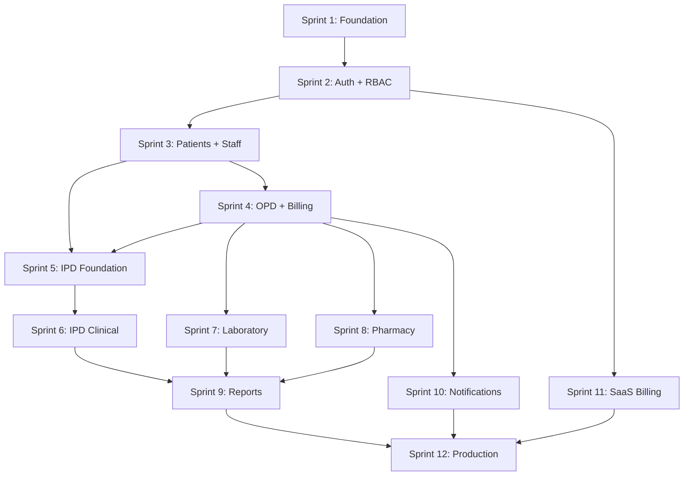

# Development Readiness Report

## Multi-Tenant Hospital Management SaaS Platform

| Field | Value |
|-------|-------|
| **Document Version** | 1.1 |
| **Assessment Date** | June 19, 2026 (initial) · **June 23, 2026** (implementation addendum) |
| **Reviewer Role** | CTO / Principal Software Architect |
| **Scope** | PRD.md, DATABASE_DESIGN.md, SYSTEM_ARCHITECTURE.md, MULTI_TENANT_DESIGN.md, RBAC_DESIGN.md, API_DESIGN.md, PROJECT_STRUCTURE.md, IMPLEMENTATION_PLAN.md (+ supporting docs and repo state) |
| **Implementation State (June 2026)** | **Sprints 1–5 complete** — platform, auth, RBAC, hospital admin, OPD API spec/stubs, audit framework, shared UI kit; see addendum below |

---

## Implementation Status Addendum (June 23, 2026)

> **Purpose:** This section supersedes pre-code claims in §§1–9 where they conflict with the current repository. The original June 19 assessment remains as the historical baseline.

### Sprint progress

| Sprint | Theme | Status |
|--------|-------|--------|
| 1 | Foundation (Docker, CI, Alembic, health) | ✅ Complete |
| 2 | Multi-tenant + RLS + Gate G1 | ✅ Complete |
| 3 | Auth vertical slice (JWT, sessions, frontend auth) | ✅ Complete |
| 4 | RBAC + hospital admin + Gate G2 | ✅ Complete |
| 5 | OPD spec, OpenAPI stubs, audit framework, UI kit | ✅ Complete |
| 6 | Org structure (departments, staff, doctors) | **Next** |

### Repository reality (updated)

| Asset | June 19 state | **Current state** |
|-------|---------------|-------------------|
| `backend/` | README only | FastAPI app with platform, auth, hospital, admin, OPD stubs, audit |
| `frontend/` | README only | React app with auth, admin settings/users/branches, shared `components/ui` |
| `docker-compose.yml` | Missing | ✅ Present |
| `.github/workflows/ci.yml` | Missing | ✅ Present (lint, G1, G2, isolation, OpenAPI snapshot, composite FK lint) |
| Alembic migrations | Not started | ✅ 001–017 applied |
| `audit.audit_logs` | Not wired | ✅ Migration + login audit + mutation middleware |
| OPD API spec | Missing | ✅ `docs/API_DESIGN_OPD.md` + OpenAPI stubs |
| `TESTING_STRATEGY.md` / `DEPLOYMENT_GUIDE.md` | Absent | ✅ Authored (MVP-010) |
| OpenAPI contract test | Absent | ✅ `tests/snapshots/openapi.json` (MVP-057) |
| Backend tests | No harness | ✅ **288 tests** collected |

### Revised verdict (June 2026)

**Go for Sprint 6+ feature work.** Foundation, auth, tenancy, RBAC, and hospital admin gates (G1, G2) are passed. Remaining pre-production blockers: patient/clinical vertical slices, billing, AWS deploy, legal review (Gate G5).

### Resolved documentation gaps (since initial report)

| Gap (original §5.1) | Resolution |
|-----------------------|------------|
| OPD module API spec | `docs/API_DESIGN_OPD.md` (MVP-051) |
| `TESTING_STRATEGY.md` | `docs/TESTING_STRATEGY.md` |
| `DEPLOYMENT_GUIDE.md` | `docs/DEPLOYMENT_GUIDE.md` |
| UI design system | Minimum shared UI kit in `frontend/src/components/ui/` (MVP-056) |
| Audit logging not wired | Audit write service + middleware (MVP-053/054) |

### Still open

| Item | Target sprint |
|------|----------------|
| IPD API spec | Before IPD sprint |
| Patient CRUD (beyond stub) | Sprint 7+ |
| OPD business logic (not 501 stubs) | Sprint 9 |
| Production deploy + pen test | Sprint 12 / Gate G5 |
| PRD / legal stakeholder sign-off | Before beta |

---

## Executive Summary

Development has progressed through **Sprint 5** (June 2026). Foundation, multi-tenant RLS, auth, RBAC, hospital admin, OPD API specification, audit framework, and a minimum UI kit are implemented with **288 backend tests** and Gates G1/G2 passing. See the **Implementation Status Addendum** above for the current repository state.

The original June 19 assessment below remains as the pre-code baseline. This platform has **unusually strong architectural documentation** for a SaaS product: a coherent multi-tenant model, 61-table PostgreSQL design with RLS, RBAC matrices, API conventions, frozen project structure, and a 12-sprint execution plan.

---

## 1. Documentation Completeness Score

### Score: **82 / 100** (Strong, with reconciliation gaps)

| Category | Weight | Score | Notes |
|----------|--------|-------|-------|
| Product & requirements | 20% | 90 | PRD, functional/non-functional requirements, user stories, business requirements are thorough |
| Architecture & tenancy | 25% | 88 | SYSTEM_ARCHITECTURE, MULTI_TENANT_DESIGN, PROJECT_STRUCTURE are detailed and aligned |
| Data model | 20% | 92 | DATABASE_DESIGN is excellent; backed by `schema.sql` (61 tables) |
| API & RBAC contracts | 20% | 68 | API_DESIGN is strong for covered modules; **OPD/IPD/reports/notifications/subscription gaps** |
| Security & compliance | 10% | 75 | SECURITY_ARCHITECTURE exists and is authoritative; legal/regional compliance still TBD |
| Operations & delivery | 5% | 60 | IMPLEMENTATION_PLAN and SPRINT_PLAN are actionable; **DEPLOYMENT_GUIDE** and **TESTING_STRATEGY** absent as standalone docs |

### Strengths

- **End-to-end traceability** from PRD personas → RBAC permissions → database tables → API modules.
- **Frozen PROJECT_STRUCTURE (v2.0)** gives unambiguous placement rules for backend domains, frontend features, and database artifacts.
- **IMPLEMENTATION_PLAN** explicitly documents known gaps, conflict resolution precedence, and sprint gates (G1–G5).
- **Supporting corpus** beyond the eight reviewed files: SECURITY_ARCHITECTURE.md, BILLING_SUBSCRIPTION.md, SPRINT_PLAN.md, FUNCTIONAL_REQUIREMENTS.md, NON_FUNCTIONAL_REQUIREMENTS.md, USER_STORIES.md, ROADMAP.md.

### Weaknesses

| Gap | Impact |
|-----|--------|
| All core documents remain **Draft**; PRD sign-off table empty | No formal stakeholder approval trail |
| **OPD/IPD API modules** missing from API_DESIGN.md (84 endpoints documented; core clinical workflow APIs absent) | Sprint 4–6 will require ad-hoc spec authoring |
| **Cross-document inconsistencies** (see §5) | Implementation bugs, security drift, frontend/backend path mismatches |
| **DEPLOYMENT_GUIDE.md** not authored | Production launch runbook gap (deferred to Sprint 12 in plan) |
| **TESTING_STRATEGY.md** not authored | Covered interim by IMPLEMENTATION_PLAN §13 only |
| No UI/UX wireframes or design system beyond component list | Frontend velocity risk in Sprint 2+ |
| UI/UX design system listed as **Planned** in PRD dependencies | Receptionist/doctor workflows may need rework |

### Documentation Maturity Matrix

| Document | Status | Dev-Ready? |
|----------|--------|------------|
| PRD.md | Draft | Yes (MVP scope clear) |
| DATABASE_DESIGN.md | Draft | Yes |
| SYSTEM_ARCHITECTURE.md | Draft | Yes (minor conflicts) |
| MULTI_TENANT_DESIGN.md | Draft | Yes |
| RBAC_DESIGN.md | Draft | Yes (authoritative for roles) |
| API_DESIGN.md | Draft | **Partial** — extend before Sprint 4 |
| PROJECT_STRUCTURE.md | **Frozen v2.0** | Yes |
| IMPLEMENTATION_PLAN.md | Active | Yes |

---

## 2. Architecture Readiness Score

### Score: **78 / 100** (Sound design; scaffolding not started)

| Dimension | Assessment |
|-----------|------------|
| **Architectural style** | Modular monolith → selective extraction is appropriate for solo MVP |
| **Technology stack** | Coherent: FastAPI, React/TS, PostgreSQL, Redis, S3, SQS, ECS Fargate |
| **Tenancy model** | Shared DB + `tenant_id` + RLS + middleware — well specified |
| **Cross-cutting concerns** | Logging, caching, file storage, DR, monitoring defined in SYSTEM_ARCHITECTURE |
| **Repo structure** | PROJECT_STRUCTURE frozen; **backend/frontend directories contain README only** |
| **Local dev environment** | `docker-compose.yml` referenced in docs but **not present in repo** |
| **CI/CD** | `.github/workflows/` referenced in PROJECT_STRUCTURE but **not scaffolded** |
| **Infrastructure** | Terraform layout documented; **not implemented** |

### Architecture Decision Quality

| ADR / Decision | Quality | Concern |
|----------------|---------|---------|
| Modular monolith (MVP) | ✅ Correct for team size | — |
| Shared DB + RLS | ✅ Cost-effective for SMB SaaS | Requires rigorous CI isolation tests |
| JWT + refresh cookie | ✅ Standard pattern | **Permissions-in-JWT vs server-side conflict** across docs |
| SQS workers (PROJECT_STRUCTURE) | ✅ AWS-native | SYSTEM_ARCHITECTURE still references Celery in diagrams |
| S3 pre-signed uploads | ✅ Scales well | ClamAV scanning deferred to Phase 2 |
| ECS Fargate over EKS (MVP) | ✅ Lower ops burden | — |

### Alignment: PROJECT_STRUCTURE vs IMPLEMENTATION_PLAN

PROJECT_STRUCTURE mandates **domain-driven** layout (`app/domains/{domain}/services|repositories|schemas`). IMPLEMENTATION_PLAN §9 still shows a flatter `services/` and `repositories/` at app root. **Follow PROJECT_STRUCTURE (frozen)** during Sprint 1 scaffolding.

---

## 3. Database Readiness Score

### Score: **85 / 100** (Schema ready; seeds and tooling pending)

| Asset | Status | Notes |
|-------|--------|-------|
| `database/baseline/schema.sql` | ✅ **Complete** | 61 `CREATE TABLE` statements; 8 PostgreSQL schemas |
| RLS policies | ✅ In baseline | Defence-in-depth tenant isolation at DB layer |
| Composite FK pattern | ✅ Documented + in design | Must be verified in generated SQL |
| `database/seeds/` | ❌ Not populated | IMPLEMENTATION_PLAN notes `seed-data.sql` empty |
| Alembic migrations | ❌ Not started | Sprint 1 deliverable |
| Table partitioning | ⏸ Deferred | Documented in DATABASE_DESIGN §7; not in baseline (acceptable for MVP) |
| `platform.create_tenant()` | 📋 Referenced | Must exist in schema or be added in Sprint 1 migration |
| `audit.phi_access_logs` | 📋 Sprint 11 migration | Per IMPLEMENTATION_PLAN; not in current 61-table count |

### Schema Coverage vs MVP

| MVP Module (PRD §9.1) | Tables Present | Ready |
|----------------------|----------------|-------|
| Platform / tenancy | `platform.*` (5 tables) | ✅ |
| Auth / RBAC | `core.users`, roles, permissions, sessions (7 tables) | ✅ |
| Patients / staff | `core.patients`, staff, doctors (8 tables) | ✅ |
| OPD | `clinical.appointments`, `opd_visits`, queue, Rx (8 tables) | ✅ |
| Billing | `billing.*` (6 tables) | ✅ |
| IPD (Phase 2 in PRD; Sprint 5–6 in plan) | `clinical` IPD tables (9 tables) | ✅ schema; out of PRD MVP scope |
| Lab / Pharmacy (Phase 2 PRD; Sprint 7–8 plan) | Full schemas | ✅ schema; scope tension with PRD |

### Database Risks

- **Scope creep at schema level**: Full 61-table schema exists while PRD MVP is narrower—teams may over-build UI for P1 modules too early.
- **Seed data dependency**: Auth/RBAC Sprint 2 blocked without system tenant, permissions, and role-permission seeds.
- **Search performance**: `pg_trgm` indexes planned for Sprint 3 migration—not in baseline.

---

## 4. Security Readiness Score

### Score: **72 / 100** (Strong design; zero implementation; compliance TBD)

| Control Area | Design | Implementation |
|--------------|--------|----------------|
| Authentication (JWT RS256, refresh rotation) | ✅ SECURITY_ARCHITECTURE §5 | ❌ Not built |
| RBAC (server-side permission resolution) | ✅ RBAC_DESIGN + SECURITY_ARCHITECTURE | ❌ Not built |
| Tenant isolation (app + RLS) | ✅ MULTI_TENANT_DESIGN §8 | ✅ RLS in SQL; ❌ app layer |
| Audit logging | ✅ `audit.audit_logs` schema | ❌ Not wired |
| PHI access logging | ✅ Planned Sprint 11 | ❌ Table not in baseline |
| Rate limiting | ✅ Documented | ❌ Not built |
| 2FA (Owner/Admin) | ✅ Sprint 11 | ❌ Not built |
| Encryption at rest/transit | ✅ AWS RDS/S3/TLS | ❌ Infra not provisioned |
| Penetration testing | ✅ Required before production (Gate G5) | ❌ Not scheduled |
| Legal/compliance (India PHI, consent) | ⚠️ Assumed in PRD | ❌ No legal sign-off |

### Critical Security Documentation Conflict

| Topic | Document A | Document B | Resolution Required |
|-------|------------|------------|---------------------|
| **Permissions in JWT** | SYSTEM_ARCHITECTURE §6.3, RBAC_DESIGN §7.3 embed `permissions` in access token | SECURITY_ARCHITECTURE §6, IMPLEMENTATION_PLAN §6.1: **do not** put permissions in JWT; resolve server-side with Redis | **Follow SECURITY_ARCHITECTURE** (smaller token, instant revocation on role change) |
| **Account lockout duration** | SYSTEM_ARCHITECTURE: 30 min after 5 failures | SECURITY_ARCHITECTURE / IMPLEMENTATION_PLAN: 15 min | Pick one; document in SECURITY_ARCHITECTURE |
| **Role examples** | SYSTEM_ARCHITECTURE §7.1: `tenant_admin`, `billing_staff` | RBAC_DESIGN: `hospital_owner`, `accountant` | **RBAC_DESIGN is authoritative** per IMPLEMENTATION_PLAN |

### Security Test Readiness

Mandatory isolation and RBAC tests are **specified** (MULTI_TENANT_DESIGN §11.3, IMPLEMENTATION_PLAN §13) but **no test harness exists**. Sprint 1 must include `test_tenant_isolation.py` scaffold.

---

## 5. Missing Items

### 5.1 Documentation Gaps

| Item | Priority | Blocking Sprint |
|------|----------|-----------------|
| OPD module API spec (`/api/v1/opd/*`) | **P0** | 4 |
| IPD module API spec (`/api/v1/ipd/*`) | **P0** | 5 |
| Reports, notifications, locations, subscription API specs | P1 | 9–11 |
| DEPLOYMENT_GUIDE.md | P1 | 12 |
| TESTING_STRATEGY.md (standalone) | P2 | 1 (interim: IMPLEMENTATION_PLAN §13) |
| UI/UX wireframes and design tokens | P1 | 2–3 |
| Regional compliance matrix (India DISHA/IT Act, consent flows) | P1 | Before beta |
| OpenAPI conflict resolution doc (admin vs staff paths) | **P0** | 2–3 |

### 5.2 Implementation Gaps (Repo)

| Item | Priority |
|------|----------|
| `backend/` application scaffold (FastAPI, domains, middleware) | P0 |
| `frontend/` application scaffold (Vite, React, Tailwind) | P0 |
| `docker-compose.yml` (postgres, redis, api) | P0 |
| Alembic baseline migration | P0 |
| Seed scripts (system tenant, plans, permissions, roles) | P0 |
| `.github/workflows/ci.yml` | P0 |
| JWT key generation script / Secrets Manager setup | P1 |
| SQS worker process | P1 (Sprint 4 for PDF jobs) |
| Terraform staging environment | P1 (Sprint 4 staging gate) |

### 5.3 Cross-Document Inconsistencies to Resolve Before Sprint 2

| ID | Issue | Resolution |
|----|-------|------------|
| C-01 | JWT contains `permissions` vs server-side resolution | Adopt SECURITY_ARCHITECTURE; update SYSTEM_ARCHITECTURE §6.3 and RBAC §7.3 |
| C-02 | Role codes: `tenant_admin` / `billing_staff` vs `hospital_owner` / `accountant` | Global find-replace in examples; RBAC_DESIGN wins |
| C-03 | Admin API paths: RBAC `/admin/users` vs API_DESIGN `/staff/users` | Standardize on PROJECT_STRUCTURE routers (`staff.py` + `subscription.py`) |
| C-04 | Permission namespace: `lab:verify` vs `laboratory:verify` | Unify to `laboratory:*` per API_DESIGN module registry |
| C-05 | Inventory base path: `/inventory` vs `/pharmacy/inventory` | Keep `/api/v1/inventory` per API_DESIGN; update RBAC examples |
| C-06 | Celery references in SYSTEM_ARCHITECTURE vs SQS in PROJECT_STRUCTURE | Update architecture diagrams to SQS-only |
| C-07 | PRD MVP scope (OPD only) vs IMPLEMENTATION_PLAN (IPD/lab/pharmacy in 6 months) | Acknowledge **expanded MVP** in PRD amendment or accept plan as superseding PRD Phase 2 timing |
| C-08 | MULTI_TENANT role seed list uses `tenant_admin`; RBAC uses `hospital_owner` | Fix provisioning seed list in MULTI_TENANT_DESIGN §3.4 |

---

## 6. Risks Before Development

### 6.1 High Risks

| Risk | Likelihood | Impact | Mitigation |
|------|------------|--------|------------|
| **Cross-tenant data leakage** from inconsistent `tenant_id` enforcement | Medium | Critical | Sprint 1 isolation tests; RLS already in schema; repository mixin mandatory |
| **API contract drift** during Sprint 4–6 without OPD/IPD specs | High | High | Author OpenAPI modules at sprint start (per IMPLEMENTATION_PLAN §5.2) |
| **Solo developer capacity** vs 12-sprint full-suite delivery | High | High | Strict gate discipline; defer P2 features; 20% buffer in months 7–12 |
| **JWT permission strategy ambiguity** | Medium | High | Resolve C-01 before auth implementation |
| **Healthcare compliance gap** (consent, retention, breach notification) | Medium | Critical | Legal review before beta; implement audit + consent fields already in schema |

### 6.2 Medium Risks

| Risk | Likelihood | Impact | Mitigation |
|------|------------|--------|------------|
| Frontend UX unvalidated for low-tech clinical users | High | Medium | Early user testing with 1–2 pilot clinics at Sprint 4 gate |
| Full 61-table schema encourages over-engineering | Medium | Medium | Build UI/API only for sprint scope; ignore unused modules |
| No `docker-compose.yml` delays local onboarding | High | Low | Sprint 1 Day 1 deliverable |
| Payment gateway (Razorpay) integration complexity | Medium | Medium | Sandbox testing in Sprint 11; stub in earlier sprints |
| Partitioning absent may affect audit log growth | Low | Medium | Defer until 50+ tenants per plan |

### 6.3 Low Risks (Acceptable for Sprint 1)

- Multi-region deployment (Phase 3+)
- AI/ML features (explicitly out of MVP scope)
- HL7/FHIR interoperability (out of scope)
- Mobile native apps (out of scope)

---

## 7. Recommended First Sprint

### Sprint 1 — Platform Foundation (Weeks 1–2)

Aligns with IMPLEMENTATION_PLAN §2.1 and SPRINT_PLAN Phase 1. **Do not skip to feature work.**

#### Sprint 1 Goals

1. Runnable local environment (`docker compose up` → API health check passes).
2. Backend scaffold matching **PROJECT_STRUCTURE** frozen layout.
3. Alembic baseline from `database/baseline/schema.sql`.
4. Tenant middleware + RLS session (`SET LOCAL app.tenant_id`).
5. CI pipeline with mandatory cross-tenant isolation test scaffold.
6. Seed script v1: system tenant, subscription plans, permission catalog.

#### Sprint 1 Deliverables (Acceptance Criteria)

| # | Deliverable | Done When |
|---|-------------|-----------|
| 1 | `docker-compose.yml` | Postgres 14 + Redis 7 start; API connects |
| 2 | FastAPI app factory + middleware stack (correlation ID, CORS, tenant context stub) | `GET /health` → 200; `GET /health/ready` checks DB |
| 3 | SQLAlchemy models for `platform` + `core` schemas | Alembic autogenerate matches baseline |
| 4 | Alembic revision `001_baseline` | `alembic upgrade head` on clean DB succeeds |
| 5 | `scripts/seed.py` | System tenant UUID, 3 plans, permissions seeded |
| 6 | `TenantScopedRepository` base class | Unit test proves `tenant_id` injected in queries |
| 7 | `tests/integration/test_tenant_isolation.py` | Tenant A row invisible to Tenant B context (RLS) |
| 8 | `.github/workflows/ci.yml` | ruff + pytest on PR |
| 9 | API response envelope + exception handlers | Matches API_DESIGN §2.3 |
| 10 | Documentation gate | C-01, C-02, C-08 reconciled in docs |

#### Sprint 1 Explicit Non-Goals

- User-facing frontend beyond placeholder (optional: Vite shell only).
- Auth endpoints (Sprint 2).
- Patient CRUD (Sprint 3).
- AWS deployment (local only).

#### Estimated Effort

~56 net hours (per SPRINT_PLAN solo capacity). **Gate G1** from IMPLEMENTATION_PLAN: schema reviewed; Docker Compose runs.

---

## 8. Development Sequence

### 8.1 Phase Overview

```
Phase 1 — MVP Foundation     Months 1–2    Sprints 1–4
Phase 2 — Clinical Depth       Months 3–4    Sprints 5–8
Phase 3 — Growth & Launch      Months 5–6    Sprints 9–12
Stabilization                  Months 7–12   Beta, ops, hardening
```

### 8.2 Module Sequence (Vertical Slices)

Build **backend + frontend together** per sprint; never defer all UI.

| Sprint | Theme | Backend Focus | Frontend Focus | Gate |
|--------|-------|---------------|----------------|------|
| **1** | Foundation | Scaffold, Alembic, tenant middleware, seeds, CI | App shell, design tokens (optional) | G1 |
| **2** | Auth & tenancy | Register, login, JWT, RBAC decorator, provisioning | Login, register, protected routes | — |
| **3** | Patients & admin | Patient CRUD, staff, departments, doctors | Patient list/register, admin settings | — |
| **4** | OPD & billing | Appointments, OPD visits/queue/consult/Rx, invoices, payments | OPD queue, consultation, billing screens | **G2 MVP demo** |
| **5** | IPD foundation | Wards, beds, admissions | Ward/bed dashboard, admission form | — |
| **6** | IPD clinical | Nursing notes, vitals, discharge, IPD billing | IPD patient chart, discharge flow | — |
| **7** | Laboratory | Orders, samples, results, reports | Lab queues, result entry | — |
| **8** | Pharmacy | Dispense, inventory, stock movements | Rx queue, inventory | **G3 Clinical suite** |
| **9** | Reports | Dashboards, exports | Admin dashboard, reports page | — |
| **10** | Notifications | Email/SMS worker, in-app notifications, branches | Notification bell, branch selector | — |
| **11** | SaaS billing | Razorpay, dunning, 2FA, audit API | Subscription page, audit viewer | **G4 Monetization** |
| **12** | Production | Staging/prod deploy, monitoring, onboarding API | Onboarding wizard | **G5 Production** |

### 8.3 Dependency Graph (Simplified)



### 8.4 API Build Order

Per IMPLEMENTATION_PLAN §5.1:

1. Health → Auth → Patients → Doctors → Staff → Appointments → **OPD** → Billing → IPD → Laboratory → Pharmacy → Inventory → Reports → Notifications → Locations → Subscription → Webhooks → Audit

### 8.5 Pre-Sprint Documentation Triggers

| Before Sprint | Required Doc Action |
|---------------|---------------------|
| Sprint 2 | Resolve C-01 (JWT permissions), C-02 (roles) |
| Sprint 4 | Add OPD OpenAPI module to API_DESIGN.md |
| Sprint 5 | Add IPD OpenAPI module to API_DESIGN.md |
| Sprint 11 | Confirm BILLING_SUBSCRIPTION.md Razorpay flows |
| Sprint 12 | Author DEPLOYMENT_GUIDE.md |

---

## 9. Go / No-Go Recommendation

### Recommendation: **CONDITIONAL GO**

| Decision | Rationale |
|----------|-----------|
| **GO for Sprint 1** | Database baseline, architecture, and project structure are sufficient to scaffold the platform without rework risk. |
| **NO-GO for production tenant onboarding** until Gate G5 (Sprint 12): pen test, isolation regression, 10 beta tenants, legal review. |
| **NO-GO for Sprint 2 auth** until documentation conflicts C-01, C-02, C-08 are resolved (estimated 1–2 days). |

### Go Criteria Checklist

| Criterion | Status |
|-----------|--------|
| Product vision and MVP workflows defined | ✅ |
| Multi-tenant architecture documented | ✅ |
| Database schema implemented (61 tables + RLS) | ✅ |
| RBAC model defined with permission matrices | ✅ |
| API conventions and partial contracts | ⚠️ Partial |
| Security architecture documented | ✅ |
| Implementation plan with sprint gates | ✅ |
| Project structure frozen | ✅ |
| Application code started | ✅ Sprints 1–5 |
| Local dev environment runnable | ✅ `docker compose up` |
| Stakeholder sign-off on PRD | ❌ |
| Legal/compliance review | ❌ |

### Decision Summary

| Audience | Guidance |
|----------|----------|
| **Engineering** | **Continue Sprint 6+** per `09_MVP_SPRINT_PLAN_V2.md`. Maintain G1/G2 regression and OpenAPI snapshot on every PR. |
| **Product** | Amend PRD MVP timeline or formally accept IMPLEMENTATION_PLAN expanded scope (IPD/lab/pharmacy in month 6). |
| **Security / Compliance** | Schedule legal review parallel to Sprints 1–3; book pen test for Sprint 11–12 window. |
| **Leadership** | Documentation investment is **above average** for pre-code stage. Risk is **execution capacity** (solo dev) and **contract consistency**, not architectural viability. |

### Final Scorecard

| Dimension | Score | Weight | Weighted |
|-----------|-------|--------|----------|
| Documentation completeness | 82 | 25% | 20.5 |
| Architecture readiness | 78 | 25% | 19.5 |
| Database readiness | 85 | 25% | 21.25 |
| Security readiness | 72 | 25% | 18.0 |
| **Overall development readiness** | | | **79.25 / 100** |

**Interpretation:** The project scores **~79/100** — **ready to begin development** with a short documentation reconciliation sprint woven into Sprint 1. This is not a "stop everything" outcome; it is a "**start foundation work now, fix contracts before auth**" outcome.

---

## Appendix A: Documents Reviewed

| Document | Version | Status |
|----------|---------|--------|
| PRD.md | 1.0 | Draft |
| DATABASE_DESIGN.md | 1.0 | Draft |
| SYSTEM_ARCHITECTURE.md | 1.0 | Draft |
| MULTI_TENANT_DESIGN.md | 1.0 | Draft |
| RBAC_DESIGN.md | 1.0 | Draft |
| API_DESIGN.md | 1.0 | Draft |
| PROJECT_STRUCTURE.md | 2.0 | **Frozen** |
| IMPLEMENTATION_PLAN.md | 1.0 | Active |

## Appendix B: Repository Snapshot (June 23, 2026)

| Path | State |
|------|-------|
| `database/baseline/schema.sql` | ✅ ~61 tables, RLS |
| `database/seeds/` | Partial (Alembic seeds for plans, permissions) |
| `backend/` | ✅ FastAPI — auth, platform, hospital, admin, OPD stubs, audit |
| `frontend/` | ✅ React — auth flows, admin UI, shared UI components |
| `docker-compose.yml` | ✅ Postgres 14 + Redis 7 |
| `infrastructure/terraform/` | ❌ Not scaffolded |
| `.github/workflows/ci.yml` | ✅ Lint, G1, G2, isolation, OpenAPI snapshot, full pytest |
| `backend/tests/snapshots/openapi.json` | ✅ Contract snapshot (MVP-057) |

## Appendix C: Repository Snapshot (June 19, 2026 — historical)

| Path | State |
|------|-------|
| `database/baseline/schema.sql` | ✅ ~61 tables, RLS |
| `database/seeds/` | ❌ Not populated |
| `backend/` | ❌ README only |
| `frontend/` | ❌ README only |
| `docker-compose.yml` | ❌ Missing |
| `infrastructure/terraform/` | ❌ Not scaffolded |
| `.github/workflows/` | ❌ Not scaffolded |

---

## Revision History

| Version | Date | Author | Changes |
|---------|------|--------|---------|
| 1.1 | June 23, 2026 | Engineering | Implementation addendum (Sprints 1–5); updated Appendix B snapshot |
| 1.0 | June 19, 2026 | CTO / Principal Software Architect | Initial development readiness assessment |

---

*This report supersedes informal readiness assumptions in PROJECT_REVIEW.md where facts have changed (e.g., SECURITY_ARCHITECTURE.md and BILLING_SUBSCRIPTION.md now exist). Use IMPLEMENTATION_PLAN.md and SPRINT_PLAN.md for sprint-level task detail.*
