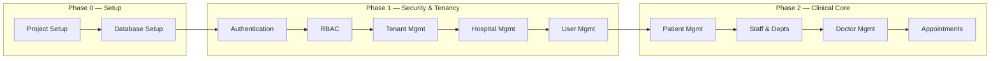

# Development Sequence

## Solo Developer — Exact Implementation Order

| Field | Value |
|-------|-------|
| **Document Version** | 1.0 |
| **Status** | Active |
| **Last Updated** | June 2026 |
| **Author** | Principal Software Architecture |
| **Stack** | React.js · FastAPI · PostgreSQL |
| **Team** | 1 solo full-stack developer |
| **Capacity** | ~56 net hours per 2-week sprint |
| **Authoritative References** | `IMPLEMENTATION_PLAN.md`, `SPRINT_PLAN.md`, `PROJECT_STRUCTURE.md`, `DATABASE_IMPLEMENTATION_PLAN.md`, `BACKEND_SPRINT1_EXECUTION.md`, `FRONTEND_SPRINT1_EXECUTION.md` |

---

## How to Use This Document

Tasks are numbered **DS-001** through **DS-048** in **strict execution order**. Do not skip ahead. Each task includes:

1. **What to build**
2. **Why it comes before the next task**
3. **Dependencies**
4. **Estimated effort**
5. **Completion criteria**

**Build pattern:** Backend Mon–Wed → Frontend Thu–Fri (per `IMPLEMENTATION_PLAN.md` §1.3). Deliver a **vertical slice** (API + UI + test) per module before moving on.

**Terminology:**

| Business term | Implementation |
|---------------|----------------|
| Hospital (organization) | `platform.tenants` |
| Hospital branch | `platform.tenant_locations` |
| SaaS customer signup | Tenant provisioning |

There is **no `hospitals` table**.

---

## Sequence Overview

| Phase | Tasks | Calendar | Cumulative hours |
|-------|-------|----------|------------------|
| Project + Database Setup | DS-001 – DS-012 | Weeks 1–2 | ~56 hrs |
| Authentication + RBAC | DS-013 – DS-022 | Weeks 3–4 | ~112 hrs |
| Tenant + Hospital + User | DS-023 – DS-032 | Weeks 3–5 | ~168 hrs |
| Patient + Doctor + Appointments | DS-033 – DS-048 | Weeks 5–8 | ~280 hrs |

> Tasks DS-023–DS-032 overlap Weeks 3–5 because tenant registration ships in Sprint 2 while user management completes in Sprint 3. Follow task numbers, not calendar weeks, when in doubt.

---

## Phase 0 — Project Setup

---

### DS-001 — Monorepo and Git foundation

| Field | Detail |
|-------|--------|
| **What to build** | Git repo with `main` + `dev` branches; root `.gitignore`, `.editorconfig`; folder skeleton per frozen `PROJECT_STRUCTURE.md` (`backend/`, `frontend/`, `database/`, `docs/`, `.github/`). |
| **Why before next** | All subsequent work needs version control and agreed folder layout. Changing structure later violates the structure freeze. |
| **Dependencies** | None |
| **Effort** | 2 hours |
| **Completion criteria** | `git status` clean; `backend/` and `frontend/` exist; no secrets tracked; `dev` branch is default working branch. |

---

### DS-002 — Docker Compose local infrastructure

| Field | Detail |
|-------|--------|
| **What to build** | Root `docker-compose.yml`: PostgreSQL 14 (`hms_dev`), Redis 7; `docker-compose.test.yml` for CI (`hms_test`). Document start commands in root `README.md`. |
| **Why before next** | Database and backend cannot run without Postgres and Redis. Health readiness checks depend on both. |
| **Dependencies** | DS-001 |
| **Effort** | 3 hours |
| **Completion criteria** | `docker compose up -d postgres redis` succeeds; `psql` connects to `hms_dev`; `redis-cli ping` returns `PONG`. |

---

### DS-003 — Environment variable templates

| Field | Detail |
|-------|--------|
| **What to build** | `backend/.env.example`, `frontend/.env.example` with all variables from `IMPLEMENTATION_PLAN.md` §12.3; local `.env.local` files gitignored. |
| **Why before next** | Backend config and frontend API client read env at startup — templates prevent drift and onboarding friction. |
| **Dependencies** | DS-001 |
| **Effort** | 1 hour |
| **Completion criteria** | Example files committed; real `.env.local` files work locally; no secrets in git. |

---

### DS-004 — Backend Python project scaffold

| Field | Detail |
|-------|--------|
| **What to build** | `backend/` venv; `requirements.txt` + `requirements-dev.txt`; `pyproject.toml` (ruff, pytest); empty `app/` package tree per `BACKEND_SPRINT1_EXECUTION.md` §1. |
| **Why before next** | Database models, Alembic, and API all live inside this package. |
| **Dependencies** | DS-001, DS-003 |
| **Effort** | 3 hours |
| **Completion criteria** | `pip install` succeeds; `import app` works; ruff configured. |

---

### DS-005 — FastAPI app factory and health stubs

| Field | Detail |
|-------|--------|
| **What to build** | `app/main.py` with `create_app()` factory; lifespan hook; bare `uvicorn` startup. Placeholder mount point for `/api/v1`. |
| **Why before next** | Validates Python path and server process before investing in database wiring. |
| **Dependencies** | DS-004 |
| **Effort** | 2 hours |
| **Completion criteria** | `uvicorn app.main:app --reload --port 8000` starts without import errors. |

---

### DS-006 — Frontend Vite + React + TypeScript scaffold

| Field | Detail |
|-------|--------|
| **What to build** | `frontend/` Vite project (React 18 + TypeScript); `package.json` scripts (`dev`, `build`, `lint`, `typecheck`); path alias `@/` → `src/`. |
| **Why before next** | Parallel frontend track starts here; API integration comes after backend envelope exists. |
| **Dependencies** | DS-001, DS-003 |
| **Effort** | 2 hours |
| **Completion criteria** | `npm run dev` serves `localhost:5173`; `npm run build` succeeds. |

---

### DS-007 — CI pipeline scaffold

| Field | Detail |
|-------|--------|
| **What to build** | `.github/workflows/ci.yml`: checkout → backend lint (ruff) → frontend lint → pytest (placeholder pass) on push to `dev`. |
| **Why before next** | Establishes quality gate before codebase grows; prevents tenant isolation regressions later. |
| **Dependencies** | DS-004, DS-006 |
| **Effort** | 2 hours |
| **Completion criteria** | CI runs on push; fails on intentional lint error; passes on clean commit. |

---

## Phase 0 — Database Setup

---

### DS-008 — PostgreSQL extensions and schemas

| Field | Detail |
|-------|--------|
| **What to build** | Alembic revision `001`: enable `pgcrypto`; create `platform` and `core` schemas; shared functions (`set_updated_at`, `enforce_tenant_self_reference`). |
| **Why before next** | Tables cannot be created without schemas and UUID support. |
| **Dependencies** | DS-002, DS-004 |
| **Effort** | 2 hours |
| **Completion criteria** | `alembic upgrade head` creates schemas; `gen_random_uuid()` available. |

---

### DS-009 — Phase 1 foundation tables

| Field | Detail |
|-------|--------|
| **What to build** | Alembic revisions for: `platform.tenants`, `platform.tenant_locations`, `core.roles`, `core.permissions`, `core.users`, `core.role_permissions`, `core.user_roles` — per `DATABASE_IMPLEMENTATION_PLAN.md` §2. |
| **Why before next** | Auth, RBAC, and tenant provisioning all require these tables. |
| **Dependencies** | DS-008 |
| **Effort** | 6 hours |
| **Completion criteria** | All 7 Phase 1 tables exist with composite FKs and indexes; matches `database/baseline/schema.sql` for these tables. |

---

### DS-010 — Row-Level Security policies

| Field | Detail |
|-------|--------|
| **What to build** | Alembic revision: `ENABLE ROW LEVEL SECURITY` + `FORCE ROW LEVEL SECURITY` + four policies per Phase 1 table using `app.tenant_id`. |
| **Why before next** | Multi-tenant isolation must exist before any data is inserted or tested. |
| **Dependencies** | DS-009 |
| **Effort** | 3 hours |
| **Completion criteria** | Query without `SET app.tenant_id` returns zero rows; manual two-tenant smoke test documented. |

---

### DS-011 — Bootstrap function and system tenant seeds

| Field | Detail |
|-------|--------|
| **What to build** | `platform.create_tenant()` function; `database/seeds/01_system_tenant.sql`, `03_permissions.sql`; `backend/scripts/seed.py` (idempotent). |
| **Why before next** | RBAC role cloning and tenant registration read from system tenant templates. |
| **Dependencies** | DS-009, DS-010 |
| **Effort** | 4 hours |
| **Completion criteria** | System tenant UUID `00000000-0000-0000-0000-000000000001` exists; permission catalog seeded; re-run seed does not duplicate rows. |

---

### DS-012 — SQLAlchemy models (platform + core Phase 1)

| Field | Detail |
|-------|--------|
| **What to build** | `app/models/base.py` (mixins); `platform.py`, `core.py`; register in `models/__init__.py` for Alembic. |
| **Why before next** | Repositories and services require ORM models; autogenerate diff validation depends on this. |
| **Dependencies** | DS-009 |
| **Effort** | 6 hours |
| **Completion criteria** | `Base.metadata` lists Phase 1 tables with correct schema; no drift vs applied migration. |

---

### DS-013 — Backend core infrastructure layer

| Field | Detail |
|-------|--------|
| **What to build** | `core/config.py`, `database.py`, `logging.py`, `response.py`, `exceptions.py`, `exception_handlers.py`, `middleware.py`; health routes `GET /api/v1/health`, `GET /api/v1/health/ready`. |
| **Why before next** | Every future endpoint uses envelope, logging, and DB session patterns established here. |
| **Dependencies** | DS-005, DS-012 |
| **Effort** | 8 hours |
| **Completion criteria** | Health returns `{ data, meta, errors }` envelope; `X-Request-ID` in response; readiness fails when Postgres down. |

---

### DS-014 — Tenant context middleware (dev stub)

| Field | Detail |
|-------|--------|
| **What to build** | `core/tenant/context.py` (`SET LOCAL app.tenant_id`); `core/tenant/middleware.py` (dev `X-Tenant-ID` header); `repositories/base.py` (`TenantScopedRepository`). |
| **Why before next** | All data access must be tenant-scoped before auth assigns real tenant context. |
| **Dependencies** | DS-013 |
| **Effort** | 6 hours |
| **Completion criteria** | Repository queries filter `tenant_id`; integration test proves tenant A cannot read tenant B data. |

---

### DS-015 — Frontend foundation (shell + API client)

| Field | Detail |
|-------|--------|
| **What to build** | Tailwind + tokens; `AppLayout`, `AuthLayout` stub; React Router (`/`, 404); `api/client.ts`, `api/types.ts`, `api/endpoints/health.ts`; TanStack Query provider; home page health badge. |
| **Why before next** | Validates full-stack connectivity before auth UI; establishes patterns for all feature API calls. |
| **Dependencies** | DS-006, DS-013 |
| **Effort** | 10 hours |
| **Completion criteria** | Home page shows API connected/disconnected; no `fetch` outside `src/api/`; `tsc --noEmit` passes. |

---

**Gate G1 — Foundation complete:** DS-001 through DS-015 done; CI green; isolation test passes.

---

## Phase 1 — Authentication

---

### DS-016 — Auth database objects

| Field | Detail |
|-------|--------|
| **What to build** | Alembic revision: `core.user_sessions`, `core.password_reset_tokens`; indexes on `users.email`, `user_sessions.refresh_token_hash`. |
| **Why before next** | Login, refresh rotation, and password reset persist sessions in these tables. |
| **Dependencies** | DS-009, DS-012 |
| **Effort** | 3 hours |
| **Completion criteria** | Tables exist with RLS; SQLAlchemy models added; migration applies cleanly. |

---

### DS-017 — JWT keys and security module

| Field | Detail |
|-------|--------|
| **What to build** | `scripts/generate_keys.py`; `core/security.py`: RS256 sign/verify, bcrypt password hash/verify, token TTL settings. |
| **Why before next** | Auth endpoints cannot issue or validate tokens without cryptographic primitives. |
| **Dependencies** | DS-013, DS-016 |
| **Effort** | 4 hours |
| **Completion criteria** | Keys generated locally in `backend/keys/` (gitignored); unit test: hash password, sign JWT, verify JWT. |

---

### DS-018 — Session and refresh token service

| Field | Detail |
|-------|--------|
| **What to build** | `domains/identity/services/auth_service.py`: create session, rotate refresh token, revoke session, reuse detection; store `refresh_token_hash` only. |
| **Why before next** | Refresh-in-cookie architecture requires server-side session lifecycle before login endpoint ships. |
| **Dependencies** | DS-016, DS-017 |
| **Effort** | 6 hours |
| **Completion criteria** | Session row created on login; refresh rotates token; reused refresh revokes all user sessions. |

---

### DS-019 — Auth API endpoints

| Field | Detail |
|-------|--------|
| **What to build** | `api/v1/auth.py`: `POST /auth/login`, `POST /auth/logout`, `POST /auth/refresh`, `POST /auth/forgot-password`, `POST /auth/reset-password`, `GET /auth/me`; HttpOnly refresh cookie. |
| **Why before next** | RBAC and user management require authenticated identity via `GET /auth/me`. |
| **Dependencies** | DS-018, DS-014 |
| **Effort** | 8 hours |
| **Completion criteria** | Login returns access token (body) + refresh cookie; `GET /auth/me` returns user profile; logout revokes session; OpenAPI documents all routes. |

---

### DS-020 — Tenant resolution on login

| Field | Detail |
|-------|--------|
| **What to build** | `core/tenant/resolver.py`: subdomain/slug → `tenant_id` lookup; wire into login flow; replace dev-only `X-Tenant-ID` stub for auth routes. |
| **Why before next** | Login must scope user lookup to `UNIQUE(tenant_id, email)` — wrong tenant must not authenticate. |
| **Dependencies** | DS-019 |
| **Effort** | 4 hours |
| **Completion criteria** | Login at subdomain resolves correct tenant; same email at two tenants = two independent logins. |

---

### DS-021 — Frontend authentication layer

| Field | Detail |
|-------|--------|
| **What to build** | `providers/AuthProvider.tsx`; `hooks/useAuth.ts`; `api/endpoints/auth.ts`; login page; axios interceptor for Bearer token; 401 → refresh → retry; access token in **memory only**. |
| **Why before next** | RBAC UI and protected routes require real auth state; backend auth endpoints need consumer. |
| **Dependencies** | DS-019, DS-015 |
| **Effort** | 12 hours |
| **Completion criteria** | User can log in; token not in `localStorage`; refresh works silently; logout clears state and cookie. |

---

### DS-022 — Auth integration tests

| Field | Detail |
|-------|--------|
| **What to build** | `tests/integration/api/v1/test_auth.py`: login, refresh, logout, lockout; `tests/integration/test_rbac_enforcement.py` scaffold. |
| **Why before next** | Auth regressions are security-critical; must be CI-gated before RBAC enforcement builds on auth. |
| **Dependencies** | DS-019 |
| **Effort** | 4 hours |
| **Completion criteria** | All auth tests pass in CI; failed login increments `failed_login_attempts`; locked user cannot login. |

---

## Phase 1 — RBAC

---

### DS-023 — Role and permission seed data

| Field | Detail |
|-------|--------|
| **What to build** | `database/seeds/04_roles.sql`, `05_role_permissions.sql` under system tenant; 8 roles per `RBAC_DESIGN.md` (`hospital_owner`, `doctor`, etc.); full permission matrix. |
| **Why before next** | Permission resolver and provisioning clone need complete template data. |
| **Dependencies** | DS-011 |
| **Effort** | 4 hours |
| **Completion criteria** | System tenant has 8 roles and role_permissions rows; role codes match `RBAC_DESIGN.md` not `tenant_admin`. |

---

### DS-024 — Permission resolver and cache

| Field | Detail |
|-------|--------|
| **What to build** | `core/permissions.py`: `PermissionResolver` loads effective permissions via `user_roles` → `role_permissions`; Redis cache `tenant:{id}:permissions:{user_id}`; invalidation on role change. |
| **Why before next** | `@requires_permission` decorator depends on resolver; permissions are **not** embedded in JWT per `SECURITY_ARCHITECTURE.md`. |
| **Dependencies** | DS-023, DS-019, DS-002 (Redis) |
| **Effort** | 6 hours |
| **Completion criteria** | Resolver returns union of role permissions; cache hit avoids DB on second call; role assignment invalidates cache. |

---

### DS-025 — RBAC middleware and decorator

| Field | Detail |
|-------|--------|
| **What to build** | `@requires_permission("module:action")` decorator; wire into route dependencies; 403 envelope on denial; audit log stub for denials. |
| **Why before next** | User, patient, and all clinical endpoints must be protected before shipping. |
| **Dependencies** | DS-024 |
| **Effort** | 4 hours |
| **Completion criteria** | Endpoint without permission returns 403; user with `patient:read` passes; `*:*` grants all for `hospital_owner`. |

---

### DS-026 — Frontend permission hooks and guards

| Field | Detail |
|-------|--------|
| **What to build** | `hooks/usePermissions.ts`; `components/shared/PermissionGuard.tsx`; `lib/permissions.ts` (`hasPermission`); load permissions from `GET /auth/me`. |
| **Why before next** | Admin and clinical UI hide unauthorized actions; must follow backend permission list not role names alone. |
| **Dependencies** | DS-025, DS-021 |
| **Effort** | 4 hours |
| **Completion criteria** | Button hidden without permission; API still enforces server-side; permissions refresh after login. |

---

### DS-027 — RBAC integration tests

| Field | Detail |
|-------|--------|
| **What to build** | `test_rbac_enforcement.py`: doctor denied `billing:void`; receptionist denied `opd:consult`; cross-tenant 404 on resource ID. |
| **Why before next** | Tenant management and user invites assign roles — incorrect RBAC leaks data across roles. |
| **Dependencies** | DS-025 |
| **Effort** | 3 hours |
| **Completion criteria** | CI mandatory RBAC tests pass; 100% of new endpoints pattern established. |

---

## Phase 1 — Tenant Management

---

### DS-028 — Subscription plans schema and seeds

| Field | Detail |
|-------|--------|
| **What to build** | Alembic: `platform.subscription_plans`, `platform.tenant_subscriptions`, `platform.tenant_settings`; seed `02_subscription_plans.sql` (starter, professional, enterprise). |
| **Why before next** | Tenant registration assigns 14-day trial subscription; plan limits enforced later. |
| **Dependencies** | DS-009 |
| **Effort** | 4 hours |
| **Completion criteria** | Three plans seeded under system tenant; subscription table links tenant to plan. |

---

### DS-029 — Tenant provisioning service

| Field | Detail |
|-------|--------|
| **What to build** | `domains/platform/services/tenant_service.py`: `provision_tenant()` — `create_tenant()` + trial subscription + primary location + clone roles/permissions from system tenant + create `hospital_owner` user + `user_roles`. |
| **Why before next** | Self-service signup is the front door; hospital and user management depend on a provisioned tenant. |
| **Dependencies** | DS-023, DS-028, DS-017 |
| **Effort** | 8 hours |
| **Completion criteria** | Single call creates tenant, subscription, location, roles, owner user; idempotent with `X-Idempotency-Key`. |

---

### DS-030 — Tenant registration API

| Field | Detail |
|-------|--------|
| **What to build** | `POST /api/v1/platform/register` (public, no JWT); validate slug uniqueness; return `tenant_id`, `trial_ends_at`; enqueue welcome email stub. |
| **Why before next** | Hospital management and user workflows assume tenants exist via registration not manual SQL. |
| **Dependencies** | DS-029 |
| **Effort** | 4 hours |
| **Completion criteria** | Registration returns 201; duplicate slug returns 409; new tenant can login as owner. |

---

### DS-031 — Subscription status middleware

| Field | Detail |
|-------|--------|
| **What to build** | `core/tenant/middleware.py` extension: block `suspended`/`cancelled` tenants; `past_due` grace read-only mode; allow `trial` and `active`. |
| **Why before next** | Must gate API access before hospital staff use the system daily. |
| **Dependencies** | DS-028, DS-020 |
| **Effort** | 3 hours |
| **Completion criteria** | Suspended tenant gets 403 on mutations; trial tenant can use MVP features. |

---

### DS-032 — Frontend registration wizard

| Field | Detail |
|-------|--------|
| **What to build** | `features/auth/pages/RegisterPage.tsx` multi-step: org name, slug, admin email/password; `api/endpoints` register call; redirect to login on success. |
| **Why before next** | Validates end-to-end tenant provisioning from UI before building hospital profile screens. |
| **Dependencies** | DS-030, DS-021 |
| **Effort** | 8 hours |
| **Completion criteria** | User registers hospital and logs in as owner; form validation via Zod; error states for duplicate slug. |

---

## Phase 1 — Hospital Management

> Hospital = tenant organization + branches (`tenant_locations`) + settings.

---

### DS-033 — Hospital profile API

| Field | Detail |
|-------|--------|
| **What to build** | `GET/PATCH /api/v1/admin/settings/organization` — update `platform.tenants` (name, address, phone, logo_url, tax_registration_no) and `tenant_settings` JSON keys. |
| **Why before next** | Staff and patients are registered under a configured hospital identity; branding needed for UI header. |
| **Dependencies** | DS-030, DS-025 (`admin:settings`) |
| **Effort** | 5 hours |
| **Completion criteria** | Owner can update org profile; changes persist per tenant; 403 for `receptionist`. |

---

### DS-034 — Branch (location) management API

| Field | Detail |
|-------|--------|
| **What to build** | `api/v1/locations.py`: CRUD `platform.tenant_locations`; `is_primary` flag; `UNIQUE(tenant_id, code)` validation. |
| **Why before next** | Multi-branch hospitals need locations before patients and appointments can be branch-scoped. |
| **Dependencies** | DS-033, DS-025 (`admin:branches` or `admin:settings`) |
| **Effort** | 5 hours |
| **Completion criteria** | Admin can add/edit/deactivate branch; one primary location per tenant; list returns only own tenant's locations. |

---

### DS-035 — Hospital management UI

| Field | Detail |
|-------|--------|
| **What to build** | `features/admin/pages/SettingsPage.tsx` (org profile); `features/admin/pages/BranchesPage.tsx` (location list + form); `LocationSelector` in header stub. |
| **Why before next** | Reception and clinical modules display hospital name and branch; admin must configure before go-live. |
| **Dependencies** | DS-033, DS-034, DS-026 |
| **Effort** | 8 hours |
| **Completion criteria** | Owner edits org profile and adds branch; changes visible after refresh; validation on required fields. |

---

## Phase 1 — User Management

---

### DS-036 — User management API

| Field | Detail |
|-------|--------|
| **What to build** | `api/v1/staff.py` user section: `GET/POST /admin/users`, `GET/PATCH /admin/users/{id}`, `POST /admin/users/invite`, `POST /admin/users/{id}/roles`, deactivate user; link `core.users` optionally to `core.staff` later. |
| **Why before next** | Hospital owner must invite staff before doctors, receptionists, or accountants can work in the system. |
| **Dependencies** | DS-025, DS-029, DS-019 |
| **Effort** | 8 hours |
| **Completion criteria** | Admin invites user with role; invite creates inactive user; assign/remove roles; cannot remove last `hospital_owner`; deactivated user cannot login. |

---

### DS-037 — Email adapter for invites and verification

| Field | Detail |
|-------|--------|
| **What to build** | `adapters/email_adapter.py` (SES local stub); send invite email, verification email, password reset; log-only in dev. |
| **Why before next** | User invite flow requires outbound email; password reset already depends on this adapter. |
| **Dependencies** | DS-019 |
| **Effort** | 4 hours |
| **Completion criteria** | Invite triggers email (or dev log); template includes accept-invite URL; failures do not orphan user row. |

---

### DS-038 — User management UI

| Field | Detail |
|-------|--------|
| **What to build** | `features/admin/pages/UsersPage.tsx`: user list, invite modal, role assignment, deactivate; `ProtectedRoute` + `PermissionGuard` for `admin:users`. |
| **Why before next** | Patient and clinical modules assume receptionist/doctor accounts exist before those roles use the app. |
| **Dependencies** | DS-036, DS-026, DS-021 |
| **Effort** | 8 hours |
| **Completion criteria** | Admin invites receptionist; user appears in list; role badges correct; deactivate removes login ability. |

---

### DS-039 — Protected routes and role-based landing

| Field | Detail |
|-------|--------|
| **What to build** | `routes/ProtectedRoute.tsx`, `RoleRedirect.tsx`; post-login redirect per `IMPLEMENTATION_PLAN.md` §3.3 (doctor → OPD, receptionist → queue, etc.). |
| **Why before next** | Patient and appointment pages must not be reachable without authentication and correct layout. |
| **Dependencies** | DS-021, DS-026 |
| **Effort** | 3 hours |
| **Completion criteria** | Unauthenticated user redirected to `/login`; each role lands on correct default route. |

---

**Gate G2 prep:** Auth, RBAC, tenant, hospital, and user management complete — internal dogfooding can begin.

---

## Phase 2 — Patient Management

---

### DS-040 — Patient database extensions

| Field | Detail |
|-------|--------|
| **What to build** | Alembic: `core.patients`, `core.patient_allergies`, `core.patient_contacts`; `generate_mrn()` function; `pg_trgm` search indexes migration. |
| **Why before next** | Patient API requires tables and MRN sequence before CRUD endpoints. |
| **Dependencies** | DS-012, DS-014 |
| **Effort** | 4 hours |
| **Completion criteria** | Tables exist with RLS; MRN function returns `MRN-YYYY-NNNNN` per tenant. |

---

### DS-041 — Patient API

| Field | Detail |
|-------|--------|
| **What to build** | `api/v1/patients.py` per `API_DESIGN.md` §4: list (search, pagination), create, get, update, soft-delete; allergies and contacts sub-resources; duplicate phone warning; PHI access audit log write. |
| **Why before next** | Appointments and OPD require a registered patient record. |
| **Dependencies** | DS-040, DS-025 (`patient:*`), DS-031 |
| **Effort** | 10 hours |
| **Completion criteria** | Full CRUD works; tenant isolation test passes; duplicate phone returns warning; trial patient limit returns 402 when exceeded. |

---

### DS-042 — Patient management UI

| Field | Detail |
|-------|--------|
| **What to build** | `features/patients/`: list with search, registration form (React Hook Form + Zod), profile page with allergies; TanStack Query hooks. |
| **Why before next** | Doctor and appointment modules need patients created from UI for end-to-end testing. |
| **Dependencies** | DS-041, DS-039 |
| **Effort** | 12 hours |
| **Completion criteria** | Receptionist registers patient in &lt; 2 minutes; search finds patient by name/phone; profile shows MRN and allergies. |

---

## Phase 2 — Doctor Management

> Doctors require staff records and departments (built here, not in user list above).

---

### DS-043 — Staff and department schema + API

| Field | Detail |
|-------|--------|
| **What to build** | Alembic verify `core.staff`, `core.departments`, `core.doctors`; `api/v1/staff.py`: departments CRUD, staff CRUD; link `users.staff_id` FK migration. |
| **Why before next** | Doctor profile extends staff; departments organize clinical staff. |
| **Dependencies** | DS-012, DS-036 |
| **Effort** | 6 hours |
| **Completion criteria** | Department and staff CRUD works; staff linked to department and optional `location_id`. |

---

### DS-044 — Doctor profile API

| Field | Detail |
|-------|--------|
| **What to build** | `api/v1/doctors.py` per `API_DESIGN.md` §5: create doctor from staff, list, get, update; specialization, registration number, consultation fee fields. |
| **Why before next** | Appointments bind to `doctor_id`; queue and calendar need doctor list. |
| **Dependencies** | DS-043, DS-025 (`doctor:*` or staff permissions) |
| **Effort** | 6 hours |
| **Completion criteria** | Doctor created from staff row; list returns only tenant doctors; get by id returns 404 for other tenant's id. |

---

### DS-045 — Doctor schedule foundation (availability stub)

| Field | Detail |
|-------|--------|
| **What to build** | `core.doctor_schedules` model usage; `GET/PUT /doctors/{id}/schedule` basic weekly slots; no holiday calendar yet. |
| **Why before next** | Appointment booking must check doctor availability before slot reservation. |
| **Dependencies** | DS-044 |
| **Effort** | 5 hours |
| **Completion criteria** | Doctor has weekly schedule JSON; unavailable slots rejected at appointment create. |

---

### DS-046 — Staff, department, and doctor UI

| Field | Detail |
|-------|--------|
| **What to build** | `features/admin/pages/DepartmentsPage.tsx`, `StaffPage.tsx`; `features/admin` or shared doctor list; doctor profile edit form. |
| **Why before next** | Appointment UI needs doctor picker populated from tenant doctors. |
| **Dependencies** | DS-043, DS-044, DS-035 |
| **Effort** | 10 hours |
| **Completion criteria** | Admin creates department, staff, doctor profile; doctor appears in appointment doctor dropdown. |

---

## Phase 2 — Appointment Management

---

### DS-047 — Appointment database and API

| Field | Detail |
|-------|--------|
| **What to build** | Alembic verify `clinical.appointments`; `api/v1/appointments.py` per `API_DESIGN.md` §6: book, list, get, cancel, reschedule; conflict detection; filter by doctor, date, status. |
| **Why before next** | OPD queue and consultation (Sprint 4) start from a booked or walk-in appointment. |
| **Dependencies** | DS-041, DS-044, DS-045, DS-025 (`appointment:*`) |
| **Effort** | 10 hours |
| **Completion criteria** | Book appointment for patient + doctor; double-booking returns 409; list filtered by date; cancel updates status; tenant isolation verified. |

---

### DS-048 — Appointment management UI

| Field | Detail |
|-------|--------|
| **What to build** | `features/clinical/pages/AppointmentsPage.tsx`: calendar/list view, booking form (patient search select, doctor select, date/time); status badges; cancel/reschedule actions. |
| **Why before next** | Completes the user-requested sequence; enables Sprint 4 OPD queue to consume appointments. |
| **Dependencies** | DS-047, DS-042, DS-046, DS-039 |
| **Effort** | 12 hours |
| **Completion criteria** | Receptionist books appointment; doctor sees today's appointments; cancel reflects in list; E2E: register → login → patient → doctor → appointment on staging. |

---

**Gate G2 — MVP clinical path to appointments:** DS-001 through DS-048 complete.

---

## What Comes Immediately After DS-048

Continue per `SPRINT_PLAN.md` — not part of this sequence but next in line:

| Order | Module | Sprint | Depends on |
|-------|--------|--------|------------|
| 49 | OPD queue + consultation + e-Rx | 4 | DS-048 |
| 50 | Hospital billing (invoice, payment, receipt) | 4 | DS-048, OPD |
| 51 | IPD (wards, beds, admissions) | 5 | Billing |
| 52 | Laboratory | 7 | Patients, billing |
| 53 | Pharmacy + inventory | 8 | OPD Rx |
| 54 | Reports + dashboard | 9 | All clinical |
| 55 | SaaS subscription (Razorpay) | 11 | Tenant mgmt |
| 56 | Production launch | 12 | G5 criteria |

---

## Dependency Matrix (Quick Reference)

| Task | Blocks |
|------|--------|
| DS-001 – DS-007 | Everything |
| DS-008 – DS-015 | Auth, all features |
| DS-016 – DS-022 | RBAC, user mgmt |
| DS-023 – DS-027 | All protected endpoints |
| DS-028 – DS-032 | Hospital + user mgmt |
| DS-033 – DS-035 | Branding, branch-scoped data |
| DS-036 – DS-039 | Clinical staff using app |
| DS-040 – DS-042 | Doctors, appointments, OPD |
| DS-043 – DS-046 | Appointments, OPD |
| DS-047 – DS-048 | OPD, billing (Sprint 4) |

---

## Solo Developer Weekly Map (Weeks 1–8)

| Week | Tasks | Focus |
|------|-------|-------|
| 1 | DS-001 – DS-011 | Project + database |
| 2 | DS-012 – DS-015 | Backend/frontend foundation + G1 |
| 3 | DS-016 – DS-022, DS-023 – DS-025 | Auth + RBAC backend |
| 4 | DS-026 – DS-032 | RBAC UI + tenant registration |
| 5 | DS-033 – DS-039 | Hospital + user management |
| 6 | DS-040 – DS-042 | Patients |
| 7 | DS-043 – DS-046 | Staff + doctors |
| 8 | DS-047 – DS-048 | Appointments → G2 prep |

---

## Decision Gates

| Gate | After tasks | Go criteria |
|------|-------------|-------------|
| **G1** | DS-015 | Docker up; Alembic applied; isolation test passes; health UI works |
| **G2** | DS-048 | Register → login → patient → doctor → appointment on staging |
| **G3** | Sprint 8 (post-sequence) | IPD + lab + pharmacy E2E |
| **G4** | Sprint 11 | Razorpay conversion |
| **G5** | Sprint 12 | 10 beta tenants; pen test; production |

---

## Document Cross-References

| Topic | Guide |
|-------|-------|
| Database Phase 1 | `DATABASE_IMPLEMENTATION_PLAN.md` |
| Backend Sprint 1 detail | `BACKEND_SPRINT1_EXECUTION.md` |
| Frontend Sprint 1 detail | `FRONTEND_SPRINT1_EXECUTION.md` |
| Pre-coding checklist | `DEVELOPMENT_CHECKLIST.md` |
| Auth design | `AUTHENTICATION_ARCHITECTURE_GUIDE.md` |
| Roles and permissions | `RBAC_DESIGN.md` |
| API contracts | `API_DESIGN.md` |

---

## Revision History

| Version | Date | Author | Changes |
|---------|------|--------|---------|
| 1.0 | June 2026 | Principal Software Architecture | Initial development sequence DS-001 – DS-048 |

---

*Exact implementation sequence for solo developer. No code — follow task order strictly. Hospital = `platform.tenants` + `platform.tenant_locations`.*
