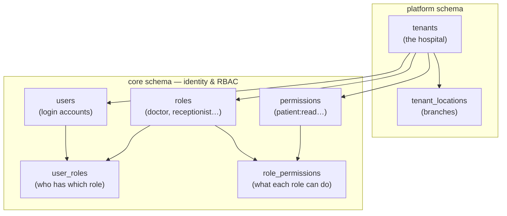
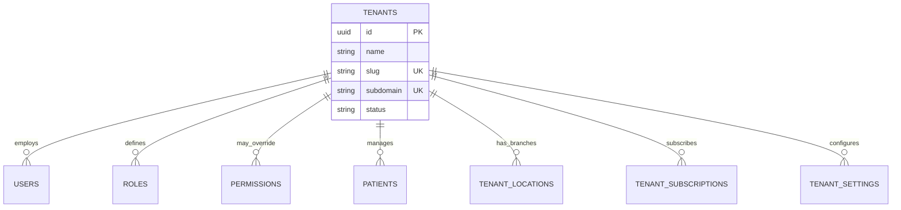
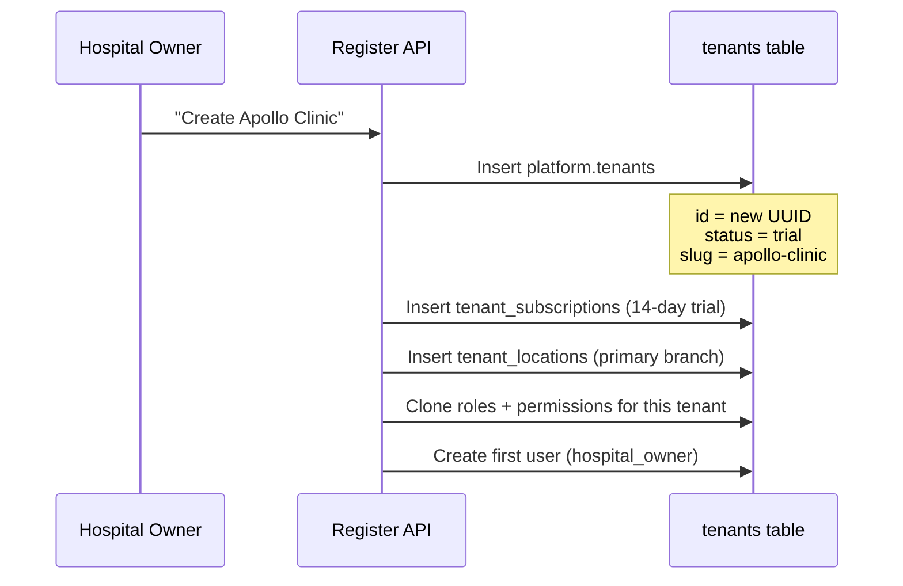
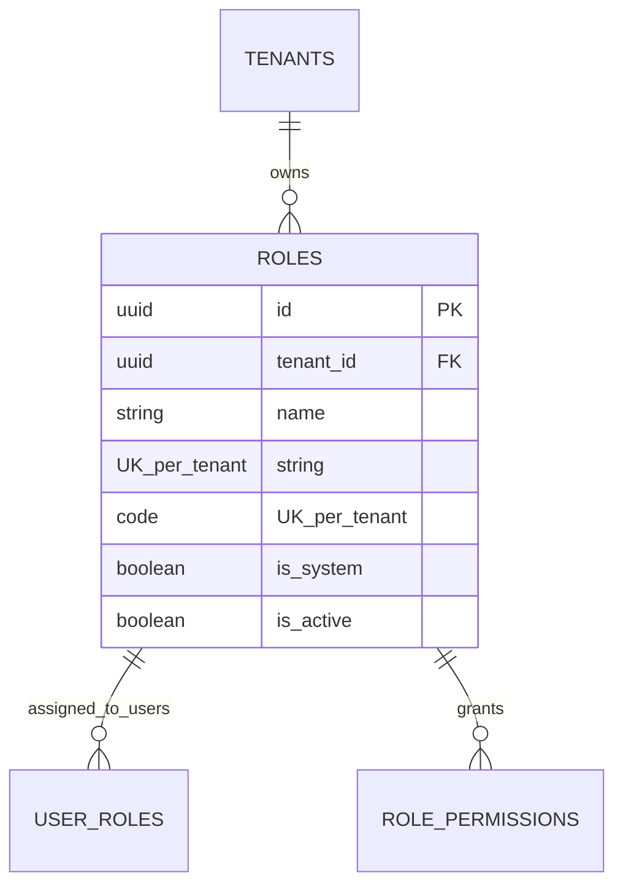
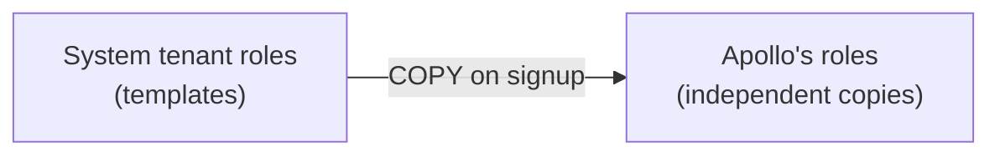
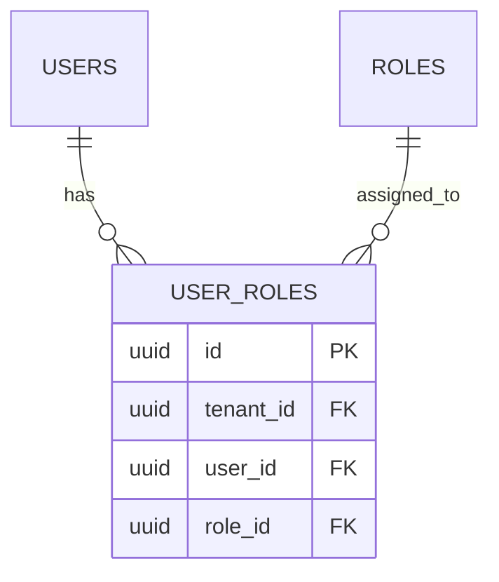
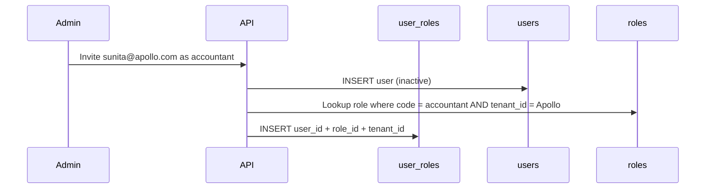
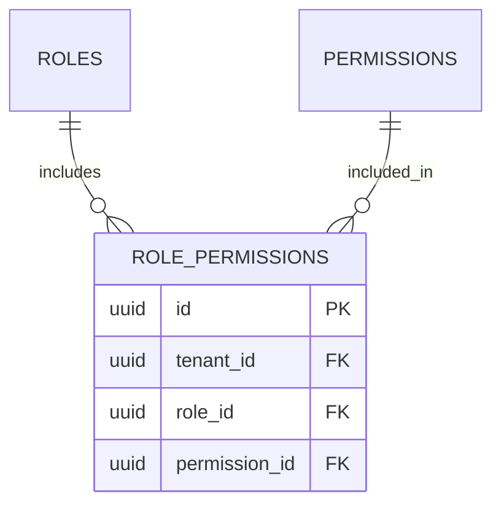
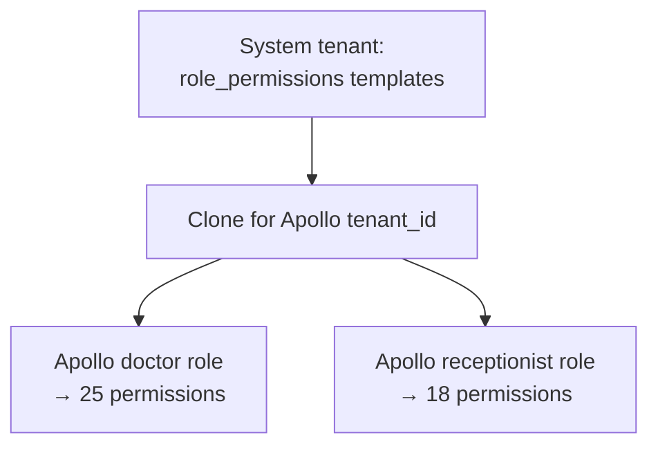
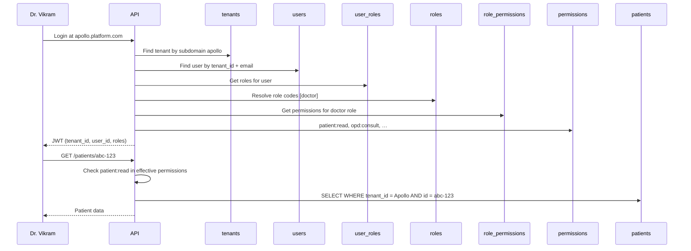

# Foundation Database Guide

## Tenants, Hospitals, Users & RBAC — Explained for Junior Developers

| Field | Value |
|-------|-------|
| **Document Version** | 1.0 |
| **Status** | Active |
| **Last Updated** | June 2026 |
| **Author** | Database Architecture |
| **Source of Truth** | DATABASE_DESIGN.md, RBAC_DESIGN.md, MULTI_TENANT_DESIGN.md |
| **Audience** | Junior developers learning the HMS data model |

---

## Before You Read This Guide

### What is a "foundation" table?

Foundation tables are the **base layer** everything else sits on. Before you can register a patient, book an appointment, or create an invoice, the system needs to know:

1. **Which hospital** owns the data (tenant)
2. **Who is logged in** (user)
3. **What they are allowed to do** (roles and permissions)

If you understand these seven concepts, the rest of the 61-table schema becomes much easier.

### Important: There is no `hospitals` table

In everyday language we say "hospital." In the database, a hospital (or clinic, or diagnostic center) is stored as a **tenant** in `platform.tenants`.

| Everyday term | Database table | Schema |
|---------------|----------------|--------|
| Hospital / clinic / organization | `tenants` | `platform` |
| Branch / second location | `tenant_locations` | `platform` |
| Staff login account | `users` | `core` |
| Job title access group | `roles` | `core` |
| Atomic action (e.g. "read patients") | `permissions` | `core` |

Think of **tenant = the customer hospital on the SaaS platform**. One row in `tenants` = one paying organization with its own isolated data.

### The big picture (start here)



**RBAC in one sentence:** A **user** is assigned one or more **roles**; each **role** is granted many **permissions**; the app checks permissions before allowing an action.

---

## Shared Concepts (Every Foundation Table)

Before diving into each table, learn these patterns once — they repeat everywhere.

### `tenant_id` on every row

Almost every table has a `tenant_id` column pointing to `platform.tenants.id`. This is how the platform keeps Apollo Clinic's data separate from City Hospital's data while using **one shared database**.

### Standard audit columns

Most tables also include:

| Column | Meaning |
|--------|---------|
| `id` | Unique row identifier (UUID) |
| `created_at` / `created_by` | Who created the record and when |
| `updated_at` / `updated_by` | Last edit |
| `deleted_at` / `deleted_by` | Soft delete (row still exists but hidden) |
| `version` | Optimistic locking (prevents overwrite conflicts) |

### The system tenant (special case)

UUID `00000000-0000-0000-0000-000000000001` is a **fake tenant** used only to store platform-wide seed data — default permission definitions, subscription plan templates, etc. Real hospitals get their own UUID when they sign up.

---

## 1. `platform.tenants`

**Schema:** `platform`  
**Plain English name:** The hospital (or clinic) as a SaaS customer

### 1.1 Why it exists

This is the **root of the entire data tree**. Multi-tenant SaaS means many hospitals share one application and one database. `tenants` is the row that says "this organization exists on our platform" and gives every other row a home.

Without `tenants`, there would be no way to answer: *"Whose patients are these?"*

### 1.2 Business purpose

| Business need | How `tenants` supports it |
|---------------|---------------------------|
| Onboard a new hospital | Insert a tenant when someone registers |
| Bill the hospital monthly | Link to `tenant_subscriptions` |
| Brand the UI | Store `name`, `logo_url`, `subdomain` |
| Know if they can log in | `status`: trial, active, suspended, cancelled |
| Operate in correct timezone/currency | `timezone`, `currency`, `country` |
| Legal/tax identity | `tax_registration_no`, address fields |

**Example row (conceptual):**

| name | slug | subdomain | status | country | timezone |
|------|------|-----------|--------|---------|----------|
| Apollo Clinic | apollo-clinic | apollo | active | IN | Asia/Kolkata |

Staff log in at `apollo.platform.com`. The subdomain maps to this tenant row.

### 1.3 Relationships



| Relationship | Type | Notes |
|--------------|------|-------|
| `tenants` → `users` | One-to-many | Each user belongs to **one** tenant |
| `tenants` → `roles` | One-to-many | Each tenant has its own copy of roles |
| `tenants` → `permissions` | One-to-many | Mostly system seed; tenants can extend |
| `tenants` → `tenant_locations` | One-to-many | Branches under same organization |
| `tenants` → everything else | One-to-many | Patients, invoices, beds — all scoped |

**Special rule:** On the `tenants` table itself, `tenant_id` equals `id` (the row points to itself). This keeps the foreign key pattern consistent across all tables.

### 1.4 Data flow

**A) New hospital signs up (registration)**



**B) Daily API request**

1. User logs in at `apollo.platform.com`
2. System finds tenant where `subdomain = 'apollo'`
3. JWT contains `tenant_id = <apollo's UUID>`
4. Every query adds `WHERE tenant_id = <apollo's UUID>`

**C) Tenant lifecycle**

| Status | Meaning |
|--------|---------|
| `trial` | New signup; limited features/seats |
| `active` | Paying customer; full access |
| `past_due` | Payment failed; grace period |
| `suspended` | Blocked for non-payment |
| `cancelled` | Offboarding; export then purge |

### 1.5 Multi-tenant considerations

| Topic | Detail |
|-------|--------|
| **Isolation key** | `tenants.id` is the value copied into every child row's `tenant_id` |
| **Global uniqueness** | `slug` and `subdomain` are unique **across the whole platform** (not just per hospital) |
| **No cross-tenant row** | A patient, user, or invoice never belongs to two tenants |
| **RLS** | Even if application code forgets a filter, PostgreSQL RLS hides other tenants' rows |
| **Deletion** | Tenants are not hard-deleted casually; cancelled tenants go through a 90-day retention window |

**Junior dev mistake to avoid:** Never trust `tenant_id` sent from the browser in a request body. Always use the `tenant_id` from the authenticated JWT.

---

## 2. Hospitals (concept) — `tenants` + `tenant_locations`

You asked about **hospitals**. There is no `core.hospitals` or `clinical.hospitals` table. Here is how the model maps.

### 2.1 Why it is designed this way

In SaaS, the **customer** is the organization, not an individual building. A small clinic and a 200-bed hospital use the same table. Multi-branch hospitals add **locations** without needing a separate "hospital" entity.

### 2.2 Business purpose

| Scenario | Table used |
|----------|------------|
| Single-clinic doctor practice | One `tenants` row |
| Hospital with main building + branch | One `tenants` row + multiple `tenant_locations` |
| Hospital chain (future) | Still one tenant per legal entity; locations per branch |

**`platform.tenant_locations` (companion table, not in your list but important):**

| Field | Purpose |
|-------|---------|
| `name` | "Apollo Clinic — Andheri Branch" |
| `code` | Short code unique per tenant (e.g. `AND`) |
| `is_primary` | Which branch is the default |
| `address_*`, `phone` | Branch contact info |

Users and patients can optionally link to a `location_id` when the hospital has multiple sites.

### 2.3 Relationships

```
tenants (Apollo Hospital)
├── tenant_locations (Main Campus)      ← is_primary = true
├── tenant_locations (East Wing Clinic)
├── users (staff logins)
├── patients
└── clinical / billing / … (all other data)
```

### 2.4 Data flow

1. Tenant created with one primary location during registration
2. Hospital admin adds more locations in settings
3. When registering a patient or booking an appointment, staff may pick a location
4. Reports can filter by location within the same tenant

### 2.5 Multi-tenant considerations

- Locations are **never shared** between tenants. `UNIQUE(tenant_id, code)` — two different hospitals can both have code `MAIN`.
- A user at Apollo cannot see City Hospital's locations because `tenant_id` differs.

---

## 3. `core.users`

**Schema:** `core`  
**Plain English name:** A person who can log into the system

### 3.1 Why it exists

Not everyone in a hospital needs a login. Patients (usually) do not log in. The `users` table stores **authentication identity** — email, password hash, account status — for staff and administrators.

Separating `users` from `staff` is intentional:

| Table | Holds |
|-------|-------|
| `staff` | HR record: employee code, department, joining date |
| `users` | Login: email, password, sessions |

A receptionist might exist in both. A report-only role might be user-only. Linking is optional via `users.staff_id`.

### 3.2 Business purpose

| Business need | Column / behavior |
|---------------|-------------------|
| Log in with email + password | `email`, `password_hash` |
| Block ex-employees | `status = inactive` |
| Stop brute-force attacks | `failed_login_attempts`, `locked_until` |
| Prove email ownership | `email_verified_at` |
| Know last activity | `last_login_at` |
| Tie login to employee record | `staff_id` (optional) |
| Default branch | `location_id` (optional) |

**Example:**

| email | first_name | status | tenant |
|-------|------------|--------|--------|
| doctor@apollo.com | Vikram | active | Apollo Clinic |
| doctor@apollo.com | — | — | ❌ Cannot also exist at City Hospital in same row |

Same email **can** exist at two tenants — they are **two different user rows** with different `tenant_id`.

### 3.3 Relationships

```mermaid
erDiagram
    TENANTS ||--o{ USERS : owns
    USERS ||--o{ USER_ROLES : has
    USERS ||--o{ USER_SESSIONS : has
    USERS |o--o| STAFF : linked_to
    USERS }o--o| TENANT_LOCATIONS : default_branch

    USERS {
        uuid id PK
        uuid tenant_id FK
        string email UK_per_tenant
        string password_hash
        string status
    }
```

| Parent | Child | Rule |
|--------|-------|------|
| `tenants` | `users` | Many users per tenant |
| `users` | `user_roles` | Many roles per user |
| `users` | `user_sessions` | Many devices/browsers = many sessions |
| `staff` | `users` | Zero or one user per staff member |

**Uniqueness:** `UNIQUE(tenant_id, email)` — email is unique **inside** one hospital, not globally.

### 3.4 Data flow

**A) Registration (hospital owner)**

1. Tenant row created
2. First user inserted with `status = active` (or pending verification)
3. `user_roles` row links user to `hospital_owner` role

**B) Staff invite**

1. Admin invites `sunita@apollo.com`
2. User row created with `status = inactive` (cannot log in yet)
3. Invite email sent
4. User accepts invite, sets password → `status = active`

**C) Login**

1. Resolve tenant from subdomain
2. Find `users` where `tenant_id = X AND email = Y`
3. Verify password against `password_hash`
4. Create session in `user_sessions`
5. Issue JWT with `sub = user.id` and `tenant_id`

**D) Deactivation**

1. Admin sets `status = inactive`
2. All `user_sessions` revoked
3. User can no longer authenticate

### 3.5 Multi-tenant considerations

| Topic | Detail |
|-------|--------|
| **One tenant per user** | A user row never spans two hospitals. If Dr. Patel works at two tenants, that is two user rows. |
| **Composite FKs** | When linking `staff_id` or `location_id`, FK includes `tenant_id` so you cannot attach Apollo user to City Hospital staff |
| **RLS** | Queries only return users for the current tenant context |
| **Password security** | Only `password_hash` stored — never plaintext |
| **Soft delete** | `deleted_at` preserves audit trail; inactive is preferred for leavers |

---

## 4. `core.roles`

**Schema:** `core`  
**Plain English name:** A job function bucket (Doctor, Receptionist, Accountant…)

### 4.1 Why it exists

You could assign fifty permissions directly to every user. That does not scale. **Roles** group permissions the way job titles work in real hospitals: a doctor needs consultation access; a receptionist needs appointment access.

Roles are the middle layer in RBAC:

```
User  →  Role  →  Permissions
```

### 4.2 Business purpose

| Business need | How roles help |
|---------------|----------------|
| Onboard staff quickly | Assign `receptionist` role instead of 20 permissions |
| Consistent access | All doctors get the same baseline permissions |
| Customize per hospital | Tenant can tweak role names (future); MVP uses seeded roles |
| Protect system roles | `is_system = true` prevents deleting `hospital_owner` |

**Standard roles (from RBAC_DESIGN.md):**

| code | Display name | Typical person |
|------|--------------|----------------|
| `hospital_owner` | Hospital Owner | Business owner |
| `hospital_admin` | Hospital Admin | IT / operations admin |
| `doctor` | Doctor | Consulting physician |
| `receptionist` | Receptionist | Front desk |
| `nurse` | Nurse | IPD nursing staff |
| `accountant` | Accountant | Billing desk |
| `pharmacist` | Pharmacist | Pharmacy |
| `lab_technician` | Lab Technician | Laboratory |

> Note: DATABASE_DESIGN.md sometimes shows `tenant_admin` in examples. Implementation uses `hospital_owner` / `hospital_admin` per RBAC_DESIGN.md.

### 4.3 Relationships



| Relationship | Meaning |
|--------------|---------|
| Tenant → Roles | Each hospital has its **own** set of role rows |
| Role → User_roles | Many users can share one role |
| Role → Role_permissions | One role has many permissions |

**Uniqueness:** `UNIQUE(tenant_id, code)` — Apollo and City Hospital can both have a role `code = 'doctor'`, but they are separate rows.

### 4.4 Data flow

**A) Tenant provisioning (clone pattern)**



1. Platform seeds default roles under system tenant
2. When Apollo Clinic registers, application **copies** role rows into Apollo's `tenant_id`
3. Apollo's admin can later customize (Phase 2) without affecting other hospitals

**B) Assigning a role to a user**

1. Admin invites Dr. Patel as `doctor`
2. Row inserted into `user_roles` linking `user_id` + `role_id`
3. Permission cache invalidated for that user

**C) Checking access at runtime**

1. Load user's roles from `user_roles`
2. Load permissions for those roles from `role_permissions`
3. Union all permissions → effective permission set
4. Check if `patient:read` is in the set

### 4.5 Multi-tenant considerations

| Topic | Detail |
|-------|--------|
| **Tenant-scoped copies** | Roles are not shared globally. Changing Apollo's `doctor` role does not change City's `doctor` role. |
| **System flag** | `is_system = true` roles cannot be deleted (protects `hospital_owner`) |
| **Cascade delete** | Deleting a role removes `user_roles` and `role_permissions` for that tenant's role |
| **Inactive role** | `is_active = false` can block new assignments while preserving history |

---

## 5. `core.permissions`

**Schema:** `core`  
**Plain English name:** One specific allowed action in the system

### 5.1 Why it exists

Roles are still too coarse if you cannot express fine actions. **Permissions** are the smallest unit of access control — one row = one thing you may or may not do.

Examples:

- `patient:read` — view patient list
- `opd:consult` — conduct a consultation
- `billing:void` — cancel an invoice

The API checks permissions, not role names, so you can change role composition without renaming code.

### 5.2 Business purpose

| Business need | Permission example |
|---------------|-------------------|
| Doctor views history | `patient:read` |
| Receptionist registers patient | `patient:create` |
| Only accountant voids bills | `billing:void` |
| Owner changes subscription | `admin:subscription` |
| Audit who can see logs | `audit:read` |

**Naming format:** `{module}:{action}`

| Part | Examples |
|------|----------|
| module | `patient`, `opd`, `billing`, `laboratory`, `admin` |
| action | `read`, `create`, `update`, `delete`, `consult`, `void` |

**Example permission rows (conceptual):**

| code | name | module |
|------|------|--------|
| patient:read | View Patients | patient |
| patient:create | Register Patients | patient |
| opd:consult | Conduct Consultation | opd |
| billing:void | Void Invoice | billing |

### 5.3 Relationships

```mermaid
erDiagram
    TENANTS ||--o{ PERMISSIONS : catalogs
    PERMISSIONS ||--o{ ROLE_PERMISSIONS : granted_via

    PERMISSIONS {
        uuid id PK
        uuid tenant_id FK
        string code UK_per_tenant
        string module
        string name
    }
```

| Relationship | Meaning |
|--------------|---------|
| Tenant → Permissions | Catalog is tenant-scoped (system tenant holds master list) |
| Permission → Role_permissions | Many roles can include the same permission |

Permissions are **not** linked directly to users. The path is always:

```
user → user_roles → role → role_permissions → permission
```

### 5.4 Data flow

**A) Platform seed (once)**

1. Insert ~50–80 permission rows under **system tenant** UUID
2. These define the complete action catalog for the product

**B) New tenant signup**

1. Clone permissions (or reference system catalog — implementation copies for isolation)
2. Clone `role_permissions` mappings from templates
3. Doctor role at Apollo gets `patient:read`, `opd:consult`, etc.

**C) API request**

1. Endpoint declares required permission: e.g. `@requires("patient:create")`
2. Resolver loads user's effective permissions (from roles)
3. Allow → proceed; Deny → HTTP 403 + audit log

**D) Frontend UI**

1. `GET /auth/me` returns permission list for menus
2. `<PermissionGuard permission="billing:void">` hides buttons user cannot use
3. UI hiding is **not security** — API always re-checks

### 5.5 Multi-tenant considerations

| Topic | Detail |
|-------|--------|
| **Catalog per tenant** | Allows future custom permissions for one hospital (Enterprise) |
| **System tenant read** | All tenants may read seed permissions from system tenant during provisioning |
| **Uniqueness** | `UNIQUE(tenant_id, code)` — same permission code exists per tenant as separate rows |
| **Stable codes** | Application code references `patient:read` string — do not rename lightly |
| **Not in JWT** | Permissions resolved server-side so role changes take effect without waiting for token expiry (cache TTL ~5 min) |

---

## 6. `core.user_roles`

**Schema:** `core`  
**Plain English name:** Junction table — "this user has this role"

### 6.1 Why it exists

Users and roles have a **many-to-many** relationship:

- One user can have multiple roles (e.g. `doctor` + `hospital_admin`)
- One role is assigned to many users (many doctors)

Junction tables exist purely to link two tables without duplicating data.

### 6.2 Business purpose

| Business need | Example |
|---------------|---------|
| Assign job function | Link receptionist user to `receptionist` role |
| Multi-hat staff | Dr. Patel is both `doctor` and `hospital_admin` → two `user_roles` rows |
| Remove access | Delete `user_roles` row (or deactivate user) |
| Audit who had access | `created_at`, `created_by` on assignment |

**Real-world analogy:** A hospital ID badge can list multiple clearance levels. `user_roles` is that list in the database.

### 6.3 Relationships



| FK | Points to | On delete |
|----|-----------|-----------|
| `user_id` | `users(id)` within same tenant | CASCADE |
| `role_id` | `roles(id)` within same tenant | CASCADE |

**Uniqueness:** `UNIQUE(tenant_id, user_id, role_id)` — you cannot assign the same role twice to one user.

### 6.4 Data flow

**A) Invite staff**



**B) Login permission resolution**

1. User authenticates
2. Query: all `user_roles` for this `user_id`
3. Collect role IDs → load permissions via `role_permissions`
4. Cache result in Redis: `tenant:{id}:permissions:{user_id}`

**C) Role change**

1. Admin adds `receptionist` role to existing user
2. New `user_roles` row inserted
3. Permission cache invalidated immediately

**D) Effective permissions with multiple roles**

If user has `doctor` + `hospital_admin`:

- Permissions = union(doctor permissions, hospital_admin permissions)
- More roles = more access (never subtracts)

### 6.5 Multi-tenant considerations

| Topic | Detail |
|-------|--------|
| **tenant_id required** | Every junction row repeats `tenant_id` even though user and role already have it — enables composite FK and RLS |
| **Composite FK** | `(tenant_id, user_id)` must match `users(tenant_id, id)` — prevents linking Apollo user to City Hospital role |
| **Cross-tenant attack blocked** | Even if attacker guesses a `role_id` from another tenant, FK + RLS reject the insert |
| **Last owner rule** | Business rule: cannot remove last `hospital_owner` from tenant (enforced in application, not DB) |

**Junior dev mistake:** Inserting `user_roles` without verifying `user.tenant_id == role.tenant_id`. The composite FK exists to catch this.

---

## 7. `core.role_permissions`

**Schema:** `core`  
**Plain English name:** Junction table — "this role includes this permission"

### 7.1 Why it exists

Roles and permissions are also **many-to-many**:

- Role `doctor` includes dozens of permissions
- Permission `patient:read` is shared by doctors, nurses, receptionists, etc.

`role_permissions` defines the **permission matrix** per role per tenant.

### 7.2 Business purpose

| Business need | How it works |
|---------------|--------------|
| Define what a doctor can do | Many `role_permissions` rows for `role = doctor` |
| Tighten security for receptionist | Omit `billing:void` from receptionist's mappings |
| Clone defaults on signup | Copy template mappings from system tenant |
| Customize hospital policy (future) | Hospital admin adds/removes mappings for their roles |

**Conceptual matrix (simplified):**

| Permission | doctor | receptionist | accountant |
|------------|:------:|:------------:|:----------:|
| patient:read | ✅ | ✅ | ✅ |
| patient:create | ❌ | ✅ | ❌ |
| opd:consult | ✅ | ❌ | ❌ |
| billing:void | ❌ | ❌ | ✅ |

The matrix is stored as rows in `role_permissions`, not as a spreadsheet.

### 7.3 Relationships



| FK | Points to | On delete |
|----|-----------|-----------|
| `role_id` | `roles` | CASCADE (remove mappings if role deleted) |
| `permission_id` | `permissions` | RESTRICT (cannot delete permission still in use) |

**Uniqueness:** `UNIQUE(tenant_id, role_id, permission_id)`

### 7.4 Data flow

**A) Tenant provisioning**



**B) Runtime check (doctor opens patient chart)**

1. API endpoint requires `patient:read`
2. Load user's roles via `user_roles`
3. For each role, load permission codes via `role_permissions`
4. If `patient:read` found → allow
5. Log PHI access in audit table

**C) Admin changes role definition (Phase 2)**

1. Hospital admin adds `reports:export` to `accountant` role
2. Insert one `role_permissions` row
3. Invalidate permission cache for all users with `accountant` role

### 7.5 Multi-tenant considerations

| Topic | Detail |
|-------|--------|
| **Independent matrices** | Apollo's `doctor` role can differ from City's `doctor` role if customized |
| **Composite FK** | `(tenant_id, role_id)` and `(tenant_id, permission_id)` must match same tenant |
| **RESTRICT on permission delete** | Prevents removing a permission that roles still depend on |
| **Seeding order** | Permissions must exist before `role_permissions`; roles must exist before mapping |

---

## End-to-End: How It All Works Together

### Story: Dr. Vikram logs in and opens a patient chart



### The full RBAC chain (memorize this)

```
platform.tenants          ← WHOSE hospital?
    └── core.users        ← WHO is logging in?
            └── core.user_roles      ← WHAT HATS do they wear?
                    └── core.roles
                            └── core.role_permissions  ← WHAT CAN that hat do?
                                    └── core.permissions
```

---

## Quick Reference Tables

### Foundation tables at a glance

| Table | Schema | One row represents | Key unique rule |
|-------|--------|-------------------|-----------------|
| `tenants` | platform | One hospital/customer on SaaS | `slug` unique globally |
| `tenant_locations` | platform | One branch/building | `UNIQUE(tenant_id, code)` |
| `users` | core | One login account | `UNIQUE(tenant_id, email)` |
| `roles` | core | One job role definition | `UNIQUE(tenant_id, code)` |
| `permissions` | core | One allowed action | `UNIQUE(tenant_id, code)` |
| `user_roles` | core | User X has role Y | `UNIQUE(tenant_id, user_id, role_id)` |
| `role_permissions` | core | Role X has permission Y | `UNIQUE(tenant_id, role_id, permission_id)` |

### What to filter in every query

| Table | Always filter by |
|-------|------------------|
| All `core.*` foundation tables | `tenant_id` + usually `deleted_at IS NULL` |
| `platform.tenants` | `id` (or status for platform admin lists) |

---

## Common Junior Developer Questions

### "Why not put role directly on the user table?"

You could add `users.role = 'doctor'`, but real staff wear multiple hats and permissions change per role. Junction tables keep the model flexible without adding `role1`, `role2` columns.

### "Why duplicate tenant_id on junction tables?"

So the database can enforce: *"This user_role row can only connect objects from the same hospital."* It is defense in depth for multi-tenancy.

### "Can two hospitals share one user row?"

No. One user row = one tenant. Same person at two hospitals = two user rows, two logins (or future SSO federation).

### "Where is the hospital name stored?"

`platform.tenants.name` — not in `users` or `roles`.

### "What's the difference between inactive user and soft delete?"

- `status = inactive` — account disabled, still visible to admin, audit trail intact
- `deleted_at` set — soft-deleted, hidden from normal queries, retention policies apply

### "Who creates the first user?"

Registration API creates tenant + first `hospital_owner` user + `user_roles` in one workflow.

---

## What to Learn Next

After foundation tables, study these in DATABASE_DESIGN.md:

| Order | Topic | Table(s) |
|-------|-------|----------|
| 1 | Staff & doctors | `core.staff`, `core.doctors` |
| 2 | Patients | `core.patients` |
| 3 | Sessions & auth | `core.user_sessions` |
| 4 | Subscriptions | `platform.tenant_subscriptions` |
| 5 | Audit | `audit.audit_logs` |

Related guides:

- `AUTHENTICATION_ARCHITECTURE_GUIDE.md` — login, JWT, sessions
- `RBAC_DESIGN.md` — full permission matrices per role
- `MULTI_TENANT_DESIGN.md` — isolation rules and RLS

---

## Revision History

| Version | Date | Author | Changes |
|---------|------|--------|---------|
| 1.0 | June 2026 | Database Architecture | Initial foundation database guide |

---

*This guide explains the **foundation layer** only. It intentionally does not cover clinical, billing, or pharmacy tables. For full schema detail, see DATABASE_DESIGN.md.*
