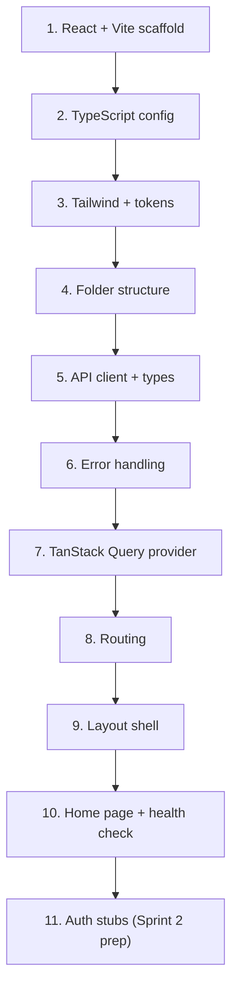
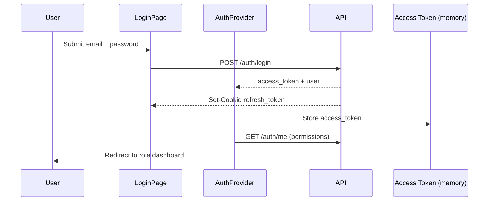

# Frontend Sprint 1 Execution Guide

## React Foundation — Implementation Steps Only

| Field | Value |
|-------|-------|
| **Document Version** | 1.0 |
| **Status** | Active |
| **Last Updated** | June 2026 |
| **Author** | Senior React Architecture |
| **Sprint** | 1 — Frontend foundation only |
| **Audience** | Solo frontend developer |
| **Authoritative References** | `PROJECT_STRUCTURE.md` §4 (frozen), `SPRINT_1_EXECUTION_GUIDE.md` §8, `API_DESIGN.md` §2, `IMPLEMENTATION_PLAN.md` §3, `AUTHENTICATION_ARCHITECTURE_GUIDE.md`, `BACKEND_SPRINT1_EXECUTION.md` |

---

## Purpose

This guide defines **implementation steps** to build the React SPA foundation before any login screens, feature modules, or clinical UI. It contains **no code** — only ordered actions, verification criteria, and architectural rules.

**Sprint 1 frontend delivers:**

- Vite + React 18 + TypeScript + TailwindCSS project
- Application shell (`AppLayout`, `AuthLayout` placeholder)
- React Router v6 with home and 404 routes
- Centralized API client matching backend response envelope
- TanStack Query provider wired (no feature queries yet)
- Design token placeholders
- Auth architecture **planned and stubbed** — not implemented until Sprint 2

**Sprint 1 frontend does not deliver:**

- Login, registration, or password reset screens
- `AuthProvider` with real token handling
- `ProtectedRoute` enforcement
- `features/*` domain modules
- `components/ui/` design system primitives (beyond layout shell)
- React Hook Form, Zod forms, or RBAC guards in use

**Estimated effort:** ~10 hours (matches `SPRINT_1_EXECUTION_GUIDE.md` Tasks FE-1 through FE-3).

---

## Prerequisites

- [ ] Backend Sprint 1 health endpoints running (`GET /api/v1/health`, `GET /api/v1/health/ready`)
- [ ] `BACKEND_SPRINT1_EXECUTION.md` API versioning confirmed — align `VITE_API_BASE_URL`
- [ ] Node.js 20 LTS installed
- [ ] `PROJECT_STRUCTURE.md` §4 frontend tree reviewed

---

## Master Setup Order

Build in this sequence. Each layer depends on the previous.



| Step | Section | Estimate |
|------|---------|----------|
| 1 | React setup | 1.5 hrs |
| 2 | TypeScript setup | 1 hr |
| 3 | Tailwind setup | 1.5 hrs |
| 4 | Folder usage guide (scaffold) | 1 hr |
| 5–6 | API integration + error handling | 2 hrs |
| 7 | State management strategy (providers) | 1 hr |
| 8–9 | Routing + layout architecture | 2 hrs |
| 10 | Auth architecture (stubs only) | 1 hr |

---

## 1. React Setup

### 1.1 Project initialization

| Step | Action | Detail |
|------|--------|--------|
| 1.1.1 | Scaffold Vite project inside `frontend/` | Template: **React + TypeScript** |
| 1.1.2 | Confirm React 18+ in `package.json` | Per `PROJECT_STRUCTURE.md` fixed stack |
| 1.1.3 | Use `frontend/` as package root — not nested subfolder | Matches monorepo layout |
| 1.1.4 | Create `index.html` at `frontend/` root with app mount point | Vite default |
| 1.1.5 | Create `src/main.tsx` as sole React DOM entry | Renders `App` inside `StrictMode` |

### 1.2 Core dependencies (Sprint 1)

| Package | Purpose | Sprint 1 |
|---------|---------|----------|
| `react`, `react-dom` | UI runtime | Install |
| `react-router-dom` v6 | Client routing | Install |
| `@tanstack/react-query` | Server state | Install — provider only |
| `axios` | HTTP client | Install — per `PROJECT_STRUCTURE.md` |
| `uuid` or `crypto.randomUUID` | Request ID generation | Install or use native |

**Defer to Sprint 2+:** `react-hook-form`, `zod`, `@hookform/resolvers`, chart libraries, date libraries (add when needed).

### 1.3 Dev dependencies

| Step | Action |
|------|--------|
| 1.3.1 | Install TypeScript, `@types/react`, `@types/react-dom` |
| 1.3.2 | Install ESLint + TypeScript ESLint parser |
| 1.3.3 | Install Prettier (optional but recommended) |
| 1.3.4 | Add npm scripts: `dev`, `build`, `preview`, `lint`, `typecheck` |

### 1.4 Vite configuration

| Step | Action |
|------|--------|
| 1.4.1 | Set dev server port to `5173` (Vite default) |
| 1.4.2 | Configure path alias `@/` → `src/` in `vite.config.ts` and `tsconfig.json` |
| 1.4.3 | Optional: proxy `/api` → `http://localhost:8000` to reduce CORS friction in dev |
| 1.4.4 | Ensure `import.meta.env` variables prefixed with `VITE_` only |

### 1.5 Environment files

| Step | Action |
|------|--------|
| 1.5.1 | Create `frontend/.env.example` with `VITE_API_BASE_URL=http://localhost:8000/api/v1` |
| 1.5.2 | Create `frontend/.env.local` from example (gitignored) |
| 1.5.3 | Document that production URL uses subdomain pattern per `API_DESIGN.md` §2.1 |

### 1.6 Verification

- [ ] `npm run dev` starts without errors at `http://localhost:5173`
- [ ] `npm run build` produces `dist/` without errors
- [ ] React 18 StrictMode enabled in `main.tsx`

---

## 2. TypeScript Setup

### 2.1 Compiler configuration

| Step | Action | Detail |
|------|--------|--------|
| 2.1.1 | Create `tsconfig.json` with `"strict": true` | Catch null/undefined early |
| 2.1.2 | Enable `"noUnusedLocals"` and `"noUnusedParameters"` | Clean codebase |
| 2.1.3 | Set `"moduleResolution": "bundler"` | Vite-compatible |
| 2.1.4 | Configure path alias: `"@/*": ["src/*"]` | Matches Vite alias |
| 2.1.5 | Create `tsconfig.node.json` for Vite config file | Separate Node context |

### 2.2 Vite environment types

| Step | Action |
|------|--------|
| 2.2.1 | Create or extend `src/vite-env.d.ts` |
| 2.2.2 | Declare `ImportMetaEnv` interface with `VITE_API_BASE_URL: string` |
| 2.2.3 | Never use `any` for API response data — use generics on `APIResponse<T>` |

### 2.3 Type organization strategy

| Location | Contents | Sprint 1 |
|----------|----------|----------|
| `src/api/types.ts` | API envelope types (`APIResponse`, `ErrorDetail`, `PaginationMeta`) | **Create** |
| `src/types/api.ts` | Re-export or shared API types if split later | Optional |
| `src/types/auth.ts` | `User`, `Role` interfaces | **Stub** — Sprint 2 |
| `src/types/tenant.ts` | `Tenant`, `Plan` interfaces | **Stub** — Sprint 2 |
| Feature types | `src/types/patient.ts`, etc. | **Defer** — Sprint 3+ |

### 2.4 TypeScript rules (enforce from day one)

| Rule | Rationale |
|------|-----------|
| No `any` in `src/api/` | Type-safe HTTP layer |
| Prefer `interface` for object shapes | Consistent with backend Pydantic models |
| Use `type` for unions and utility types | Status enums, role codes |
| Align field names with backend JSON | camelCase in TS matches API JSON (backend uses snake_case in DB, camelCase in API responses per convention — verify backend serializer; if backend returns snake_case, map in client) |
| Run `tsc --noEmit` in CI | Blocks type regressions |

> **Note:** Confirm backend JSON field casing in Sprint 1 health response. Configure axios transform or Pydantic `alias` strategy once and document the choice in sprint journal.

### 2.5 Verification

- [ ] `npm run typecheck` (or `tsc --noEmit`) passes
- [ ] `import.meta.env.VITE_API_BASE_URL` is typed — no TS error
- [ ] IDE resolves `@/` path imports

---

## 3. Tailwind Setup

### 3.1 Installation and configuration

| Step | Action |
|------|--------|
| 3.1.1 | Install TailwindCSS v3+, PostCSS, Autoprefixer |
| 3.1.2 | Create `tailwind.config.ts` with `content: ['./index.html', './src/**/*.{ts,tsx}']` |
| 3.1.3 | Create `postcss.config.js` with `tailwindcss` and `autoprefixer` plugins |
| 3.1.4 | Add Tailwind directives to `src/index.css`: `@tailwind base`, `@tailwind components`, `@tailwind utilities` |
| 3.1.5 | Import `index.css` in `src/main.tsx` |

### 3.2 Design tokens integration

| Step | Action |
|------|--------|
| 3.2.1 | Create `src/styles/tokens.ts` with placeholder values: primary, sidebar background, text, border, success, error |
| 3.2.2 | Extend `tailwind.config.ts` `theme.extend.colors` referencing token values |
| 3.2.3 | Extend `theme.extend.spacing` if custom sidebar width needed (e.g. `sidebar: '16rem'`) |
| 3.2.4 | Choose healthcare-appropriate palette: clean, professional, high contrast for clinical readability |

**Sprint 1 token placeholders (minimum):**

| Token | Usage |
|-------|-------|
| `primary` | Active nav, primary buttons |
| `sidebar` | Sidebar background |
| `surface` | Main content background |
| `text-primary` | Body text |
| `text-muted` | Secondary labels |
| `border` | Dividers, card borders |
| `success` / `error` / `warning` | Status badges (health check) |

### 3.3 Tailwind usage rules

| Rule | Detail |
|------|--------|
| Utility-first in components | No separate CSS modules in Sprint 1 |
| No arbitrary magic numbers | Use Tailwind scale or tokens |
| `components/ui/` primitives use Tailwind only | No inline styles except dynamic values |
| Desktop-first breakpoints | `lg:` as primary layout breakpoint (≥ 1024px) per `IMPLEMENTATION_PLAN.md` §3.2 |
| Mobile optimization | Defer to post-MVP |

### 3.4 Verification

- [ ] Tailwind classes apply on a test element (e.g. `bg-primary` or `text-blue-600`)
- [ ] Production build purges unused CSS (`dist/assets/*.css` reasonable size)
- [ ] `tokens.ts` values reflected in `tailwind.config.ts`

---

## 4. Routing Setup

### 4.1 Router library and mode

| Decision | Choice |
|----------|--------|
| Library | React Router v6 |
| Mode | `createBrowserRouter` + `RouterProvider` (data router API) **or** `BrowserRouter` + `Routes` — pick one, document in journal |
| Base path | `/` (SPA served from root; Nginx handles fallback in production) |
| Lazy loading | **Defer** to Sprint 12 — static imports in Sprint 1 |

### 4.2 Sprint 1 route table

| Path | Component | Layout | Auth |
|------|-----------|--------|------|
| `/` | Home / foundation status page | `AppLayout` | Public |
| `*` | NotFound (404) | `AppLayout` or minimal | Public |

**Do not register in Sprint 1:** `/login`, `/register`, `/dashboard`, `/patients/*`, or any feature route.

### 4.3 Route file structure

| Step | Action |
|------|--------|
| 4.3.1 | Create `src/routes/index.tsx` — central route definition |
| 4.3.2 | Export `router` or `AppRoutes` component consumed by `App.tsx` |
| 4.3.3 | Create placeholder files (empty export) for Sprint 2: `ProtectedRoute.tsx`, `PublicRoute.tsx`, `PermissionRoute.tsx` — **do not wire yet** |
| 4.3.4 | Create `RoleRedirect.tsx` stub — post-login landing logic in Sprint 2 |

### 4.4 Layout route nesting

| Step | Action |
|------|--------|
| 4.4.1 | Parent route uses `AppLayout` as element with `<Outlet />` for children |
| 4.4.2 | Child route `/` renders home page inside layout outlet |
| 4.4.3 | Wildcard `*` renders 404 inside same layout |

### 4.5 Future route planning (document only)

Record planned route prefixes per `PROJECT_STRUCTURE.md` §4.3 — implement in later sprints:

| Sprint | Routes |
|--------|--------|
| 2 | `/login`, `/register`, `/reset-password` |
| 3 | `/patients/*`, `/admin/staff`, `/admin/settings` |
| 4 | `/opd/*`, `/billing/*`, `/dashboard` |

### 4.6 Verification

- [ ] `/` renders home inside `AppLayout`
- [ ] `/unknown-path` renders 404
- [ ] Browser back/forward navigation works
- [ ] No route imports from `features/` (features do not exist yet)

---

## 5. Layout Architecture

### 5.1 Layout components (Sprint 1 scope)

| Component | File | Sprint 1 responsibility |
|-----------|------|-------------------------|
| `AppLayout` | `components/layout/AppLayout.tsx` | Sidebar + header + `<Outlet />` |
| `AuthLayout` | `components/layout/AuthLayout.tsx` | Centered card shell — **empty children placeholder** |
| `Sidebar` | `components/layout/Sidebar.tsx` | Static nav items, disabled links |
| `Header` | `components/layout/Header.tsx` | App title "HMS Platform", placeholder user area |
| `PageShell` | — | **Defer** — Sprint 3 |
| `LocationSelector` | — | **Defer** — Sprint 10 |

### 5.2 AppLayout implementation steps

| Step | Action |
|------|--------|
| 5.2.1 | Create two-column layout: fixed sidebar left, main content right |
| 5.2.2 | Sidebar width: `w-64` or token `sidebar` width |
| 5.2.3 | Sidebar nav items (static, non-functional): Dashboard, Patients, OPD, Billing, Admin |
| 5.2.4 | Mark nav items as disabled or `pointer-events-none` with muted style — indicate "coming soon" |
| 5.2.5 | Header bar above main content with app name |
| 5.2.6 | Main area renders `<Outlet />` with padding |
| 5.2.7 | Use Tailwind flex/grid — no absolute positioning for core structure |

### 5.3 AuthLayout implementation steps

| Step | Action |
|------|--------|
| 5.3.1 | Full-viewport centered layout |
| 5.3.2 | Card container with max-width for forms (Sprint 2 login) |
| 5.3.3 | Render `{children}` or `<Outlet />` — empty in Sprint 1 |
| 5.3.4 | Do not register auth routes yet — layout exists for Sprint 2 drop-in |

### 5.4 Responsive behavior (Sprint 1 minimum)

| Breakpoint | Behavior |
|------------|----------|
| `≥ 1024px` | Sidebar visible, full layout |
| `< 1024px` | Sidebar collapsed or hidden — acceptable degraded state for Sprint 1 |
| Mobile | Not optimized — document as known limitation |

### 5.5 Layout architecture rules

| Rule | Detail |
|------|--------|
| Layouts live in `components/layout/` | Not inside `features/` |
| Layouts may use `hooks/` and `providers/` | Not `features/` |
| No API calls in layout components | Except header notification count in Sprint 10 |
| Sidebar nav driven by role | Sprint 2+ — use static list in Sprint 1 |

### 5.6 Verification

- [ ] Home page visible inside `AppLayout` with sidebar and header
- [ ] `AuthLayout` renders in isolation if tested with temporary route (optional)
- [ ] No console errors on layout render
- [ ] Layout uses design tokens / Tailwind theme colors

---

## 6. Authentication Architecture

Sprint 1 **plans and stubs** auth — full implementation is Sprint 2 per `AUTHENTICATION_ARCHITECTURE_GUIDE.md`.

### 6.1 Security decisions (lock before Sprint 2)

| Decision | Rule | Source |
|----------|------|--------|
| Access token storage | **Memory only** — React state/context | Never `localStorage` or `sessionStorage` |
| Refresh token storage | **HttpOnly cookie** — browser manages automatically | Not accessible to JavaScript |
| Permissions in JWT | **No** — fetched via `GET /auth/me` | `SECURITY_ARCHITECTURE.md` |
| Token in URL | **Never** — no query param tokens | |
| `tenant_id` source | JWT claim after login — not from client body | `API_DESIGN.md` §2 |

### 6.2 Sprint 1 auth stubs to create

| File | Sprint 1 action |
|------|-----------------|
| `providers/AuthProvider.tsx` | Create file with placeholder context — exports `null` user, no-op `login`/`logout` |
| `providers/AppProviders.tsx` | Compose providers — AuthProvider included but inert |
| `hooks/useAuth.ts` | Return stub: `{ user: null, isAuthenticated: false, permissions: [] }` |
| `hooks/usePermissions.ts` | Return stub: `{ hasPermission: () => false }` |
| `routes/ProtectedRoute.tsx` | Export component that renders `<Outlet />` unconditionally in Sprint 1 |
| `components/shared/PermissionGuard.tsx` | **Defer** — Sprint 2 |

### 6.3 Planned auth flow (Sprint 2 reference)

Document this flow in sprint journal — implement in Sprint 2:



### 6.4 Planned token refresh flow (Sprint 2)

| Step | Behavior |
|------|----------|
| 1 | API client receives 401 on expired access token |
| 2 | Interceptor calls `POST /auth/refresh` (cookie sent automatically) |
| 3 | On success: store new access token in memory, retry original request |
| 4 | On failure: clear auth state, redirect to `/login` |
| 5 | Prevent infinite refresh loops — single retry per request |

### 6.5 Subdomain and tenant resolution

| Concern | Approach |
|---------|----------|
| Production URL | `https://{subdomain}.platform.com` |
| Local dev | `localhost:5173` with `X-Tenant-ID` or dev tenant in backend |
| Login page | Resolves tenant from subdomain before credential POST (Sprint 2) |
| Sprint 1 | No tenant context on frontend — health check is unauthenticated |

### 6.6 Auth provider composition order (Sprint 2 target)

| Order | Provider |
|-------|----------|
| 1 | `QueryClientProvider` |
| 2 | `AuthProvider` |
| 3 | `TenantProvider` |
| 4 | `NotificationProvider` |
| 5 | `RouterProvider` |

Sprint 1: only `QueryClientProvider` + stub `AuthProvider` + router.

### 6.7 Verification (Sprint 1)

- [ ] `useAuth()` callable without error — returns unauthenticated stub
- [ ] `ProtectedRoute` does not block any route yet
- [ ] No tokens stored in `localStorage` (audit DevTools Application tab)
- [ ] Auth architecture decisions documented in sprint journal

---

## 7. API Integration Strategy

### 7.1 Single gateway principle

| Rule | Detail |
|------|--------|
| All HTTP via `src/api/` | Features and pages never call `fetch` or `axios` directly |
| One axios instance | `src/api/client.ts` |
| Typed endpoints | `src/api/endpoints/{module}.ts` — one file per backend router |
| Base URL from env | `import.meta.env.VITE_API_BASE_URL` |
| API version in base URL | `http://localhost:8000/api/v1` — not repeated per endpoint |

### 7.2 API client implementation steps

| Step | Action |
|------|--------|
| 7.2.1 | Create `src/api/client.ts` — axios instance with `baseURL` from env |
| 7.2.2 | Set default headers: `Content-Type: application/json`, `Accept: application/json` |
| 7.2.3 | Request interceptor: generate or forward `X-Request-ID` header (UUID) |
| 7.2.4 | Response interceptor: unwrap `APIResponse<T>` envelope |
| 7.2.5 | If `errors` array present and non-empty — throw typed `ApiError` |
| 7.2.6 | Return `data` field to callers on success |
| 7.2.7 | **Sprint 1:** No `Authorization` header interceptor — add in Sprint 2 |

### 7.3 API types (`src/api/types.ts`)

| Type | Fields | Mirrors |
|------|--------|---------|
| `APIResponse<T>` | `data`, `meta`, `errors` | `API_DESIGN.md` §2.3 |
| `ResponseMeta` | `request_id`, `timestamp`, `tenant_id?`, `pagination?` | Backend meta |
| `ErrorDetail` | `code`, `field?`, `message` | Backend error objects |
| `PaginationMeta` | `page`, `page_size`, `total_items`, `total_pages` | List endpoints (stub) |

### 7.4 Sprint 1 endpoint modules

| File | Functions | Backend route |
|------|-----------|---------------|
| `api/endpoints/health.ts` | `getHealth()`, `getReady()` | `GET /health`, `GET /health/ready` |

**Path alignment:** Confirm with backend whether health is at `/api/v1/health` (recommended per `BACKEND_SPRINT1_EXECUTION.md`) — set `baseURL` accordingly so endpoint paths are `/health` not `/api/v1/health` twice.

### 7.5 TanStack Query integration (Sprint 1)

| Step | Action |
|------|--------|
| 7.5.1 | Create `QueryClient` with sensible defaults: `retry: 1`, `staleTime: 30_000` for health |
| 7.5.2 | Wrap app in `QueryClientProvider` in `AppProviders.tsx` |
| 7.5.3 | Home page uses `useQuery` to call `getHealth()` — demonstrates pattern |
| 7.5.4 | Feature hooks (`features/*/hooks/`) deferred — query defined inline on home page acceptable for Sprint 1 only |

### 7.6 Endpoint module conventions (future)

| Rule | Detail |
|------|--------|
| One file per backend router | `patients.ts` maps to `backend/api/v1/patients.py` |
| Export async functions | `getPatients(params)`, `createPatient(data)` |
| Return typed `data` only | Client unwraps envelope |
| No React imports in `api/` | Pure HTTP layer |

### 7.7 CORS and proxy

| Environment | Strategy |
|-------------|----------|
| Local with proxy | Vite proxies `/api` → backend — `VITE_API_BASE_URL=/api/v1` |
| Local without proxy | Full URL `http://localhost:8000/api/v1` — backend CORS must allow `5173` |
| Production | Same-origin or API subdomain with CORS configured |

### 7.8 Verification

- [ ] Health check succeeds when backend running
- [ ] `X-Request-ID` sent on requests (visible in Network tab)
- [ ] Response `meta.request_id` logged or displayed on home page
- [ ] No `fetch`/`axios` usage outside `src/api/`
- [ ] API errors throw `ApiError` with `code` and `message`

---

## 8. State Management Strategy

### 8.1 Two-tier state model

| State type | Tool | Location | Sprint 1 |
|------------|------|----------|----------|
| **Server state** | TanStack Query | `features/*/hooks/` (future); home page inline query for now | Wire provider + one query |
| **Client state** | React Context | `providers/` | Stub providers only |
| **URL state** | React Router | `routes/`, `useSearchParams` | Route path only |
| **Form state** | React Hook Form | Feature forms | **Defer** — Sprint 2+ |
| **Global UI** | Context or component state | Toast, modal | **Defer** |

**Do not add Redux, Zustand, or MobX** — stack decision is Query + Context per `IMPLEMENTATION_PLAN.md` §3.2.

### 8.2 Provider architecture

| Provider | Responsibility | Sprint 1 |
|----------|----------------|----------|
| `QueryClientProvider` | Server cache, mutations, refetch | **Implement** |
| `AuthProvider` | User, access token, login/logout | **Stub** |
| `TenantProvider` | Branding, plan, subdomain | **Defer** — Sprint 2 |
| `NotificationProvider` | Unread count | **Defer** — Sprint 10 |

### 8.3 AppProviders composition

| Step | Action |
|------|--------|
| 8.3.1 | Create `src/providers/AppProviders.tsx` |
| 8.3.2 | Accept `children` prop |
| 8.3.3 | Nest providers in documented order (Section 6.6) |
| 8.3.4 | Import `AppProviders` in `App.tsx` — single composition root |

### 8.4 Server state conventions (enforce from Sprint 2)

| Rule | Detail |
|------|--------|
| All GET requests via `useQuery` | Consistent caching |
| All POST/PUT/PATCH/DELETE via `useMutation` | With `onSuccess` invalidation |
| Query keys namespaced | `['patients', tenantId, filters]` |
| No server data in Context | Except auth user profile from `/auth/me` |
| Optimistic updates | Only where UX critical — billing, queue |

### 8.5 Client state conventions

| Data | Storage | Sprint |
|------|---------|--------|
| Access token | `AuthProvider` React state (memory) | 2 |
| Current user profile | `AuthProvider` | 2 |
| Permissions array | `AuthProvider` (from `/auth/me`) | 2 |
| Selected branch/location | `TenantProvider` or local state | 10 |
| Sidebar collapsed | `localStorage` acceptable | Optional |

### 8.6 Verification

- [ ] `QueryClientProvider` wraps app
- [ ] Home page health query shows loading, success, error states
- [ ] No redundant global state library in `package.json`
- [ ] `AppProviders` is single entry for all providers

---

## 9. Folder Usage Guide

### 9.1 Sprint 1 directory checklist

Create these paths in Sprint 1:

| Path | Sprint 1 contents |
|------|-------------------|
| `src/api/client.ts` | Axios instance |
| `src/api/types.ts` | Envelope types |
| `src/api/errors.ts` | ApiError class |
| `src/api/endpoints/health.ts` | Health functions |
| `src/components/layout/` | AppLayout, AuthLayout, Sidebar, Header |
| `src/providers/AppProviders.tsx` | Provider composition |
| `src/providers/AuthProvider.tsx` | Stub |
| `src/routes/index.tsx` | Route tree |
| `src/lib/constants.ts` | App name, API timeout |
| `src/styles/tokens.ts` | Design tokens |
| `src/pages/` or inline in routes | Home page — **prefer `src/pages/HomePage.tsx`** if not using features yet |

**Do not create in Sprint 1:**

| Path | Reason |
|------|--------|
| `src/features/*` | Sprint 2+ domain modules |
| `src/components/ui/*` | Design system — Sprint 2+ |
| `src/components/shared/*` | PermissionGuard etc. — Sprint 2+ |
| `src/api/endpoints/patients.ts` | No API yet |

> **Note:** `PROJECT_STRUCTURE.md` places pages under `features/*/pages/`. Until features exist, use `src/pages/` for the home screen **or** a minimal `src/features/foundation/pages/HomePage.tsx` — document choice in journal. Migrate to `features/` in Sprint 2.

### 9.2 Import rules (mandatory)

From `PROJECT_STRUCTURE.md` §4.2:

| Rule | Enforcement |
|------|-------------|
| `features/*` → may import `components/`, `api/`, `hooks/`, `lib/`, `types/`, `providers/` | ESLint `no-restricted-imports` in Sprint 3+ |
| `features/*` → must NOT import other `features/*` | Domain isolation |
| `components/ui/` → must NOT import `features/` or `api/` | Design system purity |
| `lib/` → must NOT import React | Pure functions |
| Pages → never import axios directly | Use `api/endpoints/` |

### 9.3 File naming conventions

| Item | Convention | Example |
|------|------------|---------|
| Components | PascalCase | `AppLayout.tsx` |
| Hooks | camelCase with `use` prefix | `useAuth.ts` |
| API endpoints | camelCase functions | `getHealth()` |
| Types / interfaces | PascalCase | `APIResponse` |
| Constants | SCREAMING_SNAKE in `constants.ts` | `APP_NAME` |
| Feature folders | lowercase plural | `features/patients/` |

### 9.4 Feature module pattern (Sprint 2+ reference)

When creating features, each module contains:

```
features/{domain}/
├── index.ts          # Public exports only
├── pages/            # Route-level screens
├── components/       # Private to feature
└── hooks/            # TanStack Query wrappers
```

### 9.5 Alignment with backend domains

| Frontend feature | Backend domain | API router |
|------------------|----------------|------------|
| `auth` | `identity`, `platform` | `auth.py` |
| `patients` | `patients` | `patients.py` |
| `opd` | `clinical` | `opd.py` |
| `admin` | `staff`, `platform` | `staff.py`, `subscription.py` |

### 9.6 Verification

- [ ] Folder structure matches Section 9.1 checklist
- [ ] No `features/` subfolders with implementation code
- [ ] All imports use `@/` alias where configured
- [ ] `lib/` files have zero React imports

---

## 10. Error Handling Strategy

### 10.1 Error sources

| Source | Handling layer |
|--------|----------------|
| HTTP 4xx/5xx with envelope | `api/client.ts` interceptor → `ApiError` |
| Network failure (no response) | `api/client.ts` → `NetworkError` |
| TanStack Query errors | Component `isError` + `error` state |
| React render errors | Error Boundary — **defer** to Sprint 2 |
| Form validation | Zod + RHF — **defer** to Sprint 2 |

### 10.2 ApiError model (`src/api/errors.ts`)

| Step | Action |
|------|--------|
| 10.2.1 | Create `ApiError` class extending `Error` |
| 10.2.2 | Properties: `status`, `code`, `message`, `field?`, `errors[]`, `requestId?` |
| 10.2.3 | Static factory: `fromEnvelope(status, body)` parses `errors` array |
| 10.2.4 | Create `NetworkError` for timeout / connection refused |

### 10.3 Axios interceptor behavior

| Response | Action |
|----------|--------|
| 2xx with `data` | Return unwrapped `data` to caller |
| 4xx/5xx with envelope | Throw `ApiError` |
| 4xx/5xx without JSON | Throw `ApiError` with generic message |
| No response (network) | Throw `NetworkError` |
| **Sprint 2:** 401 | Trigger refresh flow before throwing |

### 10.4 UI error display (Sprint 1)

| Context | Pattern |
|---------|---------|
| Home page health check | Show badge: Connected (green) / Disconnected (red) / Checking (spinner) |
| Error message | Display `error.message` — no stack trace to user |
| Request ID | Show `request_id` from meta for support debugging (collapsible) |
| Toast notifications | **Defer** — Sprint 2 (`components/ui/Toast.tsx`) |

### 10.5 Error handling rules

| Rule | Detail |
|------|--------|
| Never show raw API stack traces | User-friendly messages only |
| Log errors to console in dev only | Production: Sentry in Sprint 12 |
| Do not log PHI in error handlers | |
| Cross-tenant 404 | Display "Not found" — same as missing resource |
| Retry | TanStack Query `retry: 1` for transient failures; not for 4xx |

### 10.6 HTTP status mapping (UI behavior)

| Status | User-facing behavior (Sprint 2+) |
|--------|----------------------------------|
| 400 | Show validation summary |
| 401 | Redirect to login (after refresh fails) |
| 403 | "You don't have permission" |
| 404 | "Resource not found" |
| 409 | Show conflict message (duplicate) |
| 422 | Field-level form errors |
| 429 | "Too many requests — try again" |
| 500 | Generic error + request ID |

Sprint 1: only network and 5xx on health check need handling.

### 10.7 Verification

- [ ] Backend stopped → home shows disconnected/error state (not blank screen)
- [ ] Backend running → home shows healthy state
- [ ] Thrown `ApiError` includes `code` from envelope when present
- [ ] No unhandled promise rejections in browser console

---

## 11. App Entry Composition

### 11.1 `main.tsx` wiring order

| Order | Action |
|-------|--------|
| 1 | Import `index.css` |
| 2 | Import `App` |
| 3 | `createRoot` render `<StrictMode><App /></StrictMode>` |

### 11.2 `App.tsx` wiring order

| Order | Action |
|-------|--------|
| 1 | Wrap with `AppProviders` (QueryClient + stub Auth) |
| 2 | Render `RouterProvider` or route component from `routes/index.tsx` |

### 11.3 Home page content (Sprint 1)

| Element | Purpose |
|---------|---------|
| Title | "Sprint 1 — Foundation" |
| API status badge | Result of `getHealth()` query |
| Readiness status | Optional `getReady()` — DB connected |
| Backend `request_id` | Proves envelope parsing works |
| Static text | "Auth and features coming Sprint 2" |

---

## 12. Sprint 1 Acceptance Criteria

| # | Criterion | Verification |
|---|-----------|--------------|
| AC-1 | `npm run dev` starts without errors | Browser loads |
| AC-2 | `npm run build` succeeds | `dist/` output |
| AC-3 | `tsc --noEmit` passes | CI typecheck |
| AC-4 | `npm run lint` passes | ESLint clean |
| AC-5 | Home page renders inside `AppLayout` | Visual check |
| AC-6 | Health API call succeeds when backend up | Green status badge |
| AC-7 | Graceful error when backend down | Red/error badge, no crash |
| AC-8 | `VITE_API_BASE_URL` drives API base path | Change env, restart, confirm |
| AC-9 | No direct `fetch`/`axios` outside `src/api/` | Code search |
| AC-10 | No `features/` modules created | Folder check |
| AC-11 | No tokens in `localStorage` | DevTools audit |
| AC-12 | Folder structure aligns with `PROJECT_STRUCTURE.md` §4 | Review |

---

## 13. Sprint 1 Non-Goals

- Login, register, password reset pages
- Real `AuthProvider` with token storage
- `ProtectedRoute` blocking unauthenticated users
- `PermissionGuard` / role-based sidebar
- `components/ui/` button, input, modal library
- React Hook Form + Zod
- Any `features/*` module (patients, OPD, billing)
- Lazy route code splitting
- Sentry, analytics, PWA
- Mobile-responsive sidebar drawer
- Dark mode

---

## 14. Daily Execution Schedule (Suggested)

| Day | Focus | Deliverable |
|-----|-------|-------------|
| 1 | Sections 1–3 | Vite, TypeScript, Tailwind, tokens |
| 2 | Sections 4–5, 9 | Folders, routing, layout shell |
| 3 | Sections 6–8, 10 | API client, providers, errors, home page |

---

## 15. Related Documents

| Document | Use For |
|----------|---------|
| `PROJECT_STRUCTURE.md` §4 | Frozen folder layout and import rules |
| `BACKEND_SPRINT1_EXECUTION.md` | API paths and envelope format |
| `API_DESIGN.md` §2 | Headers, envelope, status codes |
| `AUTHENTICATION_ARCHITECTURE_GUIDE.md` | Sprint 2 auth implementation |
| `RBAC_DESIGN.md` §7.6 | PermissionGuard pattern (Sprint 2) |
| `IMPLEMENTATION_PLAN.md` §3 | Sprint-by-sprint UI roadmap |
| `SPRINT_1_EXECUTION_GUIDE.md` §8 | Full-stack sprint tasks |
| `DEVELOPMENT_CHECKLIST.md` | Pre-coding gate |

---

## Revision History

| Version | Date | Author | Changes |
|---------|------|--------|---------|
| 1.0 | June 2026 | Senior React Architecture | Initial frontend Sprint 1 execution guide |

---

*Implementation steps only — no code. Follow `PROJECT_STRUCTURE.md` (frozen) for folder layout. Auth implementation deferred to Sprint 2 per `AUTHENTICATION_ARCHITECTURE_GUIDE.md`.*
