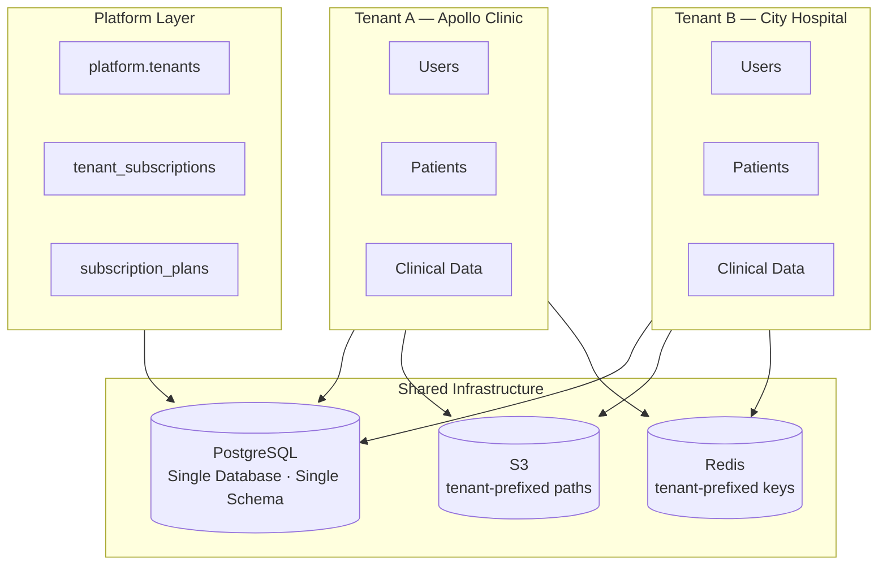
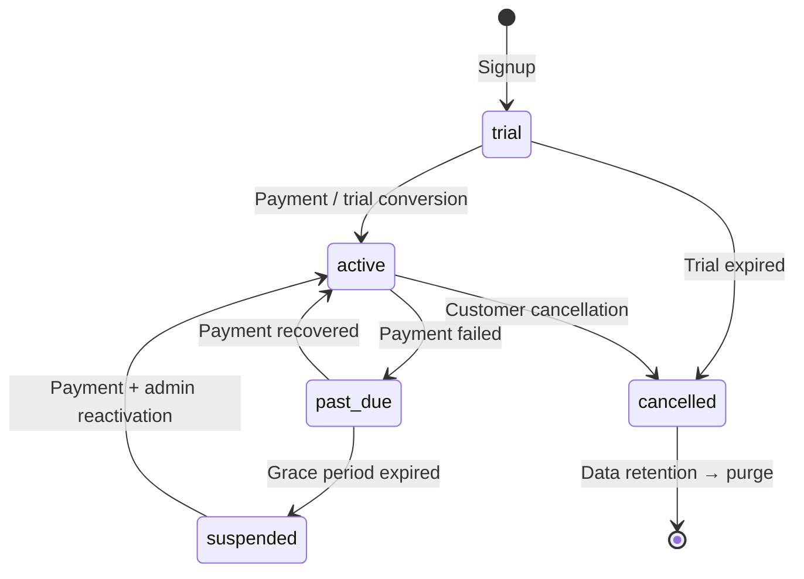
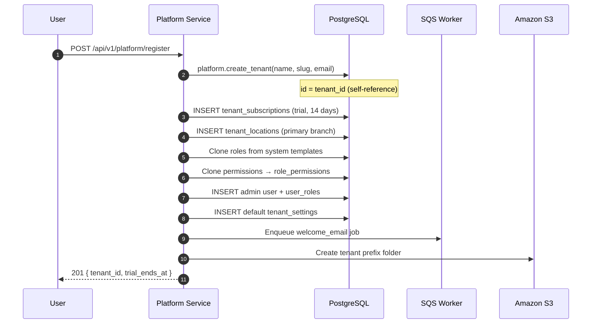
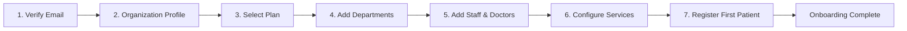
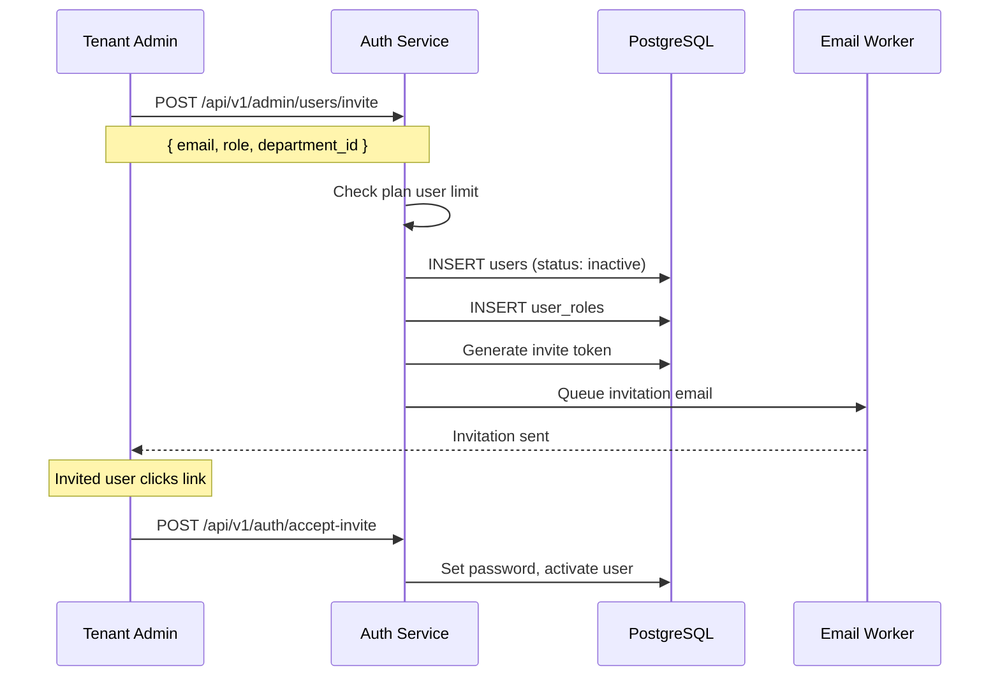
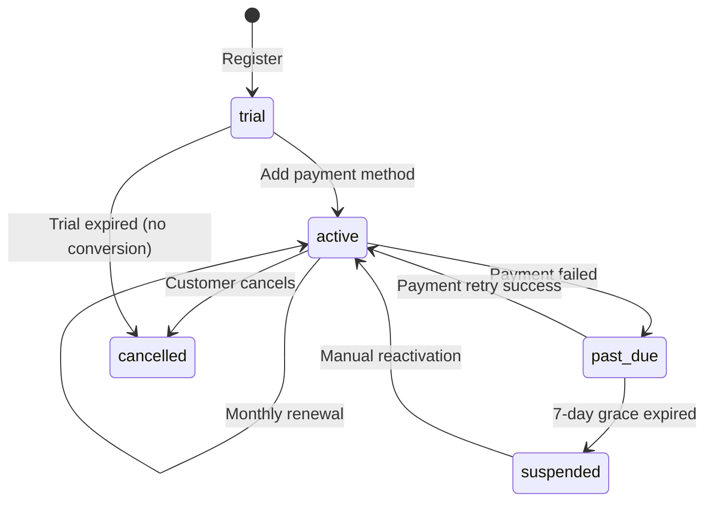
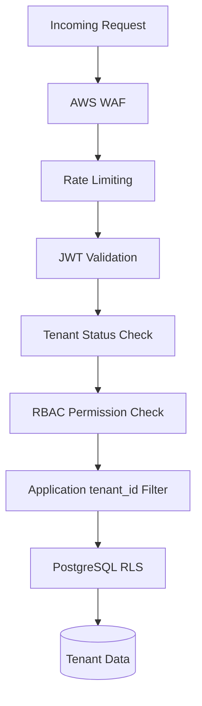
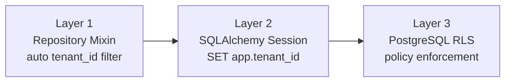
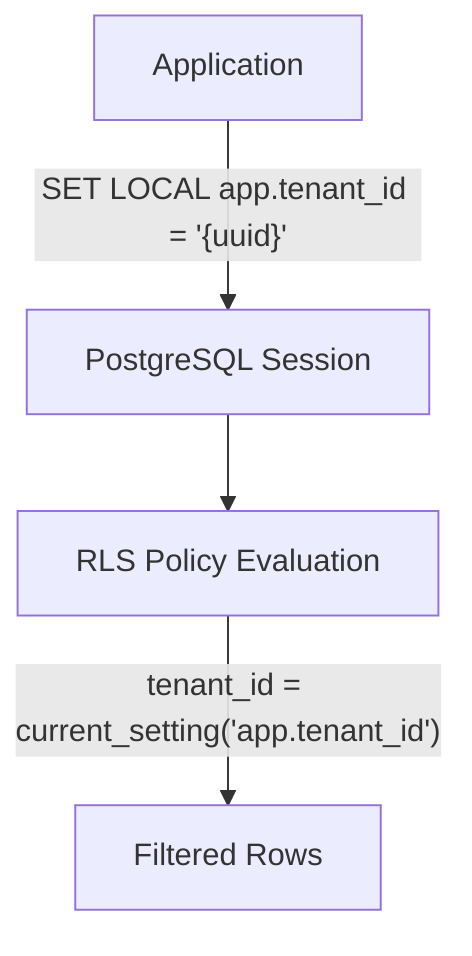
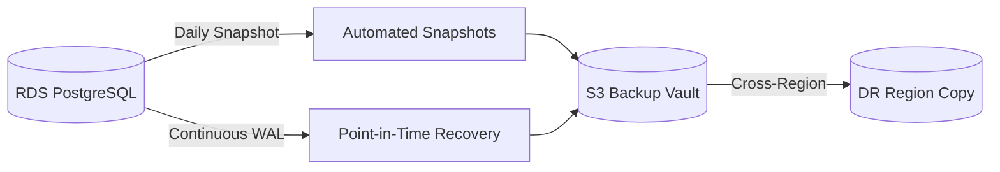

# Multi-Tenant Design Document

## Hospital Management SaaS Platform

| Field | Value |
|-------|-------|
| **Document Version** | 1.0 |
| **Status** | Draft |
| **Last Updated** | June 2026 |
| **Author** | SaaS Multi-Tenant Architecture |
| **Classification** | Internal — Engineering & Security |
| **Related Documents** | DATABASE_DESIGN.md, SYSTEM_ARCHITECTURE.md, SECURITY_ARCHITECTURE.md, RBAC_DESIGN.md, BILLING_SUBSCRIPTION.md |

---

## 1. Executive Summary

This document defines the **multi-tenancy strategy** for the Hospital Management SaaS Platform. The platform uses a **shared database, shared schema** model where all tenants coexist in a single PostgreSQL instance, with strict data isolation enforced by `tenant_id` at the application, ORM, and database (RLS) layers.

### 1.1 Tenancy Model Decision

| Approach | Selected | Rationale |
|----------|----------|-----------|
| Database per tenant | ❌ | High operational cost; impractical for SMB SaaS at scale |
| Schema per tenant | ❌ | Migration complexity grows linearly with tenant count |
| **Shared DB + shared schema + `tenant_id`** | ✅ | Cost-efficient, single migration path, proven at scale with RLS |
| Row-level siloing without `tenant_id` | ❌ | Insufficient isolation guarantees for healthcare data |

### 1.2 Isolation Guarantee

> **No tenant shall ever read, write, update, or delete another tenant's data — at any layer.**

Isolation is enforced through **defence in depth**: JWT tenant context → middleware → repository filters → composite foreign keys → PostgreSQL Row-Level Security (RLS).

### 1.3 Key Identifiers

| Identifier | Scope | Example |
|------------|-------|---------|
| `tenant_id` | Platform-wide UUID | `7c9e6679-7425-40de-944b-e07fc1f90ae7` |
| `mrn` | Unique per tenant | `MRN-2026-00042` |
| `email` (user) | Unique per tenant | `doctor@apollo.com` |
| `slug` | Unique platform-wide | `apollo-clinic` |
| `subdomain` | Unique platform-wide | `apollo` → `apollo.platform.com` |

### 1.4 System Tenant

A reserved system tenant holds platform-global seed data (subscription plans, default permissions, notification templates):

```
00000000-0000-0000-0000-000000000001
```

Real healthcare organizations always receive a newly generated UUID via `platform.create_tenant()`.

---

## 2. Tenant Architecture

### 2.1 Logical Architecture



### 2.2 Data Model Hierarchy

Every business table includes `tenant_id UUID NOT NULL` referencing `platform.tenants(id)`. Business keys (MRN, invoice number, employee code) are unique **within** a tenant, not globally.

```
platform.tenants (root)
│
├── platform.tenant_subscriptions
├── platform.tenant_locations
├── platform.tenant_settings
│
├── core.users, core.roles, core.patients, core.staff, core.doctors
├── clinical.appointments, clinical.opd_visits, clinical.admissions, clinical.beds
├── billing.invoices, billing.payments
├── pharmacy.medicines, pharmacy.dispense_records
├── laboratory.lab_orders, laboratory.lab_reports
├── comms.notifications
└── audit.audit_logs
```

### 2.3 Schema Layout (PostgreSQL)

| Schema | Tenant Scope | Purpose |
|--------|--------------|---------|
| `platform` | Cross-tenant + per-tenant rows | Tenant registry, subscriptions, settings |
| `core` | Per-tenant | Users, RBAC, patients, staff |
| `clinical` | Per-tenant | OPD, IPD, beds, appointments |
| `billing` | Per-tenant | Invoices, payments |
| `pharmacy` | Per-tenant | Medicines, inventory |
| `laboratory` | Per-tenant | Lab orders, reports |
| `comms` | Per-tenant | Notifications |
| `audit` | Per-tenant | Audit trail |

### 2.4 Tenant Resolution Paths

| Context | Resolution Method | Authority |
|---------|-------------------|-----------|
| Authenticated API request | `tenant_id` from JWT claim | **Authoritative** |
| Login / registration | Subdomain or slug lookup | Resolved → embedded in JWT |
| Background worker job | `tenant_id` in SQS message payload | Set per job execution |
| Platform admin API | Explicit `tenant_id` param (admin role only) | Audited access |

**Example — subdomain resolution:**

```
https://apollo.platform.com/login
         ↓
Host: apollo.platform.com
         ↓
SELECT id FROM platform.tenants
WHERE subdomain = 'apollo' AND status IN ('trial', 'active');
         ↓
tenant_id = 7c9e6679-7425-40de-944b-e07fc1f90ae7
```

### 2.5 Tenant States



| Status | Data Access | Billing |
|--------|-------------|---------|
| `trial` | Full (within plan limits) | No charge |
| `active` | Full | Charged |
| `past_due` | Full (grace period) | Retry in progress |
| `suspended` | Read-only or blocked | Overdue |
| `cancelled` | Export window only | Stopped |

---

## 3. Tenant Provisioning

Tenant provisioning is the **automated creation** of all resources required for a new healthcare organization to operate on the platform.

### 3.1 Provisioning Flow



### 3.2 Provisioning Steps

| Step | Action | Tables Affected |
|------|--------|-----------------|
| 1 | Create tenant root record | `platform.tenants` |
| 2 | Assign trial subscription | `platform.tenant_subscriptions` |
| 3 | Create primary location | `platform.tenant_locations` |
| 4 | Seed default settings | `platform.tenant_settings` |
| 5 | Clone system roles | `core.roles`, `core.role_permissions` |
| 6 | Create admin user | `core.users`, `core.user_roles` |
| 7 | Initialize S3 prefix | `s3://bucket/tenants/{tenant_id}/` |
| 8 | Send verification email | `comms.notification_delivery_log` |

### 3.3 Database Example — Create Tenant

```sql
-- Creates tenant with id = tenant_id (required for self-referencing FK)
SELECT platform.create_tenant(
    p_name     => 'Apollo Clinic',
    p_slug     => 'apollo-clinic',
    p_email    => 'admin@apollo.com',
    p_country  => 'IN',
    p_timezone => 'Asia/Kolkata',
    p_currency => 'INR'
);
-- Returns: 7c9e6679-7425-40de-944b-e07fc1f90ae7
```

### 3.4 Role Seeding Example

When a tenant is provisioned, system roles are **cloned** (not shared) so each tenant can customize permissions independently.

```sql
-- Pseudocode: clone roles from system tenant to new tenant
INSERT INTO core.roles (tenant_id, name, code, is_system, is_active)
SELECT
    :new_tenant_id,
    name,
    code,
    TRUE,
    TRUE
FROM core.roles
WHERE tenant_id = '00000000-0000-0000-0000-000000000001'
  AND deleted_at IS NULL;
```

**Default roles cloned:**

| Role Code | Description |
|-----------|-------------|
| `tenant_admin` | Full tenant administration |
| `doctor` | Clinical workflows |
| `receptionist` | Front desk, appointments |
| `nurse` | IPD nursing |
| `billing_staff` | Invoicing and payments |
| `lab_technician` | Laboratory operations |
| `pharmacist` | Pharmacy dispensing |

### 3.5 Provisioning SLA

| Metric | Target |
|--------|--------|
| Automated provisioning time | < 5 minutes |
| Time to first login | < 10 minutes |
| Time to first patient record | < 4 hours (with onboarding wizard) |

### 3.6 Provisioning Idempotency

Registration requests include an **idempotency key** (`X-Idempotency-Key` header) to prevent duplicate tenants on network retries:

```python
# FastAPI example
@router.post("/register")
async def register_tenant(
    payload: TenantRegisterRequest,
    idempotency_key: str = Header(..., alias="X-Idempotency-Key"),
):
    existing = await cache.get(f"provision:{idempotency_key}")
    if existing:
        return JSONResponse(status_code=200, content=existing)

    tenant = await platform_service.provision_tenant(payload)
    await cache.set(f"provision:{idempotency_key}", tenant, ttl=86400)
    return tenant
```

---

## 4. Tenant Onboarding

Onboarding is the **guided setup** after provisioning that configures the tenant for daily operations.

### 4.1 Onboarding Wizard Steps



| Step | User Action | Configuration Created |
|------|-------------|---------------------|
| 1. Verify email | Click verification link | `users.email_verified_at` set |
| 2. Organization profile | Logo, address, tax ID | `tenants.*`, `tenant_settings` |
| 3. Select plan | Choose Starter / Professional | `tenant_subscriptions` (if converting early) |
| 4. Departments | Add OPD, IPD, Lab, etc. | `core.departments` |
| 5. Staff & doctors | Invite team members | `core.staff`, `core.doctors`, `core.users` |
| 6. Service master | Consultation fees, procedures | `billing.billing_services` |
| 7. First patient | Register a test patient | `core.patients` |

### 4.2 Onboarding Progress Tracking

Stored in `platform.tenant_settings`:

```json
{
  "setting_key": "onboarding_progress",
  "setting_value": {
    "email_verified": true,
    "profile_complete": true,
    "departments_added": true,
    "staff_invited": false,
    "services_configured": false,
    "first_patient_registered": false,
    "completed_at": null
  }
}
```

### 4.3 Staff Invitation Flow



**Example invite API payload:**

```json
{
  "email": "dr.patel@apollo.com",
  "first_name": "Vikram",
  "last_name": "Patel",
  "role_code": "doctor",
  "department_id": "a1b2c3d4-e5f6-7890-abcd-ef1234567890"
}
```

### 4.4 Trial Limitations

During trial, enforced limits prevent abuse:

| Resource | Trial Limit | Enforcement Point |
|----------|-------------|-------------------|
| Users | 5 | User creation API |
| Patients | 100 | Patient creation API |
| Locations | 1 | Location creation API |
| Storage | 1 GB | S3 upload pre-check |

**Example enforcement:**

```python
async def create_patient(tenant_id: UUID, data: PatientCreate, db: Session):
    subscription = await get_active_subscription(tenant_id, db)
    if subscription.status == "trial":
        count = await count_patients(tenant_id, db)
        if count >= 100:
            raise PlanLimitExceeded("Trial limit: 100 patients. Upgrade to add more.")
    return await patient_repo.create(tenant_id, data, db)
```

### 4.5 Data Migration Onboarding

Tenants migrating from legacy systems can import patients via CSV:

```
POST /api/v1/patients/import
Content-Type: multipart/form-data

file: patients.csv
```

Import runs as an async job with per-row validation; errors reported without partial silent failures.

---

## 5. Tenant Subscription Management

Subscription management links **tenant access** to **commercial plans** and enforces resource limits.

### 5.1 Subscription Data Model

```
subscription_plans (system tenant)
        │
        ▼
tenant_subscriptions (per tenant, historical rows retained)
        │
        ▼
Plan limit enforcement (users, beds, patients, modules)
```

### 5.2 Subscription Lifecycle



### 5.3 Plan Tiers and Limits

| Plan | Monthly Price | Users | Beds | Modules |
|------|--------------|-------|------|---------|
| Starter | ₹4,999 | 10 | — | OPD, Patient, Billing |
| Professional | ₹14,999 | 50 | 50 | + IPD, Lab, Pharmacy |
| Enterprise | Custom | 200+ | 200+ | Full suite + API |

**Plan features stored as JSONB:**

```json
{
  "modules": {
    "opd": true,
    "ipd": true,
    "laboratory": true,
    "pharmacy": true,
    "reports_advanced": false,
    "api_access": false
  }
}
```

### 5.4 Limit Enforcement Matrix

| Limit | Check Trigger | HTTP Response |
|-------|---------------|---------------|
| Max users | `POST /admin/users`, login (active count) | `402 Payment Required` |
| Max beds | `POST /clinical/beds`, `POST /admissions` | `402` |
| Max patients | `POST /patients` (trial only) | `402` |
| Module access | Any module-specific endpoint | `403 Forbidden` |
| Suspended tenant | Any authenticated endpoint | `403 Tenant Suspended` |

**Example middleware check:**

```python
async def subscription_middleware(request: Request, call_next):
    tenant_id = request.state.tenant_id
    subscription = await get_subscription(tenant_id)

    if subscription.status == "suspended":
        return JSONResponse(status_code=403, content={
            "error": "tenant_suspended",
            "message": "Your account is suspended due to overdue payment."
        })

    if subscription.status == "cancelled":
        return JSONResponse(status_code=403, content={
            "error": "tenant_cancelled",
            "message": "This account has been cancelled."
        })

    request.state.subscription = subscription
    return await call_next(request)
```

### 5.5 Billing Integration

| Event | Action |
|-------|--------|
| Trial day 11 | Email: "3 days left in trial" |
| Trial day 13 | Email: "Add payment method" |
| Trial day 14 | Block access if no payment method |
| Renewal date | Charge via Razorpay/Stripe |
| Payment failed | Status → `past_due`; retry 3× over 7 days |
| Grace expired | Status → `suspended` |
| Cancellation | Status → `cancelled`; 90-day data retention |

### 5.6 Plan Upgrade Example

```json
POST /api/v1/platform/subscription/upgrade
{
  "plan_code": "professional",
  "billing_cycle": "annual"
}

Response 200:
{
  "data": {
    "previous_plan": "starter",
    "new_plan": "professional",
    "effective_immediately": true,
    "prorated_charge": 8499.00,
    "new_period_end": "2027-06-17T00:00:00Z"
  }
}
```

---

## 6. Tenant Security

### 6.1 Security Layers



### 6.2 Tenant Security Controls

| Control | Implementation |
|---------|----------------|
| Tenant context from JWT only | `tenant_id` in request body/URL ignored for data access |
| Subscription status gate | Suspended/cancelled tenants blocked at middleware |
| Cross-tenant IDOR prevention | Composite FKs + tenant_id in all queries |
| Platform admin isolation | Separate auth realm; no default clinical access |
| Break-glass support access | Time-limited impersonation token; full audit |
| Tenant-scoped encryption keys | SSE-KMS with per-tenant key (Enterprise tier) |
| Session binding | Refresh tokens tied to `tenant_id` + `user_id` |

### 6.3 JWT Tenant Binding

Access tokens are **cryptographically bound** to a tenant. A token issued for Tenant A cannot access Tenant B data even if the user somehow has credentials in both tenants (separate user records per tenant).

```json
{
  "sub": "user-uuid-tenant-a",
  "tenant_id": "7c9e6679-7425-40de-944b-e07fc1f90ae7",
  "roles": ["doctor"],
  "permissions": ["patient:read", "opd:create"]
}
```

### 6.4 Impersonation (Support) Example

```python
# Platform support with tenant consent — fully audited
@router.post("/platform/support/impersonate")
@requires_platform_admin
async def impersonate(tenant_id: UUID, reason: str, db: Session):
    audit_log(action="impersonate_start", tenant_id=tenant_id, reason=reason)
    token = create_impersonation_token(
        tenant_id=tenant_id,
        expires_in=3600,  # 1 hour max
        scope="read_only",  # or "full" with extra approval
    )
    return {"access_token": token, "expires_in": 3600}
```

### 6.5 Security Monitoring

| Event | Alert |
|-------|-------|
| Cross-tenant query returns rows | P1 — immediate |
| `tenant_id` mismatch in JWT vs. subdomain | P2 — investigate |
| Repeated 403 from same user | P3 — possible privilege probe |
| Tenant data export requested | Audit + notify tenant admin |

---

## 7. Query Filtering Strategy

### 7.1 Filtering Principles

| Rule | Description |
|------|-------------|
| **Rule 1** | Every SELECT, UPDATE, DELETE includes `tenant_id` in WHERE clause |
| **Rule 2** | Every INSERT sets `tenant_id` from request context — never from client input |
| **Rule 3** | JOINs include `tenant_id` equality on both sides |
| **Rule 4** | Raw SQL is prohibited in application code; use repository layer |
| **Rule 5** | Background jobs explicitly set tenant context before DB access |

### 7.2 Three-Layer Filtering



### 7.3 Repository Pattern Example (Python / SQLAlchemy)

```python
class TenantScopedRepository:
    def __init__(self, db: Session, tenant_id: UUID):
        self.db = db
        self.tenant_id = tenant_id

    def _base_query(self, model):
        return (
            self.db.query(model)
            .filter(model.tenant_id == self.tenant_id)
            .filter(model.deleted_at.is_(None))
        )

    def get_patient_by_mrn(self, mrn: str) -> Patient | None:
        return self._base_query(Patient).filter(Patient.mrn == mrn).first()

    def search_patients(self, query: str, limit: int = 20) -> list[Patient]:
        return (
            self._base_query(Patient)
            .filter(
                or_(
                    Patient.first_name.ilike(f"%{query}%"),
                    Patient.phone == query,
                    Patient.mrn == query,
                )
            )
            .limit(limit)
            .all()
        )
```

### 7.4 Session Context Example

Before any query executes, the database session sets the tenant context for RLS:

```python
@contextmanager
def tenant_db_session(db: Session, tenant_id: UUID):
    db.execute(text("SET LOCAL app.tenant_id = :tid"), {"tid": str(tenant_id)})
    try:
        yield db
        db.commit()
    except Exception:
        db.rollback()
        raise
```

### 7.5 JOIN Example — Correct vs. Incorrect

**Correct — tenant_id on both sides:**

```sql
SELECT v.visit_number, p.mrn, p.first_name
FROM clinical.opd_visits v
JOIN core.patients p
  ON p.tenant_id = v.tenant_id
 AND p.id = v.patient_id
WHERE v.tenant_id = :tenant_id
  AND v.deleted_at IS NULL;
```

**Incorrect — missing tenant_id on JOIN (vulnerable to cross-tenant leak if IDs collide across tenants):**

```sql
-- NEVER DO THIS
SELECT v.visit_number, p.first_name
FROM clinical.opd_visits v
JOIN core.patients p ON p.id = v.patient_id
WHERE v.tenant_id = :tenant_id;
```

### 7.6 Background Job Example

```python
async def process_appointment_reminders(message: dict):
    tenant_id = UUID(message["tenant_id"])  # Required in every job payload

    with tenant_db_session(get_db(), tenant_id) as db:
        appointments = (
            db.query(Appointment)
            .filter(Appointment.tenant_id == tenant_id)
            .filter(Appointment.appointment_date == tomorrow)
            .all()
        )
        for appt in appointments:
            await send_reminder(tenant_id, appt)
```

### 7.7 Cache Key Isolation

```python
# All cache keys are tenant-prefixed
def cache_key(tenant_id: UUID, namespace: str, key: str) -> str:
    return f"tenant:{tenant_id}:{namespace}:{key}"

# Example
permissions = await redis.get(cache_key(tenant_id, "permissions", user_id))
```

---

## 8. Row Level Security (RLS)

PostgreSQL RLS provides a **database-level safety net** that enforces tenant isolation even if application code has a bug.

### 8.1 RLS Architecture



### 8.2 Policy Definition

Applied to all 61 tenant-scoped tables:

```sql
-- Enable RLS (FORCE ensures table owner is also subject to policies)
ALTER TABLE core.patients ENABLE ROW LEVEL SECURITY;
ALTER TABLE core.patients FORCE ROW LEVEL SECURITY;

CREATE POLICY tenant_isolation_select ON core.patients
    FOR SELECT
    USING (tenant_id = current_setting('app.tenant_id', true)::uuid);

CREATE POLICY tenant_isolation_insert ON core.patients
    FOR INSERT
    WITH CHECK (tenant_id = current_setting('app.tenant_id', true)::uuid);

CREATE POLICY tenant_isolation_update ON core.patients
    FOR UPDATE
    USING (tenant_id = current_setting('app.tenant_id', true)::uuid)
    WITH CHECK (tenant_id = current_setting('app.tenant_id', true)::uuid);

CREATE POLICY tenant_isolation_delete ON core.patients
    FOR DELETE
    USING (tenant_id = current_setting('app.tenant_id', true)::uuid);
```

### 8.3 RLS Behaviour Examples

**Example 1 — Correct context returns only tenant rows:**

```sql
SET app.tenant_id = '7c9e6679-7425-40de-944b-e07fc1f90ae7';

SELECT COUNT(*) FROM core.patients;
-- Returns: 1,250 (only Apollo Clinic patients)
```

**Example 2 — Wrong context returns zero rows (not an error):**

```sql
SET app.tenant_id = '00000000-0000-0000-0000-000000000099';

SELECT * FROM core.patients WHERE mrn = 'MRN-2026-00001';
-- Returns: 0 rows (patient exists in different tenant but RLS hides it)
```

**Example 3 — Missing context returns zero rows:**

```sql
RESET app.tenant_id;

SELECT COUNT(*) FROM core.patients;
-- Returns: 0 (fail-safe default)
```

### 8.4 Platform Admin Bypass

Platform administrators use a dedicated database role with `BYPASSRLS` for tenant management operations only (never for routine clinical access):

```sql
CREATE ROLE platform_admin BYPASSRLS;
-- Granted only to break-glass migration and support tooling
-- All usage logged in audit.audit_logs
```

### 8.5 RLS + Application Layer Defence

| Scenario | Application Layer | RLS Layer | Result |
|----------|-------------------|-----------|--------|
| Correct tenant_id in query | Returns rows | Allows rows | ✅ Data returned |
| Missing tenant_id in query | Returns all rows (bug) | Filters to session tenant | ✅ Still safe |
| Wrong tenant_id in query | Returns 0 rows | Returns 0 rows | ✅ No leak |
| SQL injection bypassing app | Unfiltered query | Filters to session tenant | ✅ Mitigated |
| Missing `SET app.tenant_id` | Any query | Returns 0 rows | ✅ Fail-safe |

### 8.6 RLS Testing Requirement

Every CI pipeline run includes automated isolation tests:

```python
def test_cross_tenant_isolation(db, tenant_a, tenant_b, patient_in_a):
    # Set context to Tenant B
    db.execute(text("SET LOCAL app.tenant_id = :tid"), {"tid": str(tenant_b.id)})

    # Attempt to read Tenant A patient by ID
    result = db.query(Patient).filter(Patient.id == patient_in_a.id).first()
    assert result is None  # RLS must hide the row
```

---

## 9. Backup Strategy

### 9.1 Backup Architecture

All tenants share backup infrastructure. Tenant data is restorable individually via `tenant_id` filtering during export/restore operations.



### 9.2 Backup Schedule

| Backup Type | Frequency | Retention | Scope |
|-------------|-----------|-----------|-------|
| Continuous WAL archiving | Real-time | 30 days | All tenants |
| Automated RDS snapshot | Daily | 30 days | All tenants |
| Manual pre-release snapshot | On demand | 90 days | All tenants |
| S3 file versioning | Real-time | Per retention policy | Per-tenant paths |
| S3 cross-region replication | Continuous | 30 days | All tenant files |
| Redis snapshot | Daily | 7 days | Cache (non-authoritative) |

### 9.3 Recovery Scenarios

| Scenario | Method | RPO | RTO |
|----------|--------|-----|-----|
| Accidental row deletion (single tenant) | PITR to staging → export by `tenant_id` → re-import | 1 hour | 4 hours |
| Database corruption | Restore latest snapshot | 24 hours | 2 hours |
| Full region failure | Promote DR replica | 1 hour | 4 hours |
| Single tenant data export request | `tenant_data_export` job | 0 | 24 hours |
| Tenant cancellation | 90-day retention → purge job | — | — |

### 9.4 Per-Tenant Export Example

```sql
-- Export all patient data for a single tenant (run in export worker)
COPY (
    SELECT id, mrn, first_name, last_name, date_of_birth, phone, email, created_at
    FROM core.patients
    WHERE tenant_id = '7c9e6679-7425-40de-944b-e07fc1f90ae7'
      AND deleted_at IS NULL
) TO '/tmp/tenant_export/patients.csv' WITH CSV HEADER;
```

### 9.5 Per-Tenant Purge (Offboarding)

After 90-day retention post-cancellation:

```sql
-- Executed by automated purge job with platform admin role
-- Order: children first, respecting FK constraints

DELETE FROM billing.payment_allocations WHERE tenant_id = :tenant_id;
DELETE FROM billing.payments WHERE tenant_id = :tenant_id;
DELETE FROM billing.invoices WHERE tenant_id = :tenant_id;
-- ... all child tables ...
DELETE FROM core.users WHERE tenant_id = :tenant_id;
DELETE FROM platform.tenant_settings WHERE tenant_id = :tenant_id;
DELETE FROM platform.tenants WHERE id = :tenant_id;

-- S3: delete prefix s3://bucket/tenants/{tenant_id}/
-- Audit logs: anonymize PII, retain tenant_id for compliance
```

### 9.6 Backup Security

| Control | Implementation |
|---------|----------------|
| Encryption at rest | RDS encryption (AES-256), S3 SSE |
| Access control | IAM roles; no developer direct snapshot access in prod |
| Backup testing | Monthly restore to staging; verify row counts per tenant |
| Audit | All export/purge operations logged in `audit.audit_logs` |

---

## 10. Data Isolation

### 10.1 Isolation Domains

| Domain | Isolation Mechanism | Example |
|--------|---------------------|---------|
| **Database rows** | `tenant_id` + RLS | Patients, invoices, lab results |
| **File storage** | S3 path prefix | `tenants/{tenant_id}/patients/` |
| **Cache** | Redis key prefix | `tenant:{tenant_id}:permissions:{user_id}` |
| **Search indexes** | Tenant-scoped queries | Patient search within tenant only |
| **Background jobs** | `tenant_id` in message payload | Appointment reminders per tenant |
| **Logs** | `tenant_id` field in JSON logs | Filterable per tenant |
| **Metrics** | `tenant_id` label on Prometheus | Per-tenant API usage |
| **Reports** | Generated with single tenant context | Daily collection report |

### 10.2 Composite Foreign Keys

Prevent referencing a record that belongs to a different tenant:

```sql
ALTER TABLE clinical.opd_visits
    ADD CONSTRAINT fk_opd_visits_patient
    FOREIGN KEY (tenant_id, patient_id)
    REFERENCES core.patients (tenant_id, id);
```

**Attack prevented:**

```
Tenant B user somehow obtains Tenant A patient UUID.
Tenant B tries: INSERT opd_visit (tenant_id=B, patient_id=A_patient_id)
Result: FK violation — patient (A, A_patient_id) does not match tenant B
```

### 10.3 Unique Constraints Per Tenant

Business keys are unique within a tenant, not globally:

```sql
CREATE UNIQUE INDEX uq_patients_tenant_mrn
    ON core.patients (tenant_id, mrn);

-- Tenant A: MRN-2026-00001 ✅
-- Tenant B: MRN-2026-00001 ✅  (same MRN, different tenants — allowed)
```

### 10.4 S3 Isolation Example

```
s3://hms-prod-files/tenants/7c9e6679-.../patients/abc-uuid/documents/report.pdf
s3://hms-prod-files/tenants/9f8e7768-.../patients/def-uuid/documents/report.pdf
```

Pre-signed URLs are generated server-side with tenant-validated paths; clients cannot request paths outside their tenant prefix.

### 10.5 Noisy Neighbor Mitigation

| Control | Limit |
|---------|-------|
| API rate limit | 1,000 requests/minute/tenant |
| DB query timeout | 30 seconds |
| Export job concurrency | 1 per tenant |
| Report generation | Queue-based; fair scheduling |
| Connection pool | PgBouncer per-service pooling |

---

## 11. Cross-Tenant Protection

### 11.1 Threat Model

| Threat | Vector | Mitigation |
|--------|--------|------------|
| **T1: IDOR** | Manipulate resource UUID in API URL | tenant_id filter + RLS; return 404 not 403 |
| **T2: JWT tampering** | Modify tenant_id claim | RS256 signature verification |
| **T3: Subdomain spoofing** | Access wrong subdomain | JWT tenant_id is authoritative post-login |
| **T4: SQL injection** | Bypass application filters | Parameterized queries + RLS |
| **T5: Cache poisoning** | Cross-tenant cache key | Mandatory tenant prefix on all keys |
| **T6: File path traversal** | `../other-tenant/` in upload | Server-side key generation only |
| **T7: Worker job injection** | Missing tenant_id in job | Job validator rejects messages without tenant_id |
| **T8: Report data leak** | Multi-tenant aggregation bug | Single-tenant context per report execution |
| **T9: Support abuse** | Platform admin reads clinical data | Impersonation requires consent + audit |
| **T10: Backup restore leak** | Full DB restore to wrong env | Environment isolation; staging uses masked data |

### 11.2 IDOR Protection Example

```python
@router.get("/api/v1/patients/{patient_id}")
@requires_permission("patient:read")
async def get_patient(patient_id: UUID, request: Request, db: Session):
    tenant_id = request.state.tenant_id  # From JWT — not from URL

    patient = (
        db.query(Patient)
        .filter(Patient.tenant_id == tenant_id)  # Mandatory
        .filter(Patient.id == patient_id)
        .filter(Patient.deleted_at.is_(None))
        .first()
    )

    if not patient:
        raise HTTPException(status_code=404, detail="Patient not found")
        # 404 — not 403 — to avoid confirming existence in other tenants

    return patient
```

### 11.3 Automated Isolation Test Suite

```python
class TestCrossTenantIsolation:
    """Run on every CI build."""

    def test_patient_read_isolation(self, client, token_tenant_a, token_tenant_b, patient_a):
        # Tenant B token cannot read Tenant A patient
        response = client.get(
            f"/api/v1/patients/{patient_a.id}",
            headers={"Authorization": f"Bearer {token_tenant_b}"},
        )
        assert response.status_code == 404

    def test_patient_list_no_leak(self, client, token_tenant_b, patient_a):
        response = client.get(
            "/api/v1/patients",
            headers={"Authorization": f"Bearer {token_tenant_b}"},
        )
        patient_ids = [p["id"] for p in response.json()["data"]]
        assert str(patient_a.id) not in patient_ids

    def test_rls_direct_sql(self, db, tenant_a, tenant_b, patient_a):
        db.execute(text("SET LOCAL app.tenant_id = :tid"), {"tid": str(tenant_b.id)})
        row = db.execute(
            text("SELECT id FROM core.patients WHERE id = :pid"),
            {"pid": str(patient_a.id)},
        ).fetchone()
        assert row is None
```

### 11.4 Cross-Tenant Protection Checklist

| # | Control | Layer | Verified By |
|---|---------|-------|-------------|
| 1 | JWT `tenant_id` claim validated | API | Unit test |
| 2 | `tenant_id` never from client body | API | Code review + lint rule |
| 3 | Repository auto-filter | Application | Unit test |
| 4 | `SET LOCAL app.tenant_id` per transaction | Database session | Integration test |
| 5 | RLS policies on all 61 tables | Database | Migration test |
| 6 | Composite FKs on cross-table references | Database | Schema test |
| 7 | S3 path server-side only | Storage | Integration test |
| 8 | Redis key tenant prefix | Cache | Unit test |
| 9 | SQS message tenant_id required | Worker | Unit test |
| 10 | Annual penetration test | External | Third-party report |

### 11.5 Incident Response — Suspected Cross-Tenant Leak

| Step | Action | Owner |
|------|--------|-------|
| 1 | Declare P1 security incident | Security lead |
| 2 | Identify affected tenants and data scope | Engineering |
| 3 | Block affected endpoint if ongoing | Engineering |
| 4 | Preserve logs with `request_id` correlation | DevOps |
| 5 | Notify affected tenants within 72 hours | Legal + CS |
| 6 | Root cause analysis and fix | Engineering |
| 7 | Deploy fix + expand isolation test coverage | Engineering |
| 8 | Post-incident review | All stakeholders |

---

## 12. Multi-Tenancy Comparison Summary

| Criteria | DB-per-Tenant | Schema-per-Tenant | Shared DB + tenant_id (Ours) |
|----------|---------------|-------------------|------------------------------|
| Cost efficiency | Low | Medium | **High** |
| Operational complexity | High | Medium | **Low** |
| Migration effort | Per-tenant | Per-tenant | **Single migration** |
| Isolation strength | Highest | High | **High (with RLS)** |
| SMB SaaS fit | Poor | Medium | **Excellent** |
| Scale limit | Connection exhaustion | Schema proliferation | **5000+ tenants** |

---

## 13. Implementation Checklist

### 13.1 New Feature Checklist

When building any new feature, engineers must verify:

- [ ] New table includes `tenant_id UUID NOT NULL REFERENCES platform.tenants(id)`
- [ ] `UNIQUE (tenant_id, id)` index created
- [ ] Composite FKs include `tenant_id`
- [ ] RLS policies created (SELECT, INSERT, UPDATE, DELETE)
- [ ] Repository methods filter by `tenant_id`
- [ ] API endpoints use JWT `tenant_id` (not client-supplied)
- [ ] RBAC permission defined and enforced
- [ ] Cache keys prefixed with `tenant_id`
- [ ] S3 paths prefixed with `tenants/{tenant_id}/`
- [ ] Cross-tenant isolation test added
- [ ] Audit log entry for mutations

### 13.2 Code Review Red Flags

```python
# 🚨 RED FLAG — tenant_id from request body
tenant_id = request.body["tenant_id"]

# 🚨 RED FLAG — query without tenant filter
db.query(Patient).filter(Patient.id == patient_id).first()

# 🚨 RED FLAG — raw SQL without tenant_id
db.execute(f"SELECT * FROM patients WHERE id = '{patient_id}'")

# ✅ CORRECT
tenant_id = request.state.tenant_id
db.query(Patient).filter(Patient.tenant_id == tenant_id, Patient.id == patient_id).first()
```

---

## 14. Revision History

| Version | Date | Author | Changes |
|---------|------|--------|---------|
| 1.0 | June 2026 | SaaS Multi-Tenant Architecture | Initial multi-tenant design document |
