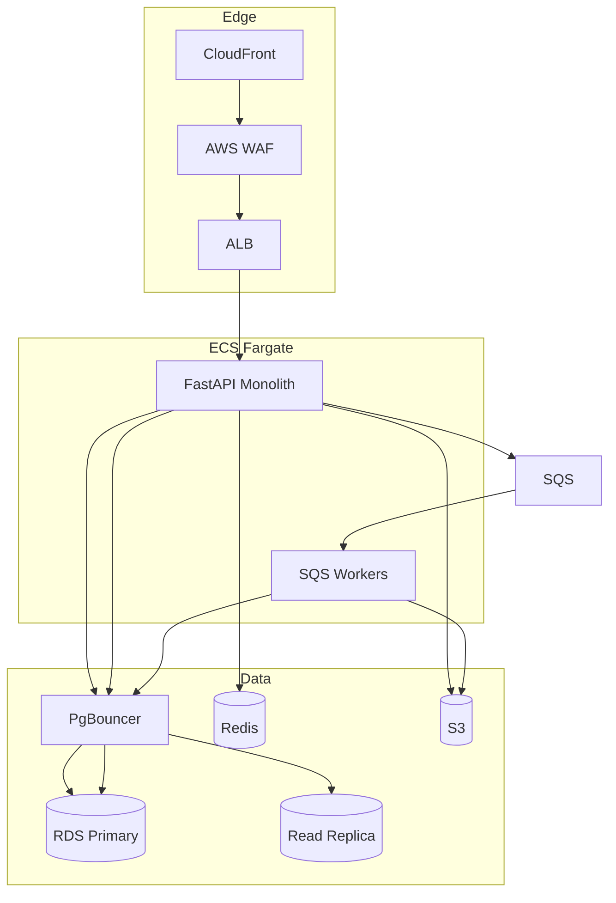

# Project Review — CTO Assessment

## Multi-Tenant Hospital Management SaaS Platform

| Field | Value |
|-------|-------|
| **Document Version** | 1.0 |
| **Review Date** | June 2026 |
| **Reviewer Role** | Chief Technology Officer |
| **Scope** | Full `docs/` folder review |
| **Documents Reviewed** | PRD, DATABASE_DESIGN, SYSTEM_ARCHITECTURE, MULTI_TENANT_DESIGN, RBAC_DESIGN, API_DESIGN, SPRINT_PLAN, FUNCTIONAL_REQUIREMENTS, NON_FUNCTIONAL_REQUIREMENTS, BUSINESS_REQUIREMENTS, USER_STORIES, ROADMAP, AI_FEATURES |

---

## 1. Executive Summary

### 1.1 Overall Assessment

| Dimension | Rating | Summary |
|-----------|--------|---------|
| **Vision & Product Definition** | ⭐⭐⭐⭐ | Clear ICP, personas, tiered SaaS model, phased roadmap |
| **Architecture Design** | ⭐⭐⭐⭐ | Sound modular-monolith, defence-in-depth tenancy, AWS-native |
| **Data Model** | ⭐⭐⭐⭐ | Comprehensive 61-table schema, RLS, composite FKs, retention policy |
| **API Contract** | ⭐⭐⭐ | Good conventions; **critical module gaps** vs RBAC and clinical workflows |
| **Security Posture** | ⭐⭐⭐ | Strong principles; **SECURITY_ARCHITECTURE.md missing**, healthcare gaps remain |
| **Delivery Plan** | ⭐⭐ | **Severe resource mismatch** between ROADMAP (7-person team) and SPRINT_PLAN (solo dev) |
| **Documentation Completeness** | ⭐⭐⭐ | Strong core docs; 4 referenced files absent; cross-doc inconsistencies |

### 1.2 Verdict

The platform has **enterprise-grade architectural intent** with unusually thorough documentation for an early-stage SaaS. The design is viable for SMB healthcare in India/SEA. However, the project is **not execution-ready** until:

1. **API_DESIGN** is reconciled with RBAC and clinical workflows (OPD/IPD modules missing).
2. **Cross-document inconsistencies** (roles, permissions, team size, timelines) are resolved.
3. **Missing governance docs** (SECURITY_ARCHITECTURE, TESTING_STRATEGY, DEPLOYMENT_GUIDE, BILLING_SUBSCRIPTION) are authored.
4. **Delivery assumptions** are aligned to realistic capacity (solo vs team).

**Recommendation:** Proceed to implementation **after a 2-week documentation hardening sprint** and API gap closure. Do not start production tenant onboarding without SECURITY_ARCHITECTURE and penetration testing.

---

## 2. Documentation Inventory

### 2.1 Complete Documents (13)

| Document | Lines (approx.) | Quality |
|----------|-----------------|---------|
| PRD.md | 450+ | Strong |
| DATABASE_DESIGN.md | 1,600+ | Excellent |
| SYSTEM_ARCHITECTURE.md | 1,170+ | Excellent |
| MULTI_TENANT_DESIGN.md | 1,130+ | Excellent |
| RBAC_DESIGN.md | 800+ | Strong |
| API_DESIGN.md | 2,160+ | Good (incomplete coverage) |
| SPRINT_PLAN.md | 1,060+ | Detailed (unrealistic capacity) |
| FUNCTIONAL_REQUIREMENTS.md | 100+ reqs | Comprehensive |
| NON_FUNCTIONAL_REQUIREMENTS.md | 320+ | Strong |
| BUSINESS_REQUIREMENTS.md | — | Present |
| USER_STORIES.md | 30+ stories | Present |
| ROADMAP.md | 480+ | Strong |
| AI_FEATURES.md | 1,000+ | Strong |

### 2.2 Missing Referenced Documents (Critical)

| Document | Referenced By | Risk if Absent |
|----------|---------------|----------------|
| **SECURITY_ARCHITECTURE.md** | SYSTEM_ARCHITECTURE, RBAC, MULTI_TENANT, DATABASE | No authoritative security control matrix; audit failures |
| **TESTING_STRATEGY.md** | NON_FUNCTIONAL_REQUIREMENTS | No test pyramid, isolation test plan, or release gates |
| **DEPLOYMENT_GUIDE.md** | SPRINT_PLAN Sprint 12, SYSTEM_ARCHITECTURE | Production launch blocked; runbook gap |
| **BILLING_SUBSCRIPTION.md** | MULTI_TENANT_DESIGN | Razorpay flows underspecified; dunning/grace ambiguous |

### 2.3 Implementation Status

| Asset | Status |
|-------|--------|
| `database/schema.sql` | Implemented (~2,380 lines, RLS enabled) |
| `backend/` | Empty (structure only) |
| `frontend/` | Empty (structure only) |
| `database/seed-data.sql` | Empty |
| Partitioning (per DATABASE_DESIGN §7) | **Not in schema.sql** |
| `audit.ai_invocations` (per AI_FEATURES) | **Not in schema** |

---

## 3. Cross-Document Inconsistencies (Design Problems)

These inconsistencies will cause implementation bugs, security gaps, and integration failures if not resolved before coding.

### 3.1 Critical Inconsistencies

| # | Issue | Document A | Document B | Resolution |
|---|-------|------------|--------------|------------|
| D-01 | **Team size** | ROADMAP: 7 engineers Phase 1 | SPRINT_PLAN: 1 solo full-stack dev | Pick authoritative plan; revise timelines 3–5× for solo |
| D-02 | **MVP launch date** | ROADMAP M2: Sep 2026 | SPRINT_PLAN: Month 6 (Dec 2026/Jan 2027) | Align milestone dates |
| D-03 | **OPD/IPD APIs missing** | RBAC: 15+ OPD/IPD endpoints | API_DESIGN: No OPD/IPD modules (84 endpoints, none for visits/queue/admissions) | Add Modules 13–16 to API_DESIGN |
| D-04 | **Admin vs Staff API paths** | RBAC: `/api/v1/admin/users` | API_DESIGN: `/api/v1/staff/users/invite` | Standardize on one module; update RBAC matrix |
| D-05 | **Inventory path** | RBAC: `/pharmacy/inventory` | API_DESIGN: `/api/v1/inventory` | Align path and permission module |
| D-06 | **Permission namespace** | RBAC/API: `laboratory:read`, `laboratory:create` | RBAC/API: `lab:verify`, `lab:report` | Unify to `laboratory:*` or `lab:*` |
| D-07 | **Role naming** | RBAC: `hospital_owner`, `hospital_admin`, `accountant` | SYSTEM_ARCHITECTURE §7.1: `tenant_admin`, `billing_staff` | Single role catalog across all docs |
| D-08 | **Functional requirements roles** | FR-AUTH-009: Super Admin, Tenant Admin, Billing Staff | RBAC: Platform Admin, Hospital Owner, Accountant | Map FR IDs to RBAC role codes |
| D-09 | **AI feature set** | PRD Phase 4: appointment optimization, revenue leakage | AI_FEATURES: 6 clinical AI features | Consolidate AI roadmap; cross-reference ROADMAP §6 |
| D-10 | **Import permission** | RBAC: `POST /patients/import` requires `patient:export` | Semantics: import ≠ export | Add `patient:import` permission |

### 3.2 Moderate Inconsistencies

| # | Issue | Details |
|---|-------|---------|
| D-11 | **Message queue** | SYSTEM_ARCHITECTURE references both Celery and SQS; pick SQS-native workers on AWS |
| D-12 | **Database engine** | NFR-COMPAT-006 lists MySQL 8+ alternative; all other docs are PostgreSQL-only — remove MySQL |
| D-13 | **Backup frequency** | NFR-AVAIL-008: every 6 hours; SYSTEM_ARCHITECTURE §13.3: continuous WAL + daily — align wording |
| D-14 | **Session timeout** | FR-AUTH-006: 30 min inactivity; JWT access token: 30 min fixed expiry — clarify idle vs absolute |
| D-15 | **Code coverage targets** | SPRINT DoD: ≥70% new code; NFR-MAINT-001: ≥80% backend — align to 80% |
| D-16 | **Platform seed data RLS** | `subscription_plans` and `permissions` under tenant RLS; tenants must read system tenant seeds — document bypass policy |
| D-17 | **Reports/Notifications/Audit APIs** | Defined in RBAC; absent from API_DESIGN endpoint index | Add API modules |

### 3.3 Architecture Decision Records Needed

| Decision | Options | Recommendation |
|----------|---------|----------------|
| Real-time OPD queue | WebSocket, SSE, polling | SSE for MVP (simpler); WebSocket at 50+ tenants |
| Report generation | Sync PDF in API, async SQS worker | Async worker + S3 URL (already implied; make explicit) |
| Permission resolution | JWT claims vs Redis lookup | Redis cache only; JWT carries `roles` not full permissions |
| Worker framework | Celery, ARQ, raw SQS consumer | SQS + lightweight Python consumer (no Celery Redis broker duplication) |

---

## 4. Missing Features

Features referenced across PRD, FUNCTIONAL_REQUIREMENTS, RBAC, or personas but **not fully specified** in API, database, or sprint plan.

### 4.1 P0 — Blocks MVP Clinical Workflow

| Feature | Referenced In | Gap |
|---------|---------------|-----|
| **OPD visit lifecycle API** | FR-OPD-006–013, RBAC | No endpoints for visits, queue, consult, vitals, notes, prescription |
| **OPD queue (real-time)** | FR-OPD-004, PRD | No WebSocket/SSE architecture; queue state explicitly not cached |
| **Platform admin console API** | Persona 5.7, RBAC `platform:*` | No platform tenant management endpoints in API_DESIGN |
| **Tenant data export** | FR-PLT-010, NFR-DATA-002, DPDP | No export job API or schema |
| **Patient duplicate detection** | FR-PAT-003 | No merge API or similarity algorithm spec |
| **Chronic conditions** | PRD §8.2, FR-PAT-005 | Stored in `metadata` or notes only — no dedicated table/field spec |
| **ICD-10 diagnosis picker** | FR-OPD-008 | No `icd_codes` reference table or API |

### 4.2 P1 — Required for Phase 2 / Clinical Suite

| Feature | Referenced In | Gap |
|---------|---------------|-----|
| **IPD admission/discharge API** | FR-IPD-*, RBAC | No IPD module in API_DESIGN |
| **Bed management dashboard API** | FR-IPD-002–003 | DB tables exist; no API |
| **Lab result verify endpoint** | RBAC `lab:verify` | API has results entry but no explicit verify/finalize split |
| **Critical value alerts** | PRD §8.5 P2 | No notification trigger spec |
| **Insurance / TPA billing** | PRD §8.7 P2, ROADMAP Month 9 | No database tables or API |
| **Radiology / imaging** | PRD persona: Diagnostic Centers | Module entirely absent |
| **Purchase order workflow** | PRD §8.6 P2 | Table exists; no API in inventory module |
| **Multi-location encounters** | FR-PLT-006 | `location_id` on users; not on visits/admissions consistently |
| **WhatsApp notifications** | BUSINESS_REQUIREMENTS add-ons | Only SMS/email in architecture |

### 4.3 P2 — Enterprise / Compliance

| Feature | Referenced In | Gap |
|---------|---------------|-----|
| **2FA / TOTP** | NFR-SEC-019, SPRINT backlog Month 10 | Too late for healthcare; should be Professional+ tier earlier |
| **SSO / SAML / OIDC** | RBAC future enhancements | No enterprise auth design |
| **ABHA / health ID** | AI_FEATURES future | No integration design |
| **HL7 / FHIR** | PRD out of scope MVP; ROADMAP Phase 5 | No interoperability roadmap detail |
| **Patient right to erasure** | NFR-COMP-006 | Anonymization workflow not specified |
| **Break-glass support access** | MULTI_TENANT_DESIGN, DATABASE §9.5 | Mentioned but no procedure, approval, or token design |
| **API keys for Enterprise** | PRD Enterprise tier | No API key auth design |
| **Webhook integrations** | PRD secondary goals | No outbound webhook system |
| **Custom roles UI** | RBAC Phase 2 | No API for role CRUD beyond seed clone |

### 4.4 AI Features (Phase 4) — Documented but Not Integrated

`AI_FEATURES.md` defines 6 features and `audit.ai_invocations`, but:

- No AI endpoints in `API_DESIGN.md`
- No `ai:*` permissions in RBAC permission registry
- No sprint allocation until ROADMAP Phase 4 (post Month 12)
- No cost budget in BUSINESS_REQUIREMENTS

---

## 5. Security Issues

### 5.1 Critical Security Gaps

| # | Issue | Risk | Recommendation |
|---|-------|------|----------------|
| S-01 | **SECURITY_ARCHITECTURE.md absent** | Controls undocumented; inconsistent implementation | Author within 1 week; include threat model (STRIDE) |
| S-02 | **No pre-launch penetration test** | NFR-SEC-014 is annual only | Mandatory pen test before first paying tenant |
| S-03 | **Platform admin BYPASSRLS** | Cross-tenant PHI exposure if misused | Require break-glass ticket, MFA, time-bound token, dual approval |
| S-04 | **JWT carries permission list** | Token bloat; stale permissions after role change | JWT: `sub`, `tenant_id`, `roles` only; resolve permissions server-side with Redis cache |
| S-05 | **Public self-service registration** | Tenant spam, abuse, fraudulent orgs | CAPTCHA, email verification before trial, manual review for Enterprise |
| S-06 | **2FA deferred to Month 10** | Credential theft → PHI breach | Ship TOTP for Hospital Owner/Admin by Sprint 11 minimum |
| S-07 | **PHI access logging incomplete** | NFR-COMP-010 requires read access logs | Add `audit.phi_access_logs` or extend audit_logs with `action: view` on patient reads |
| S-08 | **No field-level encryption** | RDS snapshot theft exposes PHI | Encrypt `phone`, `email`, `address` with tenant-scoped KMS key (Phase 2 minimum) |

### 5.2 Moderate Security Concerns

| # | Issue | Recommendation |
|---|-------|----------------|
| S-09 | CSRF (NFR-SEC-009) vs JWT SPA | Document: SameSite cookies + no cookie auth for API; CSRF N/A for Bearer token API |
| S-10 | Impersonation (`admin:impersonate`) | Time-boxed (15 min), banner in UI, tenant notification, audit every action |
| S-11 | File upload virus scan "Phase 2" | Mandatory before `patient_documents` upload goes live |
| S-12 | Rate limit 100 req/s/IP at Nginx | Insufficient DDoS protection; add AWS WAF with geo/IP reputation |
| S-13 | Secrets in logs | Enforce structured log redaction in CI lint rules |
| S-14 | Refresh token in HttpOnly cookie | Ensure CSRF not applicable; add `SameSite=Strict`; rotate on refresh |
| S-15 | AI PHI to third-party LLM | BAA/DPA, India region, zero retention — documented in AI_FEATURES; must be in SECURITY_ARCHITECTURE |

### 5.3 Compliance Gaps (India / Healthcare)

| Regulation | Status | Action |
|------------|--------|--------|
| **DPDP Act 2023** | Partially addressed (consent field on patients) | Data export, erasure, DPO contact, privacy policy versioning |
| **Clinical Establishments Act** | Not referenced | Legal review for record retention requirements |
| **EHR Standards (India)** | Not referenced | Plan ABHA alignment for Phase 3+ |
| **ISO 27001** | Aligned practices claimed | Gap assessment against Annex A controls |
| **SOC 2 Type II** | Not mentioned | Required for enterprise hospital sales — plan Year 2 |

---

## 6. Scalability Issues

### 6.1 Database & Multi-Tenancy

| # | Issue | Impact at Scale | Mitigation |
|---|-------|-----------------|------------|
| SC-01 | **Shared DB noisy neighbor** | One large tenant degrades all | Per-tenant query timeouts, connection pool quotas, rate limits (NFR-MT-002) |
| SC-02 | **Partitioning designed, not implemented** | `audit_logs`, `opd_visits`, `invoices` bloat | Implement pg_partman before 50 tenants |
| SC-03 | **Reports on primary RDS** | Analytics queries block OLTP | Read replica + report router; materialized views per tenant |
| SC-04 | **Patient search at 500K/tenant** | Full-text GIN may lag | Add `pg_trgm` indexes; consider dedicated search (OpenSearch) at threshold |
| SC-05 | **No connection pooler in architecture diagram** | RDS connection exhaustion | PgBouncer mandatory between ECS and RDS (NFR-DATA-008) |
| SC-06 | **Polymorphic FKs (app-validated only)** | Orphan references, cross-entity bugs | Add CHECK constraints or typed FK tables where feasible |
| SC-07 | **Optimistic locking (`version`)** | Concurrent billing/IPD edits | Document conflict resolution UX (409 responses) |

### 6.2 Application Tier

| # | Issue | Mitigation |
|---|-------|------------|
| SC-08 | Real-time queue without push architecture | SSE endpoint or 5s polling with ETag |
| SC-09 | PDF generation in request path | Async SQS job; poll status endpoint |
| SC-10 | No CDN for tenant logos/reports | CloudFront signed URLs for S3 objects |
| SC-11 | Modular monolith without module boundaries | Enforce import boundaries (lint); prepare extraction interfaces |
| SC-12 | 1,000 req/min/tenant may be low | Tier-based limits; burst allowance for morning OPD rush |
| SC-13 | No dead-letter queue for SQS | Add DLQ + alerting for failed jobs |

### 6.3 Operational Scalability

| # | Issue | Mitigation |
|---|-------|------------|
| SC-14 | Solo developer cannot sustain 99.9% SLA | Managed services, runbooks, on-call rotation by Month 7 |
| SC-15 | DR region "scaled to 0" | Quarterly failover drill; document cold-start time |
| SC-16 | No tenant usage metering tables | Add `platform.tenant_usage` for API calls, storage, seats |

---

## 7. Database Improvements

### 7.1 Schema Gaps

| # | Improvement | Priority | Rationale |
|---|-------------|----------|-----------|
| DB-01 | Add `clinical.patient_conditions` (chronic conditions) | P1 | FR-PAT-005; avoid unstructured metadata |
| DB-02 | Add `core.icd_codes` reference table (system tenant, read-all) | P1 | FR-OPD-008; FR-PLT-014 global master data |
| DB-03 | Add `billing.insurance_providers`, `insurance_claims` | P2 | ROADMAP Phase 3 insurance |
| DB-04 | Add `audit.phi_access_logs` (append-only) | P0 | NFR-COMP-010 compliance |
| DB-05 | Add `audit.ai_invocations` | P2 | AI_FEATURES §9.2 |
| DB-06 | Add `platform.tenant_usage` (metering) | P1 | Plan limits, cost allocation |
| DB-07 | Add `platform.webhook_subscriptions` | P2 | Enterprise integrations |
| DB-08 | Add `core.consent_records` (granular consent) | P1 | DPDP; separate from document upload |
| DB-09 | Implement partitioning per DATABASE_DESIGN §7 | P1 | Before production scale |
| DB-10 | Add `location_id` to `opd_visits`, `admissions`, `invoices` | P1 | Multi-branch FR-PLT-006 |

### 7.2 Index & Query Optimizations

| Improvement | Details |
|-------------|---------|
| **pg_trgm on patient name/phone** | Sub-second search at 100K+ patients per tenant |
| **Partial index on active admissions** | `WHERE status = 'admitted'` for bed dashboard |
| **Covering index for daily collection report** | `(tenant_id, payment_date, status) INCLUDE (amount)` |
| **UUID v7 for high-insert tables** | `audit_logs`, `opd_queue` — better B-tree locality |
| **BRIN on `audit_logs.created_at`** | Designed but verify in schema.sql |
| **Materialized view `mv_daily_stats`** | Per-tenant dashboard; refresh every 5 min via worker |

### 7.3 Data Integrity

| Improvement | Details |
|-------------|---------|
| **Deferrable constraints for admission → bed** | Atomic bed assignment under concurrency |
| **CHECK constraints on status enums** | Replace VARCHAR free-text with ENUM types or lookup tables |
| **Invoice total reconciliation trigger** | `invoice.total = SUM(line_items)` — prevent billing drift |
| **Stock non-negative constraint** | `pharmacy_inventory.quantity >= 0` |
| **Tenant cascade delete function** | Formalize offboarding purge (DATABASE §8.4) as `platform.purge_tenant()` |

### 7.4 RLS Hardening

| Improvement | Details |
|-------------|---------|
| **Separate RLS policy for system tenant reads** | Allow `SELECT` on `subscription_plans`, `permissions` where `tenant_id = system_tenant` |
| **Force RLS for table owner** | `ALTER TABLE ... FORCE ROW LEVEL SECURITY` on all tenant tables |
| **Integration test: SET ROLE** | Verify RLS blocks even when app filter is removed |
| **Background job session context** | Document `SET app.tenant_id` per job; never reuse connection across tenants |

---

## 8. Architecture Improvements

### 8.1 Recommended Changes (Priority Order)

| # | Improvement | Phase | Effort |
|---|-------------|-------|--------|
| A-01 | **Complete API_DESIGN** with OPD, IPD, Platform, Reports, Notifications, Audit modules | Pre-dev | 1 week |
| A-02 | **Author SECURITY_ARCHITECTURE.md** with threat model and control matrix | Pre-dev | 1 week |
| A-03 | **SQS-only async** — remove Celery from diagrams; single worker pattern | Sprint 1 | 2 days |
| A-04 | **Permission resolver** — roles in JWT, permissions from Redis/DB | Sprint 2 | 3 days |
| A-05 | **SSE for OPD queue** — `/api/v1/opd/queue/stream` | Sprint 4 | 3 days |
| A-06 | **Outbox pattern** — `platform.event_outbox` for reliable notifications | Sprint 10 | 5 days |
| A-07 | **Read replica router** — `@read_only` decorator routes to replica | Sprint 9 | 5 days |
| A-08 | **Feature flags** — LaunchDarkly or open-source (Unleash) | Sprint 3 | 2 days |
| A-09 | **OpenAPI contract tests** — Schemathesis in CI | Sprint 2 | 2 days |
| A-10 | **Tenant context test harness** — pytest plugin auto-sets `app.tenant_id` | Sprint 1 | 1 day |

### 8.2 Target Architecture (12-Month)



### 8.3 Module Boundary Enforcement

```
backend/app/
├── platform/      # Tenant provisioning, subscriptions (platform admin)
├── auth/          # JWT, sessions, RBAC resolver
├── patients/      # Patient CRUD, allergies, documents
├── clinical/      # OPD, IPD, appointments (single bounded context)
├── billing/       # Invoices, payments
├── pharmacy/      # Medicines, inventory, dispense
├── laboratory/    # Orders, samples, results, reports
├── comms/         # Notifications (email, SMS, in-app)
├── reports/       # Read replica queries, exports
└── shared/        # DB, cache, S3, tenant context (no business logic)
```

**Rule:** No cross-module direct DB access; use service interfaces. Prepares selective extraction at 500+ tenants.

---

## 9. Cost Optimization

### 9.1 Infrastructure Cost Model (Estimated — India Region)

| Component | MVP (0–50 tenants) | Growth (50–200 tenants) | Optimization |
|-----------|-------------------|---------------------------|--------------|
| ECS Fargate (2 tasks) | ₹25K/mo | ₹60K/mo | Graviton ARM; right-size after 30 days metrics |
| RDS PostgreSQL (db.t4g.medium) | ₹15K/mo | ₹45K/mo | Reserved Instances (1-year); PgBouncer reduces instance size |
| ElastiCache (cache.t4g.micro) | ₹5K/mo | ₹15K/mo | Single node MVP; cluster only when > 100 tenants |
| S3 + CloudFront | ₹3K/mo | ₹12K/mo | Lifecycle: Glacier at 7yr; delete temp PDFs at 30d |
| SQS + Workers | ₹1K/mo | ₹5K/mo | Batch notifications; compress payloads |
| SES + SMS | ₹5K/mo | ₹25K/mo | Pass SMS cost to tenants (add-on packs) |
| CloudWatch + Sentry | ₹5K/mo | ₹10K/mo | Log sampling; Sentry 10% trace sampling |
| **Total** | **~₹59K/mo** | **~₹172K/mo** | ROADMAP Phase 1 estimate ₹50K — close but tight |

### 9.2 Cost Optimization Strategies

| Strategy | Savings | Implementation |
|----------|---------|----------------|
| **PgBouncer** | 30–40% RDS downsizing | Transaction pooling mode |
| **ARM Graviton (ECS + RDS)** | 20% vs x86 | Use `t4g`/`m7g` instances |
| **Reserved Instances (1yr)** | 35% RDS/Redis | After 3 months stable sizing |
| **Async PDF/report generation** | Reduce ECS task size | SQS worker on smaller task |
| **S3 Intelligent-Tiering** | 20% storage on old reports | Enable on tenant document bucket |
| **CloudFront for static SPA** | 60% origin bandwidth | Already planned; ensure asset hashing |
| **AI token budgets** | Prevent runaway LLM cost | Per-tenant Redis counter (AI_FEATURES §9.4) |
| **Spot for workers only** | 70% worker compute | SQS visibility timeout handles interruption |
| **Delete staging nightly** | Dev cost control | Ephemeral staging environment |
| **Tenant storage quotas** | Pass-through above plan limit | Enforce in `tenant_usage` |

### 9.3 Unit Economics Guardrails

| Metric | Target | Action if Breached |
|--------|--------|-------------------|
| Infra cost / tenant / month | < ₹500 at 100 tenants | Optimize queries; add read replica |
| Infra cost as % of MRR | < 25% | Raise prices or reduce free tier |
| SMS cost / tenant | < ₹200/mo | SMS add-on packs only |
| Support cost / tenant | < ₹300/mo | Self-service docs, in-app help |

---

## 10. Sprint Plan Assessment

### 10.1 Capacity Reality Check

| Metric | SPRINT_PLAN | Industry Benchmark | Assessment |
|--------|-------------|-------------------|------------|
| Total story points | 269 in 24 weeks | — | Ambitious |
| Solo dev capacity | ~56 hrs/sprint | — | Reasonable |
| Scope | Full HMS (61 tables, 84+ APIs, 9 roles) | MVP typically 3–4 modules | **3–4× over capacity** |
| Phase 2 (IPD+Lab+Pharmacy) | Sprints 5–8 (8 weeks) | Typically 12–16 weeks | Under-estimated |

### 10.2 Recommended Sprint Realignment

| Phase | Original | Recommended (Solo) | Recommended (Team of 4) |
|-------|----------|-------------------|-------------------------|
| MVP (OPD+Patient+Billing) | 8 weeks | **16 weeks** | 8 weeks |
| Clinical (IPD+Lab+Pharmacy) | 8 weeks | **16 weeks** | 10 weeks |
| Growth (Reports+Billing+Launch) | 8 weeks | **12 weeks** | 8 weeks |
| **Total to production** | 6 months | **11 months** | 6.5 months |

### 10.3 What to Cut from MVP (If Timeline Fixed)

| Cut | Impact | Alternative |
|-----|--------|-------------|
| Pharmacy module → Phase 2 | E-prescription print-only | Acceptable for clinic MVP |
| IPD → Phase 2 | OPD-only clinics served | Aligns with Starter tier |
| Patient CSV import → Sprint 11 | Manual entry only | Low early tenant count |
| Custom subdomain → Phase 2 | Path-based tenant routing | `app.platform.com/t/{slug}` |

### 10.4 What Must NOT Be Cut

- Tenant isolation (RLS + middleware + CI tests)
- RBAC enforcement
- Audit logging
- Auth (JWT + refresh rotation)
- Core OPD workflow (register → consult → bill → pay)
- Razorpay subscription (revenue)

---

## 11. API Design Gaps — Required Additions

### 11.1 Proposed New Modules

#### Module: OPD (`/api/v1/opd`)

| Method | Endpoint | Permission |
|--------|----------|------------|
| GET | `/opd/queue` | `opd:read` |
| GET | `/opd/queue/stream` | `opd:read` (SSE) |
| POST | `/opd/visits` | `opd:create` |
| GET | `/opd/visits/{id}` | `opd:read` |
| PATCH | `/opd/visits/{id}/status` | `opd:update` |
| POST | `/opd/visits/{id}/vitals` | `opd:update` |
| POST | `/opd/visits/{id}/consult` | `opd:consult` |
| POST | `/opd/visits/{id}/prescription` | `opd:prescribe` |
| GET | `/opd/visits/{id}/prescription/print` | `opd:read` |

#### Module: IPD (`/api/v1/ipd`)

| Method | Endpoint | Permission |
|--------|----------|------------|
| GET | `/ipd/beds` | `ipd:read` |
| GET | `/ipd/wards` | `ipd:read` |
| POST | `/ipd/admissions` | `ipd:admit` |
| GET | `/ipd/admissions/{id}` | `ipd:read` |
| POST | `/ipd/admissions/{id}/vitals` | `ipd:update` |
| POST | `/ipd/admissions/{id}/nursing-notes` | `ipd:update` |
| POST | `/ipd/admissions/{id}/transfer` | `ipd:update` |
| POST | `/ipd/admissions/{id}/discharge` | `ipd:discharge` |

#### Module: Platform Admin (`/api/v1/platform`)

| Method | Endpoint | Permission |
|--------|----------|------------|
| GET | `/platform/tenants` | `platform:read` |
| POST | `/platform/tenants` | `platform:create` |
| PATCH | `/platform/tenants/{id}/status` | `platform:update` |
| GET | `/platform/subscriptions` | `platform:read` |
| GET | `/platform/health` | `platform:read` |

#### Module: Reports (`/api/v1/reports`)

| Method | Endpoint | Permission |
|--------|----------|------------|
| GET | `/reports/dashboard` | `reports:clinical` |
| GET | `/reports/opd-summary` | `reports:clinical` |
| GET | `/reports/financial` | `reports:financial` |
| POST | `/reports/export` | `reports:export` |

#### Module: Notifications (`/api/v1/notifications`)

| Method | Endpoint | Permission |
|--------|----------|------------|
| GET | `/notifications` | Authenticated |
| PATCH | `/notifications/{id}/read` | Authenticated |
| GET | `/notifications/preferences` | Authenticated |
| PUT | `/notifications/preferences` | Authenticated |

#### Module: Audit (`/api/v1/audit`)

| Method | Endpoint | Permission |
|--------|----------|------------|
| GET | `/audit/logs` | `audit:read` |
| GET | `/audit/phi-access` | `audit:read` |

**Revised endpoint total:** ~120 endpoints (from 84).

---

## 12. Future Features (Recommended Roadmap Additions)

Consolidated from PRD, ROADMAP, AI_FEATURES, and gap analysis.

### 12.1 Year 1 (Post-Launch)

| Feature | Business Value | Tier |
|---------|----------------|------|
| Hindi localization | India market expansion | All |
| Insurance/TPA basic | Hospital billing completeness | Professional+ |
| 2FA for admins | Security compliance | Professional+ |
| Patient portal (view reports) | Patient satisfaction | Professional+ |
| WhatsApp appointment reminders | Reduce no-shows | Add-on |
| Revenue dashboard | Owner retention | Professional+ |

### 12.2 Year 2 — Intelligence & Integration

| Feature | Source | Notes |
|---------|--------|-------|
| AI Prescription Generator | AI_FEATURES | Human-in-the-loop |
| AI Symptom Analyzer | AI_FEATURES | Decision support only |
| AI Lab Report Summarization | AI_FEATURES | Auto on verify |
| AI Voice to Notes | AI_FEATURES | Enterprise tier |
| ABHA integration | India EHR standards | Patient ID linking |
| HL7 FHIR R4 read API | ROADMAP Phase 5 | Enterprise integrations |
| Custom report builder | PRD P3 | No-code analytics |
| API marketplace / webhooks | PRD secondary goals | Ecosystem play |

### 12.3 Year 2–3 — Platform Maturity

| Feature | Target Segment |
|---------|----------------|
| Native mobile apps (doctor + receptionist) | All tiers |
| Telemedicine (video consult) | Professional+ |
| Multi-region deployment (data residency) | Enterprise |
| White-label / custom domain | Enterprise |
| Radiology PACS integration | Diagnostic centers |
| SSO / SAML | Enterprise hospitals |
| SOC 2 Type II certification | Enterprise sales |
| Smart appointment scheduling (AI) | ROADMAP Phase 4 |
| Revenue leakage detection (AI) | ROADMAP Phase 4 |

---

## 13. Enterprise-Level Recommendations

### 13.1 Immediate Actions (Next 2 Weeks) — P0

| # | Action | Owner | Output |
|---|--------|-------|--------|
| 1 | Resolve team size and timeline (solo vs team) | CEO + CTO | Revised SPRINT_PLAN or hiring plan |
| 2 | Add OPD/IPD/Platform/Reports APIs to API_DESIGN | Engineering | API v1.1 draft |
| 3 | Author SECURITY_ARCHITECTURE.md | Security/CTO | Threat model + control matrix |
| 4 | Unify role and permission naming | Engineering | RBAC v1.1 + migration of references |
| 5 | Create TESTING_STRATEGY.md | QA/Engineering | Test pyramid, isolation tests, release gates |
| 6 | Fix `patient:import` permission | Engineering | RBAC update |
| 7 | Document system tenant RLS read policy | DBA | MULTI_TENANT_DESIGN addendum |

### 13.2 Pre-Production Gate — P0

| Gate | Criteria |
|------|----------|
| **Security** | Pen test passed; no critical/high open findings |
| **Isolation** | 100% API integration tests for cross-tenant IDOR |
| **RLS** | Force RLS enabled; bypass role tested and audited |
| **Backup** | Restore drill completed; RPO/RTO verified |
| **Compliance** | Privacy policy, DPDP consent flow, data export API live |
| **Observability** | Dashboards, P1 alerts, on-call runbook |
| **Billing** | Razorpay webhooks tested; dunning flow verified |

### 13.3 Engineering Standards to Adopt

| Standard | Tool / Practice |
|----------|-----------------|
| API contract testing | Schemathesis + OpenAPI diff in CI |
| Tenant isolation tests | pytest plugin; every endpoint |
| Database migrations | Alembic only; no manual prod SQL |
| Feature flags | Unleash or env-based flags |
| Error tracking | Sentry with tenant_id tag |
| Structured logging | JSON logs; no PHI |
| Code review | Self-review checklist minimum; peer when team grows |
| ADRs | `docs/adr/` for significant decisions |

### 13.4 Organizational Recommendations

| Topic | Recommendation |
|-------|----------------|
| **Team** | Minimum viable team for 6-month launch: 2 backend, 1 frontend, 1 QA, 0.5 DevOps — not solo |
| **Compliance** | Engage healthcare legal counsel before beta (DPDP, medical records) |
| **Customer success** | First 10 tenants need white-glove onboarding; budget 4 hrs/tenant |
| **Technical debt** | Allocate 20% sprint capacity (per ROADMAP §13.2) — enforce in SPRINT_PLAN |
| **Documentation** | Single source of truth: role codes in RBAC; all docs reference it |

---

## 14. Risk Register (Consolidated)

| # | Risk | Likelihood | Impact | Mitigation |
|---|------|------------|--------|------------|
| R-01 | Solo dev timeline slip (6+ months) | High | Critical | Hire or cut scope to OPD-only MVP |
| R-02 | API/RBAC mismatch causes auth bugs | High | High | API gap closure before Sprint 3 |
| R-03 | Cross-tenant data leak | Low | Critical | RLS + CI isolation tests + pen test |
| R-04 | Healthcare data breach | Low | Critical | 2FA, PHI access logs, encryption |
| R-05 | Razorpay integration delays launch | Medium | High | Sandbox integration Sprint 2 |
| R-06 | Performance at 50+ tenants | Medium | High | Partitioning, read replica, load tests |
| R-07 | Regulatory non-compliance (DPDP) | Medium | Critical | Legal review; export/erasure APIs |
| R-08 | AI cost overrun | Medium | Medium | Token budgets; tier gating |
| R-09 | Documentation drift from code | High | Medium | OpenAPI as contract; CI diff |
| R-10 | Customer churn from incomplete IPD/Lab | Medium | High | Tier packaging; clear module matrix |

---

## 15. Strengths to Preserve

The following design decisions are **correct and should not be changed**:

1. **Shared DB + `tenant_id` + RLS** — Right for SMB SaaS cost structure.
2. **Modular monolith** — Correct for Phase 1; avoids premature microservices.
3. **JWT + refresh rotation** — Industry standard; implement permission resolver fix only.
4. **UUID primary keys** — Good for distributed systems and tenant isolation.
5. **Composite FKs with `tenant_id`** — Strong cross-tenant reference prevention.
6. **Standard audit columns + soft delete** — Healthcare-appropriate.
7. **API envelope `{ data, meta, errors }`** — Consistent client experience.
8. **Human-in-the-loop AI** — Correct regulatory positioning.
9. **Schema-separated modules** (`clinical`, `billing`, etc.) — Clean boundaries.
10. **Phased roadmap** — MVP → Clinical → Growth → AI is logical.

---

## 16. Conclusion

This Hospital Management SaaS platform has a **strong architectural foundation** and documentation quality that exceeds most Series A startups. The data model, multi-tenant design, and RBAC matrices demonstrate enterprise thinking.

The primary risks are **execution realism** (solo dev vs scope), **API contract incompleteness** (missing OPD/IPD), and **missing security governance** (SECURITY_ARCHITECTURE, pen test, PHI access logging).

**Go/No-Go for development start:** **Conditional Go** — proceed after 2-week documentation hardening and API module completion.

**Go/No-Go for production launch:** **No-Go** until security gate (§13.2) is satisfied.

---

## 17. Revision History

| Version | Date | Author | Changes |
|---------|------|--------|---------|
| 1.0 | June 2026 | CTO Review | Initial enterprise project review |
