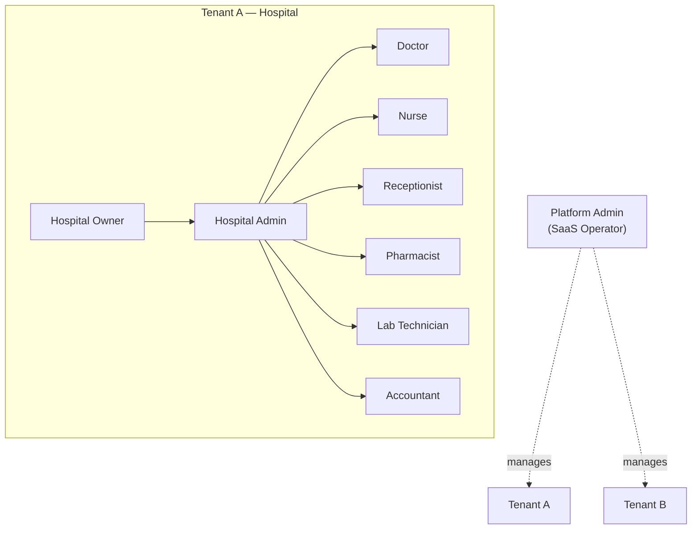
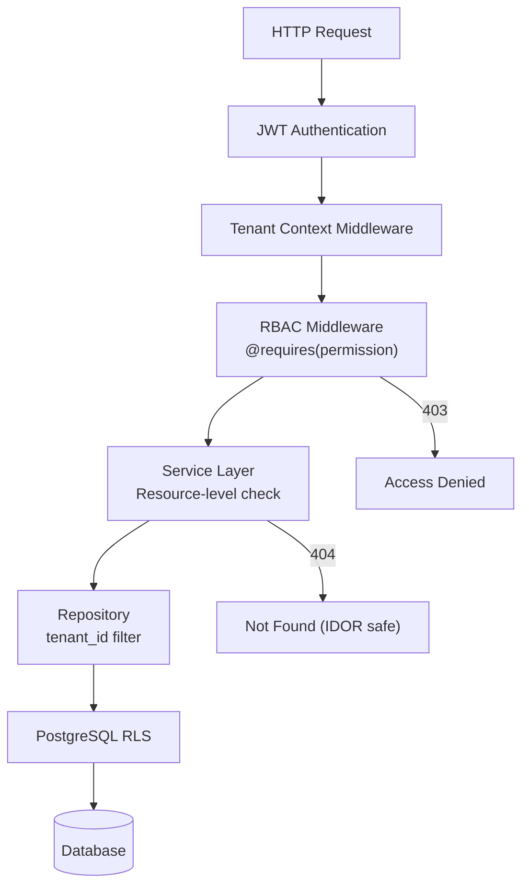

# Role-Based Access Control (RBAC) Design

## Multi-Tenant Hospital Management SaaS Platform

| Field | Value |
|-------|-------|
| **Document Version** | 1.0 |
| **Status** | Draft |
| **Last Updated** | June 2026 |
| **Author** | Security & Platform Architecture |
| **Related Documents** | SECURITY_ARCHITECTURE.md, MULTI_TENANT_DESIGN.md, API_DESIGN.md, DATABASE_DESIGN.md, FUNCTIONAL_REQUIREMENTS.md |

---

## 1. Executive Summary

This document defines the **Role-Based Access Control (RBAC)** model for the Hospital Management SaaS Platform. Access is granted through **roles** assigned to **users** within a **tenant** context. Permissions are enforced at the API layer (FastAPI), service layer, and UI layer (React).

### 1.1 Design Goals

| Goal | Description |
|------|-------------|
| **Least privilege** | Users receive only permissions required for their job function |
| **Tenant isolation** | Roles and permissions are scoped per tenant (except Platform Admin) |
| **Defence in depth** | API decorator + service check + UI guard + audit log |
| **Auditability** | All permission denials and sensitive actions are logged |
| **Extensibility** | Custom roles (Phase 2) inherit from system role templates |

### 1.2 RBAC Model

```
User ──▶ UserRole ──▶ Role ──▶ RolePermission ──▶ Permission
         (tenant)    (tenant)                    (system catalog)
```

| Entity | Table | Scope |
|--------|-------|-------|
| User | `core.users` | Per tenant |
| Role | `core.roles` | Per tenant (cloned from system templates) |
| Permission | `core.permissions` | System catalog + tenant overrides |
| UserRole | `core.user_roles` | Per tenant |
| RolePermission | `core.role_permissions` | Per tenant |

---

## 2. Role Definitions

### 2.1 Role Hierarchy



### 2.2 Role Catalog

| Role Code | Display Name | Scope | Description |
|-----------|--------------|-------|-------------|
| `platform_admin` | Platform Admin | **Platform** | SaaS operator; manages tenants, subscriptions, platform health. No default clinical data access. |
| `hospital_owner` | Hospital Owner | Tenant | Business owner; full tenant access including billing, subscription, and destructive operations. |
| `hospital_admin` | Hospital Admin | Tenant | Operational administrator; manages staff, settings, masters. No subscription/billing plan changes. |
| `doctor` | Doctor | Tenant | Clinical workflows: consultations, prescriptions, lab orders, IPD clinical notes. |
| `nurse` | Nurse | Tenant | IPD nursing: vitals, nursing notes, bed status viewing. Limited clinical write access. |
| `receptionist` | Receptionist | Tenant | Front desk: patient registration, appointments, OPD queue. No clinical notes or billing finalization. |
| `pharmacist` | Pharmacist | Tenant | Pharmacy: dispensing, inventory, medicine master. |
| `lab_technician` | Lab Technician | Tenant | Laboratory: sample processing, result entry, report generation. |
| `accountant` | Accountant | Tenant | Billing: invoices, payments, receipts, financial reports. Read-only patient demographics. |

### 2.3 Role Characteristics

| Role | Multi-Assign | Self-Register | System Role | Deletable |
|------|--------------|---------------|-------------|-----------|
| Platform Admin | No | No (internal) | Yes | No |
| Hospital Owner | No (max 2) | No | Yes | No |
| Hospital Admin | Yes | No | Yes | No |
| Doctor | Yes | No | Yes | No |
| Nurse | Yes | No | Yes | No |
| Receptionist | Yes | No | Yes | No |
| Pharmacist | Yes | No | Yes | No |
| Lab Technician | Yes | No | Yes | No |
| Accountant | Yes | No | Yes | No |

### 2.4 Platform Admin vs Tenant Roles

| Attribute | Platform Admin | Tenant Roles |
|-----------|----------------|--------------|
| Auth realm | `platform-admin` JWT issuer | Standard tenant JWT |
| `tenant_id` in JWT | Optional / multiple | Single tenant (required) |
| Database access | `platform.*` schema only | Tenant-scoped via RLS |
| Clinical PHI access | **Denied by default** | Per role permissions |
| Subscription management | All tenants | Own tenant (Owner only) |

---

## 3. Permission Naming Convention

### 3.1 Format

```
{module}:{action}
```

| Segment | Rules | Examples |
|---------|-------|----------|
| **module** | Lowercase, singular noun | `patient`, `opd`, `billing` |
| **action** | Lowercase verb | `read`, `create`, `update`, `delete` |

### 3.2 Standard Actions

| Action | Meaning | HTTP Mapping |
|--------|---------|--------------|
| `read` | View resource(s) | `GET` |
| `create` | Create new resource | `POST` |
| `update` | Modify existing resource | `PUT`, `PATCH` |
| `delete` | Soft-delete or void resource | `DELETE` |
| `export` | Export data (CSV, PDF) | `GET` (export endpoints) |
| `approve` | Approve pending action | `POST` (approve endpoints) |

### 3.3 Domain-Specific Actions

| Permission | Meaning | Used By |
|------------|---------|---------|
| `opd:consult` | Conduct consultation, write clinical notes | Doctor |
| `opd:prescribe` | Create e-prescriptions | Doctor |
| `billing:void` | Void/cancel finalized invoice | Accountant, Hospital Owner |
| `billing:collect` | Record payment | Accountant, Receptionist |
| `pharmacy:dispense` | Fulfill prescriptions | Pharmacist |
| `lab:verify` | Verify and finalize lab results | Lab Technician |
| `lab:report` | Generate and finalize lab reports | Lab Technician |
| `ipd:admit` | Create admission | Receptionist, Hospital Admin |
| `ipd:discharge` | Discharge patient | Doctor |
| `admin:impersonate` | Support impersonation (platform only) | Platform Admin |
| `admin:users` | Manage staff user accounts | Hospital Admin, Hospital Owner |
| `admin:settings` | Tenant configuration | Hospital Admin, Hospital Owner |
| `admin:subscription` | View/change subscription plan | Hospital Owner |
| `audit:read` | View audit logs | Hospital Owner, Hospital Admin |
| `reports:financial` | Financial reports | Accountant, Hospital Owner |
| `reports:clinical` | Clinical/operational reports | Hospital Admin, Doctor |

### 3.4 Wildcard Permissions

| Permission | Grants | Assigned To |
|------------|--------|-------------|
| `*:*` | All permissions within tenant | Hospital Owner |
| `platform:*` | All platform operations | Platform Admin |
| `{module}:*` | All actions on module | Hospital Admin (selected modules) |

### 3.5 Permission Module Registry

| Module Code | Description |
|-------------|-------------|
| `platform` | Tenant provisioning, subscription (platform admin) |
| `patient` | Patient demographics, allergies, documents |
| `appointment` | Appointment scheduling |
| `opd` | Outpatient visits, queue, consultation |
| `ipd` | Admissions, beds, nursing, discharge |
| `billing` | Invoices, payments, service master |
| `pharmacy` | Medicines, inventory, dispensing |
| `laboratory` | Lab orders, samples, results, reports |
| `admin` | Users, staff, departments, settings |
| `reports` | Dashboards and exports |
| `audit` | Audit log access |
| `notification` | Notification preferences |

### 3.6 Naming Examples

```
patient:read          → View patient records
patient:create        → Register new patients
opd:consult           → Conduct doctor consultation
billing:void          → Void an invoice
pharmacy:dispense     → Dispense medications
lab:report            → Finalize lab reports
admin:users           → Manage user accounts
reports:financial     → View financial reports
```

---

## 4. Feature Permissions

Feature permissions map **product features** to required permissions. A feature is visible and usable only when the user holds the required permission(s).

### 4.1 Platform Features (Platform Admin Only)

| Feature | Required Permission | Roles |
|---------|---------------------|-------|
| Tenant list & search | `platform:read` | Platform Admin |
| Tenant suspend/reactivate | `platform:update` | Platform Admin |
| Subscription plan management | `platform:update` | Platform Admin |
| Platform health dashboard | `platform:read` | Platform Admin |
| Break-glass impersonation | `admin:impersonate` | Platform Admin |

### 4.2 Patient Management

| Feature | Required Permission | Roles |
|---------|---------------------|-------|
| Patient search | `patient:read` | All tenant roles |
| Patient registration | `patient:create` | Receptionist, Hospital Admin, Hospital Owner |
| Edit patient demographics | `patient:update` | Receptionist, Hospital Admin, Hospital Owner |
| Record allergies | `patient:update` | Doctor, Nurse, Hospital Admin |
| Upload patient documents | `patient:create` | Receptionist, Doctor, Hospital Admin |
| Delete/deactivate patient | `patient:delete` | Hospital Admin, Hospital Owner |
| Import patients (CSV) | `patient:export` | Hospital Admin, Hospital Owner |

### 4.3 Appointments & OPD

| Feature | Required Permission | Roles |
|---------|---------------------|-------|
| View appointment calendar | `appointment:read` | Receptionist, Doctor, Hospital Admin |
| Book appointment | `appointment:create` | Receptionist |
| Cancel/reschedule appointment | `appointment:update` | Receptionist, Hospital Admin |
| Manage OPD queue | `opd:read`, `opd:update` | Receptionist |
| Conduct consultation | `opd:consult` | Doctor |
| Record vitals (OPD) | `opd:update` | Doctor, Nurse, Receptionist |
| Write clinical notes | `opd:consult` | Doctor |
| Create e-prescription | `opd:prescribe` | Doctor |
| Order lab tests (from OPD) | `laboratory:create` | Doctor |
| View OPD visit history | `opd:read` | Doctor, Nurse, Receptionist |

### 4.4 Inpatient (IPD)

| Feature | Required Permission | Roles |
|---------|---------------------|-------|
| View bed dashboard | `ipd:read` | Nurse, Hospital Admin, Receptionist |
| Admit patient | `ipd:admit` | Receptionist, Hospital Admin |
| Record nursing notes | `ipd:update` | Nurse |
| Chart IPD vitals | `ipd:update` | Nurse |
| Transfer bed/ward | `ipd:update` | Nurse, Hospital Admin |
| Discharge patient | `ipd:discharge` | Doctor |
| View discharge summary | `ipd:read` | Doctor, Nurse, Accountant |

### 4.5 Billing & Finance

| Feature | Required Permission | Roles |
|---------|---------------------|-------|
| View service master | `billing:read` | Accountant, Hospital Admin, Hospital Owner |
| Configure service charges | `billing:update` | Hospital Admin, Hospital Owner |
| Generate OPD/IPD invoice | `billing:create` | Accountant, Receptionist |
| Finalize invoice | `billing:update` | Accountant |
| Void invoice | `billing:void` | Accountant, Hospital Owner |
| Collect payment | `billing:collect` | Accountant, Receptionist |
| View daily collection report | `reports:financial` | Accountant, Hospital Owner |
| Apply discount > 10% | `billing:approve` | Hospital Owner, Hospital Admin |

### 4.6 Pharmacy

| Feature | Required Permission | Roles |
|---------|---------------------|-------|
| View medicine catalog | `pharmacy:read` | Pharmacist, Doctor, Hospital Admin |
| Manage medicine master | `pharmacy:update` | Pharmacist, Hospital Admin |
| View prescription queue | `pharmacy:read` | Pharmacist |
| Dispense medication | `pharmacy:dispense` | Pharmacist |
| Manage inventory | `pharmacy:update` | Pharmacist, Hospital Admin |
| Record stock purchase | `pharmacy:create` | Pharmacist |

### 4.7 Laboratory

| Feature | Required Permission | Roles |
|---------|---------------------|-------|
| View test catalog | `laboratory:read` | Lab Technician, Doctor, Hospital Admin |
| Manage test catalog | `laboratory:update` | Hospital Admin |
| View lab order queue | `laboratory:read` | Lab Technician |
| Collect sample | `laboratory:update` | Lab Technician |
| Enter results | `laboratory:update` | Lab Technician |
| Verify results | `lab:verify` | Lab Technician |
| Generate/finalize report | `lab:report` | Lab Technician |
| View lab reports | `laboratory:read` | Doctor, Lab Technician |

### 4.8 Administration & Reports

| Feature | Required Permission | Roles |
|---------|---------------------|-------|
| Manage staff users | `admin:users` | Hospital Admin, Hospital Owner |
| Manage departments | `admin:settings` | Hospital Admin, Hospital Owner |
| Tenant settings | `admin:settings` | Hospital Admin, Hospital Owner |
| Subscription & plan | `admin:subscription` | Hospital Owner |
| Operational dashboard | `reports:clinical` | Hospital Admin, Hospital Owner |
| Audit log viewer | `audit:read` | Hospital Owner, Hospital Admin |
| Export reports | `reports:export` | Hospital Admin, Accountant, Hospital Owner |

---

## 5. CRUD Permissions

### 5.1 CRUD Matrix — Patient Module

| Permission | Platform Admin | Hospital Owner | Hospital Admin | Doctor | Nurse | Receptionist | Pharmacist | Lab Tech | Accountant |
|------------|:--------------:|:--------------:|:--------------:|:------:|:-----:|:------------:|:----------:|:--------:|:----------:|
| `patient:read` | — | ✅ | ✅ | ✅ | ✅ | ✅ | ✅ | ✅ | ✅ |
| `patient:create` | — | ✅ | ✅ | — | — | ✅ | — | — | — |
| `patient:update` | — | ✅ | ✅ | ✅ | ✅ | ✅ | — | — | — |
| `patient:delete` | — | ✅ | ✅ | — | — | — | — | — | — |
| `patient:export` | — | ✅ | ✅ | — | — | — | — | — | — |

### 5.2 CRUD Matrix — OPD Module

| Permission | Platform Admin | Hospital Owner | Hospital Admin | Doctor | Nurse | Receptionist | Pharmacist | Lab Tech | Accountant |
|------------|:--------------:|:--------------:|:--------------:|:------:|:-----:|:------------:|:----------:|:--------:|:----------:|
| `appointment:read` | — | ✅ | ✅ | ✅ | — | ✅ | — | — | — |
| `appointment:create` | — | ✅ | ✅ | — | — | ✅ | — | — | — |
| `appointment:update` | — | ✅ | ✅ | — | — | ✅ | — | — | — |
| `appointment:delete` | — | ✅ | ✅ | — | — | — | — | — | — |
| `opd:read` | — | ✅ | ✅ | ✅ | ✅ | ✅ | — | — | — |
| `opd:create` | — | ✅ | ✅ | — | — | ✅ | — | — | — |
| `opd:update` | — | ✅ | ✅ | ✅ | ✅ | ✅ | — | — | — |
| `opd:consult` | — | — | — | ✅ | — | — | — | — | — |
| `opd:prescribe` | — | — | — | ✅ | — | — | — | — | — |

### 5.3 CRUD Matrix — IPD Module

| Permission | Platform Admin | Hospital Owner | Hospital Admin | Doctor | Nurse | Receptionist | Pharmacist | Lab Tech | Accountant |
|------------|:--------------:|:--------------:|:--------------:|:------:|:-----:|:------------:|:----------:|:--------:|:----------:|
| `ipd:read` | — | ✅ | ✅ | ✅ | ✅ | ✅ | — | — | ✅ |
| `ipd:admit` | — | ✅ | ✅ | — | — | ✅ | — | — | — |
| `ipd:update` | — | ✅ | ✅ | — | ✅ | — | — | — | — |
| `ipd:discharge` | — | — | — | ✅ | — | — | — | — | — |
| `ipd:delete` | — | ✅ | ✅ | — | — | — | — | — | — |

### 5.4 CRUD Matrix — Billing Module

| Permission | Platform Admin | Hospital Owner | Hospital Admin | Doctor | Nurse | Receptionist | Pharmacist | Lab Tech | Accountant |
|------------|:--------------:|:--------------:|:--------------:|:------:|:-----:|:------------:|:----------:|:--------:|:----------:|
| `billing:read` | — | ✅ | ✅ | — | — | ✅ | — | — | ✅ |
| `billing:create` | — | ✅ | ✅ | — | — | ✅ | — | — | ✅ |
| `billing:update` | — | ✅ | ✅ | — | — | — | — | — | ✅ |
| `billing:delete` | — | ✅ | — | — | — | — | — | — | — |
| `billing:void` | — | ✅ | — | — | — | — | — | — | ✅ |
| `billing:collect` | — | ✅ | — | — | — | ✅ | — | — | ✅ |
| `billing:approve` | — | ✅ | ✅ | — | — | — | — | — | — |

### 5.5 CRUD Matrix — Pharmacy Module

| Permission | Platform Admin | Hospital Owner | Hospital Admin | Doctor | Nurse | Receptionist | Pharmacist | Lab Tech | Accountant |
|------------|:--------------:|:--------------:|:--------------:|:------:|:-----:|:------------:|:----------:|:--------:|:----------:|
| `pharmacy:read` | — | ✅ | ✅ | ✅ | — | — | ✅ | — | — |
| `pharmacy:create` | — | ✅ | ✅ | — | — | — | ✅ | — | — |
| `pharmacy:update` | — | ✅ | ✅ | — | — | — | ✅ | — | — |
| `pharmacy:delete` | — | ✅ | ✅ | — | — | — | — | — | — |
| `pharmacy:dispense` | — | — | — | — | — | — | ✅ | — | — |

### 5.6 CRUD Matrix — Laboratory Module

| Permission | Platform Admin | Hospital Owner | Hospital Admin | Doctor | Nurse | Receptionist | Pharmacist | Lab Tech | Accountant |
|------------|:--------------:|:--------------:|:--------------:|:------:|:-----:|:------------:|:----------:|:--------:|:----------:|
| `laboratory:read` | — | ✅ | ✅ | ✅ | — | — | — | ✅ | — |
| `laboratory:create` | — | ✅ | ✅ | ✅ | — | — | — | — | — |
| `laboratory:update` | — | ✅ | ✅ | — | — | — | — | ✅ | — |
| `laboratory:delete` | — | ✅ | ✅ | — | — | — | — | — | — |
| `lab:verify` | — | — | — | — | — | — | — | ✅ | — |
| `lab:report` | — | — | — | — | — | — | — | ✅ | — |

### 5.7 CRUD Matrix — Admin & Platform

| Permission | Platform Admin | Hospital Owner | Hospital Admin | Doctor | Nurse | Receptionist | Pharmacist | Lab Tech | Accountant |
|------------|:--------------:|:--------------:|:--------------:|:------:|:-----:|:------------:|:----------:|:--------:|:----------:|
| `platform:read` | ✅ | — | — | — | — | — | — | — | — |
| `platform:update` | ✅ | — | — | — | — | — | — | — | — |
| `admin:users` | — | ✅ | ✅ | — | — | — | — | — | — |
| `admin:settings` | — | ✅ | ✅ | — | — | — | — | — | — |
| `admin:subscription` | — | ✅ | — | — | — | — | — | — | — |
| `audit:read` | — | ✅ | ✅ | — | — | — | — | — | — |
| `reports:clinical` | — | ✅ | ✅ | ✅ | — | — | — | — | — |
| `reports:financial` | — | ✅ | — | — | — | — | — | — | ✅ |
| `reports:export` | — | ✅ | ✅ | — | — | — | — | — | ✅ |
| `*:*` | — | ✅ | — | — | — | — | — | — | — |

---

## 6. Role Matrix (Summary)

### 6.1 Role-to-Module Access Summary

| Module | Platform Admin | Hospital Owner | Hospital Admin | Doctor | Nurse | Receptionist | Pharmacist | Lab Tech | Accountant |
|--------|:--------------:|:--------------:|:--------------:|:------:|:-----:|:------------:|:----------:|:--------:|:----------:|
| Platform | **Full** | — | — | — | — | — | — | — | — |
| Patients | — | **Full** | **Full** | Read/Update | Read/Update | Create/Read/Update | Read | Read | Read |
| Appointments | — | **Full** | **Full** | Read | — | **Full** | — | — | — |
| OPD | — | Read | Read | **Consult** | Read/Update | Queue | — | — | — |
| IPD | — | **Full** | Admit/Manage | Discharge | **Nursing** | Admit/Read | — | — | Read |
| Billing | — | **Full** | Config | — | — | Create/Collect | — | — | **Full** |
| Pharmacy | — | **Full** | Manage | Read | — | — | **Dispense** | — | — |
| Laboratory | — | **Full** | Manage | Order | — | — | — | **Process** | — |
| Admin | — | **Full** | Users/Settings | — | — | — | — | — | — |
| Reports | — | **All** | Clinical | Clinical | — | — | — | — | Financial |
| Audit | — | Read | Read | — | — | — | — | — | — |

**Legend:** **Bold** = primary module owner · Full = all CRUD + domain actions · Read = read-only

### 6.2 Role Assignment Rules

| Rule | Description |
|------|-------------|
| R-01 | Every tenant must have at least one `hospital_owner` |
| R-02 | Maximum 2 users with `hospital_owner` role per tenant |
| R-03 | `platform_admin` cannot be assigned to tenant users |
| R-04 | A user may hold multiple roles (e.g., Doctor + Hospital Admin) |
| R-05 | Effective permissions = **union** of all assigned role permissions |
| R-06 | `hospital_owner` cannot be removed if last owner |
| R-07 | Role changes take effect on next API request (permission cache invalidated) |
| R-08 | Deactivated users retain audit history; permissions revoked immediately |

### 6.3 Default Dashboard by Role

| Role | Landing Dashboard |
|------|-------------------|
| Platform Admin | Platform tenant health, MRR, churn |
| Hospital Owner | Executive overview: revenue, occupancy, staff activity |
| Hospital Admin | Operational dashboard: patients, beds, appointments |
| Doctor | Today's queue, appointments, pending lab results |
| Nurse | IPD ward overview, vitals due, nursing tasks |
| Receptionist | Today's appointments, registration, OPD queue |
| Pharmacist | Prescription queue, low stock alerts |
| Lab Technician | Pending orders, sample collection queue |
| Accountant | Today's collections, outstanding bills |

---

## 7. Access Control Design

### 7.1 Enforcement Architecture



### 7.2 Enforcement Layers

| Layer | Responsibility | Failure Response |
|-------|----------------|------------------|
| **1. Nginx / WAF** | Rate limit, IP allowlist (Enterprise) | 429 / 403 |
| **2. JWT Auth** | Validate token signature, expiry, revocation | 401 |
| **3. Tenant Middleware** | Resolve `tenant_id`; check subscription status | 403 |
| **4. RBAC Decorator** | Check endpoint permission against JWT claims | 403 |
| **5. Service Layer** | Resource ownership, state transitions, business rules | 403 / 404 / 409 |
| **6. Repository** | `tenant_id` filter on all queries | Empty result |
| **7. PostgreSQL RLS** | Row-level tenant isolation | Zero rows |
| **8. React UI** | Hide/disable unauthorized controls | UI element hidden |

### 7.3 JWT Permission Embedding

Permissions are embedded in the access token at login to avoid database lookups on every request. Cache invalidation occurs on role change.

```json
{
  "sub": "a1b2c3d4-e5f6-7890-abcd-ef1234567890",
  "tenant_id": "7c9e6679-7425-40de-944b-e07fc1f90ae7",
  "roles": ["doctor"],
  "permissions": [
    "patient:read", "patient:update",
    "appointment:read",
    "opd:read", "opd:consult", "opd:prescribe",
    "laboratory:read", "laboratory:create",
    "ipd:read", "ipd:discharge",
    "pharmacy:read",
    "reports:clinical"
  ],
  "exp": 1718613000
}
```

### 7.4 Permission Resolution Algorithm

```python
def has_permission(user_permissions: list[str], required: str) -> bool:
  if "*:*" in user_permissions:
      return True
  if required in user_permissions:
      return True
  module, _ = required.split(":", 1)
  if f"{module}:*" in user_permissions:
      return True
  return False
```

**Examples:**

| User Permissions | Required | Result |
|------------------|----------|--------|
| `["patient:read"]` | `patient:read` | ✅ Allowed |
| `["patient:read"]` | `patient:create` | ❌ Denied |
| `["billing:*"]` | `billing:void` | ✅ Allowed |
| `["*:*"]` | `admin:subscription` | ✅ Allowed |
| `["opd:consult"]` | `opd:prescribe` | ❌ Denied |

### 7.5 FastAPI Decorator Design

```python
from functools import wraps
from fastapi import HTTPException, Request

def requires(permission: str):
    def decorator(func):
        @wraps(func)
        async def wrapper(request: Request, *args, **kwargs):
            user_permissions = request.state.permissions  # from JWT
            if not has_permission(user_permissions, permission):
                await audit_log(
                    action="access_denied",
                    user_id=request.state.user_id,
                    tenant_id=request.state.tenant_id,
                    metadata={"required": permission, "path": request.url.path},
                )
                raise HTTPException(status_code=403, detail="Insufficient permissions")
            return await func(request, *args, **kwargs)
        return wrapper
    return decorator
```

### 7.6 UI Access Control (React)

```tsx
// Permission guard component
function Can({ permission, children, fallback = null }) {
  const { permissions } = useAuth();
  if (!hasPermission(permissions, permission)) {
    return fallback;
  }
  return children;
}

// Usage
<Can permission="billing:void">
  <Button onClick={handleVoidInvoice}>Void Invoice</Button>
</Can>
```

### 7.7 Permission Cache Invalidation

| Event | Action |
|-------|--------|
| User role assigned/removed | Invalidate `tenant:{id}:permissions:{user_id}` |
| Role permissions updated | Invalidate all users with that role |
| User logout | Clear session; no cache needed for access token |
| Permission catalog updated (system) | Invalidate all tenants (rare; deployment event) |

### 7.8 Sensitive Operation Controls

| Operation | Additional Control |
|-----------|-------------------|
| `billing:void` | Requires reason; logged in audit |
| `billing:approve` (discount > 10%) | Requires `hospital_owner` or `hospital_admin` |
| `patient:delete` | Soft delete only; confirmation dialog |
| `admin:users` (deactivate) | Cannot deactivate self or last owner |
| `admin:subscription` | Owner only; confirmation + payment method |
| `admin:impersonate` | Platform admin; tenant consent; 1-hour token |

---

## 8. API Authorization Rules

### 8.1 General Rules

| Rule ID | Rule |
|---------|------|
| AR-01 | All `/api/v1/*` endpoints require authentication except `/auth/login`, `/auth/register`, `/auth/forgot-password`, `/health` |
| AR-02 | Platform endpoints (`/api/v1/platform/*`) require `platform_admin` role |
| AR-03 | Tenant endpoints require valid `tenant_id` in JWT |
| AR-04 | `tenant_id` in request body or query is **ignored**; JWT is authoritative |
| AR-05 | Permission checked before handler execution |
| AR-06 | Return `404` (not `403`) when resource exists in another tenant (IDOR prevention) |
| AR-07 | All denials logged to `audit.audit_logs` with `action: access_denied` |
| AR-08 | Wildcard permissions resolved at middleware; never expand in JWT for `*:*` holders |

### 8.2 API Endpoint Authorization Map

#### Auth & Platform

| Method | Endpoint | Permission | Roles |
|--------|----------|------------|-------|
| POST | `/api/v1/auth/login` | Public | — |
| POST | `/api/v1/auth/register` | Public | — |
| POST | `/api/v1/auth/refresh` | Authenticated | All |
| POST | `/api/v1/auth/logout` | Authenticated | All |
| GET | `/api/v1/platform/tenants` | `platform:read` | Platform Admin |
| PATCH | `/api/v1/platform/tenants/{id}/status` | `platform:update` | Platform Admin |
| GET | `/api/v1/platform/subscriptions` | `platform:read` | Platform Admin |

#### Patients

| Method | Endpoint | Permission | Roles |
|--------|----------|------------|-------|
| GET | `/api/v1/patients` | `patient:read` | All tenant roles |
| POST | `/api/v1/patients` | `patient:create` | Receptionist, Hospital Admin, Hospital Owner |
| GET | `/api/v1/patients/{id}` | `patient:read` | All tenant roles |
| PUT | `/api/v1/patients/{id}` | `patient:update` | Receptionist, Doctor, Nurse, Hospital Admin, Hospital Owner |
| DELETE | `/api/v1/patients/{id}` | `patient:delete` | Hospital Admin, Hospital Owner |
| POST | `/api/v1/patients/import` | `patient:export` | Hospital Admin, Hospital Owner |
| POST | `/api/v1/patients/{id}/allergies` | `patient:update` | Doctor, Nurse, Hospital Admin |

#### Appointments & OPD

| Method | Endpoint | Permission | Roles |
|--------|----------|------------|-------|
| GET | `/api/v1/appointments` | `appointment:read` | Receptionist, Doctor, Hospital Admin, Hospital Owner |
| POST | `/api/v1/appointments` | `appointment:create` | Receptionist |
| PATCH | `/api/v1/appointments/{id}` | `appointment:update` | Receptionist, Hospital Admin |
| GET | `/api/v1/opd/queue` | `opd:read` | Receptionist, Doctor |
| POST | `/api/v1/opd/visits` | `opd:create` | Receptionist |
| GET | `/api/v1/opd/visits/{id}` | `opd:read` | Doctor, Nurse, Receptionist, Hospital Admin |
| POST | `/api/v1/opd/visits/{id}/consult` | `opd:consult` | Doctor |
| POST | `/api/v1/opd/visits/{id}/prescription` | `opd:prescribe` | Doctor |
| POST | `/api/v1/opd/visits/{id}/vitals` | `opd:update` | Doctor, Nurse, Receptionist |

#### IPD

| Method | Endpoint | Permission | Roles |
|--------|----------|------------|-------|
| GET | `/api/v1/ipd/beds` | `ipd:read` | Nurse, Receptionist, Hospital Admin |
| POST | `/api/v1/ipd/admissions` | `ipd:admit` | Receptionist, Hospital Admin |
| GET | `/api/v1/ipd/admissions/{id}` | `ipd:read` | Doctor, Nurse, Accountant, Hospital Admin |
| POST | `/api/v1/ipd/admissions/{id}/vitals` | `ipd:update` | Nurse |
| POST | `/api/v1/ipd/admissions/{id}/nursing-notes` | `ipd:update` | Nurse |
| POST | `/api/v1/ipd/admissions/{id}/discharge` | `ipd:discharge` | Doctor |

#### Billing

| Method | Endpoint | Permission | Roles |
|--------|----------|------------|-------|
| GET | `/api/v1/billing/services` | `billing:read` | Accountant, Hospital Admin, Hospital Owner |
| POST | `/api/v1/billing/services` | `billing:update` | Hospital Admin, Hospital Owner |
| POST | `/api/v1/billing/invoices` | `billing:create` | Accountant, Receptionist |
| GET | `/api/v1/billing/invoices/{id}` | `billing:read` | Accountant, Receptionist, Hospital Owner |
| POST | `/api/v1/billing/invoices/{id}/finalize` | `billing:update` | Accountant |
| POST | `/api/v1/billing/invoices/{id}/void` | `billing:void` | Accountant, Hospital Owner |
| POST | `/api/v1/billing/payments` | `billing:collect` | Accountant, Receptionist |
| GET | `/api/v1/billing/reports/daily-collection` | `reports:financial` | Accountant, Hospital Owner |

#### Pharmacy

| Method | Endpoint | Permission | Roles |
|--------|----------|------------|-------|
| GET | `/api/v1/pharmacy/medicines` | `pharmacy:read` | Pharmacist, Doctor, Hospital Admin |
| POST | `/api/v1/pharmacy/medicines` | `pharmacy:create` | Pharmacist, Hospital Admin |
| GET | `/api/v1/pharmacy/prescriptions/pending` | `pharmacy:read` | Pharmacist |
| POST | `/api/v1/pharmacy/dispense` | `pharmacy:dispense` | Pharmacist |
| GET | `/api/v1/pharmacy/inventory` | `pharmacy:read` | Pharmacist, Hospital Admin |
| POST | `/api/v1/pharmacy/inventory/adjust` | `pharmacy:update` | Pharmacist |

#### Laboratory

| Method | Endpoint | Permission | Roles |
|--------|----------|------------|-------|
| GET | `/api/v1/laboratory/orders` | `laboratory:read` | Lab Technician, Doctor |
| POST | `/api/v1/laboratory/orders` | `laboratory:create` | Doctor |
| POST | `/api/v1/laboratory/samples/{id}/collect` | `laboratory:update` | Lab Technician |
| POST | `/api/v1/laboratory/results` | `laboratory:update` | Lab Technician |
| POST | `/api/v1/laboratory/results/{id}/verify` | `lab:verify` | Lab Technician |
| POST | `/api/v1/laboratory/reports/{id}/finalize` | `lab:report` | Lab Technician |
| GET | `/api/v1/laboratory/reports/{id}` | `laboratory:read` | Doctor, Lab Technician |

#### Admin

| Method | Endpoint | Permission | Roles |
|--------|----------|------------|-------|
| GET | `/api/v1/admin/users` | `admin:users` | Hospital Admin, Hospital Owner |
| POST | `/api/v1/admin/users/invite` | `admin:users` | Hospital Admin, Hospital Owner |
| PATCH | `/api/v1/admin/users/{id}` | `admin:users` | Hospital Admin, Hospital Owner |
| GET | `/api/v1/admin/settings` | `admin:settings` | Hospital Admin, Hospital Owner |
| PUT | `/api/v1/admin/settings` | `admin:settings` | Hospital Admin, Hospital Owner |
| GET | `/api/v1/admin/subscription` | `admin:subscription` | Hospital Owner |
| POST | `/api/v1/admin/subscription/upgrade` | `admin:subscription` | Hospital Owner |
| GET | `/api/v1/audit/logs` | `audit:read` | Hospital Owner, Hospital Admin |

### 8.3 HTTP Status Code Rules

| Condition | Status | Response Body |
|-----------|--------|---------------|
| No/invalid JWT | 401 | `{ "error": "unauthorized" }` |
| Valid JWT, missing permission | 403 | `{ "error": "forbidden", "required": "billing:void" }` |
| Valid JWT, resource in other tenant | 404 | `{ "error": "not_found" }` |
| Tenant suspended | 403 | `{ "error": "tenant_suspended" }` |
| Plan limit exceeded | 402 | `{ "error": "plan_limit_exceeded" }` |
| Module not in plan | 403 | `{ "error": "module_not_available" }` |

### 8.4 Router Registration Example

```python
from fastapi import APIRouter, Depends

router = APIRouter(prefix="/api/v1/patients", tags=["Patients"])

@router.get("")
@requires("patient:read")
async def list_patients(request: Request, db: Session = Depends(get_db)):
    ...

@router.post("")
@requires("patient:create")
async def create_patient(request: Request, payload: PatientCreate, db: Session = Depends(get_db)):
    ...

@router.delete("/{patient_id}")
@requires("patient:delete")
async def delete_patient(request: Request, patient_id: UUID, db: Session = Depends(get_db)):
    ...
```

### 8.5 Multi-Role Authorization Example

A user with roles `["doctor", "hospital_admin"]` receives the **union** of both permission sets:

```python
# Effective permissions = doctor permissions ∪ hospital_admin permissions
effective = set()
for role in user.roles:
    effective |= get_role_permissions(tenant_id, role)

# Can consult (doctor) AND manage users (hospital_admin)
assert has_permission(effective, "opd:consult")
assert has_permission(effective, "admin:users")
```

---

## 9. Database Schema Mapping

### 9.1 Seed Permissions (System Tenant)

```sql
-- Example permission seeds (system tenant)
INSERT INTO core.permissions (tenant_id, code, name, module) VALUES
('00000000-0000-0000-0000-000000000001', 'patient:read',   'View Patients',       'patient'),
('00000000-0000-0000-0000-000000000001', 'patient:create', 'Register Patients',     'patient'),
('00000000-0000-0000-0000-000000000001', 'opd:consult',    'Conduct Consultation','opd'),
('00000000-0000-0000-0000-000000000001', 'billing:void',   'Void Invoice',        'billing'),
('00000000-0000-0000-0000-000000000001', 'pharmacy:dispense','Dispense Medicine', 'pharmacy'),
('00000000-0000-0000-0000-000000000001', 'lab:report',     'Finalize Lab Report', 'laboratory');
```

### 9.2 Role-Permission Assignment (Per Tenant)

On tenant provisioning, `role_permissions` rows are cloned from system templates:

```
hospital_owner  → *:*
doctor          → patient:read, patient:update, opd:*, laboratory:create, laboratory:read, ...
receptionist    → patient:*, appointment:*, opd:read, opd:create, opd:update, billing:read, billing:create, billing:collect
accountant      → patient:read, billing:*, reports:financial, reports:export, ipd:read
```

---

## 10. Testing Requirements

### 10.1 RBAC Test Matrix

| Test Case | Expected |
|-----------|----------|
| Doctor accesses `POST /opd/visits/{id}/consult` | 200 |
| Receptionist accesses `POST /opd/visits/{id}/consult` | 403 |
| Accountant accesses `POST /billing/invoices/{id}/void` | 200 |
| Receptionist accesses `POST /billing/invoices/{id}/void` | 403 |
| Hospital Owner accesses `POST /admin/subscription/upgrade` | 200 |
| Hospital Admin accesses `POST /admin/subscription/upgrade` | 403 |
| Platform Admin accesses `GET /platform/tenants` | 200 |
| Doctor accesses `GET /platform/tenants` | 403 |
| Multi-role user (Doctor + Admin) accesses `admin:users` | 200 |

### 10.2 CI Integration

RBAC tests run on every pull request as part of the API integration test suite. Permission regression is blocked at merge.

---

## 11. Future Enhancements (Phase 2+)

| Enhancement | Description |
|-------------|-------------|
| Custom roles | Tenant-defined roles with granular permission picker |
| Attribute-based access (ABAC) | Restrict doctor to own patients only (optional) |
| Time-based permissions | Temporary elevated access with expiry |
| Permission approval workflow | Request/approve sensitive permissions |
| SCIM provisioning | Enterprise SSO + automated role mapping |

---

## 12. Revision History

| Version | Date | Author | Changes |
|---------|------|--------|---------|
| 1.0 | June 2026 | Security & Platform Architecture | Initial RBAC design |
