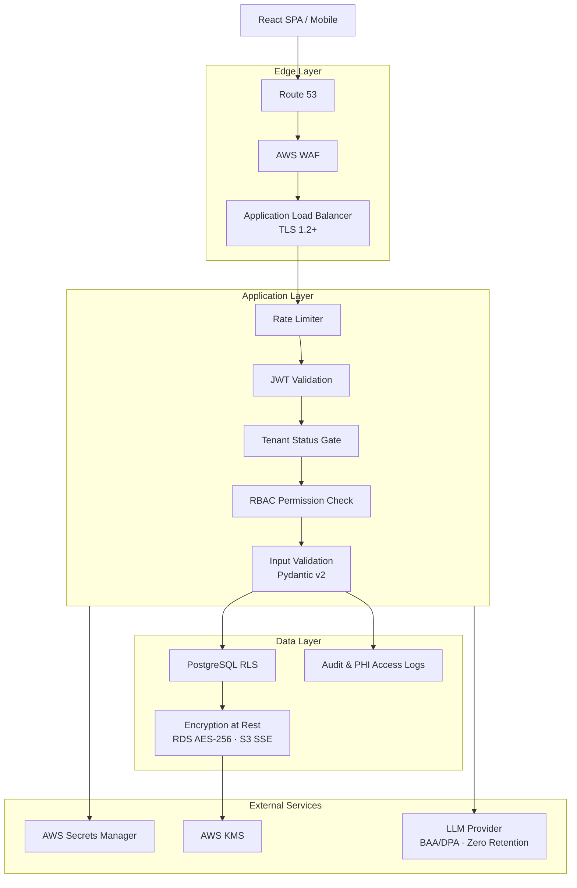
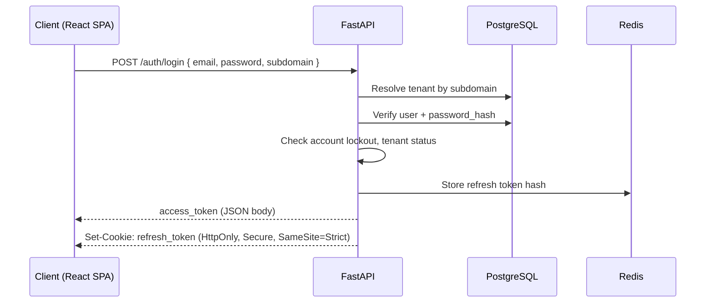
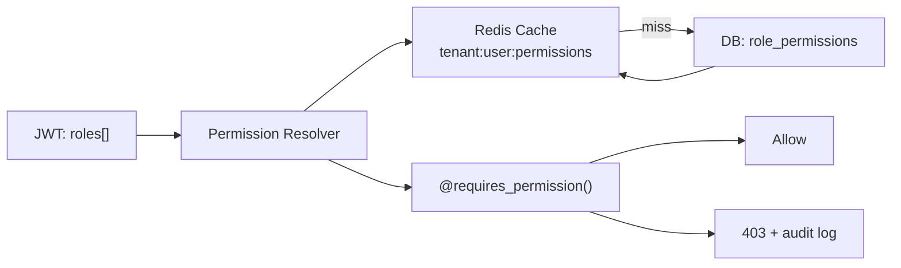
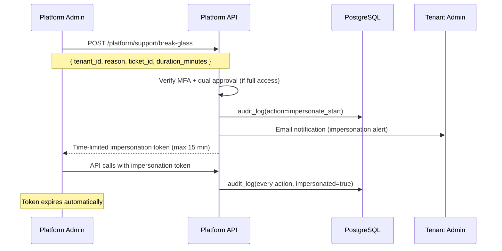
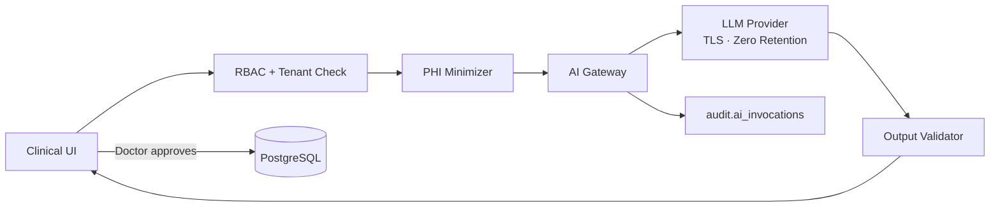

# Security Architecture Document

## Multi-Tenant Hospital Management SaaS Platform

| Field | Value |
|-------|-------|
| **Document Version** | 1.0 |
| **Status** | Draft |
| **Last Updated** | June 2026 |
| **Author** | Security & Platform Architecture |
| **Classification** | Internal — Engineering, Security, Compliance |
| **Related Documents** | RBAC_DESIGN.md, MULTI_TENANT_DESIGN.md, SYSTEM_ARCHITECTURE.md, DATABASE_DESIGN.md, NON_FUNCTIONAL_REQUIREMENTS.md, AI_FEATURES.md |

---

## 1. Executive Summary

This document defines the **authoritative security architecture** for the Multi-Tenant Hospital Management SaaS Platform. It specifies threat models, security controls, authentication and authorization patterns, data protection requirements, and compliance obligations for a healthcare SaaS product handling Protected Health Information (PHI).

### 1.1 Security Objectives

| Objective | Description |
|-----------|-------------|
| **Confidentiality** | PHI and tenant data accessible only to authorized users within the correct tenant context |
| **Integrity** | Clinical and financial records cannot be tampered with undetected |
| **Availability** | Platform maintains 99.9% uptime; security controls do not block legitimate care workflows |
| **Accountability** | All security-sensitive actions are audit-logged with actor, tenant, timestamp, and resource |
| **Isolation** | Zero cross-tenant data leakage — verified in CI on every build |

### 1.2 Security Design Principles

| Principle | Implementation |
|-----------|----------------|
| Defence in depth | WAF → rate limit → JWT → RBAC → app filter → RLS |
| Least privilege | RBAC with role-based minimum permissions; no default clinical access for platform admin |
| Fail secure | Missing `tenant_id` context returns zero rows (RLS); auth failures deny access |
| Zero trust (internal) | Every request re-validates JWT, tenant status, and permissions |
| Human-in-the-loop (AI) | AI never auto-commits clinical data; clinician approval required |
| Privacy by design | PHI minimization in logs, AI prompts, and third-party integrations |

---

## 2. Security Architecture Overview

### 2.1 Layered Security Model



### 2.2 Trust Boundaries

| Boundary | Trust Level | Controls |
|----------|-------------|----------|
| Internet → ALB | Untrusted | WAF, TLS, rate limiting |
| ALB → FastAPI | Semi-trusted | JWT validation, request size limits |
| FastAPI → PostgreSQL | Trusted (app role) | Parameterized queries, RLS, `SET app.tenant_id` |
| FastAPI → S3 | Trusted (IAM role) | Pre-signed URLs, tenant-prefixed paths |
| FastAPI → LLM Provider | Semi-trusted | PHI minimization, BAA/DPA, TLS, audit |
| Platform Admin → Production | Restricted | MFA, break-glass ticket, time-bound tokens |
| Background Worker → DB | Trusted (worker role) | `tenant_id` in every job payload |

---

## 3. Threat Model (STRIDE)

### 3.1 STRIDE Analysis

| Threat Category | Threat | Attack Vector | Risk | Mitigation |
|-----------------|--------|---------------|------|------------|
| **Spoofing** | Attacker impersonates valid user | Stolen credentials, session hijack | High | JWT RS256, refresh token rotation, account lockout, 2FA (Owner/Admin) |
| **Spoofing** | Attacker impersonates another tenant | JWT `tenant_id` tampering | Critical | RS256 signature; `tenant_id` from JWT only |
| **Tampering** | Modify clinical/billing records | API manipulation, SQL injection | High | RBAC, optimistic locking (`version`), audit logs, parameterized queries |
| **Tampering** | Modify subscription/billing state | Webhook replay, forged events | High | Webhook signature verification, idempotency keys |
| **Repudiation** | User denies action | No audit trail | Medium | Immutable `audit.audit_logs`; PHI access logs |
| **Information Disclosure** | Cross-tenant data leak | IDOR, missing `tenant_id` filter | Critical | RLS + app filter + composite FKs; return 404 not 403 |
| **Information Disclosure** | PHI in logs/AI prompts | Verbose logging, LLM context | High | Log redaction, PHI minimization, prompt hashing only in audit |
| **Information Disclosure** | RDS/S3 snapshot theft | Cloud misconfiguration | High | Encryption at rest, IAM least privilege, no dev snapshot access |
| **Denial of Service** | API flooding | DDoS, brute force login | Medium | WAF, rate limits (10/min auth, 1000/min/tenant), connection pool limits |
| **Denial of Service** | Noisy neighbor tenant | Heavy queries/reports | Medium | Per-tenant rate limits, 30s query timeout, fair job scheduling |
| **Elevation of Privilege** | User gains admin permissions | RBAC bypass, role manipulation | High | Server-side permission resolution; permissions not in JWT |
| **Elevation of Privilege** | Platform admin reads PHI | BYPASSRLS abuse | Critical | Break-glass workflow, MFA, dual approval, read-only default |

### 3.2 Attack Trees (Priority Threats)

#### T-01: Cross-Tenant Patient Data Access (IDOR)

```
Goal: Read patient record from Tenant B using Tenant A credentials
├── Path A: Manipulate patient_id in URL
│   └── Mitigation: tenant_id filter + RLS → 404
├── Path B: Inject tenant_id in request body
│   └── Mitigation: Ignored; JWT tenant_id authoritative
├── Path C: SQL injection bypassing filter
│   └── Mitigation: Parameterized queries + RLS
└── Path D: Cache key without tenant prefix
    └── Mitigation: Mandatory tenant:{id}: prefix
```

#### T-02: Credential Compromise

```
Goal: Access HMS with stolen password
├── Path A: Brute force login
│   └── Mitigation: 10 attempts/min/IP; account lockout after 5 failures
├── Path B: Phished credentials
│   └── Mitigation: 2FA for Owner/Admin (Sprint 11+)
├── Path C: Stolen refresh token
│   └── Mitigation: HttpOnly cookie, SameSite=Strict, rotation on refresh
└── Path D: JWT theft via XSS
    └── Mitigation: Access token in memory only; CSP headers; short TTL (30 min)
```

---

## 4. Security Control Matrix

| Control ID | Control | Layer | NFR Reference | MVP | Phase 2 |
|------------|---------|-------|---------------|-----|---------|
| SEC-001 | TLS 1.2+ on all endpoints | Transport | NFR-SEC-001 | ✅ | — |
| SEC-002 | AES-256 encryption at rest (RDS, S3) | Data | NFR-SEC-002 | ✅ | — |
| SEC-003 | Application `tenant_id` filtering | Tenancy | NFR-SEC-003 | ✅ | — |
| SEC-004 | PostgreSQL RLS on all tenant tables | Tenancy | NFR-SEC-004 | ✅ | — |
| SEC-005 | JWT RS256, 30-min access token | Auth | NFR-SEC-005 | ✅ | — |
| SEC-006 | bcrypt/argon2 password hashing | Auth | NFR-SEC-006 | ✅ | — |
| SEC-007 | Parameterized queries / ORM only | App | NFR-SEC-007 | ✅ | — |
| SEC-008 | CSP + input sanitization (XSS) | App | NFR-SEC-008 | ✅ | — |
| SEC-009 | Bearer token API (CSRF N/A) | App | NFR-SEC-009 | ✅ | — |
| SEC-010 | Auth endpoint rate limiting | Edge | NFR-SEC-010 | ✅ | — |
| SEC-011 | Per-tenant API rate limiting | Edge | NFR-SEC-011 | ✅ | — |
| SEC-012 | Security response headers | Edge | NFR-SEC-012 | ✅ | — |
| SEC-013 | Dependency scanning in CI | DevSecOps | NFR-SEC-013 | ✅ | — |
| SEC-014 | Pre-launch + annual pen test | Assurance | NFR-SEC-014 | ✅ | Annual |
| SEC-015 | AWS Secrets Manager | Secrets | NFR-SEC-015 | ✅ | — |
| SEC-016 | Security event audit logging | Audit | NFR-SEC-016 | ✅ | — |
| SEC-017 | Session invalidation on password change | Auth | NFR-SEC-017 | ✅ | — |
| SEC-018 | IP allowlisting (Enterprise) | Network | NFR-SEC-018 | — | ✅ |
| SEC-019 | TOTP 2FA (Owner/Admin) | Auth | NFR-SEC-019 | Sprint 11 | — |
| SEC-020 | Cross-tenant isolation CI tests | Tenancy | NFR-SEC-020 | ✅ | — |
| SEC-021 | PHI access logging | Compliance | NFR-COMP-010 | ✅ | — |
| SEC-022 | Field-level encryption (phone, email) | Data | — | — | ✅ |
| SEC-023 | File upload virus scanning | App | — | Before go-live | — |
| SEC-024 | AWS WAF + geo/IP reputation | Edge | — | ✅ | — |
| SEC-025 | Structured log redaction | DevSecOps | — | ✅ | — |
| SEC-026 | AI PHI minimization + BAA | AI | — | Post-MVP | — |
| SEC-027 | Break-glass impersonation controls | Platform | — | ✅ | — |

---

## 5. Authentication & Session Management

### 5.1 Authentication Flow



### 5.2 JWT Token Design

**Access token payload (minimal claims):**

```json
{
  "iss": "https://auth.platform.com",
  "sub": "a1b2c3d4-e5f6-7890-abcd-ef1234567890",
  "tenant_id": "7c9e6679-7425-40de-944b-e07fc1f90ae7",
  "roles": ["doctor"],
  "iat": 1718611200,
  "exp": 1718613000,
  "jti": "unique-token-id"
}
```

| Design Decision | Rationale |
|-----------------|-----------|
| **Permissions NOT in JWT** | Avoids token bloat and stale permissions after role change |
| **Roles in JWT** | Lightweight; used for UI menu rendering only |
| **Permissions resolved server-side** | Redis-cached permission set; invalidated on role change |
| **RS256 (asymmetric)** | API validates with public key; signing key in Secrets Manager |
| **30-minute TTL** | Limits exposure window for stolen tokens |
| **`tenant_id` required** | Every authenticated request is tenant-scoped |

### 5.3 Refresh Token Strategy

| Attribute | Value |
|-----------|-------|
| Storage | HttpOnly, Secure, SameSite=Strict cookie |
| TTL | 7 days |
| Rotation | New refresh token issued on every refresh; old token invalidated |
| Binding | Tied to `user_id` + `tenant_id` + device fingerprint (optional) |
| CSRF | Not applicable — API uses Bearer token for access; refresh endpoint validates cookie origin |

### 5.4 Password Policy

| Rule | Requirement |
|------|-------------|
| Minimum length | 8 characters |
| Complexity | 1 uppercase, 1 lowercase, 1 number, 1 special character |
| Hashing | bcrypt (cost factor 12) or Argon2id |
| History | Last 5 passwords cannot be reused (Phase 2) |
| Breach check | HaveIBeenPwned API check on registration (Phase 2) |

### 5.5 Account Lockout

| Event | Action |
|-------|--------|
| 5 consecutive failed logins | Account locked for 15 minutes |
| 10 failed logins from same IP/minute | IP rate-limited |
| Password reset requested | All active sessions invalidated |
| Password changed | All refresh tokens revoked |

### 5.6 Two-Factor Authentication (2FA)

| Attribute | Value |
|-----------|-------|
| Method | TOTP (RFC 6238) — Google Authenticator compatible |
| Required for | Hospital Owner, Hospital Admin (Sprint 11 minimum) |
| Optional for | All staff roles (tenant-configurable) |
| Recovery | 10 single-use backup codes (hashed, shown once) |
| Enforcement | Block sensitive actions (`admin:subscription`, data export) without 2FA |

### 5.7 Public Registration Security

| Control | Implementation |
|---------|----------------|
| CAPTCHA | hCaptcha/reCAPTCHA on `/auth/register` |
| Email verification | Required before trial features fully activated |
| Slug validation | Regex `^[a-z0-9-]+$`; reserved words blocked |
| Enterprise signup | Manual review queue for `enterprise` plan_code |
| Idempotency | `X-Idempotency-Key` prevents duplicate tenant creation |

---

## 6. Authorization

Authorization is defined in **RBAC_DESIGN.md**. Security-relevant enforcement rules:

### 6.1 Permission Resolution Flow



### 6.2 Enforcement Layers

| Layer | Mechanism | Failure Mode |
|-------|-----------|--------------|
| API (FastAPI) | `@requires_permission("patient:read")` decorator | HTTP 403 |
| Service | Explicit permission check in business logic | Raise `PermissionDenied` |
| UI (React) | `<PermissionGuard permission="patient:read">` | Hide/disable UI element |
| Database | RLS policies (tenant isolation, not RBAC) | Zero rows returned |

### 6.3 Sensitive Permission Gates

| Permission | Additional Gate |
|------------|-----------------|
| `billing:void` | Requires 2FA if enabled |
| `admin:subscription` | Hospital Owner only + 2FA |
| `patient:export` | Audit log + email notification to Owner |
| `audit:read` | Hospital Owner or Admin |
| `admin:impersonate` | Platform Admin + break-glass ticket |

---

## 7. Multi-Tenant Security

> Full multi-tenant isolation specification: **MULTI_TENANT_DESIGN.md**

### 7.1 Tenant Context Rules

| Rule | Description |
|------|-------------|
| **Rule 1** | `tenant_id` is extracted from JWT claim — never from request body, query params, or URL path |
| **Rule 2** | Every database query includes `tenant_id` in WHERE clause |
| **Rule 3** | Every INSERT sets `tenant_id` from request context |
| **Rule 4** | JOINs include `tenant_id` equality on both sides |
| **Rule 5** | Background jobs require `tenant_id` in SQS message payload |
| **Rule 6** | Cache keys prefixed: `tenant:{tenant_id}:{namespace}:{key}` |
| **Rule 7** | S3 paths: `s3://bucket/tenants/{tenant_id}/...` |

### 7.2 IDOR Prevention

```python
# Return 404 (not 403) to avoid confirming resource existence in other tenants
@router.get("/api/v1/patients/{patient_id}")
@requires_permission("patient:read")
async def get_patient(patient_id: UUID, request: Request, db: Session):
    patient = (
        db.query(Patient)
        .filter(Patient.tenant_id == request.state.tenant_id)
        .filter(Patient.id == patient_id)
        .filter(Patient.deleted_at.is_(None))
        .first()
    )
    if not patient:
        raise HTTPException(status_code=404, detail="Patient not found")
    await log_phi_access(request.state.user_id, patient_id, "read")
    return patient
```

### 7.3 Subscription Status Gate

Suspended or cancelled tenants are blocked at middleware before RBAC:

| Tenant Status | API Access | Data Access |
|---------------|------------|-------------|
| `trial` | Full (within limits) | Read/Write |
| `active` | Full | Read/Write |
| `past_due` | Full (grace period) | Read/Write |
| `suspended` | Blocked (403) | Read-only export window |
| `cancelled` | Blocked (403) | Export only (90 days) |

---

## 8. Data Protection

### 8.1 Encryption

| Data State | Method | Key Management |
|------------|--------|----------------|
| In transit | TLS 1.2+ (ALB termination) | ACM auto-renewal |
| RDS at rest | AES-256 (AWS managed) | AWS KMS default key |
| S3 at rest | SSE-S3 or SSE-KMS | Per-bucket KMS key |
| Secrets | AWS Secrets Manager | Auto-rotation for DB credentials |
| Passwords | bcrypt/Argon2id | N/A (one-way hash) |
| JWT signing | RS256 private key | Secrets Manager |
| Field-level PHI (Phase 2) | AES-256-GCM per field | Tenant-scoped KMS key (Enterprise) |

### 8.2 Field-Level Encryption (Phase 2)

| Field | Table | Priority |
|-------|-------|----------|
| `phone` | `core.patients`, `core.users` | P1 |
| `email` | `core.patients` | P1 |
| `address_line1`, `address_line2` | `core.patients` | P2 |
| `emergency_contact_phone` | `core.patient_contacts` | P2 |

Encryption is transparent to the application via SQLAlchemy column types; decryption occurs only in authorized service methods.

### 8.3 Data Classification

| Classification | Examples | Handling |
|----------------|----------|----------|
| **PHI** | Patient name, DOB, clinical notes, lab results | Encrypted, access-logged, retention policy |
| **PII** | Staff email, phone, address | Encrypted, RBAC-protected |
| **Financial** | Invoices, payments, subscription data | RBAC-protected, audit-logged |
| **Operational** | Audit logs, metrics | Immutable, 7-year retention |
| **Public** | Plan pricing, marketing content | No special handling |

### 8.4 Data Retention & Disposal

| Data Type | Retention | Disposal |
|-----------|-----------|----------|
| Clinical records | 7 years minimum (configurable) | Soft delete → archive → purge |
| Audit logs | 7 years | Anonymize PII; retain metadata |
| PHI access logs | 7 years | Append-only; no deletion |
| Session/refresh tokens | 7 days | Auto-expire |
| AI prompt audit metadata | 7 years | Hash only; no raw prompts stored |
| Cancelled tenant data | 90 days post-cancellation | `platform.purge_tenant()` job |
| S3 patient documents | Per tenant retention policy | Lifecycle rule → Glacier → delete |

---

## 9. Network Security

### 9.1 AWS Network Architecture

| Component | Configuration |
|-----------|---------------|
| VPC | Private subnets for ECS, RDS, Redis; public subnet for ALB only |
| Security Groups | ALB → ECS (443); ECS → RDS (5432); ECS → Redis (6379) |
| NACLs | Default deny inbound; allow ALB → ECS |
| AWS WAF | OWASP Top 10 rules, geo-blocking (configurable), IP reputation |
| DDoS | AWS Shield Standard (ALB); rate limiting at WAF + application |

### 9.2 Security Headers

Applied by ALB / FastAPI middleware on all responses:

```
Strict-Transport-Security: max-age=31536000; includeSubDomains
X-Content-Type-Options: nosniff
X-Frame-Options: DENY
Content-Security-Policy: default-src 'self'; script-src 'self'; style-src 'self' 'unsafe-inline'
Referrer-Policy: strict-origin-when-cross-origin
Permissions-Policy: camera=(), microphone=(), geolocation=()
Cache-Control: no-store (for authenticated API responses)
```

### 9.3 Enterprise IP Allowlisting

| Attribute | Value |
|-----------|-------|
| Availability | Enterprise plan only |
| Configuration | `platform.tenant_settings` key `security.ip_allowlist` |
| Enforcement | ALB listener rule or application middleware |
| Bypass | Platform admin break-glass from approved IPs only |

---

## 10. Application Security

### 10.1 OWASP Top 10 Mitigations

| OWASP Risk | Mitigation |
|------------|------------|
| A01 Broken Access Control | RBAC + RLS + tenant_id filtering + isolation tests |
| A02 Cryptographic Failures | TLS, AES-256 at rest, bcrypt passwords |
| A03 Injection | Parameterized queries, Pydantic validation, ORM |
| A04 Insecure Design | Threat modeling (this document), security reviews |
| A05 Security Misconfiguration | IaC (Terraform), hardened AMIs, no default creds |
| A06 Vulnerable Components | Dependabot/Snyk in CI; monthly dependency review |
| A07 Auth Failures | JWT, lockout, 2FA, refresh rotation |
| A08 Data Integrity Failures | Audit logs, optimistic locking, webhook signatures |
| A09 Logging Failures | Structured JSON logs, CloudWatch, alerting |
| A10 SSRF | Allowlist external URLs; no user-controlled fetch |

### 10.2 Input Validation

| Layer | Tool | Scope |
|-------|------|-------|
| API | Pydantic v2 models | All request/response schemas |
| Database | CHECK constraints, ENUMs | Status fields, amounts ≥ 0 |
| File upload | MIME type + extension allowlist | PDF, JPG, PNG, CSV only |
| CSV import | Row-level validation | Reject malformed rows with error report |

### 10.3 File Upload Security

| Control | Implementation |
|---------|----------------|
| Storage | S3 pre-signed URLs; server generates key (no client path) |
| Path | `tenants/{tenant_id}/patients/{patient_id}/documents/{uuid}.{ext}` |
| Size limit | 10 MB per file (configurable per plan) |
| Virus scan | ClamAV scan in SQS worker before marking file active (mandatory before go-live) |
| Content-Type | Validated against magic bytes, not just extension |
| Access | Pre-signed download URLs with 15-minute expiry |

### 10.4 CSRF Policy

| Context | Policy |
|---------|--------|
| REST API (Bearer token) | CSRF not applicable — token in `Authorization` header |
| Refresh token cookie | `SameSite=Strict`; refresh endpoint validates `Origin` header |
| Future cookie-based auth | CSRF token required (not planned for MVP) |

---

## 11. Audit & Logging

### 11.1 Audit Log Architecture

| Log Type | Table | Retention | Mutable |
|----------|-------|-----------|---------|
| Data mutations | `audit.audit_logs` | 7 years | No (append-only) |
| PHI access | `audit.phi_access_logs` | 7 years | No (append-only) |
| Security events | `audit.audit_logs` (category: security) | 7 years | No |
| AI invocations | `audit.ai_invocations` | 7 years | No |
| Notification delivery | `comms.notification_delivery_log` | 2 years | No |

### 11.2 Audit Log Schema (Mutations)

| Field | Description |
|-------|-------------|
| `tenant_id` | Tenant scope |
| `user_id` | Actor |
| `action` | `create`, `update`, `delete`, `void`, `login`, `export` |
| `resource_type` | `patient`, `invoice`, `prescription`, etc. |
| `resource_id` | UUID of affected resource |
| `old_values` | JSONB snapshot (for updates) |
| `new_values` | JSONB snapshot |
| `ip_address` | Client IP |
| `user_agent` | Browser/client identifier |
| `request_id` | Correlation ID |

### 11.3 PHI Access Logging (NFR-COMP-010)

Every read of patient clinical data triggers a PHI access log:

```sql
-- audit.phi_access_logs (append-only)
CREATE TABLE audit.phi_access_logs (
    id              UUID PRIMARY KEY,
    tenant_id       UUID NOT NULL,
    user_id         UUID NOT NULL,
    patient_id      UUID NOT NULL,
    resource_type   VARCHAR(50) NOT NULL,  -- patient, opd_visit, lab_report, etc.
    resource_id     UUID,
    action          VARCHAR(20) NOT NULL,  -- read, export, print
    ip_address      INET,
    created_at      TIMESTAMPTZ NOT NULL DEFAULT NOW()
);
```

**Triggers:** `GET /patients/{id}`, `GET /patients/{id}/visits`, lab report view, prescription view, data export.

### 11.4 Security Event Logging

| Event | Severity | Alert |
|-------|----------|-------|
| Login failure (5+ consecutive) | Warning | Email to user |
| Login from new device/IP | Info | Email notification |
| Permission denied (repeated) | Warning | Security review |
| Cross-tenant query anomaly | Critical | P1 pager |
| Data export initiated | Info | Email to Hospital Owner |
| Break-glass impersonation started | Critical | Email to tenant admin |
| Password reset | Info | Email to user |
| 2FA disabled | Warning | Email to Owner |
| Webhook signature failure | Warning | Engineering alert |

### 11.5 Log Redaction

Structured logs must never contain:

| Field | Redaction |
|-------|-----------|
| Passwords | Never logged |
| JWT tokens | Log `jti` only |
| Refresh tokens | Never logged |
| Patient PHI | Log `patient_id` only; never name/phone in app logs |
| Payment card numbers | Never logged; Razorpay token ID only |
| API keys / secrets | Never logged |

---

## 12. Platform Admin & Break-Glass Access

### 12.1 Platform Admin Restrictions

| Rule | Description |
|------|-------------|
| No default PHI access | Platform admin JWT cannot access clinical endpoints |
| Separate auth realm | `platform-admin` issuer; distinct from tenant JWT |
| `platform.*` schema only | Tenant management, subscription, health metrics |
| MFA required | TOTP mandatory for all platform admin accounts |
| All actions audited | Every platform admin API call logged with reason |

### 12.2 Break-Glass Impersonation Workflow



| Attribute | Value |
|-----------|-------|
| Max duration | 15 minutes (read-only); 60 minutes (full, dual approval) |
| Default scope | `read_only` |
| UI indicator | Red banner: "Support session active" |
| Tenant notification | Email to Hospital Owner on start and end |
| Audit | Every action tagged `impersonated_by: platform_admin_id` |

### 12.3 BYPASSRLS Database Role

```sql
-- Granted ONLY to break-glass migration tooling — never to application runtime
CREATE ROLE platform_break_glass BYPASSRLS;
-- Requires: ticket_id, MFA, time-bound session, full audit
```

Application runtime uses `hms_app` role **without** BYPASSRLS. All tenant data access goes through RLS.

---

## 13. AI Security

> Full AI security specification: **AI_FEATURES.md**

### 13.1 AI Security Controls

| Control | Implementation |
|---------|----------------|
| PHI minimization | Send age, gender, diagnosis — not name, phone, MRN |
| Provider contract | BAA/DPA with LLM provider; zero-retention option |
| Region | India/APAC region endpoint where available |
| Human-in-the-loop | Doctor must approve before saving AI output to patient record |
| Audit | `audit.ai_invocations` — prompt hash, model, tokens, latency (no raw prompt) |
| Rate limiting | Per-tenant daily token budget; per-user limits |
| Fail-safe | AI unavailable → manual workflow continues |
| UI transparency | All AI content labeled; disclaimer displayed |

### 13.2 AI Data Flow Security



---

## 14. Secrets Management

| Secret | Storage | Rotation |
|--------|---------|----------|
| Database credentials | AWS Secrets Manager | 90 days auto-rotate |
| JWT signing key (RS256) | AWS Secrets Manager | Annual manual rotate |
| Razorpay API keys | AWS Secrets Manager | On compromise |
| SMS/Email API keys | AWS Secrets Manager | Annual |
| LLM API keys | AWS Secrets Manager | Quarterly |
| Encryption keys (KMS) | AWS KMS | Annual |

**Rules:**
- No secrets in source code, `.env` files committed to git, or Docker images
- CI/CD retrieves secrets from Secrets Manager at deploy time
- Developer local dev uses `.env.local` (gitignored) with sandbox credentials only

---

## 15. Incident Response

### 15.1 Severity Classification

| Severity | Definition | Response Time | Example |
|----------|------------|---------------|---------|
| P1 — Critical | Active data breach or cross-tenant leak | 15 minutes | PHI exposed to wrong tenant |
| P2 — High | Security control failure, no confirmed breach | 1 hour | WAF bypass attempt, elevated error rate |
| P3 — Medium | Potential vulnerability discovered | 24 hours | Dependency CVE (high severity) |
| P4 — Low | Security improvement needed | Next sprint | Missing security header |

### 15.2 Incident Response Procedure

| Step | Action | Owner |
|------|--------|-------|
| 1 | Detect and classify (monitoring, report, pen test) | Security lead |
| 2 | Contain (block endpoint, revoke tokens, disable account) | Engineering |
| 3 | Preserve evidence (logs, snapshots, `request_id` correlation) | DevOps |
| 4 | Assess scope (affected tenants, data types, timeline) | Security + Engineering |
| 5 | Notify affected tenants (within 72 hours per DPDP) | Legal + CS |
| 6 | Remediate (patch, deploy, expand test coverage) | Engineering |
| 7 | Post-incident review (root cause, action items) | All stakeholders |

### 15.3 Breach Notification (DPDP Act 2023)

| Requirement | Implementation |
|-------------|----------------|
| Notify Data Protection Board | Within 72 hours of becoming aware |
| Notify affected individuals | Without delay if high risk to rights |
| Document breach | Incident report with scope, cause, remediation |
| Tenant notification | Email to Hospital Owner + in-app banner |

---

## 16. Security Testing

### 16.1 Testing Requirements

| Test Type | Frequency | Scope |
|-----------|-----------|-------|
| Cross-tenant isolation tests | Every CI build | All tenant-scoped endpoints |
| RLS policy tests | Every CI build | `SET app.tenant_id` verification |
| SAST (static analysis) | Every PR | Bandit, Semgrep |
| Dependency scanning | Every PR | Snyk/Dependabot |
| DAST | Monthly (staging) | OWASP ZAP automated scan |
| Penetration test | Pre-launch + annual | Third-party firm |
| RLS bypass test (`SET ROLE`) | Quarterly | Verify app role cannot bypass RLS |

### 16.2 Pre-Launch Security Gate

Before first paying tenant onboarding:

- [ ] Penetration test completed; critical/high findings remediated
- [ ] Cross-tenant isolation test suite passing (100% coverage on tenant endpoints)
- [ ] RLS enabled and forced on all 61+ tenant tables
- [ ] PHI access logging operational
- [ ] WAF rules active
- [ ] Secrets in Secrets Manager (no hardcoded credentials)
- [ ] File upload virus scanning enabled
- [ ] Security headers verified
- [ ] Incident response runbook documented
- [ ] Backup restore tested

---

## 17. Compliance Mapping

### 17.1 DPDP Act 2023 (India)

| Requirement | Control |
|-------------|---------|
| Lawful processing | Consent recorded in `core.consent_records` |
| Purpose limitation | Privacy policy defines data use; no secondary use |
| Data minimization | Collect only required patient fields |
| Right to access | Patient data export via tenant admin |
| Right to erasure | Patient anonymization workflow (where applicable) |
| Data breach notification | Incident response §15 |
| Data Protection Officer | Contact published in privacy policy |
| Cross-border transfer | Data residency in India (MVP); region selection Phase 2 |

### 17.2 ISO 27001 Alignment (Selected Controls)

| Annex A Control | Implementation |
|-----------------|----------------|
| A.9 Access control | RBAC, JWT, 2FA |
| A.10 Cryptography | TLS, AES-256, bcrypt |
| A.12 Operations security | Monitoring, patching, backup |
| A.14 System acquisition | Secure SDLC, dependency scanning |
| A.16 Incident management | §15 Incident Response |
| A.18 Compliance | Audit logs, retention policies |

### 17.3 Healthcare-Specific

| Standard | Status | Plan |
|----------|--------|------|
| EHR Standards (India) | Planned | ABHA integration Phase 3+ |
| Clinical Establishments Act | Legal review | Record retention alignment |
| NABH accreditation support | Phase 2 | Compliance module (ADVANCED_FEATURES_ROADMAP) |
| SOC 2 Type II | Year 2 target | Control evidence from this document |

---

## 18. Security NFR Traceability

| NFR ID | Requirement | Section |
|--------|-------------|---------|
| NFR-SEC-001 | TLS 1.2+ | §9.1 |
| NFR-SEC-002 | Encryption at rest | §8.1 |
| NFR-SEC-003 | App-layer tenant isolation | §7.1 |
| NFR-SEC-004 | Database RLS | §7.1, MULTI_TENANT_DESIGN.md |
| NFR-SEC-005 | JWT authentication | §5.2 |
| NFR-SEC-006 | Password hashing | §5.4 |
| NFR-SEC-007 | SQL injection prevention | §10.1 |
| NFR-SEC-008 | XSS prevention | §9.2, §10.1 |
| NFR-SEC-009 | CSRF protection | §10.4 |
| NFR-SEC-010 | Auth rate limiting | §5.5, §9.1 |
| NFR-SEC-011 | Per-tenant rate limiting | §9.1 |
| NFR-SEC-012 | Security headers | §9.2 |
| NFR-SEC-013 | Dependency scanning | §16.1 |
| NFR-SEC-014 | Penetration testing | §16.1, §16.2 |
| NFR-SEC-015 | Secrets management | §14 |
| NFR-SEC-016 | Security audit logging | §11.4 |
| NFR-SEC-017 | Session invalidation | §5.5 |
| NFR-SEC-018 | IP allowlisting | §9.3 |
| NFR-SEC-019 | 2FA | §5.6 |
| NFR-SEC-020 | Zero cross-tenant leakage | §7, §16.1 |
| NFR-COMP-010 | PHI access logging | §11.3 |

---

## 19. Revision History

| Version | Date | Author | Changes |
|---------|------|--------|---------|
| 1.0 | June 2026 | Security & Platform Architecture | Initial security architecture document |

---

*This document is the authoritative security reference. Implementation must not deviate from critical controls (SEC-001 through SEC-007, SEC-020, SEC-021) without written security review approval.*
