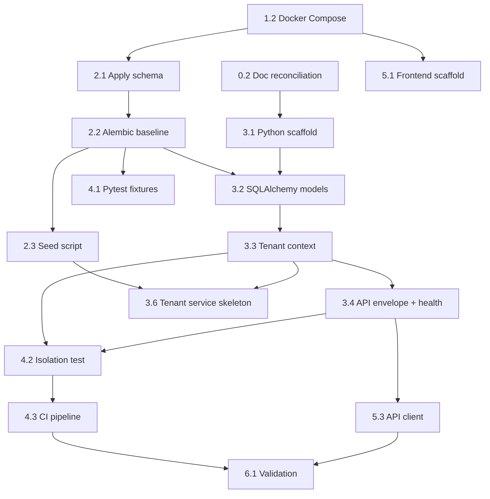

# Sprint 1 Execution Guide

## Build the Project Foundation

| Field | Value |
|-------|-------|
| **Sprint** | 1 of 12 |
| **Duration** | 2 weeks (10 working days) |
| **Theme** | Foundation & Multi-Tenancy |
| **Capacity** | ~56 net development hours (solo full-stack) |
| **Gate** | **G1** — `schema.sql` reviewed; Docker Compose runs; isolation test scaffold passes |
| **Authoritative References** | `PROJECT_STRUCTURE.md` (frozen), `IMPLEMENTATION_PLAN.md` §2.1, `SPRINT_PLAN.md` §Sprint 1, `DEVELOPMENT_READINESS_REPORT.md`, `DATABASE_DESIGN.md`, `MULTI_TENANT_DESIGN.md`, `API_DESIGN.md` §2 |

---

## How to Use This Guide

This guide is written for a **solo developer** executing Sprint 1 alone. Follow tasks **in order** unless a dependency note says otherwise. Each task lists:

- **What** you are building
- **Why** it matters for later sprints
- **Steps** — concrete actions (no code; implementation is yours)
- **Verify** — how you know the task is done
- **Estimate** — hours from `SPRINT_PLAN.md`

**Weekly rhythm (recommended):**

| Day | Focus |
|-----|-------|
| Monday–Wednesday (Week 1) | Database + backend foundation |
| Thursday–Friday (Week 1) | Backend middleware + tests |
| Monday–Wednesday (Week 2) | Backend completion + CI |
| Thursday–Friday (Week 2) | Frontend shell + sprint review |

---

## 1. Objectives

By the end of Sprint 1, the project must have a **runnable local stack** and **tenant-safe data access patterns** before any auth or clinical features are built.

| # | Objective | Success Signal |
|---|-----------|----------------|
| O1 | **Local development environment** runs with one command | `docker compose up` → Postgres, Redis, API healthy |
| O2 | **Database baseline** applied and version-controlled via Alembic | `alembic upgrade head` on clean DB creates 61 tables + RLS |
| O3 | **Backend scaffold** matches frozen `PROJECT_STRUCTURE.md` | Domain folders, `core/tenant/`, `api/v1/health.py` exist |
| O4 | **Tenant isolation foundation** enforced at app + DB layers | `SET LOCAL app.tenant_id`; `TenantScopedRepository`; RLS test passes |
| O5 | **API standards** established early | Response envelope `{ data, meta, errors }`; correlation ID in logs |
| O6 | **Seed data** for system tenant, plans, permissions | `scripts/seed.py` idempotent; Sprint 2 auth can clone roles |
| O7 | **CI pipeline** blocks regressions | GitHub Actions: lint + pytest on PR |
| O8 | **Frontend shell** ready for Sprint 2 auth UI | Vite + React + Tailwind; API client stub; layout skeleton |
| O9 | **Documentation gate** cleared for Sprint 2 | JWT permission strategy and role naming conflicts resolved |

### Sprint 1 Non-Goals (Do Not Build Yet)

- User login, JWT issuance, or RBAC enforcement (Sprint 2)
- Patient, OPD, billing, or any clinical API (Sprints 3–4)
- Razorpay, email/SMS, SQS worker handlers (Sprints 4+)
- AWS staging/production deployment (stretch only; local is required)
- Full design system or production UI polish

---

## 2. Tasks

Tasks are grouped by **phase**. Total estimate: **~56 hours** (matches `SPRINT_PLAN.md`).

### Phase 0 — Sprint Kickoff (Day 1, ~2 hours)

#### Task 0.1 — Read and align on architecture

**What:** Internalize the frozen structure and Sprint 1 scope.

**Steps:**

1. Read `PROJECT_STRUCTURE.md` §2–5 (monorepo, backend, database).
2. Read `MULTI_TENANT_DESIGN.md` §7–8 (query filtering, RLS).
3. Read `API_DESIGN.md` §2 (global conventions, response envelope).
4. Read `DEVELOPMENT_READINESS_REPORT.md` §5 (inconsistencies C-01, C-02, C-08).
5. Skim `database/baseline/schema.sql` table of contents / schema list — confirm 61 tables and `platform.create_tenant()` function exist at end of file.
6. Create a personal sprint board (GitHub Projects, Notion, or markdown checklist) mirroring deliverables in §4.

**Verify:** You can explain where tenant middleware, repositories, and Alembic migrations live without opening docs.

**Estimate:** 2 hrs

---

#### Task 0.2 — Documentation reconciliation (Sprint 2 blocker)

**What:** Fix known cross-document conflicts **before** auth work in Sprint 2.

**Steps:**

1. **C-01 — JWT permissions:** Decide that permissions are **resolved server-side** (Redis + DB), **not** embedded in JWT. Source of truth: `SECURITY_ARCHITECTURE.md` §6 and `IMPLEMENTATION_PLAN.md` §6.1. Add a one-line note in your sprint journal; optionally add an errata comment in `SYSTEM_ARCHITECTURE.md` §6.3 when you edit docs later.
2. **C-02 — Role codes:** Use `RBAC_DESIGN.md` codes everywhere: `hospital_owner`, `hospital_admin`, `accountant` — not `tenant_admin` or `billing_staff`.
3. **C-08 — Provisioning seeds:** When writing seed SQL later, clone roles listed in `RBAC_DESIGN.md` §2.2, not `MULTI_TENANT_DESIGN.md` §3.4 (`tenant_admin`).

**Verify:** Written note in sprint journal or team wiki with the three decisions.

**Estimate:** 1 hr (included in Phase 0)

---

### Phase 1 — Repository & Tooling (Day 1, ~4 hours)

#### Task 1.1 — Initialize git workflow

**What:** Establish branch strategy per `IMPLEMENTATION_PLAN.md` §11.

**Steps:**

1. Confirm you are on `dev` branch (or create `dev` from `main`).
2. Add root `.gitignore` entries for: `.env`, `.env.local`, `backend/.venv`, `frontend/node_modules`, `backend/keys/*.pem`, `__pycache__`, `.pytest_cache`, `dist/`, `build/`.
3. Add root `.editorconfig` if missing (indent 4 for Python, 2 for TS/JSON).
4. Create `backend/.env.example` and `frontend/.env.example` with variables listed in `IMPLEMENTATION_PLAN.md` §12.3 (placeholder values only).

**Verify:** `git status` shows no secrets; `.env.example` files exist.

**Estimate:** 1 hr

---

#### Task 1.2 — Docker Compose local stack

**What:** Single-command infrastructure for Postgres and Redis.

**Steps:**

1. Create `docker-compose.yml` at monorepo root per `PROJECT_STRUCTURE.md` §2.
2. Define service `postgres`: image `postgres:14`, database `hms_dev`, user/password for local dev, port `5432`, named volume for data persistence.
3. Define service `redis`: image `redis:7-alpine`, port `6379`.
4. Optionally define service `api` (Sprint 1 end): build from `backend/Dockerfile`, depends on postgres + redis, port `8000`, env from `.env`.
5. Create `docker-compose.test.yml` for CI: ephemeral Postgres on different port/database name `hms_test`.
6. Document commands in root `README.md`: `docker compose up -d postgres redis`.

**Verify:**

- `docker compose up -d postgres redis` succeeds.
- `psql` connects to `hms_dev`.
- `redis-cli ping` returns `PONG`.

**Estimate:** 3 hrs

---

### Phase 2 — Database Setup (Days 1–3, ~14 hours)

See §6 for expanded database task breakdown.

#### Task 2.1 — Apply and verify baseline schema

**Estimate:** 4 hrs

#### Task 2.2 — Alembic initialization and baseline migration

**Estimate:** 4 hrs

#### Task 2.3 — Seed script (system tenant, plans, permissions)

**Estimate:** 3 hrs

#### Task 2.4 — RLS isolation smoke verification

**Estimate:** 3 hrs

---

### Phase 3 — Backend Setup (Days 2–8, ~24 hours)

See §7 for expanded backend task breakdown.

#### Task 3.1 — Python project scaffold

**Estimate:** 4 hrs

#### Task 3.2 — SQLAlchemy models (`platform` + `core`)

**Estimate:** 6 hrs

#### Task 3.3 — Tenant context (`core/tenant/`)

**Estimate:** 4 hrs

#### Task 3.4 — API envelope, exceptions, health endpoints

**Estimate:** 3 hrs

#### Task 3.5 — Correlation ID + structured logging

**Estimate:** 3 hrs

#### Task 3.6 — Platform tenant service skeleton + test endpoint

**Estimate:** 4 hrs

---

### Phase 4 — Testing & CI (Days 7–9, ~8 hours)

#### Task 4.1 — Pytest fixtures and test database

**What:** Repeatable test DB with two tenants.

**Steps:**

1. Create `backend/tests/conftest.py`.
2. Configure pytest to use `hms_test` database (from `docker-compose.test.yml` or env override).
3. Fixture: create Session, run migrations (`alembic upgrade head`), yield session, teardown/truncate.
4. Fixture: `tenant_a` and `tenant_b` — insert minimal rows into `platform.tenants` using `platform.create_tenant()` or direct SQL.
5. Fixture: optional `client` — FastAPI TestClient with lifespan.

**Verify:** `pytest backend/tests` collects tests without import errors.

**Estimate:** 3 hrs

---

#### Task 4.2 — Tenant isolation integration test

**What:** Mandatory cross-tenant test scaffold per `MULTI_TENANT_DESIGN.md` §11.3.

**Steps:**

1. Create `backend/tests/integration/test_tenant_isolation.py`.
2. Insert a patient (or any `core` row) under `tenant_a`.
3. Set session context to `tenant_b` via `SET LOCAL app.tenant_id`.
4. Assert SELECT by `tenant_a` patient ID returns no row.
5. Repeat via API once tenant middleware exists (optional in Sprint 1 if no auth yet — DB-level test is minimum).

**Verify:** Test passes locally and will run in CI.

**Estimate:** 3 hrs

---

#### Task 4.3 — GitHub Actions CI

**Steps:**

1. Create `.github/workflows/ci.yml`.
2. Job `backend`: checkout → setup Python 3.11 → install `requirements.txt` + `requirements-dev.txt` → start Postgres service (or docker-compose.test) → `alembic upgrade head` → `ruff check` → `pytest`.
3. Job `frontend` (optional Sprint 1): `npm ci` → `tsc --noEmit` → `eslint` (add when frontend exists).
4. Trigger on pull request to `dev` and push to `dev`.

**Verify:** Push a trivial commit; CI runs green.

**Estimate:** 2 hrs

---

### Phase 5 — Frontend Setup (Days 8–10, ~10 hours)

See §8 for expanded frontend task breakdown.

#### Task 5.1 — Vite + React + TypeScript + Tailwind

**Estimate:** 3 hrs

#### Task 5.2 — App shell, routing, design tokens

**Estimate:** 4 hrs

#### Task 5.3 — API client wrapper

**Estimate:** 3 hrs

---

### Phase 6 — Sprint Close (Day 10, ~4 hours)

#### Task 6.1 — Self-review checklist

Run every item in §9 Validation Checklist.

**Estimate:** 2 hrs

---

#### Task 6.2 — Sprint review and Sprint 2 prep

**Steps:**

1. Demo locally: `docker compose up` → `GET /health` → `GET /health/ready` → show isolation test pass.
2. Update root `README.md` quick-start with real commands.
3. Write Sprint 1 retrospective (what slipped, what to carry to Sprint 2).
4. Confirm Sprint 2 prerequisites: seeds include permissions; `core/tenant/` ready for JWT middleware.

**Estimate:** 2 hrs

---

## 3. Dependencies

### 3.1 External Prerequisites

| Dependency | Required Before | Notes |
|------------|-----------------|-------|
| Python 3.11+ | Task 3.1 | `python --version` |
| Node.js 20 LTS | Task 5.1 | For frontend shell |
| Docker Desktop | Task 1.2 | Windows: WSL2 backend recommended |
| Git | Task 1.1 | |
| PostgreSQL client (`psql`) | Task 2.1 | Optional but helpful for debugging |
| Code editor | Day 1 | VS Code / Cursor recommended |

### 3.2 Internal Task Dependencies



### 3.3 Document Dependencies

| Sprint 1 Work | Primary Doc | Secondary Doc |
|---------------|-------------|---------------|
| Folder layout | `PROJECT_STRUCTURE.md` | `IMPLEMENTATION_PLAN.md` §9 |
| Schema & RLS | `DATABASE_DESIGN.md` | `database/baseline/schema.sql` |
| Tenant rules | `MULTI_TENANT_DESIGN.md` | `SECURITY_ARCHITECTURE.md` §4 |
| API envelope | `API_DESIGN.md` §2.3 | `SYSTEM_ARCHITECTURE.md` §5.3 |
| Seed plans | `BILLING_SUBSCRIPTION.md` §2 | `DATABASE_DESIGN.md` §4.1 |
| System tenant UUID | `DATABASE_DESIGN.md` §1.5 | `00000000-0000-0000-0000-000000000001` |

### 3.4 Downstream Sprint Dependencies (What Sprint 2 Needs From Sprint 1)

| Sprint 2 Need | Sprint 1 Must Deliver |
|---------------|----------------------|
| JWT + login | `core/database.py`, `core/security.py` stub, `domains/identity/` folders |
| Tenant provisioning | `platform.create_tenant()` callable from service layer |
| RBAC seeding | `core.permissions` + `core.roles` seeded under system tenant |
| `@requires_permission` | `core/permissions.py` file exists (implementation Sprint 2) |
| Registration UI | Frontend `api/client.ts`, `AuthLayout`, routes stub |

---

## 4. Deliverables

| # | Deliverable | Acceptance Criteria | Owner |
|---|-------------|---------------------|-------|
| D1 | `docker-compose.yml` | Postgres 14 + Redis 7 start; documented in README | Dev |
| D2 | `docker-compose.test.yml` | CI can run integration tests against `hms_test` | Dev |
| D3 | Alembic `001_baseline` migration | `alembic upgrade head` on empty DB → 61 tables, RLS enabled | Dev |
| D4 | `backend/scripts/seed.py` | Idempotent; seeds system tenant, 3 plans, permission catalog | Dev |
| D5 | `database/seeds/01–03_*.sql` | SQL mirror of seed script (optional but recommended) | Dev |
| D6 | FastAPI app with health endpoints | `GET /health` → 200; `GET /health/ready` checks DB + Redis | Dev |
| D7 | Tenant context layer | `core/tenant/context.py` sets `SET LOCAL app.tenant_id` per request/session | Dev |
| D8 | `TenantScopedRepository` | `repositories/base.py` auto-filters `tenant_id` + `deleted_at IS NULL` | Dev |
| D9 | API response envelope | All JSON responses match `API_DESIGN.md` §2.3 shape | Dev |
| D10 | Structured logging | JSON logs include `request_id`, `tenant_id` (when set) | Dev |
| D11 | `test_tenant_isolation.py` | Cross-tenant row invisible; runs in CI | Dev |
| D12 | `.github/workflows/ci.yml` | Green on `dev` branch | Dev |
| D13 | Frontend Vite shell | `npm run dev` serves app; placeholder home route | Dev |
| D14 | API client stub | `src/api/client.ts` with base URL from env | Dev |
| D15 | Documentation gate | C-01, C-02, C-08 decisions recorded | Dev |

### Stretch Deliverables (Only If Ahead of Schedule)

| Deliverable | Notes |
|-------------|-------|
| `POST /api/v1/platform/tenants` skeleton | No auth; dev-only; calls `tenant_service.provision` |
| AWS staging ECS | Defer to Sprint 4 staging gate per `DEVELOPMENT_READINESS_REPORT` |
| `backend/Dockerfile` multi-stage | Needed before containerized deploy |

---

## 5. Expected Folder Structure Usage

Sprint 1 **creates** the following paths. Do **not** rename top-level folders (`PROJECT_STRUCTURE.md` is frozen).

### 5.1 Monorepo Root (create / populate)

```
hospital-management-saas/
├── docker-compose.yml          ← CREATE (Task 1.2)
├── docker-compose.test.yml     ← CREATE (Task 1.2)
├── .gitignore                  ← CREATE/UPDATE (Task 1.1)
├── .editorconfig               ← CREATE (Task 1.1)
├── README.md                   ← UPDATE quick-start (Task 6.2)
├── .github/workflows/ci.yml    ← CREATE (Task 4.3)
├── backend/                    ← POPULATE (Phase 3)
├── frontend/                   ← POPULATE (Phase 5)
└── database/seeds/             ← POPULATE (Task 2.3)
```

**Do not create in Sprint 1:** `infrastructure/terraform/` (defer), full `worker/handlers/` (defer to Sprint 4).

### 5.2 Backend — Minimum Sprint 1 Tree

Create directories and `__init__.py` files; implement only what is listed.

```
backend/
├── app/
│   ├── main.py                         ← App factory
│   ├── api/v1/
│   │   ├── router.py                   ← Mount health router only
│   │   ├── health.py                   ← /health, /health/ready
│   │   └── deps.py                     ← Stub pagination deps
│   ├── core/
│   │   ├── config.py                   ← Pydantic Settings
│   │   ├── database.py                 ← Engine, SessionLocal, get_db
│   │   ├── middleware.py               ← Register middleware chain
│   │   ├── logging.py                  ← JSON structured logging
│   │   ├── response.py                 ← APIResponse envelope
│   │   ├── exceptions.py               ← Base domain exceptions
│   │   ├── exception_handlers.py       ← Map to envelope
│   │   ├── security.py                 ← EMPTY STUB (Sprint 2)
│   │   ├── permissions.py              ← EMPTY STUB (Sprint 2)
│   │   └── tenant/
│   │       ├── context.py              ← tenant_db_session, SET LOCAL
│   │       ├── middleware.py           ← Stub: header/dev tenant for testing
│   │       └── resolver.py             ← Stub: slug lookup (Sprint 2)
│   ├── domains/
│   │   ├── platform/
│   │   │   ├── services/tenant_service.py
│   │   │   ├── repositories/tenant_repository.py
│   │   │   └── schemas/tenant.py
│   │   └── identity/                   ← CREATE folders only (Sprint 2)
│   ├── models/
│   │   ├── base.py                     ← TenantMixin, AuditMixin, SoftDeleteMixin
│   │   ├── platform.py                 ← tenants, plans, subscriptions, settings, locations
│   │   └── core.py                     ← users, roles, permissions, patients (models only)
│   └── repositories/
│       └── base.py                     ← TenantScopedRepository
├── alembic/
│   ├── env.py
│   └── versions/001_baseline.py
├── tests/
│   ├── conftest.py
│   └── integration/test_tenant_isolation.py
├── scripts/
│   └── seed.py
├── keys/.gitkeep
├── .env.example
├── pyproject.toml                      ← ruff, pytest config
├── requirements.txt
├── requirements-dev.txt
└── alembic.ini
```

**Sprint 1 rule:** Routers in `api/v1/` call `domains/*/services/` only — never query DB directly from routers.

### 5.3 Database — Sprint 1 Touch Points

```
database/
├── baseline/schema.sql         ← READ ONLY reference (do not edit unless bug found)
├── seeds/
│   ├── 01_system_tenant.sql    ← CREATE
│   ├── 02_subscription_plans.sql
│   └── 03_permissions.sql
└── rls/                        ← REFERENCE only; RLS already in schema.sql
```

Runtime changes go through **`backend/alembic/versions/`** only (`database/migrations-readme.md`).

### 5.4 Frontend — Minimum Sprint 1 Tree

```
frontend/
├── src/
│   ├── main.tsx
│   ├── App.tsx
│   ├── index.css                 ← Tailwind directives
│   ├── api/
│   │   ├── client.ts
│   │   ├── types.ts              ← APIResponse<T> mirror
│   │   └── endpoints/health.ts   ← call GET /health
│   ├── components/layout/
│   │   ├── AppLayout.tsx         ← Sidebar + header shell (static nav)
│   │   └── AuthLayout.tsx        ← Centered layout (empty)
│   ├── routes/index.tsx          ← Single home route + 404
│   ├── lib/constants.ts
│   └── styles/tokens.ts          ← Colors, spacing placeholders
├── .env.example
├── package.json
├── vite.config.ts
├── tailwind.config.ts
└── tsconfig.json
```

**Sprint 1 rule:** No feature modules under `features/` yet — only layout + API client.

---

## 6. Database Setup Tasks

### Task DB-1 — Apply and verify baseline schema (4 hrs)

**Why:** `database/baseline/schema.sql` is the authoritative 61-table design with RLS. Everything else builds on it.

**Steps:**

1. Start Postgres: `docker compose up -d postgres`.
2. Connect with `psql` to `hms_dev`.
3. Run baseline SQL:
   - **Option A (Sprint 1 quick path):** Execute `database/baseline/schema.sql` directly against `hms_dev`.
   - **Option B (preferred long-term):** Skip direct apply; use Alembic migration in DB-2 that embeds or runs equivalent DDL.
4. Verify schema count:
   - List schemas: `platform`, `core`, `clinical`, `billing`, `pharmacy`, `laboratory`, `comms`, `audit`.
   - Count tables: expect **61**.
5. Verify RLS:
   - Pick `core.patients` (or any tenant table).
   - Confirm `rowsecurity = true` in `pg_tables` / `\d+ core.patients`.
6. Verify `platform.create_tenant()`:
   - Confirm function exists: `\df platform.create_tenant`.
   - Read function signature at end of `schema.sql` (~line 2366).
7. Document any drift between `schema.sql` and `DATABASE_DESIGN.md` in a scratch note (report only if blocking).

**Verify:**

- 8 schemas, 61 tables.
- RLS enabled on tenant-scoped tables.
- `platform.create_tenant` callable (test in DB-4).

---

### Task DB-2 — Alembic initialization and baseline migration (4 hrs)

**Why:** All future schema changes must flow through Alembic (`PROJECT_STRUCTURE.md` §5.3).

**Steps:**

1. From `backend/`, initialize Alembic: `alembic init alembic`.
2. Configure `alembic.ini`:
   - Set `sqlalchemy.url` to read from env `DATABASE_URL` (not hardcoded).
3. Edit `alembic/env.py`:
   - Import `Base` from `app.models` (after models exist).
   - Set `target_metadata = Base.metadata`.
4. **Strategy for baseline:**
   - If you applied `schema.sql` manually in DB-1 Option A: create empty revision `001_baseline` and `alembic stamp head` (marks DB as current without re-running DDL).
   - If starting fresh: create revision that executes `schema.sql` content or autogenerate from models once models match schema.
5. Name revision: `001_baseline` — **never edit this file after it is on staging**.
6. Test on clean database:
   - Drop/recreate `hms_dev` OR use fresh Docker volume.
   - Run `alembic upgrade head`.
7. Test downgrade path if revision supports it (optional for baseline).

**Verify:**

- Fresh DB + `alembic upgrade head` = full schema.
- `alembic current` shows head revision.

---

### Task DB-3 — Seed script: system tenant, plans, permissions (3 hrs)

**Why:** Sprint 2 auth clones roles/permissions from system tenant (`RBAC_DESIGN.md` §9.1).

**Steps:**

1. Create `database/seeds/01_system_tenant.sql`:
   - Insert system tenant with fixed UUID `00000000-0000-0000-0000-000000000001` per `DATABASE_DESIGN.md` §1.5.
   - Set `tenant_id = id` (self-reference).
2. Create `database/seeds/02_subscription_plans.sql`:
   - Insert `starter`, `professional`, `enterprise` per `BILLING_SUBSCRIPTION.md` §2.1–2.2.
   - Include `features` JSONB flags per plan.
3. Create `database/seeds/03_permissions.sql`:
   - Insert permission catalog under system tenant per `RBAC_DESIGN.md` §3.5 module registry.
   - Use `laboratory:*` namespace consistently (not mixed `lab:*` unless you standardize all docs first).
4. Create `backend/scripts/seed.py`:
   - Read `DATABASE_URL` from env.
   - Execute seed SQL files in order (or equivalent ORM inserts).
   - Use `ON CONFLICT DO NOTHING` or check-before-insert for **idempotency**.
5. **Do not seed role_permissions yet** — full role matrix is Sprint 2 Task (clone on tenant provision).
6. Run seed: `python -m scripts.seed` from `backend/`.
7. Verify with SQL:
   - `SELECT id FROM platform.tenants WHERE id = '00000000-0000-0000-0000-000000000001'`.
   - `SELECT code FROM platform.subscription_plans`.
   - `SELECT count(*) FROM core.permissions WHERE tenant_id = system_uuid`.

**Verify:** Re-running seed does not duplicate rows.

---

### Task DB-4 — RLS isolation smoke verification (3 hrs)

**Why:** Proves database-layer isolation before app code relies on it.

**Steps:**

1. Create two test tenants using `SELECT platform.create_tenant(...)` with distinct slugs.
2. Note both `tenant_id` UUIDs.
3. Set context and insert:
   - `SET app.tenant_id = '<tenant_a_uuid>'`;
   - Insert one row into `core.patients` (minimal required columns per schema).
4. Switch context:
   - `SET app.tenant_id = '<tenant_b_uuid>'`;
   - `SELECT * FROM core.patients WHERE id = '<tenant_a_patient_id>'` → expect **0 rows**.
5. Wrong context test:
   - `RESET app.tenant_id`;
   - `SELECT count(*) FROM core.patients` → expect **0 rows** (fail-safe).
6. Document results in `backend/tests/integration/test_tenant_isolation.py` (automate what you just did manually).

**Verify:** Manual SQL and automated test agree.

---

## 7. Backend Setup Tasks

### Task BE-1 — Python project scaffold (4 hrs)

**Steps:**

1. Create `backend/` virtual environment; pin Python 3.11+.
2. Create `requirements.txt`: `fastapi`, `uvicorn[standard]`, `sqlalchemy>=2`, `alembic`, `psycopg2-binary` (or `asyncpg` if async — pick one ORM style and stay consistent), `pydantic-settings`, `python-dotenv`.
3. Create `requirements-dev.txt`: `pytest`, `pytest-cov`, `httpx`, `ruff`, `factory-boy` (optional).
4. Create `pyproject.toml` with ruff rules (line length 100, select `E`, `F`, `I`).
5. Create package structure per §5.2 — all `__init__.py` files.
6. Create `app/main.py`:
   - `create_app()` factory pattern.
   - Lifespan handler: dispose engine on shutdown.
   - Include CORS middleware (allow localhost:5173 for frontend).
   - Mount `api/v1/router.py`.
7. Confirm local run: `uvicorn app.main:app --reload --port 8000`.

**Verify:** Open `http://localhost:8000/docs` — Swagger loads (even if few routes).

---

### Task BE-2 — SQLAlchemy models: `platform` + `core` (6 hrs)

**Steps:**

1. Create `app/models/base.py`:
   - `DeclarativeBase`.
   - `TenantMixin` (`tenant_id` UUID FK).
   - `AuditMixin` (`created_at`, `created_by`, `updated_at`, `updated_by`, `version`).
   - `SoftDeleteMixin` (`deleted_at`, `deleted_by`).
2. Create `app/models/platform.py` — map tables:
   - `tenants`, `subscription_plans`, `tenant_subscriptions`, `tenant_locations`, `tenant_settings`.
3. Create `app/models/core.py` — map Sprint 1–2 critical tables:
   - `users`, `roles`, `permissions`, `role_permissions`, `user_roles`, `user_sessions`, `password_reset_tokens`.
   - Optionally stub `patients` for isolation test.
4. Match column names and types to `DATABASE_DESIGN.md` §4 — do not invent columns.
5. Register models in `app/models/__init__.py` for Alembic discovery.
6. Run `alembic revision --autogenerate` and **inspect diff** — autogenerate may not capture RLS; baseline should already match.

**Verify:** `Base.metadata.tables` includes expected table names with schema (`platform.tenants` style or `__table_args__ = {'schema': 'platform'}`).

---

### Task BE-3 — Tenant context layer (4 hrs)

**Reference:** `MULTI_TENANT_DESIGN.md` §7.3–7.4, `IMPLEMENTATION_PLAN.md` §7.1.

**Steps:**

1. **`core/tenant/context.py`:**
   - Implement `tenant_db_session(db, tenant_id)` context manager.
   - On enter: execute `SET LOCAL app.tenant_id = '<uuid>'`.
   - On exit: commit or rollback; session handles connection return.
2. **`core/tenant/middleware.py`:**
   - Sprint 1 stub: for **development only**, accept `X-Tenant-ID` header OR fixed dev tenant when `ENVIRONMENT=development`.
   - Store `tenant_id` on `request.state.tenant_id`.
   - **Do not** read `tenant_id` from request body (ISO-07).
   - Sprint 2 will replace with JWT extraction.
3. **`core/tenant/resolver.py`:**
   - Stub function `resolve_tenant_from_host(host: str) -> UUID | None` — implement slug lookup in Sprint 2.
4. **`repositories/base.py`:**
   - `TenantScopedRepository` with `_base_query(model)` filtering `tenant_id` and `deleted_at IS NULL`.
5. Wire middleware in `core/middleware.py` registration order:
   - Correlation ID → CORS → Tenant (stub) → (auth later).

**Verify:**

- Request with dev tenant header + repository query only returns that tenant's rows.
- Logs include `tenant_id` when middleware sets it.

---

### Task BE-4 — API envelope, exceptions, health endpoints (3 hrs)

**Reference:** `API_DESIGN.md` §2.3, `SYSTEM_ARCHITECTURE.md` §5.3–5.4.

**Steps:**

1. **`core/response.py`:**
   - Generic `APIResponse[T]` with `data`, `meta`, `errors`.
   - `meta` includes `request_id`, `timestamp`, optional `tenant_id`.
   - Helper `success_response(data, request)` and `paginated_response(...)`.
2. **`core/exceptions.py`:**
   - `NotFoundError`, `ValidationError`, `ForbiddenError`, `PlanLimitError` (stub).
3. **`core/exception_handlers.py`:**
   - Map exceptions to HTTP status + envelope format.
   - Validation errors → 422 with `errors[]` array per API_DESIGN.
4. **`api/v1/health.py`:**
   - `GET /health` — liveness: return 200 if process up.
   - `GET /health/ready` — readiness: ping DB (`SELECT 1`) and Redis (`PING`).
5. Register handlers on app in `main.py`.

**Verify:**

- `curl localhost:8000/health` → JSON envelope, 200.
- Stop Postgres → `/health/ready` → 503 or unhealthy status.

---

### Task BE-5 — Correlation ID + structured logging (3 hrs)

**Reference:** `SYSTEM_ARCHITECTURE.md` §11.

**Steps:**

1. **`core/logging.py`:**
   - Configure JSON log formatter.
   - Fields: `timestamp`, `level`, `service` (`hms-api`), `request_id`, `tenant_id`, `message`.
2. **Middleware:**
   - Read `X-Request-ID` header or generate UUID.
   - Store on `request.state.request_id`.
   - Bind to logging context for request duration.
   - Return `X-Request-ID` on response.
3. **PHI rule:** Do not log request bodies or patient names in Sprint 1 (establish habit early).

**Verify:** One API call produces one JSON log line with matching `request_id` in response header.

---

### Task BE-6 — Platform tenant service skeleton (4 hrs)

**Reference:** `MULTI_TENANT_DESIGN.md` §3.

**Steps:**

1. **`domains/platform/schemas/tenant.py`:**
   - Pydantic models: `TenantCreate`, `TenantResponse` (minimal fields).
2. **`domains/platform/repositories/tenant_repository.py`:**
   - Extends `TenantScopedRepository` where applicable; platform-level queries may use dedicated session.
3. **`domains/platform/services/tenant_service.py`:**
   - Method `provision_tenant(name, slug, email, country, timezone, currency)`:
     - Calls DB function `platform.create_tenant()` via SQL or repository.
     - Creates trial `tenant_subscriptions` row (14-day trial per `BILLING_SUBSCRIPTION.md`).
     - Creates primary `tenant_locations` row.
     - Returns `tenant_id`.
   - **Sprint 1:** No admin user, no role clone — that's Sprint 2 registration flow.
4. **Optional dev endpoint** `POST /api/v1/platform/tenants` (guarded by `ENVIRONMENT=development` only):
   - Calls `tenant_service.provision_tenant`.
   - Returns 201 with `tenant_id`.
5. Write unit test: mock DB or use test DB to assert `provision_tenant` returns UUID.

**Verify:**

- Calling provision creates rows in `platform.tenants` and `platform.tenant_subscriptions`.
- Second tenant with same slug fails (unique constraint).

---

## 8. Frontend Setup Tasks

Sprint 1 frontend is a **shell only** — no auth screens until Sprint 2 (`IMPLEMENTATION_PLAN.md` §3.1).

### Task FE-1 — Vite + React + TypeScript + Tailwind (3 hrs)

**Steps:**

1. From `frontend/`, scaffold Vite project: React + TypeScript template.
2. Install TailwindCSS v3+; configure `tailwind.config.ts` and `postcss.config.js`.
3. Add `index.css` with `@tailwind base/components/utilities`.
4. Install React Router v6.
5. Install TanStack Query (`@tanstack/react-query`) — wire provider in `main.tsx` (no queries yet).
6. Configure `vite.config.ts` proxy: `/api` → `http://localhost:8000` (optional, simplifies CORS during dev).
7. Create `.env.example`: `VITE_API_BASE_URL=http://localhost:8000/api/v1`.

**Verify:** `npm run dev` → browser shows default app at `localhost:5173`.

---

### Task FE-2 — App shell, routing, design tokens (4 hrs)

**Steps:**

1. **`styles/tokens.ts`:** Define placeholder colors (primary, sidebar bg, text) — align loosely with healthcare SaaS (clean, professional). Full design system is post-MVP.
2. **`components/layout/AppLayout.tsx`:**
   - Sidebar with static nav items (disabled/placeholder): Dashboard, Patients, OPD, Billing, Admin.
   - Header with app name placeholder "HMS Platform".
   - `<Outlet />` for child routes.
3. **`components/layout/AuthLayout.tsx`:** Centered card layout — empty children for Sprint 2 login.
4. **`routes/index.tsx`:**
   - `/` → simple home page showing "Sprint 1 — Foundation" + health check status (fetch from API).
   - `*` → 404 page.
5. **`App.tsx`:** Compose providers (QueryClient, Router).
6. Do **not** create `features/*` modules yet.

**Verify:** Navigate to `/`; page renders inside layout; no console errors.

---

### Task FE-3 — API client wrapper (3 hrs)

**Reference:** `API_DESIGN.md` §2.2–2.3, `PROJECT_STRUCTURE.md` §4.2.

**Steps:**

1. **`api/types.ts`:**
   - Mirror `APIResponse<T>`, `PaginationMeta`, `ErrorDetail` from backend envelope.
2. **`api/client.ts`:**
   - Create axios instance (or `fetch` wrapper) with `baseURL` from `import.meta.env.VITE_API_BASE_URL`.
   - Request interceptor: attach `X-Request-ID` (generate UUID client-side).
   - Response interceptor: parse envelope; throw typed error if `errors` present.
   - **Sprint 1:** No auth token interceptor (Sprint 2).
3. **`api/endpoints/health.ts`:**
   - `getHealth()` → `GET /health` (note: health may be at root `/health` not `/api/v1` — align with backend mount path).
   - `getReady()` → `GET /health/ready`.
4. **Home page:** Call `getHealth()` on load; display status badge (connected / disconnected).

**Verify:** With backend running, home page shows API healthy; with backend stopped, shows error state gracefully.

---

## 9. Validation Checklist

Run this checklist before marking Sprint 1 complete (Task 6.1).

### Environment & Infrastructure

- [ ] `docker compose up -d postgres redis` starts without errors
- [ ] `docker compose down` and `up` again preserves or correctly recreates data (document volume behavior)
- [ ] `backend/.env.example` documents all required variables
- [ ] `frontend/.env.example` documents `VITE_API_BASE_URL`
- [ ] No `.env` files committed to git

### Database

- [ ] 8 PostgreSQL schemas exist
- [ ] 61 tables present
- [ ] RLS enabled on tenant-scoped tables (`\d+ core.patients` shows row security)
- [ ] `alembic upgrade head` succeeds on empty database
- [ ] `alembic current` shows `001_baseline` (or head revision)
- [ ] System tenant UUID seeded: `00000000-0000-0000-0000-000000000001`
- [ ] Three subscription plans seeded (`starter`, `professional`, `enterprise`)
- [ ] Permission catalog seeded (count > 0)
- [ ] `scripts/seed.py` is idempotent (run twice, no duplicates)
- [ ] Manual RLS test: Tenant B cannot see Tenant A patient

### Backend

- [ ] `uvicorn app.main:app --reload` starts without import errors
- [ ] `GET /health` returns 200 with envelope `{ data, meta, errors }`
- [ ] `GET /health/ready` returns 200 when DB + Redis up; fails when DB down
- [ ] `X-Request-ID` present on API responses
- [ ] Logs are JSON with `request_id` field
- [ ] Tenant middleware sets `request.state.tenant_id` in dev mode
- [ ] `SET LOCAL app.tenant_id` executed before repository queries in request path
- [ ] `TenantScopedRepository._base_query` filters `tenant_id` and `deleted_at`
- [ ] `ruff check` passes
- [ ] `pytest` passes including `test_tenant_isolation.py`
- [ ] No business logic in `api/v1/` routers (only validation + service calls)
- [ ] Folder structure matches `PROJECT_STRUCTURE.md` §3 (no flat `app/services/` at root)

### Frontend

- [ ] `npm run dev` runs without errors
- [ ] `tsc --noEmit` passes
- [ ] Home page loads inside `AppLayout`
- [ ] Health check API call succeeds when backend is running
- [ ] API client reads base URL from environment variable
- [ ] No direct `fetch` calls outside `src/api/`

### CI/CD

- [ ] `.github/workflows/ci.yml` runs on push to `dev`
- [ ] CI runs ruff + pytest
- [ ] CI uses test database (not dev database)
- [ ] CI badge green on latest commit

### Documentation & Process

- [ ] Root `README.md` updated with quick-start commands
- [ ] C-01 decision recorded: permissions server-side, not in JWT
- [ ] C-02 decision recorded: use `hospital_owner` role codes from RBAC_DESIGN
- [ ] Sprint retrospective written
- [ ] Sprint 2 backlog drafted (auth, register, login UI)

### Security Sanity (Sprint 1 Level)

- [ ] No hardcoded database passwords in source code
- [ ] CORS restricted to localhost origins in development
- [ ] Dev-only tenant header bypass disabled when `ENVIRONMENT=production`
- [ ] No patient PHI in application logs

---

## 10. Definition of Done

Sprint 1 is **Done** when **all** of the following are true. This extends `SPRINT_PLAN.md` §1.3 Definition of Done with Sprint 1 specifics.

### 10.1 Functional Done

| Criterion | Required |
|-----------|----------|
| Local stack runs via Docker Compose | Yes |
| Database schema at Alembic head with 61 tables + RLS | Yes |
| Health endpoints operational | Yes |
| Tenant DB context (`SET LOCAL app.tenant_id`) implemented | Yes |
| `TenantScopedRepository` pattern implemented | Yes |
| Seed data for system tenant, plans, permissions | Yes |
| Cross-tenant isolation test passes | Yes |
| Frontend shell renders and calls health API | Yes |

### 10.2 Quality Done

| Criterion | Required |
|-----------|----------|
| `ruff check` passes | Yes |
| `pytest` passes (minimum: isolation test + any unit tests) | Yes |
| CI pipeline green on `dev` | Yes |
| No P0 bugs open for Sprint 1 scope | Yes |
| Self-review checklist (§9) 100% complete | Yes |

### 10.3 Structural Done

| Criterion | Required |
|-----------|----------|
| Code follows frozen `PROJECT_STRUCTURE.md` | Yes |
| API responses use standard envelope | Yes |
| Alembic baseline revision exists and is immutable | Yes |
| No Sprint 2 features merged (auth, patients, OPD) | Yes |

### 10.4 Documentation Done

| Criterion | Required |
|-----------|----------|
| README quick-start accurate | Yes |
| Sprint 2 blockers (C-01, C-02, C-08) resolved | Yes |
| Gate G1 satisfied: schema reviewed, Docker Compose runs | Yes |

### 10.5 Explicitly Not Required for Sprint 1 Done

- Staging AWS deployment
- Authentication or RBAC enforcement
- OpenAPI coverage beyond health
- 70% code coverage (target stabilizes Sprint 3+)
- Production monitoring (Sentry, CloudWatch)
- E2E Playwright tests

---

## Appendix A — Suggested 10-Day Schedule

| Day | Focus | Tasks | Hours |
|-----|-------|-------|-------|
| **D1** | Kickoff + infra | 0.1, 0.2, 1.1, 1.2, DB-1 start | 6 |
| **D2** | Database | DB-1 finish, DB-2 | 6 |
| **D3** | Database + backend start | DB-3, DB-4, BE-1 | 6 |
| **D4** | Models | BE-2 | 6 |
| **D5** | Tenant layer | BE-3 | 6 |
| **D6** | API standards | BE-4, BE-5 | 6 |
| **D7** | Platform service + tests | BE-6, 4.1 start | 6 |
| **D8** | Tests + CI | 4.1 finish, 4.2, 4.3 | 6 |
| **D9** | Frontend | FE-1, FE-2, FE-3 | 6 |
| **D10** | Close | 6.1, 6.2, buffer/fixes | 6 |

**Buffer:** If behind on D8–D9, reduce frontend to FE-1 + minimal home page; complete FE-2/FE-3 on Sprint 2 Day 1.

---

## Appendix B — Troubleshooting

| Symptom | Likely Cause | Action |
|---------|--------------|--------|
| RLS returns 0 rows for valid tenant | `app.tenant_id` not set on session | Ensure `SET LOCAL` runs in same transaction as query |
| Alembic autogenerate empty diff | Models don't match schema or schemas not imported | Check `__table_args__` schema names; import all models in `env.py` |
| `platform.create_tenant` fails | Extension or FK order | Read function body in `schema.sql`; ensure `platform.tenants` self-FK satisfied |
| CI pytest can't connect DB | Service not waiting for Postgres | Add healthcheck / `pg_isready` wait step in workflow |
| CORS error from frontend | Missing CORS middleware origin | Add `http://localhost:5173` to FastAPI CORS |
| Redis ready check fails locally | Redis not in compose | Add redis service or make Redis optional in `/health/ready` for Sprint 1 |

---

## Appendix C — Reference Links (In-Repo)

| Topic | Document |
|-------|----------|
| Frozen folder rules | `docs/PROJECT_STRUCTURE.md` |
| Sprint hour breakdown | `docs/SPRINT_PLAN.md` §Sprint 1 |
| Build order | `docs/IMPLEMENTATION_PLAN.md` §1–2 |
| Readiness gate G1 | `docs/DEVELOPMENT_READINESS_REPORT.md` §7 |
| Tenant isolation rules | `docs/MULTI_TENANT_DESIGN.md` |
| API envelope spec | `docs/API_DESIGN.md` §2.3 |
| Subscription plan values | `docs/BILLING_SUBSCRIPTION.md` §2 |
| Baseline SQL | `database/baseline/schema.sql` |

---

## Revision History

| Version | Date | Author | Changes |
|---------|------|--------|---------|
| 1.0 | June 19, 2026 | Agile Technical Lead | Initial Sprint 1 execution guide |

---

*Sprint 2 execution will build on this foundation: authentication, RBAC, tenant registration, and login UI. Do not start Sprint 2 until §10 Definition of Done is fully satisfied.*
