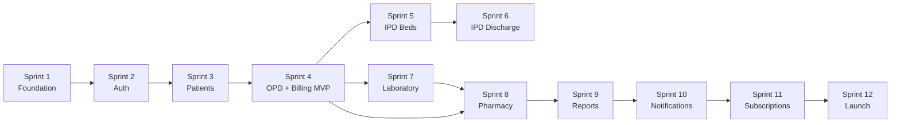

# Sprint Plan

## Multi-Tenant Hospital Management SaaS Platform

| Field | Value |
|-------|-------|
| **Document Version** | 1.0 |
| **Status** | Active |
| **Last Updated** | June 2026 |
| **Project Duration** | 12 months (July 2026 – June 2027) |
| **Team Size** | 1 Full Stack Developer |
| **Sprint Duration** | 2 weeks |
| **Total Sprints** | 12 (24 weeks active development) |
| **Related Documents** | ROADMAP.md, PRD.md, USER_STORIES.md, API_DESIGN.md |

---

## 1. Executive Summary

This sprint plan schedules delivery of the Hospital Management SaaS Platform across **12 two-week sprints** executed by a **single full-stack developer**. Work is organized into three phases aligned with the product roadmap.

### 1.1 Timeline Overview

```
Month:  1    2    3    4    5    6    7    8    9   10   11   12
        ├────┼────┼────┼────┤
        │ Phase 1 MVP      │  Sprints 1–4
             ├────┼────┼────┤
             │ Phase 2      │  Sprints 5–8
                  ├────┼────┼────┤
                  │ Phase 3      │  Sprints 9–12
                       ├──────────────────────────┤
                       │ Beta · Hardening · Launch │  Months 7–12
```

| Phase | Sprints | Calendar | Theme |
|-------|---------|----------|-------|
| **Phase 1 — MVP** | 1–4 | Months 1–2 | Platform, auth, patients, OPD, billing |
| **Phase 2 — Clinical** | 5–8 | Months 3–4 | IPD, laboratory, pharmacy, inventory |
| **Phase 3 — Growth** | 9–12 | Months 5–6 | Reports, notifications, subscriptions, launch |
| **Stabilization** | — | Months 7–12 | Beta feedback, bug fixes, DevOps, onboarding support |

### 1.2 Capacity Assumptions (Solo Developer)

| Assumption | Value |
|------------|-------|
| Sprint length | 10 working days |
| Productive hours/day | 6 hours (coding) |
| **Sprint capacity** | **~60 hours** |
| Ceremony overhead | ~4 hrs/sprint (planning, review, retro) |
| **Net development capacity** | **~56 hours/sprint** |
| Velocity (story points) | 18–25 points/sprint (baseline stabilizes Sprint 3+) |

### 1.3 Definition of Done (DoD)

- [ ] Code merged to `main` with peer self-review checklist
- [ ] Unit tests for backend business logic (≥ 70% new code)
- [ ] API endpoint documented in OpenAPI
- [ ] `tenant_id` isolation verified on new endpoints
- [ ] RBAC permission enforced
- [ ] Frontend responsive (≥ 1024px)
- [ ] No P0/P1 bugs open for sprint scope
- [ ] Deployed to staging and smoke-tested

### 1.4 Risk Factors (Solo Team)

| Risk | Mitigation |
|------|------------|
| Developer illness / leave | 20% buffer in Months 7–12; defer P2 items |
| Scope creep | Strict sprint goals; change requests → backlog |
| Full-stack context switching | Backend Mon–Wed, Frontend Thu–Fri pattern |
| Production incidents post-launch | Month 7+ reserved for support and fixes |

---

## 2. Phase 1 — MVP (Sprints 1–4)

**Goal:** Deploy a working SaaS MVP — tenant signup → patient registration → OPD visit → invoice → payment.  
**Target:** Staging environment with end-to-end demo; 3 internal beta tenants by end of Sprint 4.

---

### Sprint 1 — Foundation & Multi-Tenancy

**Dates:** Week 1–2 (Month 1)  
**Story Points:** 21  
**Theme:** Project scaffolding, database, tenant isolation

#### Objectives

1. Establish monorepo structure with FastAPI backend and React frontend.
2. Deploy PostgreSQL schema with multi-tenant `tenant_id` on all tables.
3. Implement tenant context middleware and RLS session setup.
4. Set up CI/CD pipeline and Docker local development environment.

#### Features

- Developer environment (Docker Compose: API + PostgreSQL + Redis)
- Tenant root provisioning (`platform.create_tenant`)
- Health check endpoints
- Basic project README and environment configuration

#### Database Tasks (14 hrs)

| Task | Estimate |
|------|----------|
| Apply `schema.sql` to dev/staging; verify 61 tables | 4 hrs |
| Set up Alembic migration framework; initial baseline migration | 4 hrs |
| Create seed script: system tenant, subscription plans, default permissions | 3 hrs |
| Verify RLS policies active; write isolation smoke SQL tests | 3 hrs |

#### Backend Tasks (24 hrs)

| Task | Estimate |
|------|----------|
| FastAPI project structure (routers, services, repositories, schemas) | 4 hrs |
| Database connection pool, SQLAlchemy models (platform + core schemas) | 6 hrs |
| Tenant middleware: resolve `tenant_id`, `SET LOCAL app.tenant_id` | 4 hrs |
| `platform.create_tenant()` service + register endpoint skeleton | 4 hrs |
| Standard API response envelope + exception handlers | 3 hrs |
| Correlation ID middleware + structured logging | 3 hrs |

#### Frontend Tasks (10 hrs)

| Task | Estimate |
|------|----------|
| React + TypeScript + TailwindCSS + Vite project setup | 3 hrs |
| App shell: layout, routing (React Router), design tokens | 4 hrs |
| API client wrapper (axios/fetch) with error handling | 3 hrs |

#### Testing Tasks (8 hrs)

| Task | Estimate |
|------|----------|
| Pytest setup; DB fixture with test tenant | 3 hrs |
| Tenant isolation integration test (RLS + middleware) | 3 hrs |
| GitHub Actions: lint + test on PR | 2 hrs |

#### Deliverables

- [ ] Running local stack via `docker compose up`
- [ ] PostgreSQL schema applied with RLS enabled
- [ ] Tenant creation API returns `tenant_id`
- [ ] CI pipeline green on `main`
- [ ] Staging environment provisioned (AWS ECS or equivalent)

---

### Sprint 2 — Authentication, RBAC & Tenant Onboarding

**Dates:** Week 3–4 (Month 1)  
**Story Points:** 23  
**Theme:** Secure login, roles, self-service signup

#### Objectives

1. Deliver complete authentication flow (login, logout, refresh, password reset).
2. Implement RBAC with predefined roles and `@requires` permission decorator.
3. Build tenant self-service registration with trial subscription.
4. Ship login and registration UI.

#### Features

- User login / logout / token refresh
- Password reset via email (SMTP/SES integration)
- Self-service tenant registration (14-day trial)
- Role-based permission enforcement
- Role-based dashboard routing (skeleton)
- Staff invite flow (API only; UI in Sprint 4)

#### Database Tasks (6 hrs)

| Task | Estimate |
|------|----------|
| Seed roles + role_permissions for all 9 roles (system tenant clone logic) | 3 hrs |
| Migration: indexes on `users.email`, `user_sessions` | 1 hr |
| Audit log write helper for auth events | 2 hrs |

#### Backend Tasks (28 hrs)

| Task | Estimate |
|------|----------|
| JWT issuance (RS256), refresh token rotation, session storage | 8 hrs |
| Auth endpoints: login, logout, refresh, forgot/reset password | 6 hrs |
| RBAC: permission resolver, `@requires()` decorator, JWT claims | 5 hrs |
| Tenant register: create tenant, admin user, trial subscription, seed roles | 5 hrs |
| Subscription status middleware (trial/active/suspended gate) | 2 hrs |
| Email service adapter (SES) for verification + reset | 2 hrs |

#### Frontend Tasks (16 hrs)

| Task | Estimate |
|------|----------|
| Login page with form validation (Zod) | 4 hrs |
| Registration wizard (org details + admin account) | 5 hrs |
| Auth context provider, token storage, auto-refresh | 4 hrs |
| Protected route wrapper + redirect logic | 3 hrs |

#### Testing Tasks (6 hrs)

| Task | Estimate |
|------|----------|
| Auth unit tests: password hash, JWT encode/decode | 2 hrs |
| RBAC tests: 403 on missing permission | 2 hrs |
| E2E smoke: register → login → `/auth/me` | 2 hrs |

#### Deliverables

- [ ] User can register tenant and log in
- [ ] JWT contains `tenant_id`, `roles`, `permissions`
- [ ] Wrong role receives 403 on protected endpoint
- [ ] Password reset email delivered (staging)
- [ ] Login and registration pages deployed to staging

---

### Sprint 3 — Patients, Staff & Administration

**Dates:** Week 5–6 (Month 2)  
**Story Points:** 24  
**Theme:** Patient registry and hospital staff setup

#### Objectives

1. Deliver full patient CRUD with MRN generation and search.
2. Build staff, department, and doctor profile management.
3. Implement patient allergies and emergency contacts.
4. Ship patient and admin UI screens.

#### Features

- Patient registration, search, profile view
- MRN auto-generation (`MRN-YYYY-NNNNN`)
- Duplicate patient warning (phone match)
- Patient allergies recording
- Department master CRUD
- Staff CRUD + doctor profile linkage
- Doctor list for appointment module (Sprint 4 prep)
- Admin settings page (tenant profile)

#### Database Tasks (4 hrs)

| Task | Estimate |
|------|----------|
| Verify patient/staff/doctor FK constraints; add search indexes if missing | 2 hrs |
| MRN sequence function per tenant | 2 hrs |

#### Backend Tasks (26 hrs)

| Task | Estimate |
|------|----------|
| Patient API: list, create, get, update, soft-delete (7 endpoints) | 8 hrs |
| Patient allergies + contacts sub-resources | 3 hrs |
| Staff + departments API | 5 hrs |
| Doctors API: create from staff, list, get, basic profile | 4 hrs |
| Tenant settings API (organization profile update) | 3 hrs |
| Plan limit check: trial patient cap (100) | 3 hrs |

#### Frontend Tasks (20 hrs)

| Task | Estimate |
|------|----------|
| Patient list with search and pagination | 5 hrs |
| Patient registration form | 5 hrs |
| Patient profile page (demographics, allergies) | 4 hrs |
| Admin: departments + staff list pages | 4 hrs |
| Admin: organization settings form | 2 hrs |

#### Testing Tasks (6 hrs)

| Task | Estimate |
|------|----------|
| Patient API integration tests (CRUD + tenant isolation) | 3 hrs |
| MRN uniqueness per tenant test | 1 hr |
| Frontend component tests for registration form validation | 2 hrs |

#### Deliverables

- [ ] Receptionist can register and search patients in < 2 minutes
- [ ] MRN unique per tenant; duplicate phone warning shown
- [ ] Admin can add departments, staff, and doctor profiles
- [ ] Patient and admin modules on staging
- [ ] ~102 P0 patient user story points partially complete

---

### Sprint 4 — OPD, Billing & MVP Release

**Dates:** Week 7–8 (Month 2)  
**Story Points:** 25  
**Theme:** Core clinical workflow + billing; MVP launch to staging

#### Objectives

1. Deliver OPD workflow: appointments, queue, consultation, vitals, e-prescription.
2. Deliver billing: service master, invoice, payment, receipt.
3. Integrate end-to-end flow: patient → appointment → consult → bill → pay.
4. **MVP release** to staging with demo tenant.

#### Features

- Appointment booking and calendar view
- Doctor availability slots
- OPD walk-in queue with token numbers
- Doctor consultation view (vitals, notes, diagnosis)
- E-prescription (printable; pharmacy module Phase 2)
- Billing service master
- OPD invoice generation and finalization
- Payment collection (cash, UPI, card)
- Receipt generation (PDF)
- Daily collection report (basic)
- Role dashboards: Receptionist, Doctor, Accountant

#### Database Tasks (4 hrs)

| Task | Estimate |
|------|----------|
| OPD + billing tables verified; invoice number sequence per tenant | 2 hrs |
| Seed default billing services (consultation, registration fee) on tenant onboarding | 2 hrs |

#### Backend Tasks (28 hrs)

| Task | Estimate |
|------|----------|
| Appointments API: CRUD, availability check, conflict prevention | 6 hrs |
| OPD visits + queue API | 5 hrs |
| Consultation API: vitals, clinical notes, e-prescription | 6 hrs |
| Billing: service master, invoice CRUD, finalize, void | 5 hrs |
| Payments API with allocations + receipt number | 4 hrs |
| PDF generation: invoice + receipt (WeasyPrint/reportlab) | 2 hrs |

#### Frontend Tasks (20 hrs)

| Task | Estimate |
|------|----------|
| Appointment calendar + booking modal | 5 hrs |
| OPD queue board (receptionist + doctor view) | 4 hrs |
| Doctor consultation screen (patient context, vitals, Rx) | 6 hrs |
| Billing: invoice creation, payment modal, receipt view | 5 hrs |

#### Testing Tasks (8 hrs)

| Task | Estimate |
|------|----------|
| E2E test: register patient → book appointment → consult → bill → pay | 4 hrs |
| Cross-tenant isolation regression suite | 2 hrs |
| Manual UAT script execution with demo data | 2 hrs |

#### Deliverables

- [ ] **MVP Phase 1 complete** on staging
- [ ] End-to-end workflow completable in < 5 minutes
- [ ] 3 demo tenants configured with seed data
- [ ] MVP demo video recorded for sales
- [ ] Known issues log for Phase 2 backlog
- [ ] OpenAPI docs published at `/api/v1/docs` (staging)

#### Phase 1 Exit Criteria

| Criterion | Status |
|-----------|--------|
| Tenant signup + login | Sprint 2 |
| Patient registration + search | Sprint 3 |
| OPD appointment → consultation | Sprint 4 |
| Invoice + payment | Sprint 4 |
| RBAC enforced | Sprint 2 |
| Tenant isolation tests pass | Sprint 1–4 |

---

## 3. Phase 2 — Clinical Depth (Sprints 5–8)

**Goal:** IPD, laboratory, pharmacy, and inventory modules for full hospital operations.  
**Target:** Professional-tier feature set; 5 beta tenants using IPD or lab by Sprint 8.

---

### Sprint 5 — IPD Foundation: Wards, Beds & Admissions

**Dates:** Week 9–10 (Month 3)  
**Story Points:** 22  
**Theme:** Inpatient bed management and admission workflow

#### Objectives

1. Implement ward → room → bed hierarchy with availability dashboard.
2. Build patient admission workflow with bed assignment.
3. Enforce bed plan limits per subscription tier.
4. Ship IPD admin and admission UI.

#### Features

- Ward, room, bed master CRUD
- Bed availability dashboard (color-coded)
- Patient admission with bed assignment
- Admission number generation
- Bed status auto-update (available ↔ occupied)
- IPD patient list (currently admitted)

#### Database Tasks (4 hrs)

| Task | Estimate |
|------|----------|
| Clinical schema: wards, rooms, beds, admissions verified | 2 hrs |
| Admission number sequence per tenant | 1 hr |
| Bed status constraint triggers (optional) | 1 hr |

#### Backend Tasks (26 hrs)

| Task | Estimate |
|------|----------|
| Wards / rooms / beds CRUD API | 6 hrs |
| Bed availability dashboard aggregation endpoint | 3 hrs |
| Admissions API: create, get, list, status transitions | 8 hrs |
| Bed plan limit enforcement (subscription `max_beds`) | 2 hrs |
| Admission transfers API (basic) | 4 hrs |
| Link admission to patient history | 3 hrs |

#### Frontend Tasks (18 hrs)

| Task | Estimate |
|------|----------|
| Ward/bed management admin pages | 5 hrs |
| Bed availability dashboard (visual grid) | 5 hrs |
| Admission form with bed selector | 5 hrs |
| Admitted patients list view | 3 hrs |

#### Testing Tasks (8 hrs)

| Task | Estimate |
|------|----------|
| Admission integration tests: bed status transitions | 3 hrs |
| Cannot admit to occupied bed (409 conflict) | 2 hrs |
| Bed limit plan enforcement test | 3 hrs |

#### Deliverables

- [ ] Admin can configure wards, rooms, beds
- [ ] Receptionist can admit patient to available bed
- [ ] Bed dashboard reflects real-time occupancy
- [ ] IPD module on staging

---

### Sprint 6 — IPD Clinical & Discharge Billing

**Dates:** Week 11–12 (Month 3)  
**Story Points:** 23  
**Theme:** Nursing workflows and IPD billing

#### Objectives

1. Deliver nursing notes and IPD vitals charting.
2. Implement discharge summary and discharge workflow.
3. Build IPD daily charges and running bill.
4. Integrate IPD discharge with final billing.

#### Features

- Nursing notes (assessment, progress, incident)
- IPD vitals charting with timestamps
- Discharge summary generation (PDF)
- Discharge workflow (bed released, status updated)
- IPD daily charge accrual (room, nursing)
- Running IPD bill view
- Discharge final invoice

#### Database Tasks (3 hrs)

| Task | Estimate |
|------|----------|
| IPD daily charges linked to billing services | 2 hrs |
| Discharge summary one-to-one admission constraint verified | 1 hr |

#### Backend Tasks (27 hrs)

| Task | Estimate |
|------|----------|
| Nursing notes API | 4 hrs |
| IPD vitals API with chart data endpoint | 4 hrs |
| Discharge summary API + PDF | 5 hrs |
| Discharge workflow: release bed, update admission status | 4 hrs |
| IPD daily charges cron/job (manual trigger for MVP) | 4 hrs |
| IPD final invoice generation from accrued charges | 6 hrs |

#### Frontend Tasks (18 hrs)

| Task | Estimate |
|------|----------|
| Nurse: vitals entry form + chart view | 5 hrs |
| Nurse: nursing notes panel | 4 hrs |
| Doctor: discharge summary form | 5 hrs |
| Accountant: running IPD bill + discharge invoice | 4 hrs |

#### Testing Tasks (8 hrs)

| Task | Estimate |
|------|----------|
| Discharge workflow E2E: admit → charges → discharge → invoice | 4 hrs |
| Bed released to `available` after discharge | 2 hrs |
| PDF discharge summary generates | 2 hrs |

#### Deliverables

- [ ] Full IPD lifecycle: admit → treat → discharge → bill
- [ ] Nurse and doctor IPD screens on staging
- [ ] IPD billing integrated with existing payment flow

---

### Sprint 7 — Laboratory Module

**Dates:** Week 13–14 (Month 4)  
**Story Points:** 24  
**Theme:** Lab orders, samples, results, reports

#### Objectives

1. Deliver lab test catalog and order management.
2. Build sample collection and tracking workflow.
3. Implement result entry with abnormal/critical flagging.
4. Generate finalized lab reports (PDF).

#### Features

- Lab test catalog CRUD
- Lab order creation (from doctor; standalone)
- Sample ID / barcode generation
- Sample status tracking (ordered → collected → processing → completed)
- Result entry with reference ranges
- Critical value flag + in-app doctor notification
- Lab report PDF generation and finalize
- Lab order queue for technicians

#### Database Tasks (3 hrs)

| Task | Estimate |
|------|----------|
| Laboratory schema verification; sample ID uniqueness | 2 hrs |
| Seed common lab tests (CBC, LFT, RFT) for new tenants | 1 hr |

#### Backend Tasks (28 hrs)

| Task | Estimate |
|------|----------|
| Lab test catalog API | 4 hrs |
| Lab orders + order items API | 6 hrs |
| Sample collection API + barcode generation | 4 hrs |
| Results entry API with abnormal detection | 5 hrs |
| Critical value notification (in-app + email queue) | 3 hrs |
| Lab report PDF generation + finalize | 4 hrs |
| Link lab charges to billing (invoice line item) | 2 hrs |

#### Frontend Tasks (18 hrs)

| Task | Estimate |
|------|----------|
| Lab test catalog admin page | 3 hrs |
| Doctor: order labs from consultation (add to Sprint 4 screen) | 3 hrs |
| Lab technician: order queue + sample collection | 5 hrs |
| Lab technician: result entry form | 4 hrs |
| Lab report view + download | 3 hrs |

#### Testing Tasks (7 hrs)

| Task | Estimate |
|------|----------|
| Lab workflow E2E: order → collect → result → report | 4 hrs |
| Critical flag triggers notification record | 2 hrs |
| Lab report accessible from patient profile | 1 hr |

#### Deliverables

- [ ] Diagnostic center can run standalone lab workflow
- [ ] Doctor receives notification on critical results
- [ ] Lab reports PDF downloadable
- [ ] Lab charges appear on patient invoice

---

### Sprint 8 — Pharmacy, Inventory & Phase 2 Release

**Dates:** Week 15–16 (Month 4)  
**Story Points:** 24  
**Theme:** Prescription dispensing and stock management

#### Objectives

1. Deliver medicine master and prescription dispensing.
2. Build inventory stock-in, adjustments, and movement ledger.
3. Integrate pharmacy charges with billing.
4. **Phase 2 release** with full clinical suite.

#### Features

- Medicine catalog CRUD
- Pending prescription queue (from OPD e-Rx)
- Prescription dispensing with batch tracking
- Pharmacy inventory by batch (expiry, quantity)
- Stock-in (goods receipt) and manual adjustment
- Low-stock and expiring-soon alerts
- Stock movement history (read-only ledger)
- Purchase order CRUD (basic)
- Partial dispensing support

#### Database Tasks (4 hrs)

| Task | Estimate |
|------|----------|
| Pharmacy inventory unique (tenant, medicine, batch) verified | 1 hr |
| Stock movement immutable ledger constraints | 2 hrs |
| Dispense → stock movement trigger/service | 1 hr |

#### Backend Tasks (28 hrs)

| Task | Estimate |
|------|----------|
| Medicines API CRUD | 4 hrs |
| Pending prescriptions queue endpoint | 3 hrs |
| Dispense API: fulfill Rx, deduct stock, create movement | 8 hrs |
| Inventory: stock-in, adjust, list, low-stock, expiring | 6 hrs |
| Purchase order basic API | 3 hrs |
| Pharmacy charge → invoice line item integration | 4 hrs |

#### Frontend Tasks (18 hrs)

| Task | Estimate |
|------|----------|
| Medicine master admin page | 3 hrs |
| Pharmacist: prescription queue | 4 hrs |
| Dispense form with stock batch selection | 5 hrs |
| Inventory list + stock-in form | 4 hrs |
| Low-stock alert widget on pharmacist dashboard | 2 hrs |

#### Testing Tasks (6 hrs)

| Task | Estimate |
|------|----------|
| Dispense deducts inventory correctly | 2 hrs |
| Insufficient stock returns 409 | 2 hrs |
| E2E: prescribe (Sprint 4) → dispense → bill | 2 hrs |

#### Deliverables

- [ ] **Phase 2 complete** on staging
- [ ] Full suite: OPD + IPD + Lab + Pharmacy operational
- [ ] 5 beta tenants onboarded onto Professional plan
- [ ] Phase 2 release notes published
- [ ] Updated OpenAPI documentation

#### Phase 2 Exit Criteria

| Criterion | Status |
|-----------|--------|
| IPD admit → discharge → bill | Sprint 6 |
| Lab order → report | Sprint 7 |
| Prescription → dispense → stock update | Sprint 8 |
| Inventory low-stock alerts | Sprint 8 |

---

## 4. Phase 3 — Growth & Launch (Sprints 9–12)

**Goal:** Reporting, notifications, subscription billing, security hardening, production launch.  
**Target:** Production deployment; 10 paying tenants; 99.9% uptime.

---

### Sprint 9 — Reporting & Operational Dashboard

**Dates:** Week 17–18 (Month 5)  
**Story Points:** 20  
**Theme:** Dashboards and exportable reports

#### Objectives

1. Build operational dashboard for hospital admin/owner.
2. Deliver department reports: OPD, IPD, lab, pharmacy summaries.
3. Implement financial reports for accountant role.
4. Add CSV/PDF export for key reports.

#### Features

- Admin dashboard: today's patients, revenue, appointments, bed occupancy
- OPD report: patient count by doctor, by date range
- IPD report: admissions, discharges, ALOS, occupancy
- Lab report: tests performed, TAT summary
- Pharmacy report: dispensing volume, stock value
- Financial: daily collection, outstanding balances
- Report export (CSV + PDF)
- Date range and department filters

#### Database Tasks (6 hrs)

| Task | Estimate |
|------|----------|
| Optimized read queries / views for dashboard aggregations | 4 hrs |
| Index review for report query performance | 2 hrs |

#### Backend Tasks (24 hrs)

| Task | Estimate |
|------|----------|
| Dashboard stats API (cached in Redis, 2-min TTL) | 5 hrs |
| OPD + IPD report endpoints | 5 hrs |
| Lab + pharmacy report endpoints | 4 hrs |
| Financial reports: collection, outstanding | 4 hrs |
| CSV + PDF export service | 4 hrs |
| Report permission checks (`reports:clinical`, `reports:financial`) | 2 hrs |

#### Frontend Tasks (20 hrs)

| Task | Estimate |
|------|----------|
| Admin dashboard with stat cards + charts (Chart.js/Recharts) | 8 hrs |
| Reports page with module tabs + date picker | 5 hrs |
| Export buttons + download handling | 3 hrs |
| Role-specific dashboard routing (owner vs accountant) | 4 hrs |

#### Testing Tasks (6 hrs)

| Task | Estimate |
|------|----------|
| Report accuracy: reconcile daily collection with payments table | 3 hrs |
| Dashboard loads in < 3 seconds with seed data | 2 hrs |
| RBAC: accountant cannot access clinical-only reports | 1 hr |

#### Deliverables

- [ ] Hospital owner sees operational dashboard
- [ ] Accountant sees financial reports
- [ ] Reports exportable as CSV/PDF
- [ ] Dashboard on staging

---

### Sprint 10 — Notifications & Multi-Location

**Dates:** Week 19–20 (Month 5)  
**Story Points:** 21  
**Theme:** Patient engagement and branch support

#### Objectives

1. Implement in-app notification center.
2. Deliver email/SMS appointment reminders and lab result alerts.
3. Add multi-location (branch) support per tenant.
4. Build notification preference settings.

#### Features

- In-app notifications (bell icon, unread count)
- Email: appointment reminder (1 day before), lab result ready
- SMS: appointment reminder (MSG91/Twilio integration)
- Notification templates per tenant
- User notification preferences (enable/disable by type)
- Tenant locations CRUD (branches)
- Location filter on patients, appointments, inventory
- Notification delivery log (audit)

#### Database Tasks (3 hrs)

| Task | Estimate |
|------|----------|
| Comms schema: notifications, preferences, delivery log | 1 hr |
| `location_id` filters added to list endpoints (migration if needed) | 2 hrs |

#### Backend Tasks (26 hrs)

| Task | Estimate |
|------|----------|
| Notification service: create, list, mark read | 5 hrs |
| SQS worker: send email (SES) + SMS (MSG91) | 6 hrs |
| Scheduled job: appointment reminders (daily cron) | 4 hrs |
| Notification preferences API | 3 hrs |
| Tenant locations CRUD API | 4 hrs |
| Location scoping on patient + appointment queries | 4 hrs |

#### Frontend Tasks (16 hrs)

| Task | Estimate |
|------|----------|
| Notification bell + dropdown panel | 4 hrs |
| Notification preferences settings page | 3 hrs |
| Location selector in header (multi-branch tenants) | 3 hrs |
| Admin: branch management page | 4 hrs |
| Location filter on patient list + appointment calendar | 2 hrs |

#### Testing Tasks (7 hrs)

| Task | Estimate |
|------|----------|
| Reminder job creates notification + delivery log | 3 hrs |
| SMS/email mock adapter tests | 2 hrs |
| Location filter isolates data correctly per branch | 2 hrs |

#### Deliverables

- [ ] Appointment reminders sent 1 day before (email + SMS)
- [ ] In-app notification center functional
- [ ] Multi-location tenants can manage branches
- [ ] Notification module on staging

---

### Sprint 11 — Subscription Billing & Security Hardening

**Dates:** Week 21–22 (Month 6)  
**Story Points:** 22  
**Theme:** Monetization and production security

#### Objectives

1. Integrate Razorpay/Stripe for subscription billing and plan upgrades.
2. Enforce plan limits (users, beds, modules) across all modules.
3. Conduct security hardening: rate limiting, audit logs, penetration self-assessment.
4. Implement patient CSV import for data migration.

#### Features

- Payment gateway integration (Razorpay for India)
- Automated monthly subscription billing
- Plan upgrade/downgrade (self-service for owner)
- Trial → paid conversion flow
- Grace period and tenant suspension on payment failure
- Billing history and invoice download (SaaS invoices)
- Plan limit enforcement dashboard (usage vs. limits)
- Audit log viewer (admin)
- Rate limiting on auth endpoints
- Patient CSV bulk import (async job)
- Security headers (HSTS, CSP)

#### Database Tasks (4 hrs)

| Task | Estimate |
|------|----------|
| `tenant_subscriptions` payment gateway fields populated | 1 hr |
| Audit log query optimization for admin viewer | 2 hrs |
| Import job status table (or tenant_settings) | 1 hr |

#### Backend Tasks (28 hrs)

| Task | Estimate |
|------|----------|
| Razorpay: customer, subscription, webhook handler | 8 hrs |
| Plan upgrade/downgrade + proration logic | 4 hrs |
| Suspension middleware on `past_due` / grace expiry | 3 hrs |
| Usage metering: users, beds, patients count API | 3 hrs |
| Audit log list API with filters | 3 hrs |
| Rate limiting middleware (Redis) | 2 hrs |
| Patient CSV import async job (SQS worker) | 5 hrs |

#### Frontend Tasks (14 hrs)

| Task | Estimate |
|------|----------|
| Subscription & plan page (owner) | 5 hrs |
| Payment method collection (Razorpay checkout) | 4 hrs |
| Usage vs. limits widget | 2 hrs |
| Audit log viewer (admin) | 3 hrs |

#### Testing Tasks (10 hrs)

| Task | Estimate |
|------|----------|
| Razorpay webhook test (sandbox): payment success/failure | 4 hrs |
| Plan limit blocks user creation at cap | 2 hrs |
| Cross-tenant isolation full regression (automated) | 4 hrs |

#### Deliverables

- [ ] Tenants can convert trial → paid via Razorpay
- [ ] Failed payment triggers grace period → suspension flow
- [ ] Audit log viewer for hospital admin
- [ ] Patient CSV import functional
- [ ] Security self-assessment checklist completed

---

### Sprint 12 — Production Launch & Beta Onboarding

**Dates:** Week 23–24 (Month 6)  
**Story Points:** 20  
**Theme:** Production deployment, UAT, beta launch

#### Objectives

1. Deploy production environment on AWS (ECS, RDS Multi-AZ, Redis, S3).
2. Complete UAT with 10 beta tenants.
3. Fix all P0/P1 bugs from beta feedback.
4. Publish deployment runbook and user onboarding guide.
5. **Production launch.**

#### Features

- Production AWS infrastructure (Terraform)
- CloudWatch monitoring + alerting (P1/P2)
- Sentry error tracking integration
- Automated database backups verified
- SSL/TLS + custom subdomain routing
- Onboarding wizard (post-registration setup)
- Help documentation (in-app tooltips + knowledge base articles)
- Status page setup
- Production smoke test suite

#### Database Tasks (4 hrs)

| Task | Estimate |
|------|----------|
| Production migration runbook; apply schema to RDS | 2 hrs |
| Backup restore drill to staging | 2 hrs |

#### Backend Tasks (18 hrs)

| Task | Estimate |
|------|----------|
| Production environment configuration (Secrets Manager) | 4 hrs |
| Sentry + CloudWatch integration | 3 hrs |
| Onboarding progress API (tenant_settings) | 3 hrs |
| Production health checks + readiness probes | 2 hrs |
| Bug fixes from beta (buffer) | 6 hrs |

#### Frontend Tasks (16 hrs)

| Task | Estimate |
|------|----------|
| Onboarding wizard (5-step post-registration) | 8 hrs |
| Production build optimization (code splitting, lazy routes) | 3 hrs |
| Bug fixes from beta (buffer) | 5 hrs |

#### Testing Tasks (14 hrs)

| Task | Estimate |
|------|----------|
| Full regression test suite execution | 4 hrs |
| Load test: 50 concurrent users (Locust/k6) | 4 hrs |
| UAT with 10 beta tenants; issue triage | 4 hrs |
| Production smoke test post-deploy | 2 hrs |

#### Deliverables

- [ ] **Production launch** 🚀
- [ ] 10 beta tenants live on production
- [ ] 99.9% uptime SLA monitoring active
- [ ] DEPLOYMENT_GUIDE.md validated against actual infra
- [ ] Onboarding wizard reduces time-to-first-patient to < 4 hours
- [ ] Known P2 bugs documented in backlog for Months 7–12

#### Phase 3 Exit Criteria

| Criterion | Target |
|-----------|--------|
| Production deployed | Sprint 12 |
| Paying tenants | 10 |
| MRR | ₹1,00,000+ |
| P95 API latency | < 500ms |
| Zero cross-tenant leaks | Verified |
| Core workflow E2E | Pass |

---

## 5. Months 7–12 — Post-Launch Stabilization

After Sprint 12, the remaining **6 months** of the 12-month project are allocated to stabilization, customer success, and incremental improvements — not additional 2-week sprints.

| Month | Focus | Activities |
|-------|-------|------------|
| **7** | Beta feedback | P1/P2 bug fixes, performance tuning, support runbook |
| **8** | Customer onboarding | Assist first 10 tenants; onboarding improvements |
| **9** | Insurance billing (basic) | TPA claim tracking (ROADMAP Phase 3 carry-over) |
| **10** | Hindi localization | UI translation for key screens |
| **11** | Advanced analytics | Custom report builder (if capacity allows) |
| **12** | Year-1 review | Retrospective, Year 2 roadmap, technical debt sprint |

### 5.1 Backlog for Months 7–12 (Prioritized)

| Priority | Item | Est. |
|----------|------|------|
| P1 | Insurance/TPA basic billing | 3 weeks |
| P1 | Hindi UI (core screens) | 2 weeks |
| P2 | Custom report builder | 3 weeks |
| P2 | 2FA (TOTP) | 1 week |
| P2 | API v1 public docs for Enterprise | 2 weeks |
| P3 | AI: revenue leakage detection | 4 weeks |
| P3 | Mobile-responsive tablet optimization | 2 weeks |

---

## 6. Sprint Ceremonies (Solo Developer Adapted)

| Ceremony | Duration | When | Purpose |
|----------|----------|------|---------|
| **Sprint Planning** | 1 hr | Day 1 | Select backlog items; confirm sprint goal |
| **Daily Standup** | 10 min | Daily (self journal) | What done / doing / blockers |
| **Mid-Sprint Check** | 30 min | Day 5 | Scope adjustment if behind |
| **Sprint Review** | 1 hr | Day 10 | Demo to stakeholder (recorded video) |
| **Retrospective** | 30 min | Day 10 | What worked / improve next sprint |
| **Backlog Grooming** | 1 hr | Last Friday | Refine next sprint stories |

---

## 7. Story Point Summary

| Sprint | Phase | Points | Cumulative |
|--------|-------|--------|------------|
| 1 | MVP | 21 | 21 |
| 2 | MVP | 23 | 44 |
| 3 | MVP | 24 | 68 |
| 4 | MVP | 25 | 93 |
| 5 | Clinical | 22 | 115 |
| 6 | Clinical | 23 | 138 |
| 7 | Clinical | 24 | 162 |
| 8 | Clinical | 24 | 186 |
| 9 | Growth | 20 | 206 |
| 10 | Growth | 21 | 227 |
| 11 | Growth | 22 | 249 |
| 12 | Growth | 20 | **269** |
| **Total** | | **269** | |

---

## 8. Dependencies & Critical Path



**Critical path:** S1 → S2 → S3 → S4 → S8 → S11 → S12

Any slip in Sprints 1–4 delays MVP and compresses Phase 2. Laboratory (S7) and pharmacy (S8) can partially overlap only if MVP is stable.

---

## 9. Risk Register (Sprint-Level)

| Sprint | Risk | Impact | Mitigation |
|--------|------|--------|------------|
| 1 | RLS complexity delays backend | High | Use existing `schema.sql`; defer custom roles |
| 2 | Email delivery setup slow | Medium | Use SES sandbox; mock in dev |
| 4 | OPD + billing too large | High | Defer PDF polish; basic receipt text OK |
| 6 | IPD billing logic complex | Medium | Manual daily charge trigger first |
| 7 | Lab PDF template time-consuming | Medium | Simple HTML template |
| 8 | Stock movement race conditions | Medium | DB transaction + row lock |
| 11 | Razorpay webhook edge cases | High | Sandbox test all event types |
| 12 | UAT finds P0 bugs | High | Buffer 6 hrs bug fix; defer non-critical |

---

## 10. Revision History

| Version | Date | Author | Changes |
|---------|------|--------|---------|
| 1.0 | June 2026 | Agile Project Management | Initial 12-sprint plan for solo full-stack developer |
