# System Architecture Document

## Multi-Tenant Hospital Management SaaS Platform

| Field | Value |
|-------|-------|
| **Document Version** | 1.0 |
| **Status** | Draft |
| **Last Updated** | June 2026 |
| **Author** | Principal Software Architecture |
| **Classification** | Internal — Engineering |
| **Related Documents** | PRD.md, DATABASE_DESIGN.md, API_DESIGN.md, SECURITY_ARCHITECTURE.md, MULTI_TENANT_DESIGN.md, RBAC_DESIGN.md, DEPLOYMENT_GUIDE.md |

---

## 1. Executive Summary

This document defines the **system architecture** for a cloud-native, multi-tenant Hospital Management SaaS Platform serving small and medium hospitals, clinics, and diagnostic centers. The platform is built as a modular, API-first system with strict tenant isolation, JWT-based security, and AWS-hosted containerized infrastructure.

### 1.1 Architecture Style

| Attribute | Decision |
|-----------|----------|
| **Pattern** | Modular Monolith (Phase 1) → Selective Service Extraction (Phase 2+) |
| **Tenancy** | Shared database, shared schema, `tenant_id` row isolation |
| **API** | REST (OpenAPI 3.x) over HTTPS |
| **Frontend** | Single Page Application (SPA) |
| **Auth** | Stateless JWT with refresh token rotation |
| **Deployment** | Docker containers on AWS ECS/EKS behind Nginx |
| **Data Store** | PostgreSQL (primary), Redis (cache/sessions), S3 (files) |

### 1.2 Technology Stack

| Layer | Technology | Version |
|-------|------------|---------|
| **Frontend** | React.js, TypeScript, TailwindCSS | React 18+ |
| **Backend** | Python, FastAPI | Python 3.11+, FastAPI 0.100+ |
| **Database** | PostgreSQL | 14+ |
| **Cache** | Redis (ElastiCache) | 7+ |
| **Message Queue** | Amazon SQS (async jobs) | — |
| **File Storage** | Amazon S3 | — |
| **Reverse Proxy** | Nginx | 1.24+ |
| **Container Runtime** | Docker | 24+ |
| **Orchestration** | AWS ECS Fargate (MVP) / EKS (scale) | — |
| **CDN** | Amazon CloudFront | — |
| **Monitoring** | CloudWatch, Prometheus, Grafana | — |
| **Error Tracking** | Sentry | — |

### 1.3 Architectural Principles

1. **Tenant isolation first** — No request proceeds without validated tenant context.
2. **API-first** — All features exposed via versioned REST APIs; frontend is a client.
3. **Defence in depth** — Security enforced at edge, application, and database (RLS) layers.
4. **Stateless services** — Application containers hold no session state; horizontal scaling enabled.
5. **Observable by default** — Structured logs, metrics, and distributed tracing on every request.
6. **Fail secure** — Authentication/authorization failures deny access; no silent degradation.
7. **Design for 99.9% uptime** — Redundancy, health checks, automated failover, and DR runbooks.

---

## 2. High-Level Architecture

The platform follows a classic **three-tier cloud architecture** with a reverse proxy edge, stateless application tier, and managed data services. External integrations (payment gateway, SMS, email) are accessed asynchronously where possible.

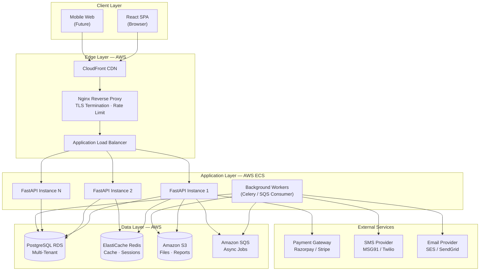

### 2.1 Layer Responsibilities

| Layer | Responsibility | Key Technologies |
|-------|----------------|------------------|
| **Client** | UI rendering, form validation, client-side routing, token storage | React, TypeScript, TailwindCSS |
| **Edge** | TLS, static asset delivery, request routing, rate limiting, WAF | CloudFront, Nginx, ALB, AWS WAF |
| **Application** | Business logic, validation, tenant context, RBAC, API orchestration | FastAPI, Python, Pydantic |
| **Data** | Persistent storage, caching, file blobs, job queues | PostgreSQL, Redis, S3, SQS |
| **Integration** | Billing, notifications, third-party APIs | Razorpay, SES, MSG91 |

### 2.2 Deployment Regions

| Phase | Region | Rationale |
|-------|--------|-----------|
| MVP | `ap-south-1` (Mumbai) | Primary market: India |
| Phase 2 | `ap-southeast-1` (Singapore) | SEA expansion |
| Phase 3 | `me-south-1` (Bahrain) | Middle East data residency |

### 2.3 Environment Topology

| Environment | Purpose | Infrastructure |
|-------------|---------|----------------|
| **Development** | Local developer machines | Docker Compose (API + PostgreSQL + Redis) |
| **Staging** | Pre-production integration testing | AWS ECS (single AZ), RDS (small), shared Redis |
| **Production** | Live tenant workloads | AWS ECS (multi-AZ), RDS Multi-AZ, Redis cluster, S3 |

---

## 3. Component Diagram

The application is organized into **logical components** within a modular monolith. Each component maps to a FastAPI router module and a React feature module.

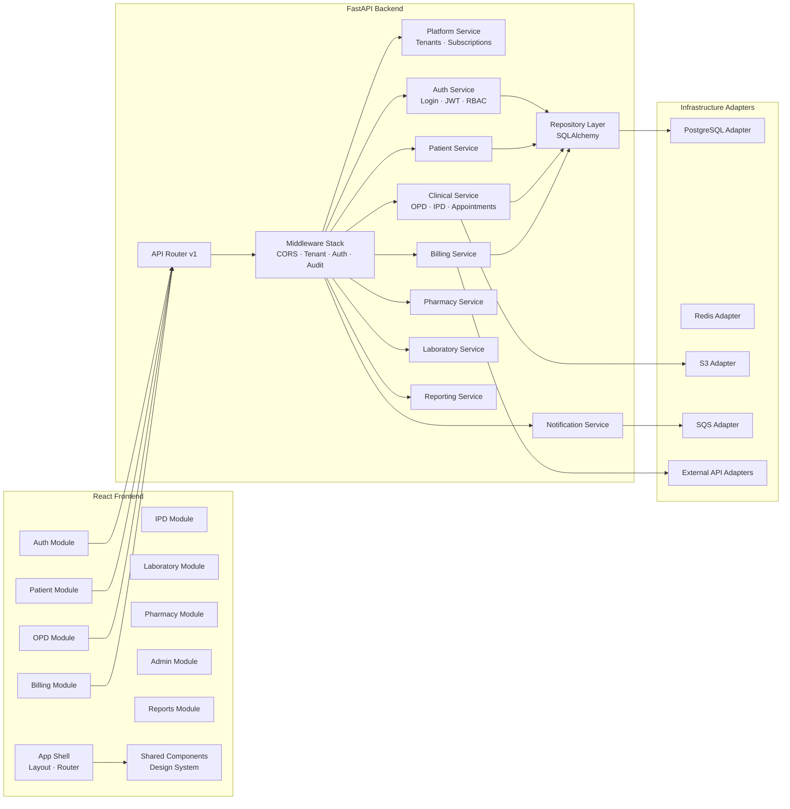

### 3.1 Frontend Components

| Component | Responsibility | Key Routes |
|-----------|----------------|------------|
| **App Shell** | Layout, navigation, tenant branding, global state | `/` |
| **Auth Module** | Login, logout, password reset, session management | `/login`, `/reset-password` |
| **Patient Module** | Registration, search, profile, allergies, documents | `/patients/*` |
| **OPD Module** | Appointments, queue, consultation, e-prescription | `/opd/*` |
| **IPD Module** | Admissions, beds, nursing notes, discharge | `/ipd/*` |
| **Billing Module** | Invoices, payments, receipts, service master | `/billing/*` |
| **Laboratory Module** | Orders, samples, results, reports | `/lab/*` |
| **Pharmacy Module** | Dispensing, inventory, medicines | `/pharmacy/*` |
| **Admin Module** | Staff, departments, settings, subscription | `/admin/*` |
| **Reports Module** | Dashboards, operational and financial reports | `/reports/*` |
| **Shared Components** | Tables, forms, modals, toasts, design tokens | — |

### 3.2 Backend Components

| Component | Responsibility | Database Schemas |
|-----------|----------------|------------------|
| **Middleware Stack** | Request pipeline: correlation ID, tenant resolution, JWT validation, RBAC, audit | — |
| **Platform Service** | Tenant CRUD, subscription management, plan enforcement | `platform` |
| **Auth Service** | Authentication, token issuance, session management, password reset | `core` |
| **Patient Service** | Patient demographics, MRN, allergies, documents | `core` |
| **Clinical Service** | OPD, IPD, appointments, beds, vitals, prescriptions | `clinical` |
| **Billing Service** | Invoices, payments, service master, receipts | `billing` |
| **Pharmacy Service** | Medicines, inventory, dispensing, stock movements | `pharmacy` |
| **Laboratory Service** | Test catalog, orders, samples, results, reports | `laboratory` |
| **Notification Service** | In-app, email, SMS notifications (async) | `comms` |
| **Reporting Service** | Aggregations, exports, dashboards | All schemas (read) |
| **Repository Layer** | Data access, tenant-scoped queries, RLS session setup | All schemas |

### 3.3 Cross-Cutting Concerns

| Concern | Implementation |
|---------|----------------|
| **Configuration** | Environment variables + AWS Secrets Manager |
| **Validation** | Pydantic models (backend), Zod (frontend) |
| **Error Handling** | Standardized error response envelope with correlation ID |
| **Audit Logging** | Middleware writes to `audit.audit_logs` on mutations |
| **Feature Flags** | Redis-backed flags per tenant (LaunchDarkly optional) |

---

## 4. Service Diagram

Phase 1 deploys as a **modular monolith** (single FastAPI application). Background processing runs as a separate worker service. Phase 2+ may extract high-load modules.

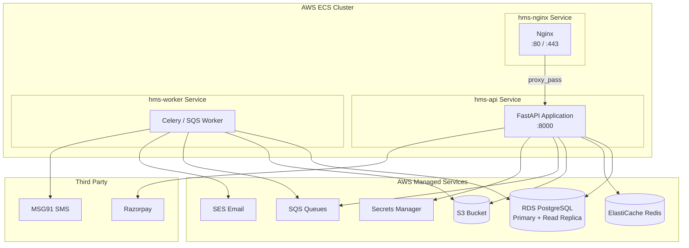

### 4.1 Service Inventory

| Service | Container Image | Port | Replicas (Prod) | CPU / Memory |
|---------|-----------------|------|-----------------|--------------|
| `hms-nginx` | `hms/nginx:latest` | 80, 443 | 2 | 0.25 vCPU / 512 MB |
| `hms-api` | `hms/api:latest` | 8000 | 2–10 (auto-scale) | 0.5 vCPU / 1 GB |
| `hms-worker` | `hms/worker:latest` | — | 1–3 | 0.5 vCPU / 1 GB |

### 4.2 API Service Modules (Internal)

| Module | Endpoints Prefix | Async Jobs |
|--------|------------------|------------|
| Platform | `/api/v1/platform` | Tenant provisioning |
| Auth | `/api/v1/auth` | — |
| Patients | `/api/v1/patients` | CSV import |
| Clinical | `/api/v1/clinical` | — |
| Billing | `/api/v1/billing` | Invoice PDF generation |
| Pharmacy | `/api/v1/pharmacy` | Low-stock alerts |
| Laboratory | `/api/v1/laboratory` | Lab report PDF, critical alerts |
| Notifications | `/api/v1/notifications` | Email/SMS dispatch |
| Reports | `/api/v1/reports` | Report generation, export |

### 4.3 Background Worker Jobs

| Job | Trigger | Queue | SLA |
|-----|---------|-------|-----|
| `send_appointment_reminder` | Scheduled (cron) | `notifications` | < 5 min |
| `generate_invoice_pdf` | On-demand | `documents` | < 30 sec |
| `generate_lab_report_pdf` | On result finalization | `documents` | < 30 sec |
| `process_subscription_billing` | Scheduled (daily) | `billing` | < 1 hour |
| `tenant_data_export` | Admin request | `exports` | < 24 hours |
| `send_email` / `send_sms` | Event-driven | `notifications` | < 2 min |
| `audit_log_partition_maintenance` | Scheduled (monthly) | `maintenance` | Off-peak |

### 4.4 Service Communication

| From | To | Protocol | Sync/Async |
|------|-----|----------|------------|
| React SPA | FastAPI | HTTPS / REST | Sync |
| FastAPI | PostgreSQL | TCP / SQL (SQLAlchemy) | Sync |
| FastAPI | Redis | TCP / RESP | Sync |
| FastAPI | S3 | HTTPS / AWS SDK | Sync |
| FastAPI | SQS | HTTPS / AWS SDK | Async (publish) |
| Worker | SQS | HTTPS / AWS SDK | Async (consume) |
| Worker | SES / MSG91 | HTTPS | Async |
| FastAPI | Razorpay | HTTPS / REST | Sync |

---

## 5. Request Flow

### 5.1 Standard API Request Flow

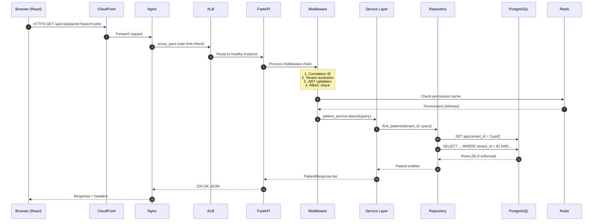

### 5.2 Request Processing Pipeline

| Step | Component | Action |
|------|-----------|--------|
| 1 | **CloudFront** | Serve cached static assets; forward API calls to origin |
| 2 | **Nginx** | TLS termination, request size limits, rate limiting (100 req/s/IP) |
| 3 | **ALB** | Health check routing, SSL passthrough or termination |
| 4 | **Correlation ID** | Generate `X-Request-ID` UUID; attach to all logs |
| 5 | **Tenant Middleware** | Resolve `tenant_id` from JWT; reject if missing/invalid |
| 6 | **Auth Middleware** | Validate JWT signature, expiry, and token revocation list |
| 7 | **RBAC Middleware** | Check `permission:action` for endpoint; return 403 if denied |
| 8 | **Audit Middleware** | Log mutation requests (POST/PUT/PATCH/DELETE) |
| 9 | **Service Layer** | Execute business logic with validated input |
| 10 | **Repository** | Set `app.tenant_id` session variable; execute parameterized query |
| 11 | **Response** | Standard envelope: `{ data, meta, errors }` |

### 5.3 API Response Envelope

```json
{
  "data": { },
  "meta": {
    "request_id": "550e8400-e29b-41d4-a716-446655440000",
    "timestamp": "2026-06-17T10:30:00Z",
    "tenant_id": "7c9e6679-7425-40de-944b-e07fc1f90ae7"
  },
  "errors": null
}
```

### 5.4 Error Response Flow

| HTTP Status | Condition | Client Action |
|-------------|-----------|---------------|
| `400` | Validation error | Display field errors |
| `401` | Missing/expired JWT | Redirect to login; attempt refresh |
| `403` | RBAC denial or tenant suspended | Show access denied message |
| `404` | Resource not found (within tenant) | Show not found |
| `409` | Conflict (duplicate MRN, etc.) | Show conflict message |
| `422` | Unprocessable entity | Display validation details |
| `429` | Rate limit exceeded | Retry with backoff |
| `500` | Server error | Show generic error; log `request_id` for support |

---

## 6. Authentication Flow

Authentication uses **JWT (JSON Web Tokens)** with short-lived access tokens and long-lived refresh tokens stored as hashed values in the database.

### 6.1 Token Architecture

| Token | Lifetime | Storage (Client) | Storage (Server) |
|-------|----------|------------------|------------------|
| **Access Token** | 30 minutes | Memory (preferred) or sessionStorage | Stateless (JWT) |
| **Refresh Token** | 7 days | HttpOnly secure cookie | `core.user_sessions` (hashed) |

### 6.2 Login Flow

```mermaid
sequenceDiagram
    autonumber
    participant U as User (Browser)
    participant FE as React App
    participant API as FastAPI Auth
    participant DB as PostgreSQL
    participant REDIS as Redis

    U->>FE: Enter email + password
    FE->>API: POST /api/v1/auth/login
    API->>DB: Find user by email + tenant context
    DB-->>API: User record

  alt Invalid credentials
        API-->>FE: 401 Unauthorized
    else Account locked
        API-->>FE: 423 Locked
    else Valid credentials
        API->>API: Verify bcrypt password hash
        API->>API: Build JWT payload
        Note over API: { sub, tenant_id, roles,<br/>permissions, exp, iat }
        API->>API: Sign access token (RS256)
        API->>API: Generate refresh token
        API->>DB: Store refresh token hash in user_sessions
        API->>DB: Update last_login_at; reset failed attempts
        API->>DB: Insert audit_log (login)
        API-->>FE: { access_token, expires_in }
        API-->>FE: Set-Cookie: refresh_token (HttpOnly, Secure, SameSite)
        FE->>FE: Store access_token in memory
        FE->>FE: Redirect to role-based dashboard
    end
```

### 6.3 JWT Payload Structure

```json
{
  "sub": "user-uuid",
  "tenant_id": "tenant-uuid",
  "email": "doctor@hospital.com",
  "roles": ["doctor"],
  "permissions": ["patient:read", "opd:create", "opd:read"],
  "iat": 1718611200,
  "exp": 1718613000,
  "jti": "token-unique-id"
}
```

### 6.4 Token Refresh Flow

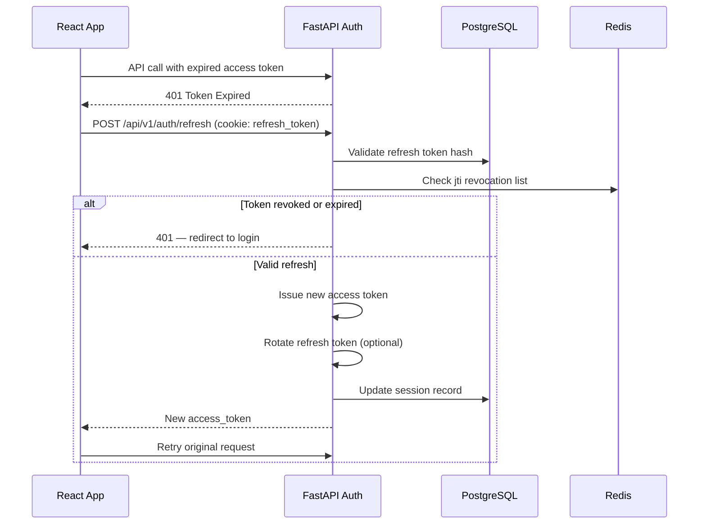

### 6.5 Logout Flow

1. Client calls `POST /api/v1/auth/logout`.
2. Server revokes refresh token in `user_sessions` (`revoked_at = NOW()`).
3. Server adds access token `jti` to Redis revocation list (TTL = remaining token life).
4. Server writes `audit_log` entry (`action: logout`).
5. Client clears access token from memory; cookie cleared via `Set-Cookie` expiry.

### 6.6 Password Reset Flow

1. User submits email → `POST /api/v1/auth/forgot-password`.
2. Server generates single-use token (1-hour expiry); stores hash in `password_reset_tokens`.
3. Email sent with reset link: `https://{tenant}.platform.com/reset-password?token=...`.
4. User submits new password → `POST /api/v1/auth/reset-password`.
5. Server validates token, updates password hash, invalidates all sessions, audits event.

### 6.7 Security Controls

| Control | Implementation |
|---------|----------------|
| Password hashing | bcrypt (cost factor 12) or Argon2id |
| Brute force protection | Lock account after 5 failures for 30 minutes |
| Token signing | RS256 (asymmetric keys in Secrets Manager) |
| Token revocation | Redis denylist keyed by `jti` |
| Session limit | Max 5 concurrent sessions per user (configurable) |
| HTTPS only | HSTS enabled; secure cookies |

---

## 7. Authorization Flow

Authorization is enforced via **Role-Based Access Control (RBAC)** with permissions checked at both API and UI layers.

### 7.1 RBAC Model

```
User ──▶ UserRole ──▶ Role ──▶ RolePermission ──▶ Permission
```

| Role | Description | Example Permissions |
|------|-------------|---------------------|
| `tenant_admin` | Full tenant administration | `*:*` |
| `doctor` | Clinical workflows | `patient:read`, `opd:*`, `lab:order` |
| `receptionist` | Front desk operations | `patient:*`, `appointment:*`, `opd:queue` |
| `billing_staff` | Financial operations | `billing:*`, `patient:read` |
| `lab_technician` | Laboratory operations | `lab:*`, `patient:read` |
| `pharmacist` | Pharmacy operations | `pharmacy:*`, `patient:read` |
| `nurse` | IPD nursing | `ipd:*`, `patient:read` |

### 7.2 Authorization Check Flow

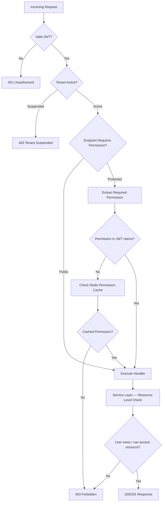

### 7.3 Permission Format

```
{module}:{action}

Examples:
  patient:read, patient:create, patient:update, patient:delete
  opd:read, opd:create, opd:consult
  billing:read, billing:create, billing:void
  admin:users, admin:settings
```

### 7.4 Authorization Enforcement Layers

| Layer | Enforcement | Failure Mode |
|-------|-------------|--------------|
| **Nginx** | Rate limiting, IP allowlist (Enterprise) | 429 / 403 |
| **FastAPI Middleware** | JWT + permission decorator (`@requires("patient:read")`) | 401 / 403 |
| **Service Layer** | Resource ownership validation (e.g., patient belongs to tenant) | 404 / 403 |
| **Repository** | `tenant_id` filter on every query | Empty result set |
| **PostgreSQL RLS** | `tenant_id = current_setting('app.tenant_id')` | Zero rows returned |
| **React UI** | Hide/disable unauthorized components | UI element hidden |

### 7.5 Platform Admin Authorization

Platform operators (SaaS admins) use a separate auth realm:

- Separate JWT issuer (`platform-admin`)
- Access limited to `platform.*` schema tables
- No default access to tenant clinical data
- Break-glass clinical access requires tenant consent + full audit trail

---

## 8. Multi-Tenant Flow

### 8.1 Tenancy Model

| Attribute | Value |
|-----------|-------|
| **Model** | Shared database, shared schema |
| **Isolation Key** | `tenant_id` (UUID) on every table |
| **Resolution** | JWT `tenant_id` claim (authoritative) |
| **DB Enforcement** | PostgreSQL Row-Level Security (RLS) |
| **App Enforcement** | Middleware + repository query filters |

### 8.2 Tenant Resolution Flow

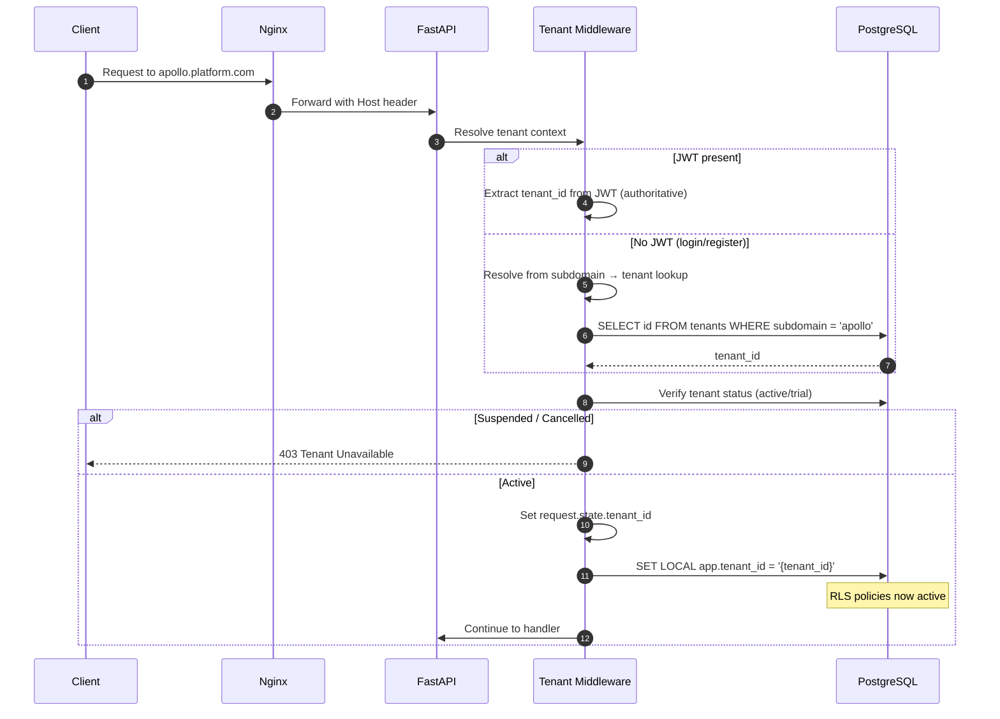

### 8.3 Tenant Onboarding Flow

```mermaid
flowchart LR
    A[User Signs Up] --> B[Create Tenant Record]
    B --> C[Assign Trial Subscription]
    C --> D[Seed Default Roles & Permissions]
    D --> E[Create Admin User]
    E --> F[Send Verification Email]
    F --> G[User Verifies Email]
    G --> H[Onboarding Wizard]
    H --> I[Configure Organization]
    I --> J[Add Staff Users]
    J --> K[Register First Patient]
    K --> L[Tenant Active]
```

| Step | Service | Data Created |
|------|---------|--------------|
| Signup | Platform Service | `platform.tenants`, `tenant_subscriptions` |
| Seed RBAC | Auth Service | `roles`, `permissions`, `role_permissions` (cloned from system templates) |
| Admin user | Auth Service | `users`, `user_roles` |
| Onboarding | Platform Service | `tenant_settings`, `tenant_locations`, `departments` |

### 8.4 Tenant Context Propagation

| Context | Propagation Method |
|---------|-------------------|
| HTTP Request | `request.state.tenant_id` (FastAPI) |
| Database Session | `SET LOCAL app.tenant_id = '{uuid}'` per transaction |
| Background Job | `tenant_id` in SQS message payload |
| Cache Key | Prefix: `tenant:{tenant_id}:{key}` |
| S3 Path | `s3://bucket/tenants/{tenant_id}/...` |
| Logs | `tenant_id` field in structured JSON logs |
| Traces | `tenant_id` span attribute (OpenTelemetry) |

### 8.5 Subscription Enforcement

Before processing requests, the tenant middleware validates:

1. Subscription status is `trial` or `active`.
2. Plan limits not exceeded (users, beds, patients) — checked on resource creation.
3. Grace period honored for `past_due` (read-only mode after grace expiry).

---

## 9. File Storage Strategy

### 9.1 Storage Architecture

All binary files are stored in **Amazon S3** with tenant-prefixed paths. The database stores metadata only (path, size, MIME type).

```
s3://hms-prod-files/
└── tenants/
    └── {tenant_id}/
        ├── patients/
        │   └── {patient_id}/
        │       ├── documents/
        │       └── photos/
        ├── reports/
        │   ├── lab/
        │   ├── invoices/
        │   └── discharge/
        ├── branding/
        │   └── logo.png
        └── exports/
            └── {export_id}.zip
```

### 9.2 File Categories

| Category | Max Size | Allowed Types | Access Method |
|----------|----------|---------------|---------------|
| Patient documents | 10 MB | PDF, JPG, PNG | Pre-signed URL (15 min) |
| Patient photos | 2 MB | JPG, PNG | Pre-signed URL |
| Lab reports (PDF) | 5 MB | PDF | Pre-signed URL |
| Invoices / receipts | 2 MB | PDF | Pre-signed URL |
| Tenant logo | 2 MB | JPG, PNG, SVG | CloudFront CDN URL |
| Data exports | 500 MB | ZIP, CSV | Pre-signed URL (1 hour) |

### 9.3 Upload Flow

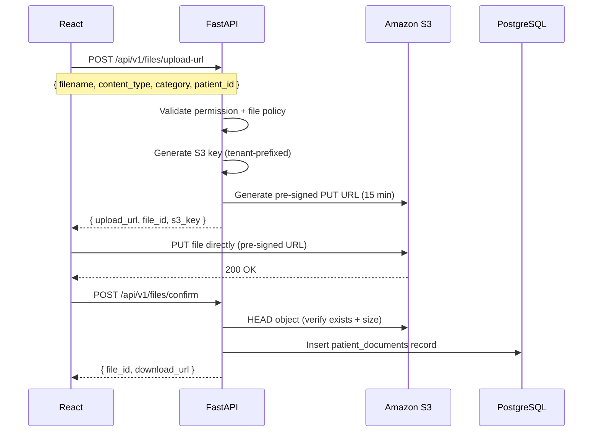

### 9.4 Security Controls

| Control | Implementation |
|---------|----------------|
| Tenant isolation | S3 key prefix enforced server-side; client cannot override path |
| Encryption at rest | S3 SSE-S3 (default) or SSE-KMS (Enterprise) |
| Encryption in transit | HTTPS only |
| Access control | Pre-signed URLs with short expiry; no public buckets |
| Virus scanning | ClamAV scan via Lambda on S3 `ObjectCreated` event (Phase 2) |
| Lifecycle policy | Move to Glacier after 7 years; delete exports after 30 days |

---

## 10. Caching Strategy

### 10.1 Cache Architecture

**Redis (ElastiCache)** serves as the centralized cache for session data, permission lookups, frequently accessed configuration, and rate limiting counters.

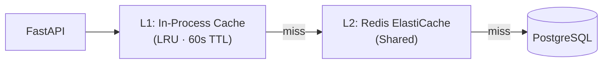

### 10.2 Cache Categories

| Cache Key Pattern | Data | TTL | Invalidation |
|-------------------|------|-----|--------------|
| `tenant:{id}:settings` | Tenant configuration | 15 min | On settings update |
| `tenant:{id}:user:{id}:permissions` | User permission set | 5 min | On role change / logout |
| `tenant:{id}:services` | Billing service master | 30 min | On service CRUD |
| `tenant:{id}:medicines` | Medicine catalog | 30 min | On medicine CRUD |
| `tenant:{id}:lab_tests` | Lab test catalog | 30 min | On test CRUD |
| `tenant:{id}:doctors:schedule:{date}` | Doctor schedules | 5 min | On schedule update |
| `tenant:{id}:dashboard:stats` | Dashboard aggregations | 2 min | Time-based expiry |
| `ratelimit:{ip}` | Rate limit counter | 1 min | Auto-expire |
| `jwt:denylist:{jti}` | Revoked token IDs | Token remaining life | Auto-expire |
| `session:{id}` | Refresh token metadata | 7 days | On logout |

### 10.3 Caching Rules

| Rule | Policy |
|------|--------|
| **Never cache** | Patient clinical data (PHI), audit logs, real-time queue state |
| **Cache with short TTL** | Dashboard stats, doctor schedules, lookup masters |
| **Cache with invalidation** | Permissions, tenant settings, service catalogs |
| **Tenant isolation** | All cache keys prefixed with `tenant_id` |
| **Cache stampede** | Lock-based regeneration for expensive queries |

### 10.4 CDN Caching (CloudFront)

| Asset | Cache TTL | Invalidation |
|-------|-----------|--------------|
| React static bundles (JS/CSS) | 1 year (content-hashed filenames) | On deploy |
| Tenant logos | 24 hours | On logo update |
| Public marketing pages | 1 hour | On content change |
| API responses | **No cache** | — |

---

## 11. Logging Strategy

### 11.1 Logging Architecture

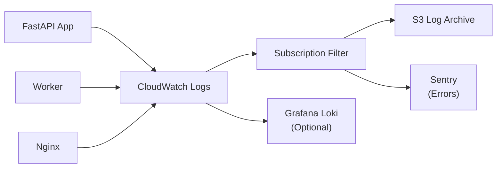

### 11.2 Log Format

All application logs use **structured JSON** for machine parsing:

```json
{
  "timestamp": "2026-06-17T10:30:00.123Z",
  "level": "INFO",
  "service": "hms-api",
  "environment": "production",
  "request_id": "550e8400-e29b-41d4-a716-446655440000",
  "tenant_id": "7c9e6679-7425-40de-944b-e07fc1f90ae7",
  "user_id": "a1b2c3d4-e5f6-7890-abcd-ef1234567890",
  "method": "POST",
  "path": "/api/v1/patients",
  "status_code": 201,
  "duration_ms": 145,
  "message": "Patient created successfully",
  "module": "patient_service"
}
```

### 11.3 Log Categories

| Category | Level | Destination | Retention |
|----------|-------|-------------|-----------|
| **Access logs** | INFO | CloudWatch + S3 | 90 days |
| **Application logs** | INFO–ERROR | CloudWatch + S3 | 90 days |
| **Audit logs** | INFO | PostgreSQL `audit.audit_logs` | 7 years |
| **Security events** | WARN–ERROR | CloudWatch + Sentry + SNS alert | 1 year |
| **Error logs** | ERROR–CRITICAL | Sentry + CloudWatch | 1 year |
| **Nginx access logs** | — | CloudWatch | 30 days |
| **Worker job logs** | INFO | CloudWatch | 90 days |

### 11.4 PHI / PII Handling in Logs

| Rule | Implementation |
|------|----------------|
| No patient names in logs | Log `patient_id` only |
| No passwords or tokens | Redact `password`, `token`, `authorization` fields |
| No full request bodies for PHI endpoints | Log metadata only (method, path, status, duration) |
| Audit trail for PHI access | `audit_logs` with `action: view` on patient records |

### 11.5 Correlation and Tracing

| Mechanism | Purpose |
|-----------|---------|
| `X-Request-ID` header | End-to-end request correlation across services |
| OpenTelemetry spans | Distributed tracing (API → DB → S3) |
| `tenant_id` + `user_id` | Tenant-scoped log filtering |
| Sentry breadcrumbs | Error context reconstruction |

---

## 12. Monitoring Strategy

### 12.1 Monitoring Architecture

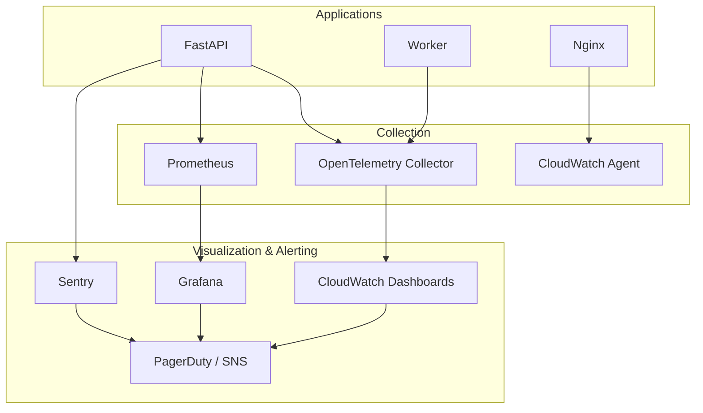

### 12.2 Key Metrics

#### Infrastructure Metrics

| Metric | Source | Alert Threshold |
|--------|--------|-----------------|
| CPU utilization | CloudWatch / ECS | > 80% for 5 min |
| Memory utilization | CloudWatch / ECS | > 85% for 5 min |
| ECS task count | CloudWatch | < 2 (prod) |
| RDS CPU | CloudWatch | > 75% for 10 min |
| RDS connections | CloudWatch | > 80% of max |
| RDS storage | CloudWatch | > 80% capacity |
| Redis memory | ElastiCache | > 80% |
| ALB healthy hosts | CloudWatch | < 2 |
| ALB 5xx rate | CloudWatch | > 1% for 5 min |

#### Application Metrics

| Metric | Source | Alert Threshold |
|--------|--------|-----------------|
| API request rate | Prometheus | Baseline anomaly |
| API P95 latency | Prometheus | > 500ms for 5 min |
| API error rate (5xx) | Prometheus | > 0.1% for 5 min |
| API 4xx rate | Prometheus | > 5% for 10 min |
| JWT validation failures | App metrics | > 50/min |
| Tenant isolation violations | App metrics | > 0 (critical) |
| Queue depth (SQS) | CloudWatch | > 1000 messages |
| Worker job failures | CloudWatch | > 5 in 10 min |
| PDF generation time | App metrics | P95 > 10s |

#### Business Metrics

| Metric | Source | Dashboard |
|--------|--------|-----------|
| Active tenants | PostgreSQL | Platform Admin |
| Daily API calls per tenant | Prometheus | Platform Admin |
| Patient registrations/day | PostgreSQL | Tenant Admin |
| Failed payment count | PostgreSQL | Finance |
| Subscription churn events | PostgreSQL | Platform Admin |

### 12.3 Health Checks

| Endpoint | Check | Interval |
|----------|-------|----------|
| `GET /health` | API process alive | 10s (ALB) |
| `GET /health/ready` | API + DB + Redis connectivity | 30s (ECS) |
| `GET /health/live` | Process not deadlocked | 10s (ECS) |

### 12.4 Alerting Severity

| Severity | Response Time | Channel | Examples |
|----------|---------------|---------|----------|
| **P1 — Critical** | < 15 min | PagerDuty + Phone | API down, DB unreachable, data breach |
| **P2 — High** | < 1 hour | PagerDuty + Slack | Error rate spike, RDS failover |
| **P3 — Medium** | < 4 hours | Slack | High latency, queue backlog |
| **P4 — Low** | Next business day | Email | Disk space warning, cert expiry (30d) |

### 12.5 Dashboards

| Dashboard | Audience | Key Panels |
|-----------|----------|------------|
| **Platform Overview** | Engineering | Request rate, latency, errors, ECS tasks |
| **Database Performance** | DBA / Engineering | Query time, connections, replication lag |
| **Tenant Activity** | Product / CS | Active tenants, feature usage, onboarding funnel |
| **Security** | Security team | Failed logins, 403 rate, WAF blocks |
| **Business** | Leadership | MRR, tenant count, churn, registrations |

---

## 13. Disaster Recovery

### 13.1 Recovery Objectives

| Metric | Target | Description |
|--------|--------|-------------|
| **RPO** (Recovery Point Objective) | 1 hour | Maximum acceptable data loss |
| **RTO** (Recovery Time Objective) | 4 hours | Maximum acceptable downtime |
| **Availability SLA** | 99.9% | ≤ 43 minutes downtime/month |

### 13.2 DR Architecture

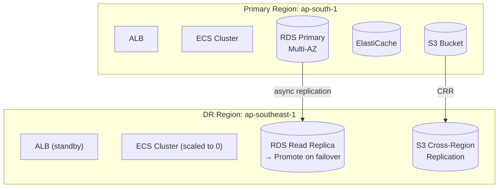

### 13.3 Backup Strategy

| Component | Backup Method | Frequency | Retention |
|-----------|---------------|-----------|-----------|
| **PostgreSQL** | RDS automated snapshots + PITR | Continuous (WAL) + daily snapshot | 30 days |
| **PostgreSQL** | Manual snapshot before major releases | On demand | 90 days |
| **S3 files** | S3 versioning + cross-region replication | Continuous | Per retention policy |
| **Redis** | ElastiCache snapshots | Daily | 7 days |
| **Configuration** | Terraform state + Secrets Manager | On change | Versioned |
| **Container images** | ECR image scanning + lifecycle | On build | Last 30 images |

### 13.4 Failover Procedures

#### Scenario 1: Single API Container Failure

| Step | Action | Impact |
|------|--------|--------|
| 1 | ALB health check fails unhealthy task | Automatic |
| 2 | ECS replaces task | < 30 seconds downtime |
| 3 | No manual intervention required | Zero data loss |

#### Scenario 2: RDS Primary Failure (Multi-AZ)

| Step | Action | Impact |
|------|--------|--------|
| 1 | AWS auto-failover to standby AZ | 60–120 seconds |
| 2 | Application reconnects via RDS endpoint | Automatic (connection pool retry) |
| 3 | Verify replication and application health | Manual verification |

#### Scenario 3: Full Region Failure

| Step | Action | Time |
|------|--------|------|
| 1 | Declare incident; activate DR runbook | T+0 |
| 2 | Promote RDS read replica in DR region | T+30 min |
| 3 | Scale ECS cluster in DR region | T+45 min |
| 4 | Update Route 53 DNS to DR ALB | T+60 min |
| 5 | Verify S3 CRR data availability | T+60 min |
| 6 | Run smoke tests against DR environment | T+90 min |
| 7 | Notify customers via status page | T+120 min |
| 8 | Resume operations from DR region | T+240 min (RTO) |

### 13.5 DR Testing

| Test Type | Frequency | Scope |
|-----------|-----------|-------|
| **Backup restore verification** | Monthly | Restore RDS snapshot to staging; verify data integrity |
| **Failover drill (Multi-AZ)** | Quarterly | Simulate AZ failure; measure failover time |
| **Full region failover drill** | Annually | Promote DR replica; run full application stack |
| **Runbook review** | Quarterly | Update procedures, contacts, and escalation paths |

### 13.6 Data Integrity Verification

Post-recovery checklist:

- [ ] Row counts match pre-incident baseline per tenant
- [ ] Latest audit log timestamp is within RPO window
- [ ] Subscription billing state is consistent
- [ ] S3 file count and sample checksums verified
- [ ] JWT signing keys accessible from Secrets Manager
- [ ] All health checks passing
- [ ] Smoke test: login → register patient → create invoice

---

## 14. Security Architecture Summary

| Layer | Control |
|-------|---------|
| **Network** | VPC private subnets, security groups, NACLs, AWS WAF |
| **Transport** | TLS 1.2+, HSTS, certificate auto-renewal |
| **Authentication** | JWT (RS256), refresh token rotation, account lockout |
| **Authorization** | RBAC with permission decorators + UI guards |
| **Tenancy** | `tenant_id` middleware + PostgreSQL RLS |
| **Data** | Encryption at rest (RDS, S3), encryption in transit (TLS) |
| **Secrets** | AWS Secrets Manager, no hardcoded credentials |
| **Compliance** | Audit logs (7-year retention), consent tracking, data export |

> Full security specification: `SECURITY_ARCHITECTURE.md`

---

## 15. Scalability Roadmap

| Phase | Trigger | Action |
|-------|---------|--------|
| **Phase 1** | 0–100 tenants | Modular monolith, 2–4 API containers, single RDS |
| **Phase 2** | 100–500 tenants | Add RDS read replica for reports; Redis cluster; auto-scaling 2–10 |
| **Phase 3** | 500–2000 tenants | Extract notification service; EKS migration; DB connection pooling (PgBouncer) |
| **Phase 4** | 2000+ tenants | Evaluate table partitioning; CDN for API edge caching; multi-region active-passive |

---

## 16. Architecture Decision Records (Summary)

| ADR | Decision | Rationale |
|-----|----------|-----------|
| ADR-001 | Modular monolith over microservices (MVP) | Faster development, simpler ops for small team |
| ADR-002 | Shared DB with `tenant_id` over DB-per-tenant | Cost-efficient for SMB SaaS; proven at scale with RLS |
| ADR-003 | JWT over server-side sessions | Stateless API; horizontal scaling |
| ADR-004 | PostgreSQL over MySQL | RLS, JSONB, partitioning, ecosystem |
| ADR-005 | S3 pre-signed URLs over proxied uploads | Reduces API server load; direct client-to-S3 |
| ADR-006 | ECS Fargate over EKS (MVP) | Lower operational complexity |
| ADR-007 | SQS over RabbitMQ | Native AWS integration, managed, durable |

---

## 17. Revision History

| Version | Date | Author | Changes |
|---------|------|--------|---------|
| 1.0 | June 2026 | Principal Software Architecture | Initial system architecture document |
